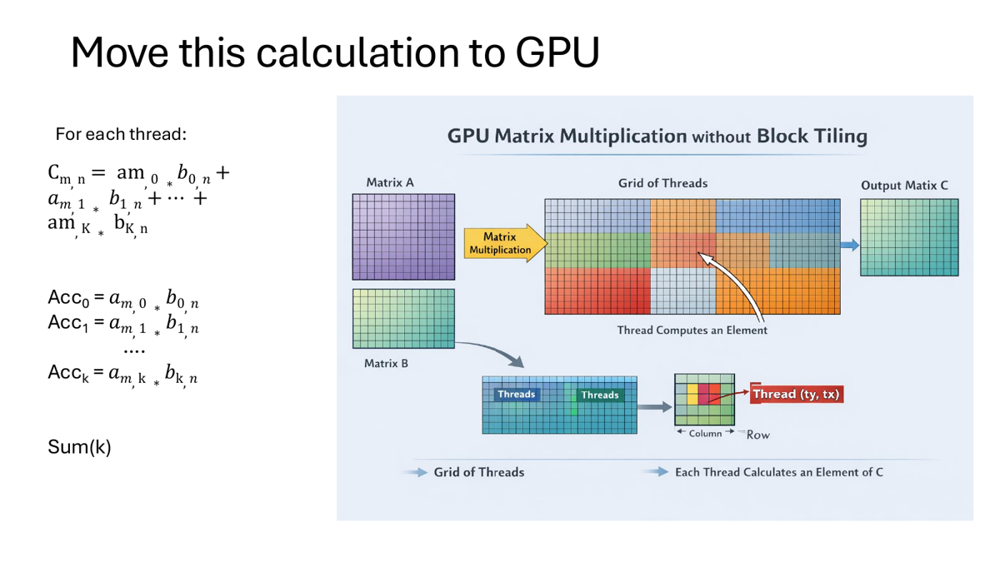
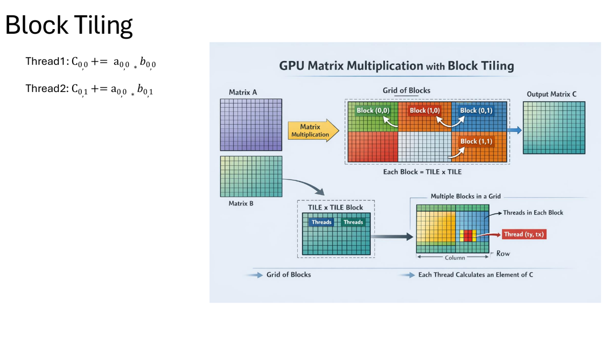
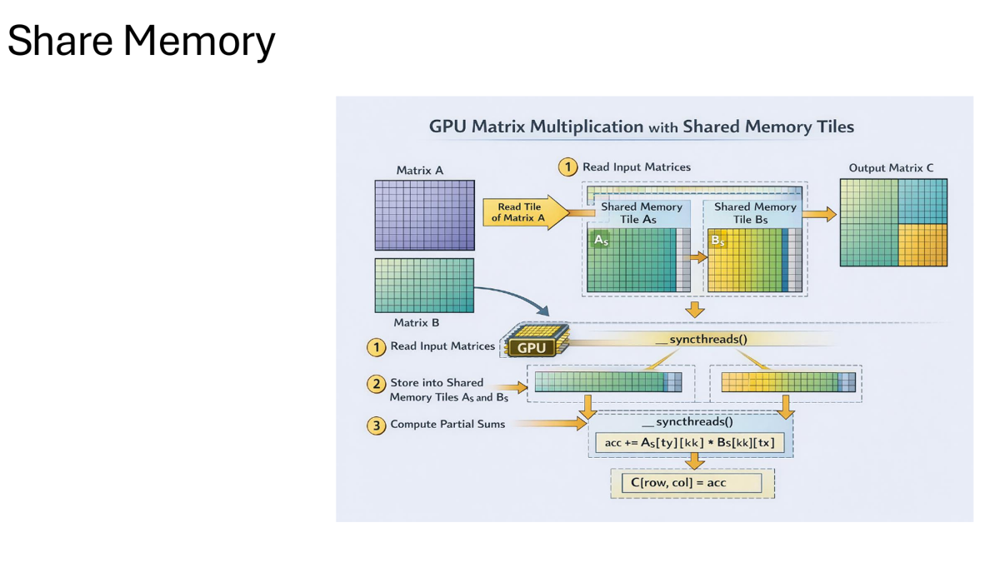
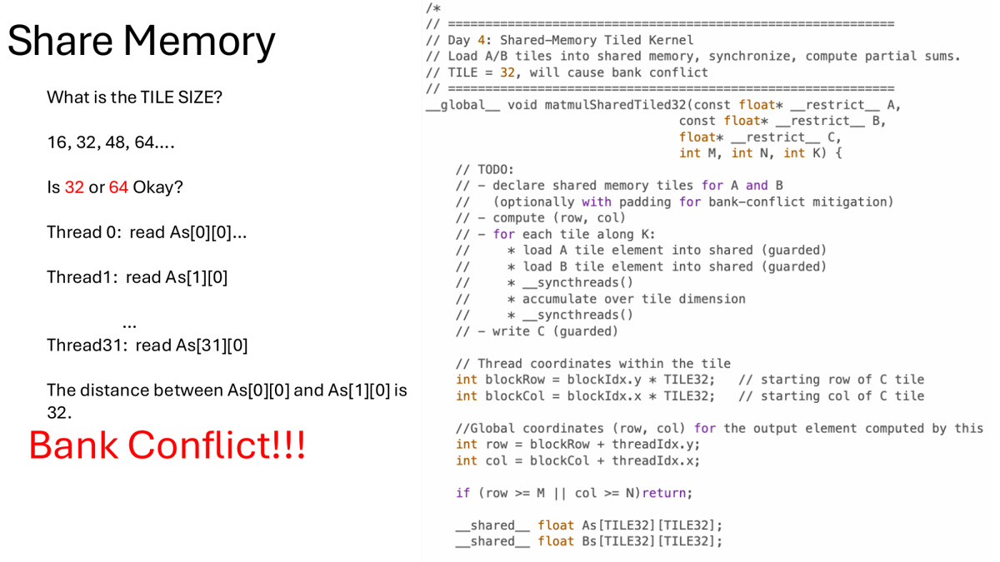
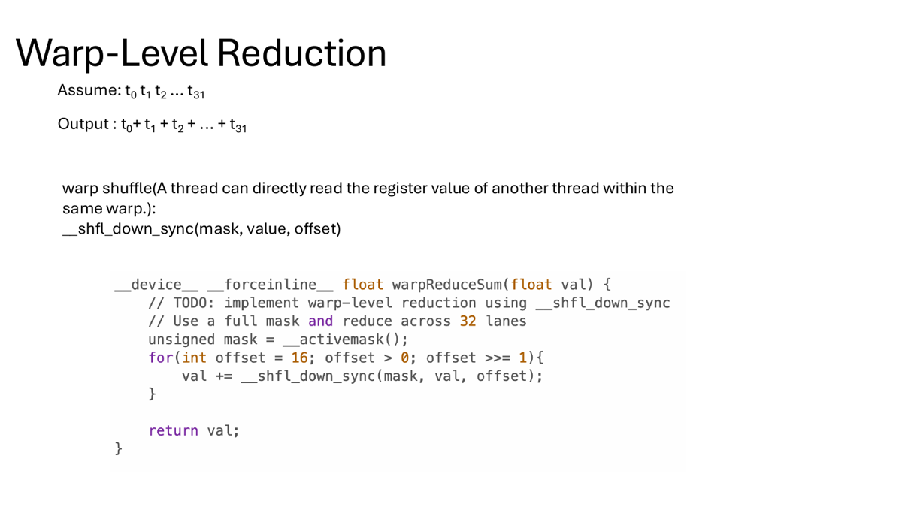
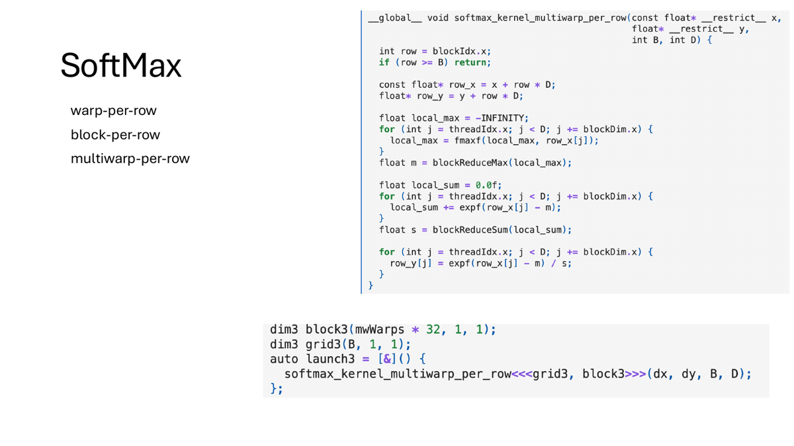
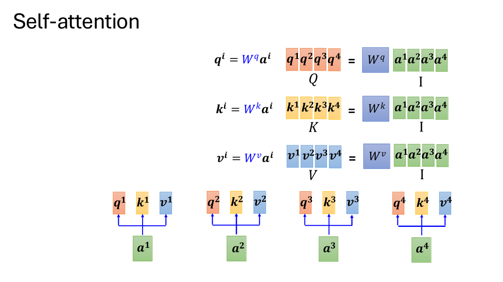
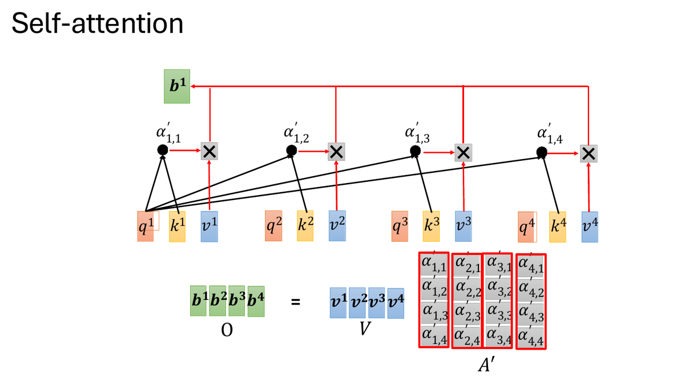
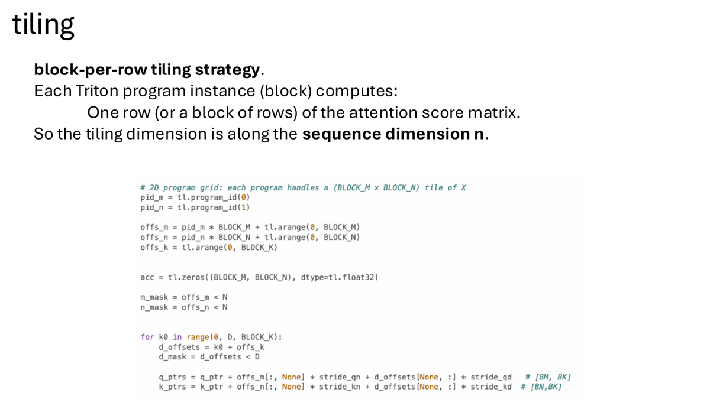
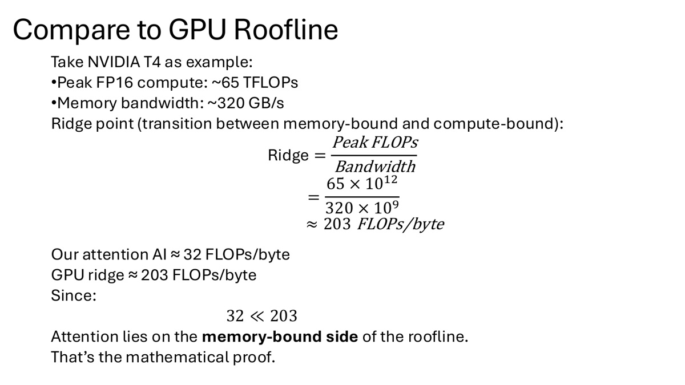

# CUDA Kernel Optimization for ML Operators

This project implements and analyzes CUDA kernels for core ML operators, with a focus on memory access patterns, tiling, warp-level reductions, shared memory reuse, register-level optimization, profiling, and PyTorch C++/CUDA extension integration.

Source repo: [cuda_projects](https://github.com/licheng2018/cuda_projects/tree/main)

## Project Goal

The goal was to understand how GPU kernel design choices affect the performance of ML operators that appear repeatedly in transformer workloads:

- Matrix multiplication.
- Layer normalization forward and backward.
- Numerically stable softmax.
- Fused elementwise / activation extensions.
- Naive attention score, softmax, and output stages.

The project starts from simple CUDA baselines, then adds progressively more hardware-aware optimizations such as block tiling, shared memory, padding to avoid bank conflicts, warp shuffle reductions, loop unrolling, register reuse, and PyTorch extension wrappers.

## Repository Structure

The repo is organized as a progression from CUDA fundamentals to ML operator kernels:

| Area | Files | Purpose |
|---|---|---|
| CUDA basics | `basic/0_cuda_computation.ipynb`, `1_vector_add.ipynb`, `2_memory_coalescing.ipynb`, `3_shared_memory_and_bank_conflict.ipynb`, `4_warp_level_reduction.ipynb` | Build intuition for execution hierarchy, memory coalescing, shared memory, bank conflicts, and warp reductions. |
| Week 1 operators | `project/week1_matmul_laynorm_softmax/*` | Matrix multiplication, loop unrolling, Nsight profiling, LayerNorm, and Softmax kernels. |
| PyTorch extensions | `project/week2_pytorch_extension/*` | C++/CUDA extension loading, TensorAccessor usage, LayerNorm extension, autograd checks, and fused Bias+GELU. |

## Matrix Multiplication

Matrix multiplication computes:

```text
C = A * B
A: M x K
B: K x N
C: M x N
```

The CPU baseline has `O(M*N*K)` work and becomes too slow for large matrices. The CUDA version maps output elements or output tiles to GPU threads/blocks.



## MatMul Optimization Path

The project walks through several matmul implementations:

1. **Naive kernel:** each thread computes one output element and repeatedly reads from global memory.
2. **Block tiling:** each block computes a tile of `C`, improving work partitioning.
3. **Shared-memory tiling:** tiles of `A` and `B` are loaded into shared memory and reused by threads in the block.
4. **Tile-size tuning:** compare `TILE=16` and `TILE=32`.
5. **Padding:** avoid shared-memory bank conflicts for tile layouts.
6. **Loop unrolling and register optimization:** reduce loop overhead and increase instruction-level parallelism.





## Shared Memory and Bank Conflicts

Shared memory improves performance when data is reused by multiple threads, but the layout matters. A tile size such as 32 can create bank conflicts when consecutive threads access addresses separated by 32 banks. Padding the shared-memory tile changes the stride and avoids conflict-heavy access.



## MatMul Benchmark Results

Environment from notebook: Tesla T4, CUDA 12.x toolchain. Matrix size: `M=N=K=1024`.

| Kernel | Correctness | Time (ms) | GFLOP/s | Speedup vs naive |
|---|---|---:|---:|---:|
| Naive MatMul baseline | PASS | 9.1753 | 234.05 | 1.00x |
| Block tiling, still global loads | PASS | 4.0592 | 529.04 | 2.26x |
| Shared-memory tiled, Tile16 | PASS | 2.4577 | 873.76 | 3.73x |
| Shared-memory tiled, Tile32 | PASS | 10.4073 | 206.34 | 0.88x |
| Shared-memory Tile32 with padding | PASS | 2.0924 | 1026.32 | 4.38x |

The best MatMul kernel in this benchmark is the padded Tile32 shared-memory version, reaching about 1026 GFLOP/s and 4.38x speedup over the naive baseline.

## Loop Unrolling and Register Optimization

Loop unrolling expands the loop body to reduce loop-control instructions such as counters, branches, and index updates. On GPUs, this can improve instruction-level parallelism and give the compiler more scheduling freedom.

Benchmark setting from notebook: A100, dot-product style workload with `M=1,048,576`, `K=1024`, `UNROLL=4`.

| Kernel | Correctness | Time (ms) | GFLOP/s | Speedup vs baseline |
|---|---|---:|---:|---:|
| Baseline | PASS | 8.4628 | 253.76 | 1.00x |
| Unroll + registers, global B | PASS | 7.3327 | 292.86 | 1.15x |
| Unroll + registers, constant B | PASS | 7.3741 | 291.22 | 1.15x |

The unrolled/register versions improve throughput by roughly 15%, showing a smaller but still meaningful benefit compared with memory tiling.

## Softmax

Softmax is central to attention and must be numerically stable. The implementation uses the shift-invariance trick:

```text
softmax(x_j) = exp(x_j - max(x)) / sum_k exp(x_k - max(x))
```


The project implements row-wise softmax with several GPU mappings:

- **Warp-per-row:** one warp handles one row, using warp shuffle reductions.
- **Block-per-row:** one block handles one row, useful for larger row width.
- **Multiwarp-per-row:** multiple warps cooperate on one row.





## Softmax Benchmark Results

Environment from notebook: Tesla T4. The benchmark reports average launch time and approximate memory bandwidth.

| Shape | Strategy | Time (ms) | Approx. GB/s | Notes |
|---|---|---:|---:|---|
| `B=65536, D=128` | Warp-per-row | 0.2871 | 233.75 | Best for small row width |
| `B=65536, D=128` | Block-per-row | 0.9043 | 74.21 | Slower due to overhead for small rows |
| `B=65536, D=128` | Multiwarp-per-row | 0.7211 | 93.06 | Also slower for small rows |
| `B=16384, D=512` | Warp-per-row | 0.3288 | 204.12 | Slightly best in this run |
| `B=16384, D=512` | Block-per-row | 0.3533 | 189.95 | Competitive |
| `B=16384, D=512` | Multiwarp-per-row | 0.3503 | 191.59 | Competitive |
| `B=4096, D=4096` | Warp-per-row | 1.2903 | 104.02 | Too little cooperation for long rows |
| `B=4096, D=4096` | Block-per-row, 512 threads | 0.9278 | 144.66 | Better for long rows |
| `B=4096, D=4096` | Multiwarp-per-row | 0.7547 | 177.84 | Best for long rows |

The best softmax strategy depends on row width. Warp-per-row is effective for small rows, while multiwarp-per-row becomes better for long rows because more threads cooperate on the same row reduction.

## LayerNorm

LayerNorm requires row-wise reductions for mean and variance, followed by normalization and affine transformation. The project implements forward and backward kernels and checks gradients against PyTorch autograd references.

Benchmark setting from notebook: Tesla T4, `B=4096`, `D=1024`.

| LayerNorm kernel | Correctness | Time (ms) | Notes |
|---|---|---:|---|
| Warp-based forward | PASS | 0.2119 | One optimized forward path |
| Warp-based backward | PASS | 0.2916 | Backward gradients pass correctness checks |
| Two-pass forward | PASS | 0.2118 | Similar forward speed |
| Two-pass backward total | FAIL in notebook | 0.6136 | Demonstrates the complexity of correct backward reductions |
| Mixed precision, FP32 reduction | Accuracy checked | 0.1811 | Faster and more accurate than low-precision reduction |
| Pure low-precision reduction | Accuracy checked | 0.2149 | Higher error and slower in this run |

The LayerNorm experiments show why numerical precision matters. FP32 reductions with FP16 IO gave lower error and faster runtime than pure low-precision reduction in the tested configuration.

## PyTorch C++/CUDA Extensions

The project also integrates CUDA kernels with PyTorch through C++/CUDA extensions:

- TensorAccessor-based extension loading.
- Forward-only extension path.
- Forward/backward LayerNorm extension.
- Autograd wrapper validation.
- Fused Bias+GELU extension.

Selected validation results:

| Extension | Test | Result |
|---|---|---|
| TensorAccessor extension | `B=256, D=1024` | `allclose=True`, max absolute error `0.0` |
| TensorAccessor benchmark | `B=4096, D=1024`, 200 iterations | `0.156652 ms/iter` |
| LayerNorm extension gradients | `dx`, `dgamma`, `dbeta` | allclose true, max abs errors around `4.77e-07` to `9.54e-07` |
| Fused Bias+GELU, FP32 | `B=256, D=1024` | max error `4.73e-04` |
| Fused Bias+GELU, FP16 | `B=256, D=1024` | max error `3.91e-03` |

## Naive Attention and IO-Bound Analysis

The attention notes explain the full attention pipeline:

```text
Q = X Wq
K = X Wk
V = X Wv
Scores = Q K^T
P = softmax(Scores)
O = P V
```





For a naive attention implementation, the project uses a block-per-row tiling strategy where each program/block computes one row or block of rows of the attention score matrix.



The notes derive why naive attention can be IO-bound. For `n=2048`, `d=64`, FP16:

- Attention score computation is roughly `4 * n^2 * d`, around `1.07e9` FLOPs.
- Materializing score/probability matrices creates roughly `4 * n^2` FP16 elements of S/P traffic, about 33.5 MB just for those intermediate matrices.
- Arithmetic intensity is about 32 FLOPs/byte.
- On a T4-style roofline with FP16 peak around 65 TFLOP/s and memory bandwidth around 320 GB/s, the ridge point is about 203 FLOPs/byte.

Since `32 << 203`, naive attention lies on the memory-bound side of the roofline.



## Profiling Focus

The project uses Nsight Compute concepts to connect code changes with GPU behavior:

- Memory workload analysis.
- Source counters.
- Warp state statistics.
- Scheduler statistics.
- DRAM throughput.
- SM utilization.
- Memory dependency stalls.

For IO-bound kernels, the expected profiling signature is high DRAM activity, lower achieved FLOPs relative to peak, and stalls related to memory dependencies.

## Main Takeaways

- Shared memory tiling gives a large MatMul speedup only when access patterns avoid bank conflicts.
- Padding can turn a slow Tile32 shared-memory kernel into the best MatMul variant.
- Loop unrolling and register reuse provide moderate gains by reducing loop overhead and improving instruction scheduling.
- Softmax strategy depends on row width: warp-per-row is strong for small rows, while multiwarp-per-row is better for long rows.
- LayerNorm performance depends on both reduction strategy and numerical precision.
- PyTorch C++/CUDA extensions require both kernel correctness and integration correctness through autograd checks.
- Naive attention is memory-bound because it materializes large score/probability matrices with low arithmetic intensity relative to GPU roofline.

## Experiment Result Analysis

The MatMul results show the clearest optimization ladder. Moving from naive global-memory access to block tiling gives a 2.26x speedup. Adding shared-memory tiling with `TILE=16` increases speedup to 3.73x. However, `TILE=32` without padding becomes slower than the naive baseline because bank conflicts and unfavorable memory access patterns outweigh the theoretical reuse benefit. Once padding is added, the Tile32 kernel becomes the best result at 4.38x speedup.

The Softmax results show that there is no single best mapping for every shape. Small rows benefit from warp-per-row because a single warp can reduce the row efficiently with low coordination overhead. Large rows benefit from multiwarp-per-row because one warp is not enough parallelism for the row width, and multiple cooperating warps improve memory throughput.

LayerNorm demonstrates the interaction between performance and numerical correctness. A fast kernel is not useful unless the backward pass and reductions are correct. The mixed-precision experiment is especially important: FP32 reductions with FP16 IO achieved both better accuracy and better runtime than pure low-precision reduction in this run.

The attention analysis connects the operator-level work to a roofline model. Naive attention performs substantial compute, but it also materializes large intermediate score and probability matrices. The arithmetic-intensity estimate places it on the memory-bound side of the T4 roofline, explaining why IO-aware attention kernels such as FlashAttention avoid materializing the full attention matrix and instead tile Q/K/V through faster memory.

Overall, this project shows how CUDA optimization is not one trick. Performance comes from matching the kernel strategy to the operator shape, memory hierarchy, numerical constraints, and profiler evidence.

[Back to Home](../index.md)
