# Distributed Training Optimization with FSDP, ZeRO, and Activation Checkpointing

This project builds a PyTorch distributed training workflow for GPT-Neo-1.3B and studies the memory/communication trade-offs behind DDP, ZeRO, FSDP, gradient accumulation, mixed precision, and activation checkpointing.

Source repo: [gpt_training](https://github.com/licheng2018/gpt_training/tree/main)

## Project Goal

The goal was to make large-model training practical under constrained multi-GPU memory:

- Train GPT-Neo-1.3B with `torchrun`.
- Compare DDP and FSDP training paths.
- Use FP16 mixed precision on GPU.
- Tune sequence length, microbatch size, and gradient accumulation.
- Add activation checkpointing to reduce activation memory.
- Log loss, step time, tokens/sec, and GPU memory statistics.
- Study the theory behind data parallelism, ZeRO, FSDP, tensor parallelism, and pipeline parallelism.

## Repository Structure

| File / script | Purpose |
|---|---|
| `train.py` | Main distributed training script with DDP/FSDP strategy selection. |
| `train_check_point.py` | Training script variant with activation checkpointing flag. |
| `scripts/run_ddp_wikitext.sh` | DDP run on Wikitext with GPT-Neo-1.3B. |
| `scripts/run_fsdp_wikitext.sh` | Sweep script for multi-GPU Wikitext runs. |
| `scripts/ddp_ckpt_on.sh`, `ddp_ckpt_off.sh` | DDP checkpointing comparison. |
| `scripts/fsdp_ckpt_on.sh`, `fsdp_ckpt_off.sh` | FSDP checkpointing comparison. |
| `scripts/sweep.sh`, `sweep_min.sh` | Sweeps over strategy, checkpointing, microbatch size, and gradient accumulation. |

## Data Parallel Training

Data parallelism replicates the model on each GPU, partitions the training data into batches, computes gradients independently, and aggregates gradients across workers.

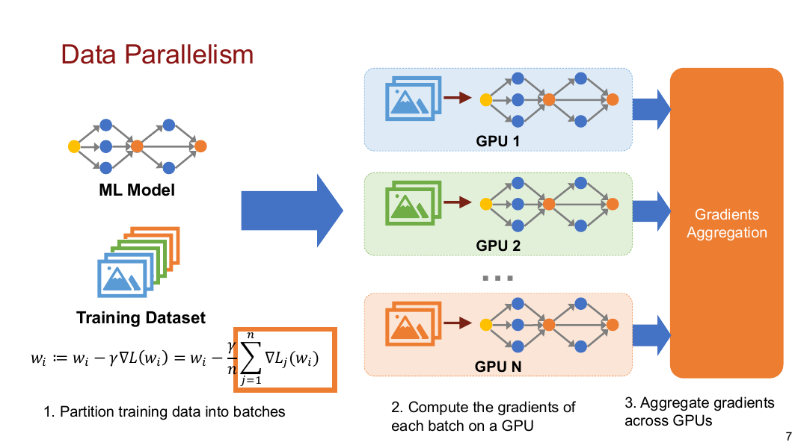

The core limitation is memory redundancy: every GPU stores a full copy of the model parameters, gradients, and optimizer states. That becomes a problem for billion-parameter language models.

## AllReduce and Communication

Gradient aggregation can be implemented with different collective strategies such as naive AllReduce, ring AllReduce, tree AllReduce, and butterfly AllReduce.

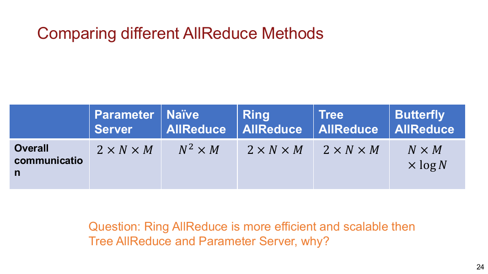

For DDP, gradient synchronization is central to training performance. The repo uses PyTorch distributed with NCCL and reports averaged metrics across ranks using distributed reductions.

## Memory Consumption in Large Models

For large models, parameter memory is only part of the cost. Training also needs gradients, optimizer states, and activations.

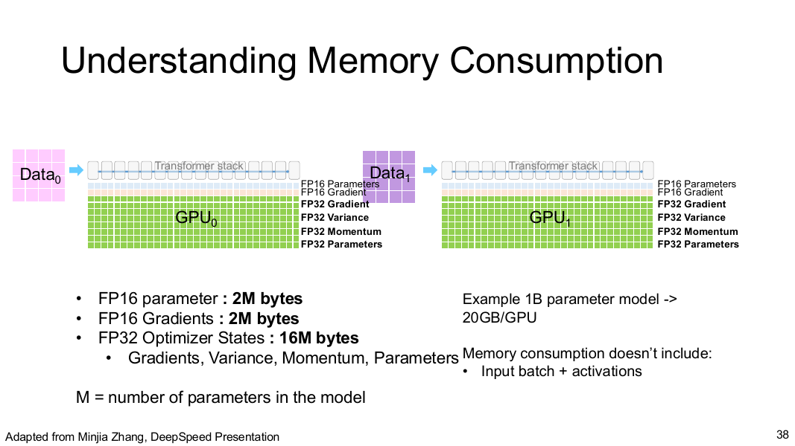

For a 1B parameter model, a common memory estimate includes:

| Component | Approx. memory per parameter |
|---|---:|
| FP16 parameters | 2 bytes |
| FP16 gradients | 2 bytes |
| FP32 optimizer states and master weights | much larger, often around 16 bytes total |

This means a 1B parameter model can require around 20GB/GPU before counting input batches and activations.

## ZeRO and FSDP

ZeRO reduces redundancy across data-parallel workers:

- **ZeRO Stage 1:** partition optimizer states.
- **ZeRO Stage 2:** partition gradients.
- **ZeRO Stage 3:** partition parameters.

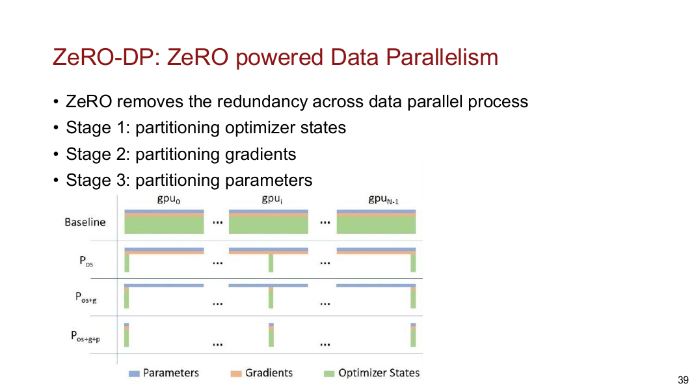

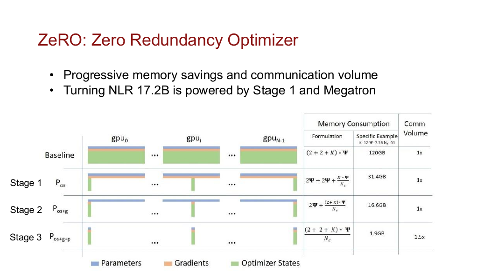

PyTorch FSDP is closely related to ZeRO Stage 3. It shards model parameters across GPUs, gathers full parameters only when needed for computation, and reduce-scatters gradients after backward.

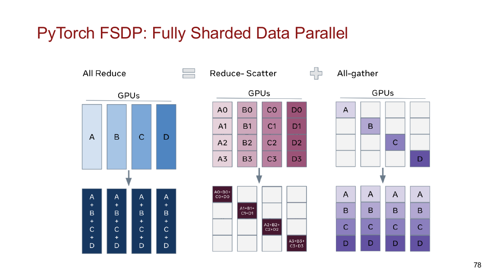

### FSDP Forward and Backward Flow

Forward pass:

1. Divide model parameters into FSDP units.
2. Shard each unit across GPUs.
3. All-gather the parameters needed for a unit.
4. Run forward.
5. Discard gathered full parameters after use.

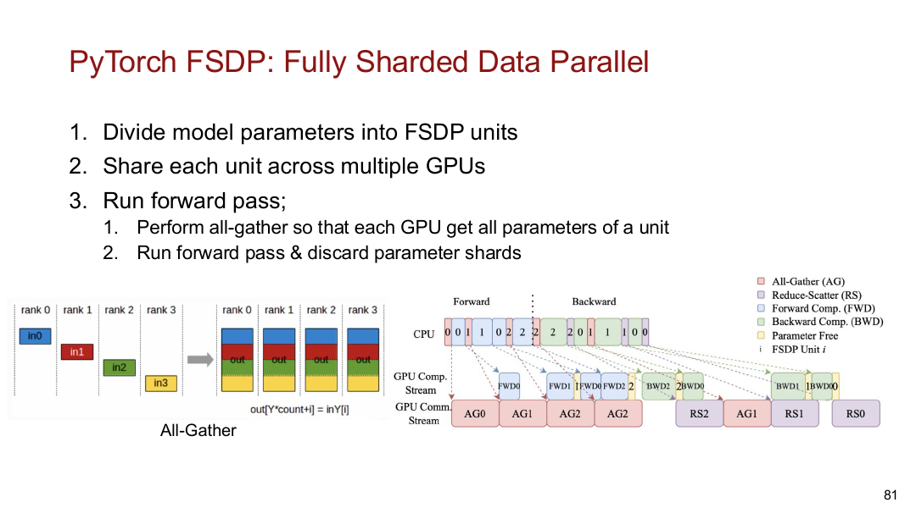

Backward pass:

1. All-gather parameters again for the unit.
2. Compute gradients.
3. Reduce-scatter gradients so each GPU keeps only its shard.

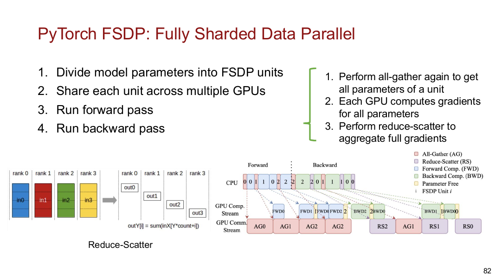

## Model, Tensor, and Pipeline Parallelism

The PDF notes also cover why data parallelism alone is not enough. If every GPU must store the full model, data parallelism cannot train models that exceed device memory.

Tensor parallelism partitions computation inside layers.

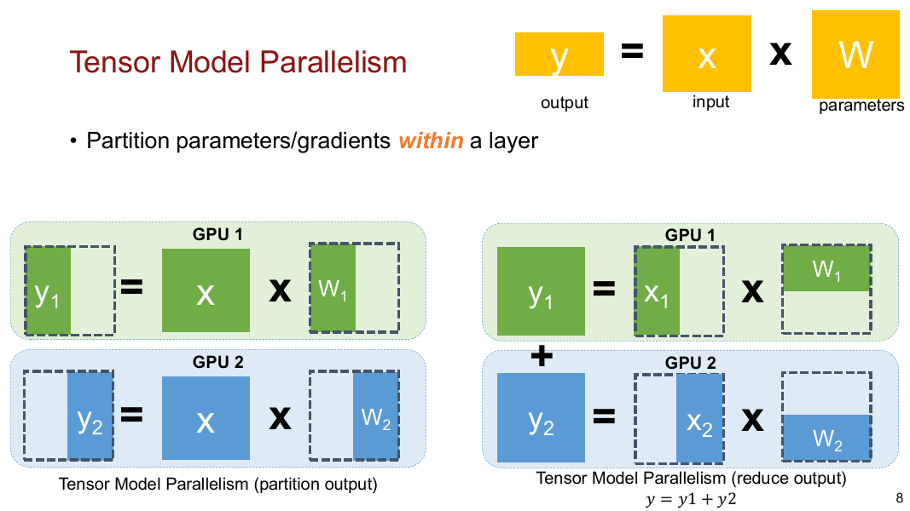

Pipeline parallelism partitions model layers across devices and uses microbatches to keep pipeline stages busy.

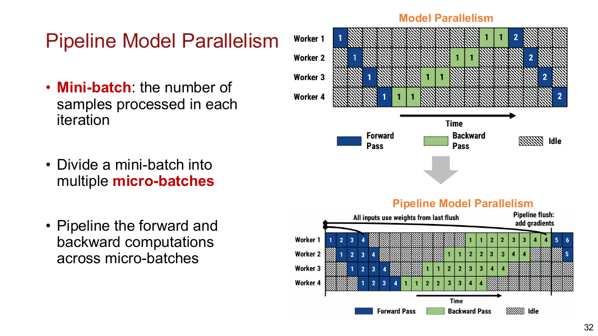

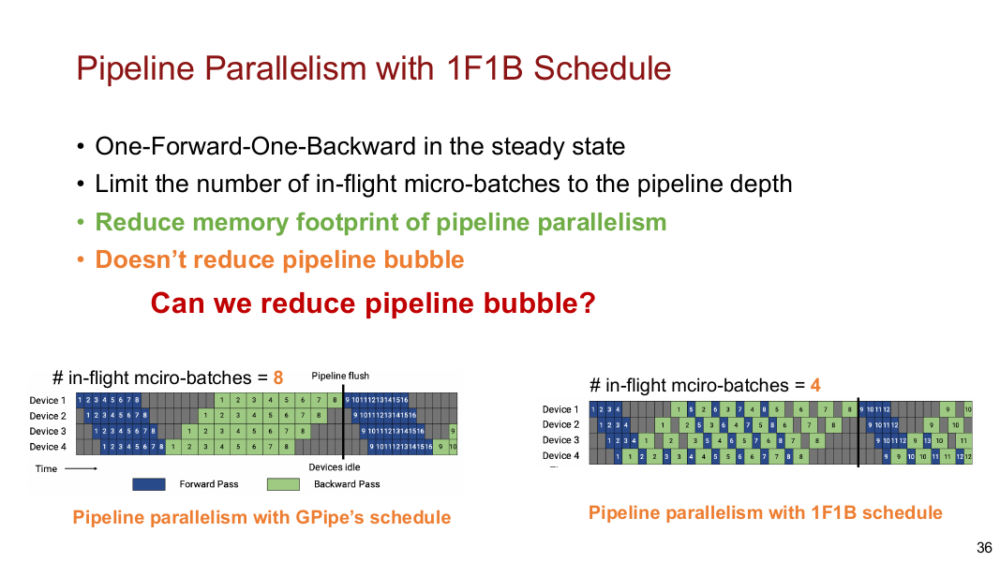

The project itself focuses on DDP/FSDP and activation checkpointing, but the theory notes place those techniques in the broader DP/TP/PP design space.

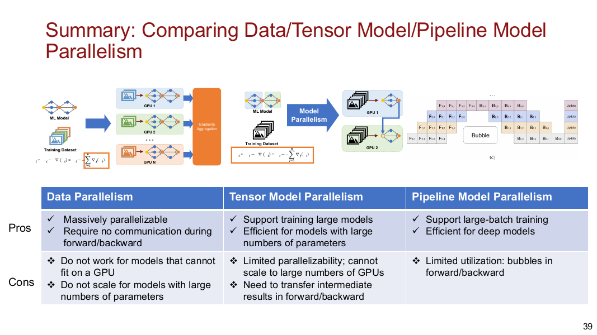

## Implementation Details

The training scripts support:

- `torchrun` multi-process launch.
- NCCL distributed backend.
- DDP or FSDP strategy selection via `--strategy`.
- GPT-Neo-1.3B loading through Hugging Face Transformers.
- Wikitext or synthetic token stream dataset.
- Sequence length control with `--seq_len`.
- Per-GPU microbatch control with `--microbatch`.
- Gradient accumulation with `--grad_accum`.
- FP16 mixed precision with `--fp16`.
- Activation checkpointing with `--checkpoint`.
- Loss logging, step time, tokens/sec, and max GPU memory reporting.

FSDP setup uses:

- `FullyShardedDataParallel`.
- `ShardingStrategy.FULL_SHARD`.
- Transformer block auto-wrapping for GPT-Neo blocks.
- `MixedPrecision` with FP16 parameter, reduce, and buffer dtypes.

## Experiment Matrix

The repo includes sweep scripts for the following experiment dimensions.

| Experiment | Strategy | Dataset | Seq len | Microbatch | Grad accumulation | Checkpointing | GPUs |
|---|---|---|---:|---:|---:|---|---:|
| DDP Wikitext run | DDP | Wikitext | 1024 | 2 | 8 | Off | 4 |
| DDP checkpoint off | DDP | Wikitext | 1024 | 2 | 8 | Off | 4 |
| DDP checkpoint on | DDP | Wikitext | 1024 | 2 | 8 | On | 4 |
| FSDP checkpoint off | FSDP | Wikitext | 1024 | 4 | 4 | Off | 4 |
| FSDP checkpoint on | FSDP | Wikitext | 1024 | 4 | 4 | On | 4 |
| Sweep | DDP/FSDP | Synthetic | 1024 | 1, 2, 4, 8 | 16, 8, 4, 2 | On/Off | 4 |
| Sweep | DDP | Wikitext | 512, 1024 | 1, 2, 4, 8 | 8, 4, 2, 1 | Off | 8 |

The effective tokens per optimizer step are computed as:

```text
microbatch * seq_len * world_size * grad_accum
```

This makes microbatch and gradient accumulation directly comparable: different settings can keep similar effective batch size while changing memory pressure and communication cadence.

## Observable Metrics

The scripts are designed to log:

| Metric | Purpose |
|---|---|
| Loss | Training sanity check. |
| Average step time | Measures throughput bottlenecks. |
| Tokens/sec | Normalized training throughput. |
| Max allocated GPU memory | Peak memory pressure. |
| Max reserved GPU memory | CUDA caching allocator footprint. |
| Rank-averaged metrics | Comparable reporting across distributed workers. |

The public repo contains the training scripts and sweep configuration, but it does not include saved log files or result plots. Because of that, this page reports the implemented experiment matrix and the metrics the scripts record, rather than inventing exact throughput numbers.

## Activation Checkpointing

Activation checkpointing trades compute for memory. Instead of saving all intermediate activations during forward, checkpointing saves fewer tensors and recomputes activations during backward.

In the repo, checkpointing is enabled with:

```text
--checkpoint
```

and implemented through:

```python
model.gradient_checkpointing_enable()
```

Expected trade-off:

| Setting | Memory | Compute time | Why |
|---|---|---|---|
| Checkpoint off | Higher activation memory | Faster backward | Activations are stored from forward. |
| Checkpoint on | Lower activation memory | Slower backward | Activations are recomputed during backward. |

Checkpointing is useful when the limiting factor is peak memory and a larger microbatch or longer sequence length would otherwise not fit.

## Main Takeaways

- DDP is simple and efficient when the full model fits on each GPU.
- ZeRO/FSDP reduce memory redundancy by sharding optimizer states, gradients, and parameters.
- FSDP full-shard requires AllGather before computation and ReduceScatter after gradient computation.
- Activation checkpointing reduces peak activation memory but adds recomputation overhead.
- Microbatch size and gradient accumulation trade memory pressure against optimizer-step frequency.
- Distributed training optimization is a balance between memory, communication, compute, and stability.

## Experiment Result Analysis

The main value of this project is the implementation and experiment design for training GPT-Neo-1.3B under constrained memory. The scripts make the key distributed-training trade-offs explicit: DDP keeps full replicas and relies on gradient synchronization, while FSDP shards parameters and gradients to reduce per-GPU memory.

FSDP should help most when model-state memory is the bottleneck. It can allow larger models or larger microbatches to fit, but it introduces extra AllGather and ReduceScatter communication. That means FSDP is not automatically faster than DDP; it is a memory-saving strategy that must be evaluated together with communication overhead.

Activation checkpointing targets a different memory component: activations. It is especially useful for long sequence lengths such as 1024, where transformer activations become expensive. The cost is extra recomputation in backward, so the best checkpointing setting depends on whether the run is memory-bound or compute-bound.

The sweep scripts are set up to answer the practical question: for a fixed effective batch size, which combination of microbatch, gradient accumulation, checkpointing, and sharding gives the best tokens/sec without exceeding GPU memory? That is the right framing for large-model training systems, because peak memory and throughput must be optimized together.

[Back to Home](../index.md)
