# Distributed Training Optimization with FSDP, ZeRO, and Activation Checkpointing

This project builds a PyTorch distributed training workflow for GPT-Neo-1.3B and studies the memory/communication trade-offs behind DDP, ZeRO, FSDP, gradient accumulation, mixed precision, and activation checkpointing.

Source repo: [gpt_training](https://github.com/licheng2018/gpt_training/tree/main)

## Contents

| Area | Jump to sections |
|---|---|
| Overview | [Project Goal](#project-goal) · [Benchmark Positioning](#benchmark-positioning) · [Repository Structure](#repository-structure) · [Code Architecture and Training Flow](#code-architecture-and-training-flow) |
| Training System | [Distributed Training Fundamentals](#distributed-training-fundamentals) · [Distributed Launch and NCCL Setup](#distributed-launch-and-nccl-setup) · [Model and Dataset Pipeline](#model-and-dataset-pipeline) · [FP16 Mixed Precision](#fp16-mixed-precision) |
| Parallelism | [Data Parallel Training](#data-parallel-training) · [AllReduce and Communication](#allreduce-and-communication) · [Memory Consumption in Large Models](#memory-consumption-in-large-models) · [ZeRO and FSDP](#zero-and-fsdp) · [Model, Tensor, and Pipeline Parallelism](#model-tensor-and-pipeline-parallelism) |
| Experiments | [Implementation Details](#implementation-details) · [Microbatch, Gradient Accumulation, and Global Batch](#microbatch-gradient-accumulation-and-global-batch) · [DDP no_sync Optimization](#ddp-nosync-optimization) · [Experiment Matrix](#experiment-matrix) · [Observable Metrics](#observable-metrics) · [Activation Checkpointing](#activation-checkpointing) |
| Analysis | [Expected Performance Patterns](#expected-performance-patterns) · [Main Takeaways](#main-takeaways) · [Experiment Result Analysis](#experiment-result-analysis) |

## Project Goal

The goal was to build a controlled multi-GPU training benchmark around GPT-Neo-1.3B, then use it to compare how DDP, FSDP, gradient accumulation, FP16, and activation checkpointing affect memory, throughput, and optimizer-step latency.

This project is not primarily about fully training GPT-Neo on WikiText to convergence. It is a systems benchmark for validating a distributed training workflow and exposing practical trade-offs:

- Can GPT-Neo-1.3B be launched and trained correctly with `torchrun`?
- How much per-GPU memory does DDP require when every rank stores the full model state?
- How much memory can FSDP `FULL_SHARD` save by sharding parameters, gradients, and optimizer states?
- How do microbatch size and gradient accumulation affect throughput at fixed effective global batch size?
- How much memory does activation checkpointing save, and how much recomputation overhead does it introduce?
- When does synthetic data provide a cleaner systems measurement than WikiText?
- How should loss, step time, tokens/sec, and CUDA memory be measured across ranks?

The overall workflow can be summarized as:

```text
GPT-Neo-1.3B causal language model
        ↓
FP16 mixed-precision training
        ↓
DDP or FSDP distributed strategy
        ↓
microbatch / gradient accumulation / checkpointing sweep
        ↓
measure loss, step time, tokens/s, peak allocated memory, peak reserved memory
```

## Benchmark Positioning

The core experimental object is:

| Component | Choice |
|---|---|
| Model | `EleutherAI/gpt-neo-1.3B` |
| Dataset | WikiText-103 or synthetic token stream |
| Precision | FP16 mixed precision |
| Distributed launch | `torchrun` |
| Communication backend | NCCL |
| Strategies | DDP and FSDP `FULL_SHARD` |
| Key knobs | `seq_len`, `microbatch`, `grad_accum`, `checkpoint` |
| Metrics | loss, step time, tokens/sec, max allocated memory, max reserved memory |

The distinction matters because the expected output is not a final language-model checkpoint or best perplexity. The expected output is a controlled comparison of memory and throughput behavior under different distributed training strategies.

## Repository Structure

| File / script | Purpose |
|---|---|
| `train.py` | Main distributed training script with DDP/FSDP strategy selection. |
| `train_check_point.py` | Training script variant with activation checkpointing flag. |
| `scripts/run_ddp_wikitext.sh` | DDP run on Wikitext with GPT-Neo-1.3B. |
| `scripts/run_fsdp_wikitext.sh` | Sweep script for multi-GPU Wikitext runs. |
| `scripts/ddp_ckpt_on.sh`, `ddp_ckpt_off.sh` | DDP checkpointing comparison. |
| `scripts/fsdp_ckpt_on.sh`, `fsdp_ckpt_off.sh` | FSDP checkpointing comparison. |
| `scripts/sweep.sh`, `sweep_min.sh` | Sweeps over strategy, checkpointing, microbatch size, and gradient accumulation. |

## Code Architecture and Training Flow

The codebase can be understood as a layered training benchmark rather than a single monolithic script. Each layer isolates one part of the distributed training system:

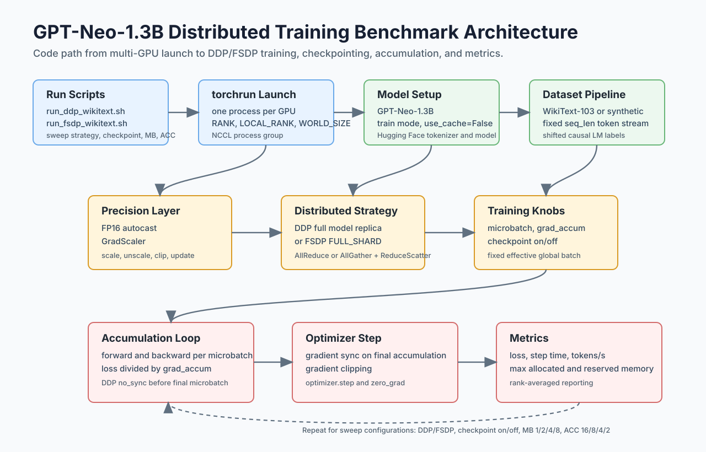

| Layer | Code responsibility | What it controls |
|---|---|---|
| Run scripts | Launch repeatable experiment configurations. | Strategy, checkpointing, sequence length, microbatch, gradient accumulation, number of GPUs. |
| Distributed bootstrap | Start one process per GPU and initialize NCCL. | `RANK`, `LOCAL_RANK`, `WORLD_SIZE`, device binding, process group. |
| Model setup | Load GPT-Neo-1.3B for causal language modeling. | Hugging Face tokenizer/model, `model.train()`, `use_cache=False`. |
| Dataset pipeline | Build either real or synthetic token batches. | WikiText token stream, synthetic tokens, fixed `seq_len`, shifted labels. |
| Precision layer | Run mixed-precision training safely. | FP16 autocast, `GradScaler`, unscale, gradient clipping. |
| Distributed strategy | Wrap the model with DDP or FSDP. | DDP full replica, FSDP `FULL_SHARD`, GPT-Neo block auto-wrapping. |
| Training loop | Execute microbatch accumulation and optimizer steps. | `loss / grad_accum`, DDP `no_sync()`, final synchronization, `optimizer.step()`. |
| Metrics | Report comparable benchmark outputs. | Loss, step time, tokens/sec, max allocated memory, max reserved memory. |

The main code path is:

```text
run script
  -> torchrun launch
  -> distributed init with NCCL
  -> load tokenizer and GPT-Neo-1.3B
  -> build WikiText or synthetic dataloader
  -> enable FP16 and optional checkpointing
  -> wrap model with DDP or FSDP
  -> run gradient-accumulation training loop
  -> synchronize metrics across ranks
```

This structure is useful for interviews because each part corresponds to a concrete systems question:

| Code part | Interview question it answers |
|---|---|
| `torchrun` + NCCL setup | How does each process know which GPU and rank it owns? |
| WikiText vs synthetic data | How do you separate model-system performance from data-pipeline overhead? |
| DDP wrapper | What is replicated, and when does AllReduce happen? |
| FSDP wrapper | What is sharded, and when are parameters gathered? |
| FP16 + GradScaler | Why can mixed precision improve throughput, and why is scaling needed? |
| Gradient accumulation | How do you keep effective global batch fixed under memory limits? |
| DDP `no_sync()` | How do you avoid redundant communication during accumulation? |
| Checkpointing | How do you trade recomputation for lower activation memory? |
| Metrics logging | How do you compare strategies fairly across ranks? |

## Distributed Training Fundamentals

This section integrates the foundational material from the review notes, covering Sections `4.1` to `4.7`. The main idea is that distributed training is a joint compute, memory, and communication problem:

```text
Data parallelism:      split samples, replicate model.
Tensor parallelism:    split operations inside layers.
Pipeline parallelism:  split layer stacks into stages.
ZeRO/FSDP:             shard persistent states that DDP would replicate.
```

A method can make a model fit without making each training step faster. This distinction is central to interpreting DDP, FSDP, and checkpointing results.

| PDF section | Concept integrated here |
|---|---|
| `4.1` | Global batch, local batch, microbatch, gradient accumulation, useful tokens. |
| `4.2` | DDP execution, gradient AllReduce, bucketing, communication-computation overlap. |
| `4.3` | ZeRO stages, FSDP full-shard lifecycle, AllGather, ReduceScatter, auto-wrap policy. |
| `4.4` | Activation memory, checkpointing, mixed precision dtype choices. |
| `4.5` | Persistent model states and complete peak memory accounting. |
| `4.6` | Step time, tokens/sec, peak memory, profiler diagnosis. |
| `4.7` | Why FSDP can be slower than DDP and how to compare them fairly. |

### 4.1 Training Batch and Execution Model

Let:

```text
N_DP     = data-parallel degree
B_micro  = samples processed by one rank in one forward/backward pair
K_acc    = number of accumulated microbatches
```

The effective global batch is:

```text
B_global = N_DP * B_micro * K_acc
```

The term `local batch` can be ambiguous. Some codebases use it to mean one microbatch; others use it to mean all samples processed by one rank before an optimizer step, or `B_micro * K_acc`. For this project, it is safer to explicitly state `microbatch` and `grad_accum`.

For variable-length sequence training, tokens per optimizer step can be a better work measure than sample count:

```text
T_global = sum over ranks and accumulation steps of actual tokens processed
```

This matters because padded tokens consume compute but are not useful training data. Packed-sequence benchmarks should distinguish useful tokens from executed tokens.

Gradient accumulation runs several forward/backward pairs before one optimizer update:

```text
zero gradients
for k in accumulation steps:
    forward(microbatch[k])
    backward(loss[k] / K_acc)
synchronize final gradients
optimizer step
```

The activation memory of accumulation is controlled mainly by the microbatch, not by the full effective batch, because activations from one microbatch can normally be released after its backward pass. Accumulation does not shard parameters, gradients, or optimizer states. It also does not increase same-instant GPU parallelism, so very small microbatches may reduce GEMM efficiency.

### 4.2 Distributed Data Parallel

In DDP, every rank holds a complete model replica, computes gradients on a different data slice, synchronizes gradients, and performs the same optimizer update.

If rank `r` produces gradient `g_r`, the desired average gradient is:

```text
g = (1 / N_DP) * sum_r g_r
```

The collective may sum gradients and let the framework divide separately. Identical initial parameters plus identical reduced gradients keep all model replicas synchronized. Standard DDP does not reduce per-rank parameter, gradient, or optimizer-state memory.

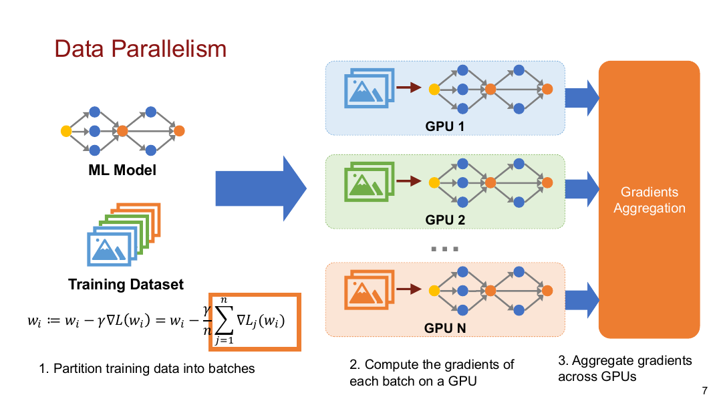

AllReduce combines every rank's tensor and returns the result to every rank. Ring AllReduce can be understood as:

```text
ReduceScatter + AllGather
```

For `p` ranks and message size `M`, each rank transfers approximately:

```text
2 * (p - 1) / p * M
```

in the bandwidth term. A simple latency-bandwidth model is:

```text
T_ring ~= 2 * (p - 1) * alpha + [2 * (p - 1) / p] * M / beta
```

where `alpha` is per-step latency and `beta` is effective bandwidth. Ring is bandwidth-efficient for large messages but has `O(p)` phases. Tree algorithms use fewer phases and can be better for smaller messages. Real collective libraries choose rings, trees, or topology-aware variants depending on size and hardware.

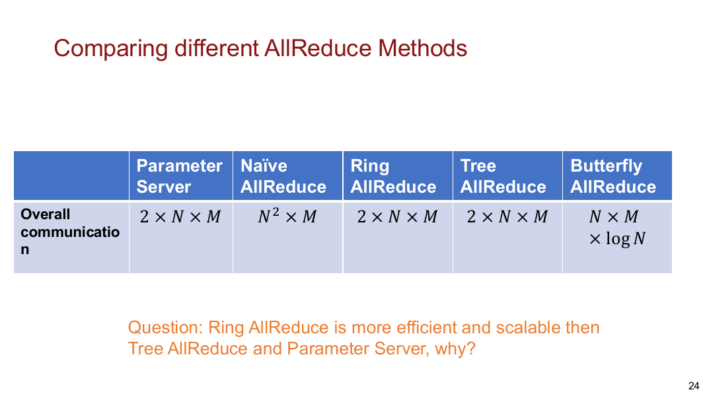

DDP also uses gradient bucketing. Backward produces gradients in reverse graph order, so DDP groups parameters into buckets and launches an AllReduce once all gradients in a bucket are ready. This allows later backward computation to overlap communication.

| Bucket choice | Benefit | Cost |
|---|---|---|
| Small buckets | Start communication earlier. | Many latency-dominated collectives and more framework overhead. |
| Large buckets | Better bandwidth efficiency. | Become ready later, reduce overlap, need larger buffers, and may leave a long communication tail. |

An optimistic overlap model is:

```text
T_step ~= T_forward + max(T_backward, T_communication) + T_optimizer
```

Only communication that overlaps independent backward compute can be hidden. The final bucket often creates an exposed tail because there is no later backward work left to cover it.

### 4.3 ZeRO and FSDP

Let:

```text
M_P = parameter memory
M_G = gradient memory
M_O = optimizer-state memory
p   = number of ranks
```

Ideal persistent model-state memory per rank is:

| Method | Parameters | Gradients | Optimizer states | Ideal persistent state per rank |
|---|---|---|---|---|
| DDP | replicated | replicated | replicated | `M_P + M_G + M_O` |
| ZeRO-1 | replicated | replicated | sharded | `M_P + M_G + M_O / p` |
| ZeRO-2 | replicated | sharded | sharded | `M_P + M_G / p + M_O / p` |
| ZeRO-3 / FSDP full shard | sharded | sharded | sharded | `M_P / p + M_G / p + M_O / p` |

These equations omit activations, temporary full parameters, communication buffers, workspaces, allocator fragmentation, and CUDA context overhead. ZeRO and FSDP do not automatically shard activations.

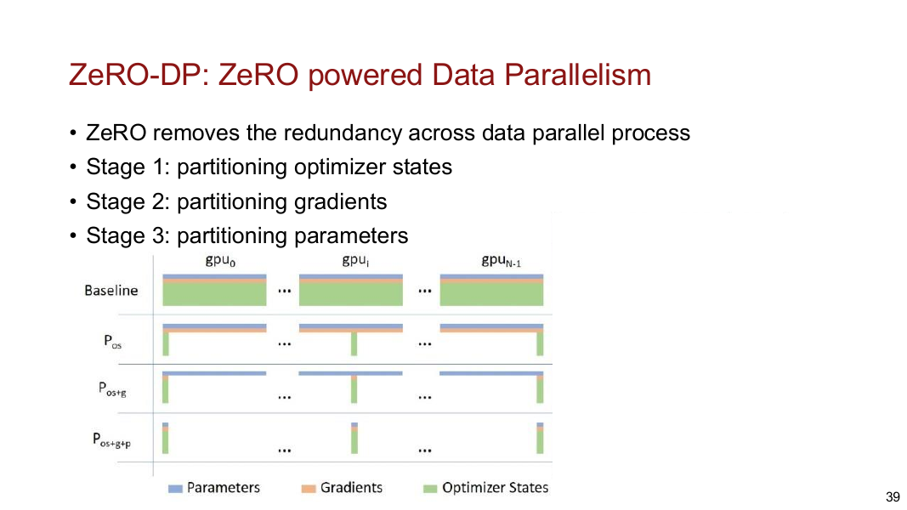

For one FSDP-wrapped unit, the full-shard lifecycle is:

```text
1. Hold parameter shards at rest.
2. AllGather parameter shards before forward.
3. Compute forward with temporary full parameters.
4. Optionally reshard or free full parameters after forward.
5. AllGather again before backward if parameters were resharded.
6. Compute local gradient contributions.
7. ReduceScatter gradients so each rank keeps only its shard.
8. Update local parameter shard with local optimizer-state shard.
```

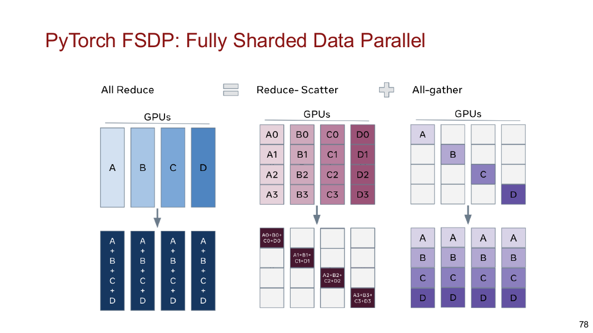

AllGather materializes full parameters for the current unit:

```text
W = AllGather(W_1, W_2, ..., W_p)
```

This temporary full tensor contributes to peak memory. ReduceScatter reduces gradients and distributes non-overlapping shards, avoiding a full AllReduce result that would be mostly discarded.

Auto-wrap policy defines the unit of parameter gathering, resharding, and gradient scattering. Transformer-block wrapping is a common starting point.

| Wrapping granularity | Problem |
|---|---|
| Too coarse | Large temporary full parameters, high peak memory, long residency, fewer overlap opportunities. |
| Too fine | Many small latency-dominated collectives, CPU launch overhead, metadata overhead, too little compute per communication. |

The wrap policy should be profiled on the target topology and should avoid incorrectly splitting shared parameters.

### 4.4 Activation Checkpointing and Mixed Precision

Backward may need normalization inputs and statistics, Q/K/V or selected attention state, residuals, MLP pre-activations, gate/up outputs, and dropout state. A rough activation memory model is:

```text
M_act proportional to B_micro * S * d_model * L
```

where `S` is sequence length and `L` is the number of layers. Naive attention may also create sequence-squared intermediates. Fused attention and selective saved tensors change the exact set of activations.

Activation checkpointing saves selected boundary activations and recomputes missing forward regions during backward:

```text
save less activation state
        ↓
recompute during backward
        ↓
lower memory, higher compute and launch overhead
```

Fine-grained checkpointing can save more intermediate state but introduces many boundaries and framework overhead. Coarse-grained checkpointing repeats larger regions of computation. Random operations must reproduce correct RNG behavior during recomputation.

Checkpointing usually slows the same microbatch. Its system value appears when saved memory enables a larger microbatch, longer sequence, or otherwise more efficient shape. FSDP reduces model-state memory, while checkpointing reduces activation memory. They solve different memory components and are often combined.

Mixed-precision training can use different dtypes for:

| Training component | Possible dtype choices |
|---|---|
| Stored parameters | FP16, BF16, FP32, or sharded policy-specific dtype. |
| Forward/backward compute | FP16/BF16/TF32/FP32 depending on hardware and autocast policy. |
| Reductions and gradient communication | Often configurable separately in FSDP. |
| Master weights and optimizer states | Commonly FP32 for stability. |
| Sensitive operations | Often kept in higher precision. |

FP16 often requires loss scaling because its exponent range is narrow. BF16 has FP32-like range and usually avoids loss scaling, although reductions and optimizer states commonly remain FP32. FP8 training requires explicit scaling or amax tracking, supported matrix kernels, and higher-precision accumulation.

### 4.5 Training Memory Accounting

For mixed-precision Adam, one model parameter may correspond to several persistent states:

| State | Typical dtype | Bytes per parameter |
|---|---|---:|
| Model parameter | FP16/BF16 | 2 |
| FP32 master parameter, if present | FP32 | 4 |
| Gradient | FP16/BF16 or FP32 | 2 or 4 |
| First moment | FP32 | 4 |
| Second moment | FP32 | 4 |

Persistent states therefore often require roughly `12-16 bytes` per parameter depending on the master-copy and gradient implementation. A billion parameters can require `12-16 GB` before activations, temporary buffers, and fragmentation.

Complete peak memory is closer to:

```text
M_peak ~= M_P + M_G + M_O + M_act
        + M_comm + M_workspace + M_allocator
```

`M_comm` includes DDP buckets and FSDP collective buffers. Workspaces include storage used by attention, GEMM, and fused optimizers. Allocated and reserved memory differ because fragmentation and cached blocks can make reserved memory substantially larger. Memory should be recorded by rank and by phase because one imbalanced rank can OOM the whole job.

### 4.6 Performance Measurement and Diagnosis

A measured optimizer step can be decomposed as:

```text
T_step = T_data
       + T_forward
       + T_backward
       + T_comm_exposed
       + T_optimizer
       + T_misc
```

With uniform sequence length:

```text
tokens/sec = B_global * S / T_step
```

For variable-length data, the benchmark should state whether it reports useful tokens or executed tokens. Steady-state cluster tokens/sec, tokens/sec/GPU, and step-time breakdown should be reported separately. Compilation, evaluation, checkpoint saving, and first-step initialization should be excluded or separately reported.

The review notes give a practical diagnosis table:

| Observation | Likely cause | Next experiment |
|---|---|---|
| Long AllReduce tail | Late or large bucket, little overlap. | Adjust bucket size and inspect gradient-ready order. |
| Many short collectives | Buckets or wrapped units are too fine. | Increase message granularity. |
| FSDP gather memory spike | Wrapped unit too large or prefetch too aggressive. | Reduce wrap size or prefetch depth. |
| Rank wait imbalance | Input/sequence skew or host delay. | Compare per-rank traces. |
| Checkpoint saves memory but slows | Recomputation did not enable a better workload shape. | Compare the largest feasible microbatch. |
| Low utilization | Tiny microbatch, communication, or launch overhead. | Increase local work and inspect timeline gaps. |

### 4.7 Why FSDP Can Be Slower Than DDP

DDP already owns full parameters and mainly needs gradient AllReduce. FSDP adds:

```text
parameter AllGather before each wrapped unit
possible second AllGather before backward
reshard / unshard work
gradient ReduceScatter
buffer management
more collective launches
```

FSDP is commonly slower in small experiments when:

- The model fits comfortably under DDP.
- Microbatches and per-unit compute are small.
- Wrapping is too fine, or prefetch cannot hide gathers.
- The topology is slow or crosses PCIe/network boundaries.
- Activation checkpointing adds recomputation at the same time.
- Saved memory is not used to increase microbatch, sequence length, or model size.
- Initialization or first-step effects contaminate the benchmark.

A fair comparison needs two views:

| View | Purpose |
|---|---|
| Hold microbatch and semantics constant | Measures direct FSDP overhead. |
| Tune each method to its largest efficient shape | Measures whether FSDP's memory savings enable a better workload. |

The interview-ready answer is:

```text
FSDP is primarily a memory-scaling method, not a promise of speedup.
It becomes valuable when sharding makes the model fit or enables a more efficient workload shape,
and when gathers/scatters are large enough and well overlapped.
For a small model and tiny microbatch, DDP's simpler path can easily be faster.
```

## Distributed Launch and NCCL Setup

The project launches one Python process per GPU with `torchrun`. A typical 4-GPU run uses:

```text
torchrun --nproc_per_node=4 train_check_point.py
```

Each process reads distributed metadata from environment variables:

| Variable | Meaning |
|---|---|
| `RANK` | Global process index in the distributed job. |
| `LOCAL_RANK` | GPU index used by the process on the current node. |
| `WORLD_SIZE` | Total number of distributed processes, usually equal to total GPUs for single-node runs. |

The script then binds the process to its GPU and initializes the process group:

```python
torch.cuda.set_device(local_rank)

dist.init_process_group(
    backend="nccl",
    init_method="env://"
)
```

For a 4-GPU single-node run, the mapping is:

| Process | GPU |
|---|---|
| Process 0 | GPU 0 |
| Process 1 | GPU 1 |
| Process 2 | GPU 2 |
| Process 3 | GPU 3 |

NCCL handles the GPU collective communication used by DDP and FSDP. This project uses those collectives inside a training system, while the separate NCCL project studies the communication primitives themselves.

## Model and Dataset Pipeline

The default model is loaded through Hugging Face:

```python
AutoTokenizer.from_pretrained(...)
AutoModelForCausalLM.from_pretrained(...)
```

The model is placed in training mode and inference KV cache is disabled:

```python
model.train()
model.config.use_cache = False
```

Disabling `use_cache` is the right behavior for training. KV cache is useful during autoregressive inference because it avoids recomputing historical keys and values during decoding. In training, the full sequence is normally processed in one forward pass, and gradient checkpointing is generally incompatible with `use_cache=True`.

The project supports two data modes:

| Dataset mode | Purpose |
|---|---|
| WikiText-103 | Validates the real language-model training path and checks whether loss behaves reasonably. |
| Synthetic tokens | Removes dataset download, tokenization, disk I/O, and preprocessing variation so the benchmark focuses on model compute, GPU memory, and distributed communication. |

For WikiText, the pipeline concatenates raw text, tokenizes it into a continuous token stream, slices fixed-length sequences, and constructs causal language-model labels by shifting by one token.

For example:

```text
raw tokens = [10, 20, 30, 40, 50]

input_ids = [10, 20, 30, 40]
labels    = [20, 30, 40, 50]
```

The model learns:

```text
given 10          -> predict 20
given 10,20       -> predict 30
given 10,20,30    -> predict 40
```

The resulting tensors have shape:

```text
input_ids: [microbatch, seq_len]
labels:    [microbatch, seq_len]
```

Synthetic data uses random token IDs from the model vocabulary. It is not meant to prove model quality; it is meant to produce stable systems measurements.

## FP16 Mixed Precision

The project supports FP16 training with:

```text
--fp16
```

Forward computation runs under autocast:

```python
torch.cuda.amp.autocast(dtype=torch.float16)
```

and training uses `GradScaler`:

```text
forward under FP16 autocast
        ↓
calculate loss
        ↓
scale loss
        ↓
backward
        ↓
unscale gradients
        ↓
gradient clipping
        ↓
optimizer.step()
        ↓
scaler.update()
```

`GradScaler` is needed because FP16 has a limited numeric range. Small gradients may underflow to zero. Scaling the loss also scales the gradients during backward, then gradients are unscaled before clipping and the optimizer update.

Expected effects:

| Effect | Why it matters |
|---|---|
| Lower activation memory | FP16 activations are smaller than FP32 activations. |
| Lower communication/storage for some tensors | Reduced dtype can reduce transferred bytes when supported by the strategy. |
| Tensor Core use | Large matrix operations can run faster in mixed precision. |
| Not always faster | If the run is communication-bound, launch-bound, or too small to saturate GPUs, FP16 alone may not dominate runtime. |

## Data Parallel Training

Data parallelism replicates the model on each GPU, partitions the training data into batches, computes gradients independently, and aggregates gradients across workers.


The core limitation is memory redundancy: every GPU stores a full copy of the model parameters, gradients, and optimizer states. That becomes a problem for billion-parameter language models.

In the DDP baseline, each GPU executes:

```text
different local batch
        ↓
forward
        ↓
backward
        ↓
gradient AllReduce
        ↓
same averaged gradient on every GPU
        ↓
local optimizer update
```

Conceptually:

```text
GPU 0 gradient ─┐
GPU 1 gradient ─┤
GPU 2 gradient ─┼─ NCCL AllReduce
GPU 3 gradient ─┘
                  ↓
          synchronized gradients
```

DDP is often fast because the model replica is local and gradient synchronization can overlap with backward computation. Its cost is memory redundancy. Every GPU stores the full parameters, gradients, and optimizer states. With AdamW, optimizer state can be especially expensive because it includes moment estimates and, depending on the setup, FP32 master weights.

## AllReduce and Communication

Gradient aggregation can be implemented with different collective strategies such as naive AllReduce, ring AllReduce, tree AllReduce, and butterfly AllReduce.


For DDP, gradient synchronization is central to training performance. The repo uses PyTorch distributed with NCCL and reports averaged metrics across ranks using distributed reductions.

## Memory Consumption in Large Models

For large models, parameter memory is only part of the cost. Training also needs gradients, optimizer states, and activations.

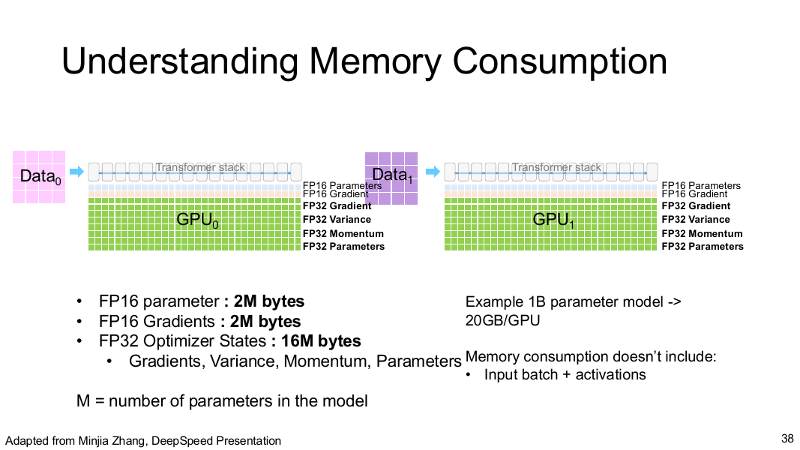

For a 1B parameter model, a common memory estimate includes:

| Component | Approx. memory per parameter |
|---|---:|
| FP16 parameters | 2 bytes |
| FP16 gradients | 2 bytes |
| FP32 optimizer states and master weights | much larger, often around 16 bytes total |

This means a 1B parameter model can require around 20GB/GPU before counting input batches and activations.

## ZeRO and FSDP

ZeRO reduces redundancy across data-parallel workers:

- **ZeRO Stage 1:** partition optimizer states.
- **ZeRO Stage 2:** partition gradients.
- **ZeRO Stage 3:** partition parameters.


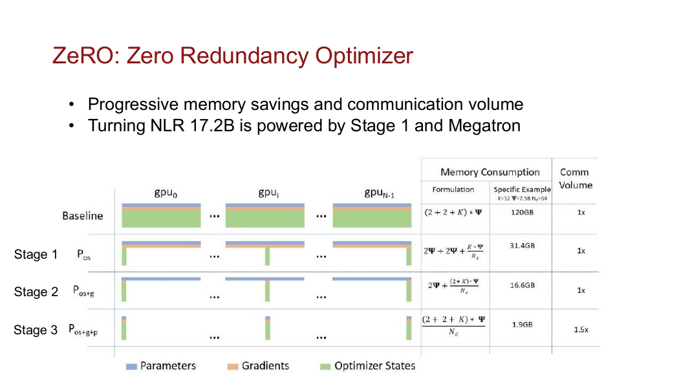

PyTorch FSDP is closely related to ZeRO Stage 3. It shards model parameters across GPUs, gathers full parameters only when needed for computation, and reduce-scatters gradients after backward.


In this project, FSDP uses:

```python
FSDP(
    model,
    sharding_strategy=ShardingStrategy.FULL_SHARD,
    auto_wrap_policy=auto_wrap,
    mixed_precision=mp,
    use_orig_params=True
)
```

The auto-wrap policy uses `GPTNeoBlock` as the wrapping unit:

```text
transformer_layer_cls = {GPTNeoBlock}
```

This means FSDP operates around Transformer block boundaries rather than wrapping the entire model as a single unit. `FULL_SHARD` is similar to ZeRO Stage 3 because it shards:

| State | DDP | FSDP `FULL_SHARD` |
|---|---|---|
| Parameters | Full copy on each GPU | Sharded across GPUs, gathered when needed. |
| Gradients | Full copy on each GPU | Reduce-scattered so each GPU keeps a shard. |
| Optimizer states | Full copy on each GPU | Sharded across GPUs. |

With 4 GPUs, this can be roughly understood as:

```text
GPU 0: shard 0
GPU 1: shard 1
GPU 2: shard 2
GPU 3: shard 3
```

However, computation still needs full parameters for the current FSDP unit. FSDP therefore trades persistent memory for communication and temporary reconstruction.

### FSDP Forward and Backward Flow

Forward pass:

1. Divide model parameters into FSDP units.
2. Shard each unit across GPUs.
3. All-gather the parameters needed for a unit.
4. Run forward.
5. Discard gathered full parameters after use.

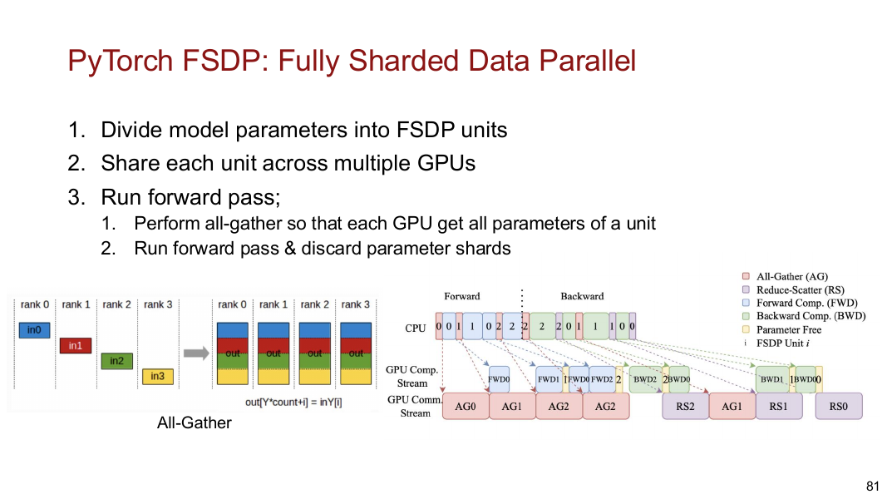

Backward pass:

1. All-gather parameters again for the unit.
2. Compute gradients.
3. Reduce-scatter gradients so each GPU keeps only its shard.

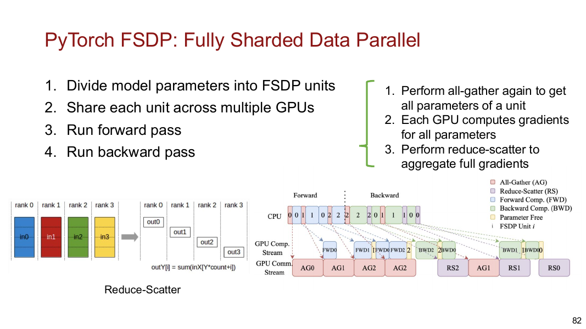

The main trade-off is:

```text
lower resident model-state memory
        ↕
more AllGather, ReduceScatter, scheduling, and temporary-buffer overhead
```

This is why FSDP is primarily a memory-scalability technique. It may allow larger models, longer sequences, or larger microbatches to fit, but it is not guaranteed to be faster than DDP on smaller GPU counts or slower interconnects.

## Model, Tensor, and Pipeline Parallelism

The PDF notes also cover why data parallelism alone is not enough. If every GPU must store the full model, data parallelism cannot train models that exceed device memory.

Tensor parallelism partitions computation inside layers.

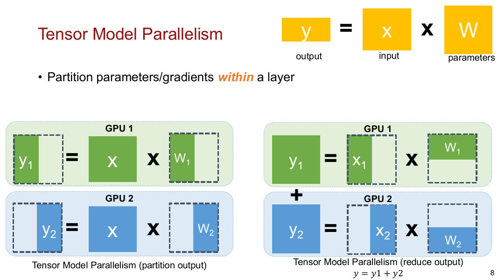

Pipeline parallelism partitions model layers across devices and uses microbatches to keep pipeline stages busy.

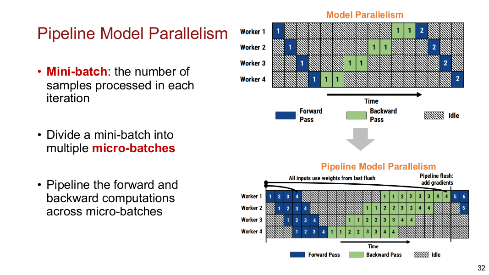

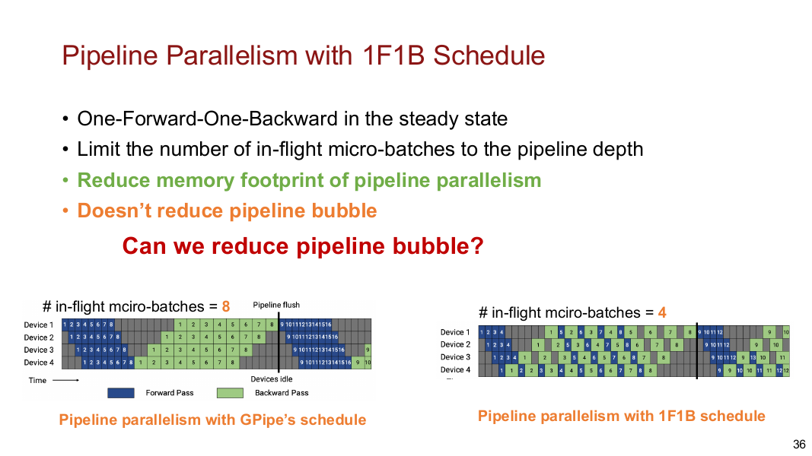

The project itself focuses on DDP/FSDP and activation checkpointing, but the theory notes place those techniques in the broader DP/TP/PP design space.

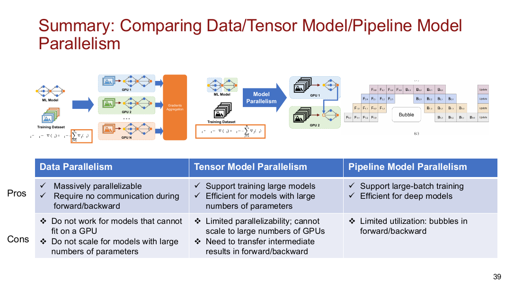

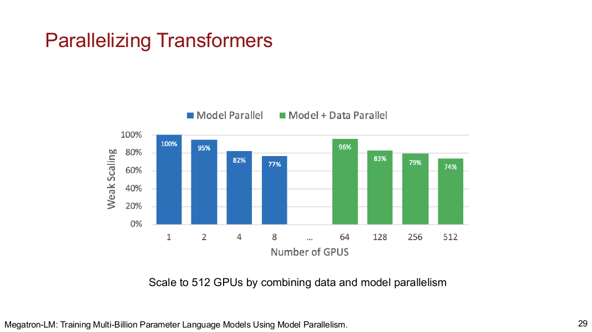

The scaling figure illustrates why real large-language-model training often combines forms of parallelism. Data parallelism helps throughput when each GPU can store a full model replica, but model, tensor, and pipeline parallelism become important once model state or layer computation no longer fits comfortably on one device.

## Implementation Details

The training scripts support:

- `torchrun` multi-process launch.
- NCCL distributed backend.
- DDP or FSDP strategy selection via `--strategy`.
- GPT-Neo-1.3B loading through Hugging Face Transformers.
- Wikitext or synthetic token stream dataset.
- Sequence length control with `--seq_len`.
- Per-GPU microbatch control with `--microbatch`.
- Gradient accumulation with `--grad_accum`.
- FP16 mixed precision with `--fp16`.
- Activation checkpointing with `--checkpoint`.
- Loss logging, step time, tokens/sec, and max GPU memory reporting.

FSDP setup uses:

- `FullyShardedDataParallel`.
- `ShardingStrategy.FULL_SHARD`.
- Transformer block auto-wrapping for GPT-Neo blocks.
- `MixedPrecision` with FP16 parameter, reduce, and buffer dtypes.

## Microbatch, Gradient Accumulation, and Global Batch

The most important experimental knobs are:

```text
--microbatch
--grad_accum
```

`microbatch` controls how many sequences each GPU processes in one forward/backward pass. `grad_accum` controls how many microbatches are accumulated before one optimizer update.

The effective global batch size is:

```text
global_batch = microbatch * world_size * grad_accum
```

For example, the DDP checkpoint experiment uses:

```text
world_size = 4
microbatch = 2
grad_accum = 8

global_batch = 4 * 2 * 8 = 64
```

The FSDP experiment uses:

```text
world_size = 4
microbatch = 4
grad_accum = 4

global_batch = 4 * 4 * 4 = 64
```

This design keeps the effective global batch roughly fixed while changing the memory and performance profile of each optimizer step.

For `microbatch = 2` and `grad_accum = 8`, one logical optimizer step looks like:

```text
microbatch 1: forward + backward + accumulate gradients
microbatch 2: forward + backward + accumulate gradients
...
microbatch 8: forward + backward + synchronize gradients

gradient clipping
optimizer.step()
optimizer.zero_grad()
```

The training loop divides each microbatch loss by the number of accumulation steps:

```python
loss = loss / cfg.grad_accum
```

This makes the accumulated gradient equivalent to averaging over the effective batch rather than summing gradients whose scale grows with `grad_accum`.

Why fix global batch size?

If we compare `microbatch=1, accum=1` against `microbatch=8, accum=1`, the optimizer step processes different amounts of data. Step time, throughput, loss scale, memory pressure, and optimization behavior are all mixed together. Fixing `microbatch * grad_accum` makes the comparison more meaningful:

```text
For the same effective batch, is it better to use a larger microbatch
with fewer accumulation steps, or a smaller microbatch with more accumulation?
```

## DDP no_sync Optimization

The DDP training loop uses an important optimization during gradient accumulation:

```python
use_no_sync = (
    cfg.strategy == "ddp"
    and hasattr(model, "no_sync")
    and i < cfg.grad_accum - 1
)
```

For the first `grad_accum - 1` microbatches, DDP enters `model.no_sync()` and accumulates gradients locally. Only the final microbatch triggers gradient synchronization.

Without `no_sync()`:

```text
microbatch 1 -> backward + AllReduce
microbatch 2 -> backward + AllReduce
...
microbatch 8 -> backward + AllReduce
```

With `no_sync()`:

```text
microbatch 1 -> local gradient accumulation
microbatch 2 -> local gradient accumulation
...
microbatch 8 -> backward + one AllReduce
```

This does not change the intended mathematical update because the optimizer step happens only after all accumulation microbatches. It avoids unnecessary communication and is essential for making gradient accumulation efficient under DDP.

## Experiment Matrix

The repo includes sweep scripts for the following experiment dimensions.

| Experiment | Strategy | Dataset | Seq len | Microbatch | Grad accumulation | Checkpointing | GPUs |
|---|---|---|---:|---:|---:|---|---:|
| DDP Wikitext run | DDP | Wikitext | 1024 | 2 | 8 | Off | 4 |
| DDP checkpoint off | DDP | Wikitext | 1024 | 2 | 8 | Off | 4 |
| DDP checkpoint on | DDP | Wikitext | 1024 | 2 | 8 | On | 4 |
| FSDP checkpoint off | FSDP | Wikitext | 1024 | 4 | 4 | Off | 4 |
| FSDP checkpoint on | FSDP | Wikitext | 1024 | 4 | 4 | On | 4 |
| Sweep | DDP/FSDP | Synthetic | 1024 | 1, 2, 4, 8 | 16, 8, 4, 2 | On/Off | 4 |
| Sweep | DDP | Wikitext | 512, 1024 | 1, 2, 4, 8 | 8, 4, 2, 1 | Off | 8 |

The effective tokens per optimizer step are computed as:

```text
microbatch * seq_len * world_size * grad_accum
```

This makes microbatch and gradient accumulation directly comparable: different settings can keep similar effective batch size while changing memory pressure and communication cadence.

## Observable Metrics

The scripts are designed to log:

| Metric | Purpose |
|---|---|
| Loss | Training sanity check. |
| Average step time | Measures throughput bottlenecks. |
| Tokens/sec | Normalized training throughput. |
| Max allocated GPU memory | Peak memory pressure. |
| Max reserved GPU memory | CUDA caching allocator footprint. |
| Rank-averaged metrics | Comparable reporting across distributed workers. |

Loss is averaged over the accumulation cycle and then reduced across ranks. Its purpose is to validate that forward/backward is numerically sane, DDP and FSDP are in the same range, and no NaN/Inf instability occurs. The project does not optimize for final perplexity or long-run convergence.

Step time measures one logical optimizer step, including:

```text
grad_accum forward passes
grad_accum backward passes
gradient communication
gradient clipping
optimizer update
```

Warmup steps are excluded because early iterations can include CUDA context initialization, kernel loading, memory allocation, NCCL communicator setup, and cache warming.

Tokens/sec is computed from:

```text
tokens_per_step = microbatch * seq_len * world_size * grad_accum
tokens_per_second = tokens_per_step / average_step_time
```

For example:

```text
microbatch = 2
seq_len = 1024
world_size = 4
grad_accum = 8

tokens_per_step = 2 * 1024 * 4 * 8 = 65,536 tokens
```

If average step time is 4 seconds:

```text
tokens/sec = 65,536 / 4 = 16,384
```

GPU memory is reported with both:

| Metric | Meaning |
|---|---|
| `max_memory_allocated()` | Peak memory actually occupied by PyTorch tensors. |
| `max_memory_reserved()` | Peak memory reserved by the PyTorch caching allocator. |

`reserved` is usually greater than or equal to `allocated`, so reporting both gives a clearer view of tensor memory and allocator footprint.

The public repo contains the training scripts and sweep configuration, but it does not include saved log files or result plots. Because of that, this page reports the implemented experiment matrix and the metrics the scripts record, rather than inventing exact throughput numbers.

## Activation Checkpointing

Activation checkpointing trades compute for memory. Instead of saving all intermediate activations during forward, checkpointing saves fewer tensors and recomputes activations during backward.

In the repo, checkpointing is enabled with:

```text
--checkpoint
```

and implemented through:

```python
model.gradient_checkpointing_enable()
```

Expected trade-off:

| Setting | Memory | Compute time | Why |
|---|---|---|---|
| Checkpoint off | Higher activation memory | Faster backward | Activations are stored from forward. |
| Checkpoint on | Lower activation memory | Slower backward | Activations are recomputed during backward. |

Checkpointing is useful when the limiting factor is peak memory and a larger microbatch or longer sequence length would otherwise not fit.

## Expected Performance Patterns

The project is designed to reveal several predictable but hardware-dependent patterns.

### Microbatch and Throughput

At fixed global batch:

| Configuration | Expected behavior |
|---|---|
| Smaller microbatch, larger accumulation | Lower peak activation memory, but more forward/backward loops per optimizer step. |
| Larger microbatch, smaller accumulation | Higher activation memory, but often better GPU utilization and higher tokens/sec if it fits. |

For example:

| Microbatch | Grad accumulation | Per-GPU effective batch |
|---:|---:|---:|
| 1 | 16 | 16 |
| 2 | 8 | 16 |
| 4 | 4 | 16 |
| 8 | 2 | 16 |

The expected trend is that larger microbatch improves throughput until memory, cache pressure, or kernel saturation becomes the limiting factor. It is not infinitely linear:

```text
tokens/s
   ^
   |            ______
   |         __/
   |      __/
   |_____/
   +------------------> microbatch
```

Activation memory mainly depends on microbatch size, sequence length, hidden size, number of layers, and checkpointing. Gradient accumulation does not keep all microbatch activations alive at once; each microbatch runs forward/backward and releases its activations before the next microbatch.

### Checkpointing Trade-Off

Checkpointing is expected to reduce peak activation memory but increase step time:

| Setting | Peak memory | Step time | Tokens/sec |
|---|---|---|---|
| Checkpoint off | Higher | Lower | Higher |
| Checkpoint on | Lower | Higher | Lower |

However, checkpointing can make an otherwise impossible configuration fit. For example, `checkpoint off + microbatch=8` may OOM, while `checkpoint on + microbatch=8` may run. In that case, checkpointing may still be useful even if it is slower at the same microbatch size.

### DDP vs FSDP

FSDP should reduce model-state memory relative to DDP because parameters, gradients, and optimizer states are sharded. But peak memory is not simply DDP memory divided by the GPU count. The run still needs activation memory, temporary AllGather buffers, communication buffers, CUDA context memory, allocator reserve, and temporary full parameters.

FSDP also is not automatically faster than DDP:

| Metric | DDP | FSDP `FULL_SHARD` |
|---|---|---|
| Memory | Higher | Lower |
| Implementation complexity | Lower | Higher |
| Communication pattern | Gradient AllReduce | Parameter AllGather + gradient ReduceScatter |
| Small-scale throughput | Often better | Can be worse |
| Maximum trainable model size | Smaller | Larger |

On small GPU counts, PCIe interconnects, or small microbatches, DDP can have higher tokens/sec because FSDP communication is harder to hide behind computation. FSDP's primary value is memory scalability, not guaranteed single-step speedup.

### Likely Ranking

If all configurations fit, a rough expected throughput order is:

```text
DDP, checkpoint off, large microbatch
        ↓ fastest
DDP, checkpoint off, small microbatch
DDP, checkpoint on
FSDP, checkpoint off
FSDP, checkpoint on, small microbatch
        ↓ possibly slowest
```

The memory ranking is usually:

```text
FSDP + checkpoint on
        ↓ lowest
FSDP + checkpoint off
DDP + checkpoint on
DDP + checkpoint off
        ↓ highest
```

These are expectations, not universal laws. Hardware interconnect, GPU memory size, sequence length, model size, wrapping granularity, and microbatch size can change the exact order.

## Main Takeaways

- DDP is simple and efficient when the full model fits on each GPU.
- ZeRO/FSDP reduce memory redundancy by sharding optimizer states, gradients, and parameters.
- FSDP full-shard requires AllGather before computation and ReduceScatter after gradient computation.
- Activation checkpointing reduces peak activation memory but adds recomputation overhead.
- Microbatch size and gradient accumulation trade memory pressure against optimizer-step frequency.
- DDP `no_sync()` avoids unnecessary AllReduce during intermediate gradient-accumulation microbatches.
- Synthetic data is useful for isolating model compute, GPU memory, and distributed communication from data-pipeline overhead.
- Distributed training optimization is a balance between memory, communication, compute, and stability.

## Experiment Result Analysis

The main value of this project is the implementation and experiment design for training GPT-Neo-1.3B under constrained memory. The scripts make the key distributed-training trade-offs explicit: DDP keeps full replicas and relies on gradient synchronization, while FSDP shards parameters and gradients to reduce per-GPU memory.

FSDP should help most when model-state memory is the bottleneck. It can allow larger models or larger microbatches to fit, but it introduces extra AllGather and ReduceScatter communication. That means FSDP is not automatically faster than DDP; it is a memory-saving strategy that must be evaluated together with communication overhead.

Activation checkpointing targets a different memory component: activations. It is especially useful for long sequence lengths such as 1024, where transformer activations become expensive. The cost is extra recomputation in backward, so the best checkpointing setting depends on whether the run is memory-bound or compute-bound.

The microbatch and gradient-accumulation sweep is the center of the benchmark. By keeping the effective global batch fixed, the experiment can separate training-system effects from workload-size changes. Larger microbatch values usually improve GPU utilization and reduce repeated loop overhead, but they also increase activation memory and may OOM. Smaller microbatches are safer for memory but require more accumulation steps per optimizer update.

The checkpointing comparison answers a different question: how much activation memory can be traded for recomputation? It is expected to reduce peak memory and reduce tokens/sec at the same microbatch size, but it may enable a larger microbatch or longer sequence length that would otherwise fail.

The DDP `no_sync()` path is also important. Without it, gradient accumulation would trigger redundant AllReduce operations after every microbatch. Synchronizing only on the final accumulation step keeps the mathematical update the same while reducing communication.

Overall, the benchmark is framed around six systems questions:

| Question | What the project measures |
|---|---|
| DDP vs FSDP memory | Whether sharding parameters, gradients, and optimizer states meaningfully reduces per-GPU memory. |
| FSDP communication cost | Whether memory savings compensate for AllGather and ReduceScatter overhead. |
| Microbatch vs accumulation | Which fixed-global-batch configuration gives the best tokens/sec without OOM. |
| Checkpointing | How much activation memory is saved and how much recomputation is added. |
| Sequence length | How the bottleneck changes from shorter to longer contexts, where attention and activations grow quickly. |
| DDP `no_sync()` | Whether communication is avoided during intermediate accumulation steps. |

That is the right framing for large-model training systems: peak memory, communication, compute utilization, and throughput have to be optimized together rather than one at a time.

[Back to Home](../index.md)
