# LLM Inference Serving Benchmark

This project builds a lightweight benchmark and analysis workflow for LLM inference serving. The goal is to explain how prompt length, output length, prefill, decode, queueing, batching, and concurrency affect user-visible latency and serving throughput.

[Download the original slides PDF](../assets/projects/llm-serving/serving-bench.pdf)  
[Download the original PowerPoint deck](../assets/projects/llm-serving/serving-bench.pptx)

## Project Goal

The project focuses on practical serving metrics rather than model accuracy. It studies what happens after a user sends a prompt to an inference service:

- How long the user waits before the first token appears.
- How quickly later tokens are generated.
- How total request latency is built from prefill and decode stages.
- How concurrency changes queueing delay, batching opportunities, and GPU contention.
- Which metrics are useful for diagnosing serving bottlenecks.

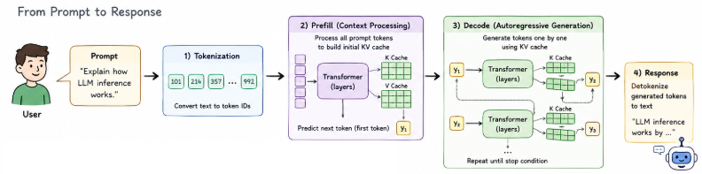

## LLM Serving Pipeline

An LLM request generally moves through:

1. Prompt submission.
2. Tokenization.
3. Prefill / initial prompt processing.
4. KV-cache construction.
5. First-token generation.
6. Iterative decode.
7. Detokenization and response streaming.

This pipeline matters because different stages stress the system in different ways. Prefill processes the full prompt, while decode generates one token at a time and repeatedly reads the KV cache.

## Metrics

The benchmark tracks the metrics that matter most for interactive inference serving.

| Metric | Meaning | Main bottleneck captured | User-facing interpretation |
|---|---|---|---|
| TTFT | Time to first token | Queueing, tokenization, prefill compute, first-token sampling, scheduler overhead | How long the user waits before seeing the model start responding |
| TPOT | Time per output token | Decode speed, KV-cache reads/writes, memory bandwidth, decode batch size | How fast the response streams after the first token |
| TPS | Tokens per second | Aggregate generation throughput | How much token work the system can sustain |
| Requests/sec | Completed requests per second | System-level throughput | How many user requests the service can finish per unit time |
| E2E latency | End-to-end request latency | Full request lifecycle | Total time from prompt submission to final response |
| P95 latency | 95th percentile latency | Tail latency under load | How slow the slowest normal requests feel |

## Time to First Token

TTFT is the time from submitting a query to receiving the first output token. It generally includes request queueing time, network overhead, tokenization, prefill computation, first-token sampling or selection, and scheduler overhead.

Longer prompts usually increase TTFT because attention must process the full input sequence and create the initial KV cache before generation can begin.

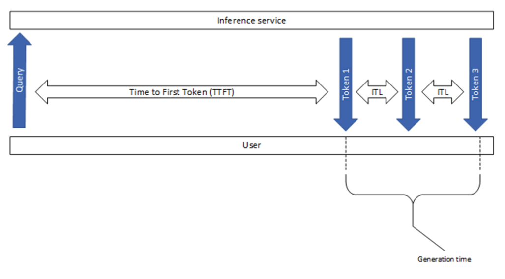

Key contributors:

- Request queueing time.
- Network overhead.
- Tokenization time.
- Prefill computation time.
- First-token sampling or selection time.
- Scheduler overhead.

## Time Per Output Token

TPOT is the average time required to generate each token after the first token. It mainly reflects sustained decode-stage generation speed.

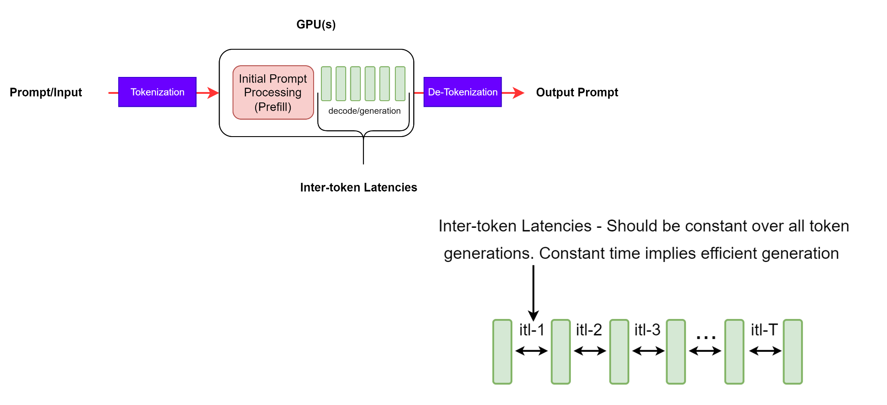

Important factors:

- Model size.
- Decode batch size.
- KV-cache length.
- Memory bandwidth.
- GPU utilization.
- Sampling strategy.
- Scheduler overhead.
- Concurrency.

Unlike prefill, decode is sequential across output tokens. It is often memory-bound because each decode step reads cached K/V values and writes the newly generated token state.

## Tokens Per Second and Requests Per Second

Tokens per second measures aggregate generation throughput. Requests per second measures how many full requests the service completes. Both are throughput metrics, but they answer different questions:

- TPS is useful when output lengths vary and token workload is the main concern.
- Requests/sec is useful when user-facing request completion rate is the main concern.

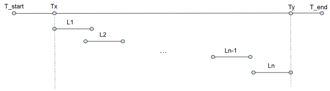

## End-to-End Request Latency

End-to-end latency measures the full time to process the input and generate all output tokens.

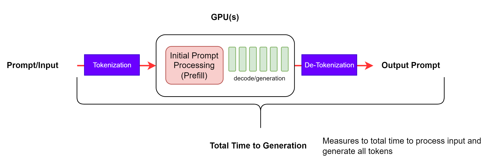

This includes both the prefill stage and the decode stage:

```text
request starts
-> prompt received
-> first token
-> token 2
-> token 3
-> ...
-> final response
```

## P95 Latency

Average latency can hide slow requests. P95 latency captures the latency threshold below which 95% of requests finish. It is a better signal for tail behavior in serving systems.

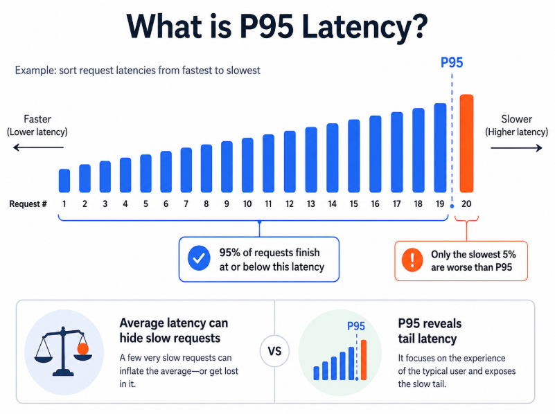

P95 is important because production users often feel the tail, not the mean. A system can have acceptable average latency while still producing slow responses under contention, long prompts, or queueing spikes.

## Metric Timeline Summary

```text
Request starts
     |
     |<----------- TTFT ----------->|
     |                              |
     v                              v
Prompt received                First token
                                   |
                                   |<-- TPOT -->|<-- TPOT -->|<-- TPOT -->|
                                   v            v            v
                                token 2      token 3      token 4
                                                                |
                                                                v
                                                          Final response

|<-------------------- End-to-end latency -------------------->|
```

## Prefill

Prefill processes the full input prompt and builds the initial KV cache before generating the first token.

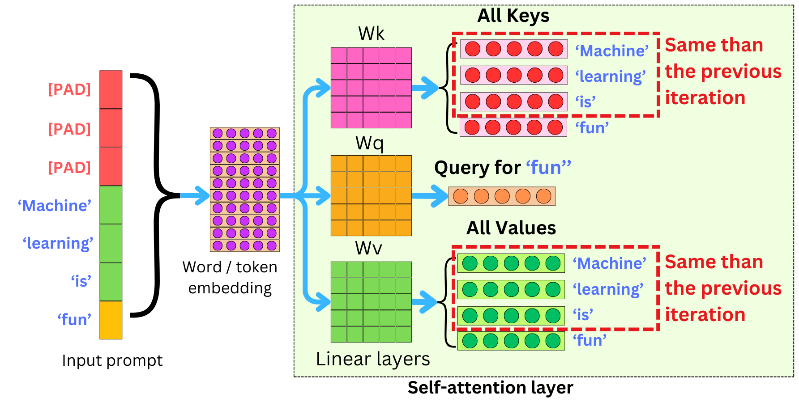

For prompt tokens:

```text
x1, x2, x3, ..., xN
```

prefill performs:

- Full prompt processing.
- Q/K/V computation for the prompt.
- Initial KV-cache construction.
- First-token generation.

TTFT mainly reflects the cost of prefill and system responsiveness. Longer prompt length means more prefill computation, larger attention cost, and higher TTFT.

Example:

| Prompt length | Prefill work |
|---:|---:|
| 32 tokens | Prefill processes 32 tokens |
| 1024 tokens | Prefill processes 1024 tokens |

Prefill bottlenecks include:

- Compute.
- Large attention computation.
- Matrix multiplication.
- Activation memory.
- Prefill batch size.

## Decode

Decode starts after the first token and KV cache exist. Each step reads cached K/V values, processes the previous generated token, appends new K/V, and emits the next token.

```text
First token y1 + KV cache
-> decode step 1: input y1, read cached K/V, generate y2, append new K/V
-> decode step 2: generate y3
-> decode step 3: generate y4
```

TPOT mainly reflects the sustained generation speed of this decode stage.

## Prefill vs. Decode

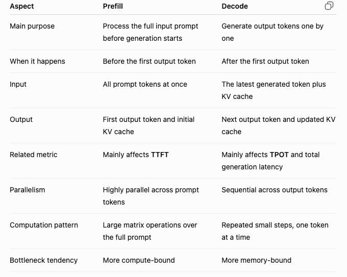

| Aspect | Prefill | Decode |
|---|---|---|
| Main purpose | Process the full input prompt before generation starts | Generate output tokens one by one |
| When it happens | Before the first output token | After the first output token |
| Input | All prompt tokens at once | Latest generated token plus KV cache |
| Output | First output token and initial KV cache | Next output token and updated KV cache |
| Related metric | Mainly affects TTFT | Mainly affects TPOT and total generation latency |
| Parallelism | Highly parallel across prompt tokens | Sequential across output tokens |
| Computation pattern | Large matrix operations over the full prompt | Repeated small steps, one token at a time |
| Bottleneck tendency | More compute-bound | More memory-bound |

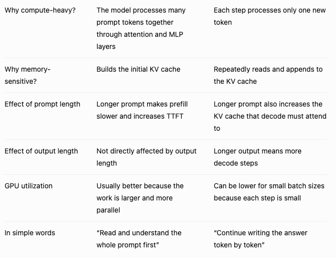

## Concurrency

Concurrency means multiple tasks are in progress at the same time. Parallelism means multiple tasks are physically executed at the exact same time.

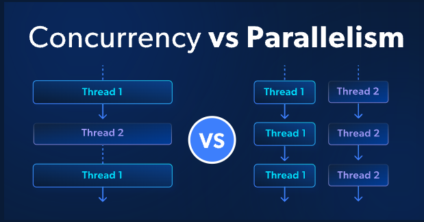

Concurrency affects serving in several ways:

| Serving stage | Concurrency effect | Metric impact |
|---|---|---|
| Prefill queueing | Request arrives, waits in queue, then prefill starts | Increases TTFT |
| Prefill contention | Multiple requests may need prefill at the same time | Raises compute contention and first-token delay |
| Batching delay | The scheduler may wait briefly to collect more requests | Can increase TTFT but improve throughput |
| Decode batching | Concurrent decode requests can be batched | Can improve GPU utilization and token throughput |

This creates a latency-throughput trade-off. More concurrency can improve utilization, but it can also increase queueing delay and tail latency.

## Simulation Results

The slides include a small simulation showing how prompt length and output length affect serving metrics. The plotted values are read from the slide figures, so they should be interpreted as approximate chart values rather than a raw benchmark log.

### TTFT vs. Prompt Length

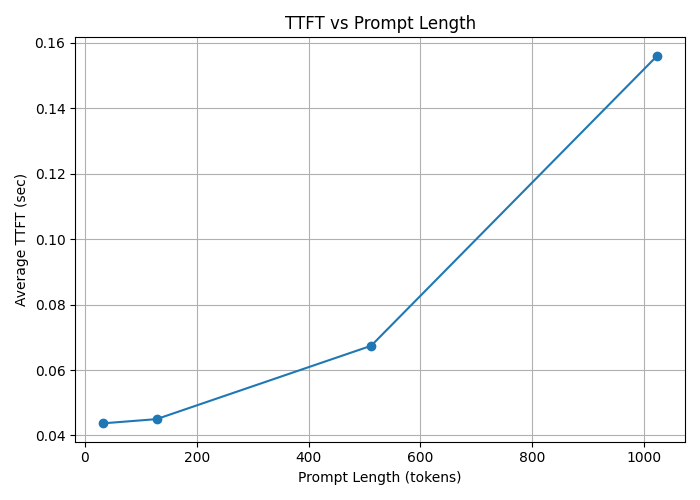

| Prompt length (tokens) | Approx. average TTFT (sec) | Observation |
|---:|---:|---|
| 32 | ~0.044 | Short prompt, lowest prefill cost |
| 64 | ~0.046 | Similar to 32-token prompt |
| 128 | ~0.050 | Slight TTFT increase |
| 512 | ~0.067 | Clear prefill-cost growth |
| 1024 | ~0.156 | Largest TTFT due to full-prompt attention/KV-cache construction |

### TPOT vs. Output Length

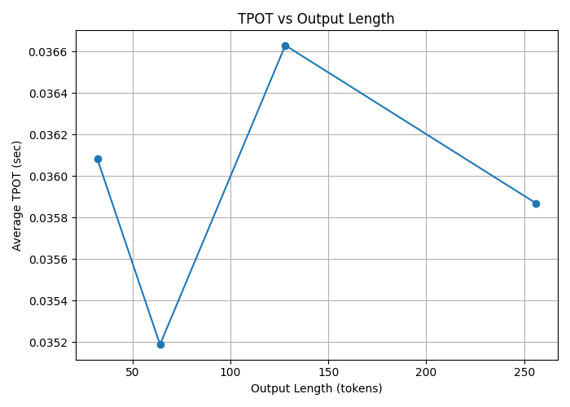

| Output length (tokens) | Approx. average TPOT (sec/token) | Observation |
|---:|---:|---|
| 32 | ~0.0361 | Decode step cost is stable but slightly noisy |
| 64 | ~0.0352 | Lowest plotted TPOT |
| 128 | ~0.0366 | Highest plotted TPOT |
| 256 | ~0.0359 | Returns near the initial level |

The TPOT curve is much flatter than TTFT. This supports the expected separation between prefill and decode: prompt length strongly affects prefill/TTFT, while output length mostly extends total latency by repeating decode steps.

## Main Takeaways

- TTFT is the best metric for first-response responsiveness.
- TPOT is the best metric for sustained token streaming speed.
- End-to-end latency combines prefill and decode costs.
- P95 latency is necessary for understanding tail behavior under contention.
- Prefill is usually compute-heavy because it processes the full prompt.
- Decode is often memory-bound because each step repeatedly reads and updates the KV cache.
- Concurrency can improve throughput through batching, but it can also increase queueing delay and tail latency.

## Skills Demonstrated

- LLM serving metric design.
- Latency and throughput benchmarking.
- Prefill/decode bottleneck analysis.
- Queueing and concurrency reasoning.
- GPU inference performance analysis.
- Clear visualization of serving-system behavior.

## Experiment Result Analysis

The simulation results match the expected behavior of autoregressive LLM serving. TTFT grows strongly with prompt length because prefill must process the entire prompt and construct the initial KV cache before the first token can be produced. The 1024-token prompt shows the largest TTFT, which reflects the cost of full-sequence attention and initial cache construction.

TPOT is comparatively stable across output lengths because each decode step performs a similar unit of work: read the current KV cache, process the latest generated token, sample the next token, and append new cache entries. Output length still increases total latency, but it does so by repeating decode steps rather than by making each individual step dramatically more expensive.

Concurrency adds another layer. More concurrent requests can create batching opportunities and improve GPU utilization, especially during decode. At the same time, concurrency can increase TTFT through queueing delay, prefill contention, and scheduler batching delay. This is why serving systems must tune batching, queueing, and concurrency limits according to the target latency objective rather than maximizing throughput alone.

Overall, the benchmark separates three different questions that are often mixed together: how fast the first token appears, how fast later tokens stream, and how much work the system can sustain under concurrent load. That separation makes it easier to diagnose whether an inference bottleneck is dominated by prefill compute, decode memory bandwidth, queueing, batching policy, or tail-latency behavior.

[Back to Home](../index.md)
