# LLM Inference Serving Benchmark

This project builds a lightweight benchmark and analysis workflow for LLM inference serving. The goal is to explain how prompt length, output length, prefill, decode, queueing, batching, and concurrency affect user-visible latency and serving throughput.

[Download the original slides PDF](../assets/projects/llm-serving/serving-bench.pdf)

Source repo: [github](https://github.com/licheng2018/serving-benchmark/tree/main)

## Contents

| Area | Jump to sections |
|---|---|
| Overview | [Project Goal](#project-goal) · [Experimental Setup](#experimental-setup) · [Benchmark Design](#benchmark-design) |
| Serving Metrics | [LLM Serving Pipeline](#llm-serving-pipeline) · [Metrics](#metrics) · [Time to First Token](#time-to-first-token) · [Time Per Output Token](#time-per-output-token) · [Tokens Per Second and Requests Per Second](#tokens-per-second-and-requests-per-second) · [End-to-End Request Latency](#end-to-end-request-latency) · [P95 Latency](#p95-latency) |
| Prefill and Decode | [Metric Timeline Summary](#metric-timeline-summary) · [Prefill](#prefill) · [Decode](#decode) · [Prefill vs. Decode](#prefill-vs-decode) · [KV Cache Interpretation](#kv-cache-interpretation) |
| Experiments | [Concurrency](#concurrency) · [Benchmark Repository Results](#benchmark-repository-results) · [TTFT vs. Prompt Length](#ttft-vs-prompt-length) · [TPOT vs. Output Length](#tpot-vs-output-length) · [Throughput vs. Concurrency](#throughput-vs-concurrency) · [Latency vs. Concurrency](#latency-vs-concurrency) |
| Review | [Benchmark Limitations and Scope](#benchmark-limitations-and-scope) · [Main Takeaways](#main-takeaways) · [Skills Demonstrated](#skills-demonstrated) · [Experiment Result Analysis](#experiment-result-analysis) |

## Project Goal

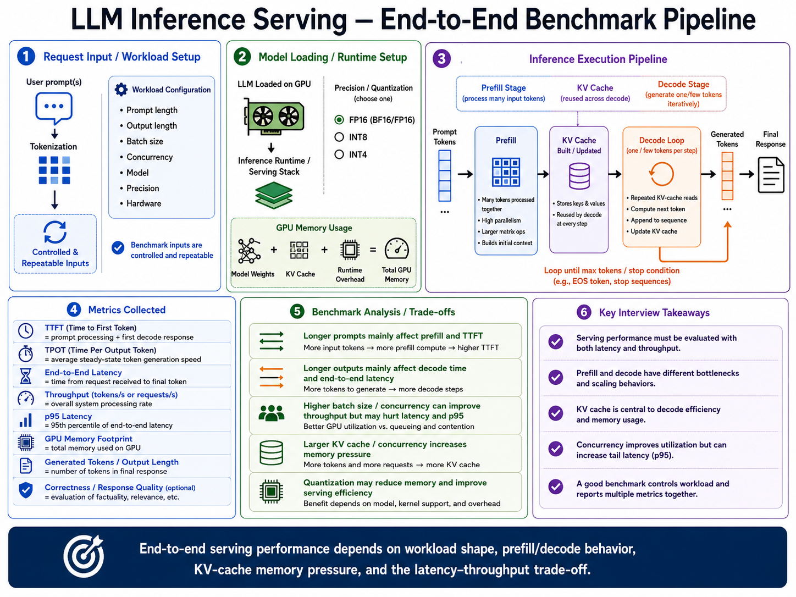

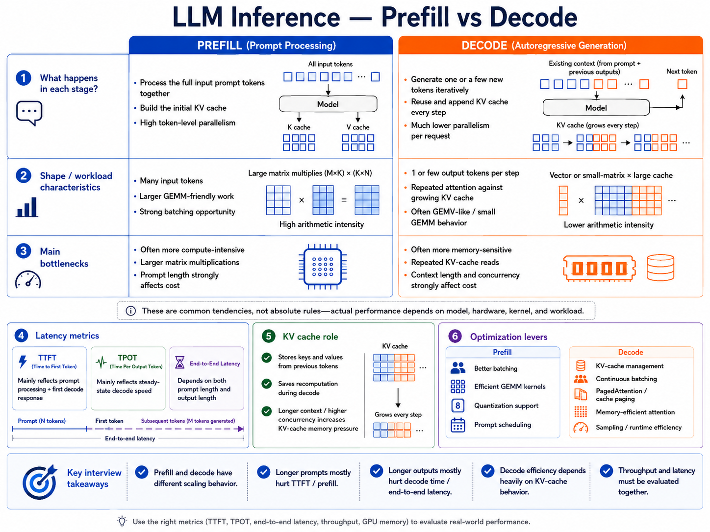

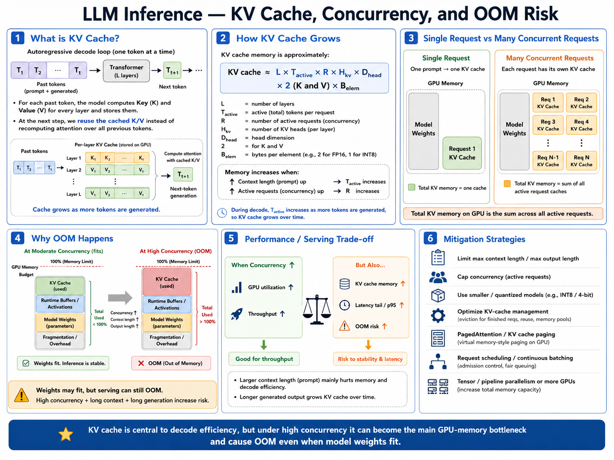

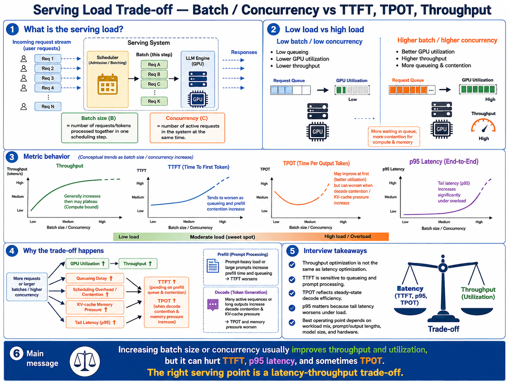

The project focuses on practical serving metrics rather than model accuracy. It studies what happens after a user sends a prompt to an inference service:

- How long the user waits before the first token appears.
- How quickly later tokens are generated.
- How total request latency is built from prefill and decode stages.
- How concurrency changes queueing delay, batching opportunities, and GPU contention.
- Which metrics are useful for diagnosing serving bottlenecks.

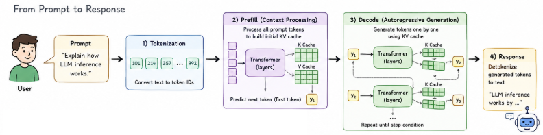

## Experimental Setup

The benchmark uses a single-GPU Hugging Face inference baseline to study model-side serving behavior under controlled prompt length, output length, and concurrency settings.

| Component | Setting |
|---|---|
| GPU | 1 x Tesla T4, 15 GB |
| Model | `Qwen/Qwen2.5-0.5B-Instruct` |
| Precision | FP16 |
| Framework | Hugging Face Transformers |
| Device | Single CUDA GPU |
| Decoding | Greedy decoding |
| Sampling | `do_sample=False` |
| KV cache | `use_cache=True` |

The model is loaded in FP16 and placed on GPU:

```python
model = AutoModelForCausalLM.from_pretrained(
    model_name,
    torch_dtype=torch.float16
)

model = model.to("cuda")
model.eval()
```

Generation uses deterministic greedy decoding:

```python
do_sample = False
use_cache = True
```

This avoids random sampling noise and enables the KV cache so decode does not recompute historical K/V projections for every generated token.

This project is different from the distributed training project:

| Project | Focus | Main metrics |
|---|---|---|
| `gpt_training` | Training performance with DDP/FSDP/gradient accumulation | step time, tokens/sec, peak memory |
| `serving-benchmark` | Inference serving performance | TTFT, TPOT, latency, throughput, concurrency behavior |

The current repository implements the FP16 Hugging Face baseline, length sweeps, and concurrency benchmark. It should not be described as already containing completed AWQ, GPTQ, INT8, or FP8 comparison results unless those experiments are later implemented and saved.

## Benchmark Design

The benchmark has three main parts:

| Part | Notebook / workflow | Purpose |
|---|---|---|
| Minimal benchmark | `1.minimal_benchmark copy.ipynb` | Sanity-check model loading, tokenization, generation, timing, FP16 execution, and KV-cache use. |
| Prompt/output length sweep | `2_sweep_benchmark.ipynb` | Measure how input length affects TTFT and how output length affects decode latency and total latency. |
| Concurrency benchmark | `3_concurrency_benchmark.ipynb` | Measure how simultaneous requests affect wall time, average latency, P95 latency, requests/sec, and tokens/sec. |

The minimal benchmark uses a prompt such as:

```text
Explain the role of attention in transformer models.
```

It is mainly a pipeline sanity check:

- The model loads successfully on the T4.
- Tokenizer and model inputs are correct.
- `generate()` runs without NaN or OOM.
- FP16 inference works.
- Output text is reasonable.
- KV cache can be enabled.

The sweep benchmark uses:

```text
prompt_lengths = [32, 128, 512, 1024]
output_lengths = [32, 64, 128, 256]
num_runs = 3
num_warmup = 1
concurrency = 1
use_kv_cache = True
```

Prompt length and output length are swept separately because they stress different stages:

| Sweep | Fixed variable | Changed variable | Expected effect |
|---|---|---|---|
| Prompt-length sweep | Output length fixed | Prompt length: 32, 128, 512, 1024 | Longer prompts increase prefill work, KV-cache initialization, and TTFT. |
| Output-length sweep | Prompt length fixed | Output length: 32, 64, 128, 256 | Longer outputs increase decode steps and end-to-end latency. |

The concurrency benchmark fixes the workload and changes the number of simultaneous requests:

```text
input tokens = 128
output tokens = 64
total requests = 20
concurrency = 1, 2, 4, 8, 16
```

For each setting, the benchmark records:

| Recorded field | Meaning |
|---|---|
| Wall time | Total time to finish the request set. |
| Average latency | Mean per-request end-to-end latency. |
| P95 latency | Tail latency threshold for the slowest normal requests. |
| Requests/sec | Completed requests per second. |
| Output tokens/sec | Aggregate generated token throughput. |
| Per-request records | Individual request latency and output-token speed. |

## LLM Serving Pipeline

An LLM request generally moves through:

1. Prompt submission.
2. Tokenization.
3. Prefill / initial prompt processing.
4. KV-cache construction.
5. First-token generation.
6. Iterative decode.
7. Detokenization and response streaming.

This pipeline matters because different stages stress the system in different ways. Prefill processes the full prompt, while decode generates one token at a time and repeatedly reads the KV cache.

## Metrics

The benchmark tracks the metrics that matter most for interactive inference serving.

| Metric | Meaning | Main bottleneck captured | User-facing interpretation |
|---|---|---|---|
| TTFT | Time to first token | Queueing, tokenization, prefill compute, first-token sampling, scheduler overhead | How long the user waits before seeing the model start responding |
| TPOT | Time per output token | Decode speed, KV-cache reads/writes, memory bandwidth, decode batch size | How fast the response streams after the first token |
| TPS | Tokens per second | Aggregate generation throughput | How much token work the system can sustain |
| Requests/sec | Completed requests per second | System-level throughput | How many user requests the service can finish per unit time |
| E2E latency | End-to-end request latency | Full request lifecycle | Total time from prompt submission to final response |
| P95 latency | 95th percentile latency | Tail latency under load | How slow the slowest normal requests feel |

## Time to First Token

TTFT is the time from submitting a query to receiving the first output token. It generally includes request queueing time, network overhead, tokenization, prefill computation, first-token sampling or selection, and scheduler overhead.

Longer prompts usually increase TTFT because attention must process the full input sequence and create the initial KV cache before generation can begin.

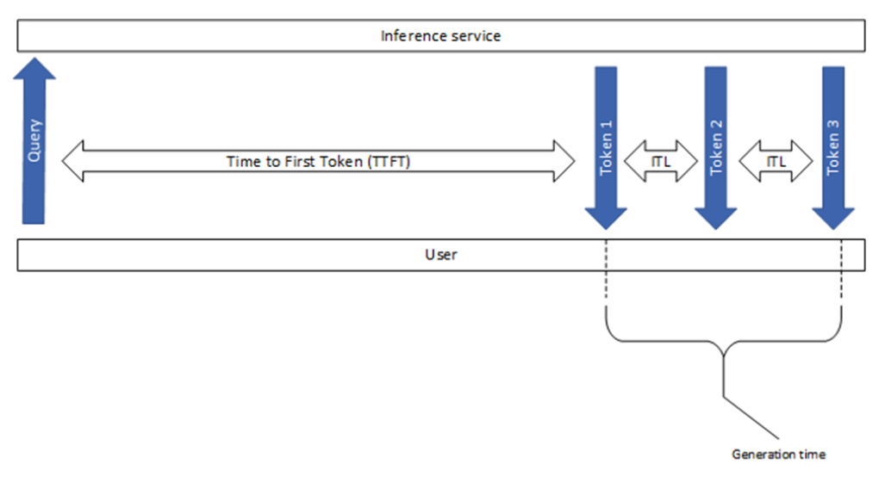

Key contributors:

- Request queueing time.
- Network overhead.
- Tokenization time.
- Prefill computation time.
- First-token sampling or selection time.
- Scheduler overhead.

## Time Per Output Token

TPOT is the average time required to generate each token after the first token. It mainly reflects sustained decode-stage generation speed.

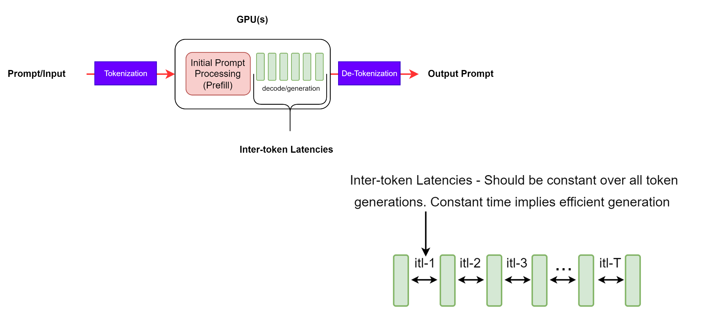

Important factors:

- Model size.
- Decode batch size.
- KV-cache length.
- Memory bandwidth.
- GPU utilization.
- Sampling strategy.
- Scheduler overhead.
- Concurrency.

Unlike prefill, decode is sequential across output tokens. It is often memory-bound because each decode step reads cached K/V values and writes the newly generated token state.

## Tokens Per Second and Requests Per Second

Tokens per second measures aggregate generation throughput. Requests per second measures how many full requests the service completes. Both are throughput metrics, but they answer different questions:

- TPS is useful when output lengths vary and token workload is the main concern.
- Requests/sec is useful when user-facing request completion rate is the main concern.

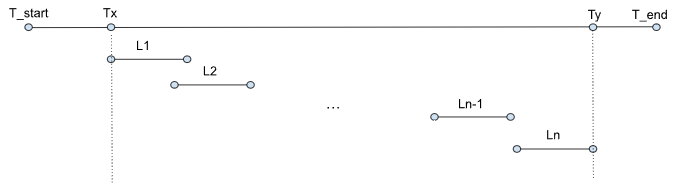

## End-to-End Request Latency

End-to-end latency measures the full time to process the input and generate all output tokens.

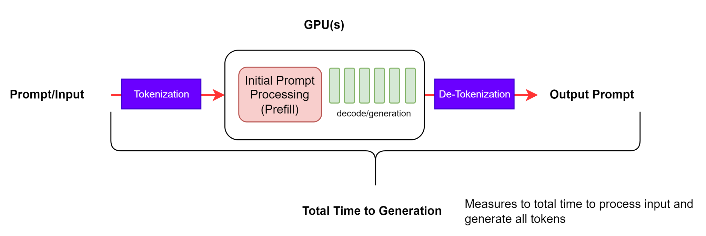

This includes both the prefill stage and the decode stage:

```text
request starts
-> prompt received
-> first token
-> token 2
-> token 3
-> ...
-> final response
```

## P95 Latency

Average latency can hide slow requests. P95 latency captures the latency threshold below which 95% of requests finish. It is a better signal for tail behavior in serving systems.

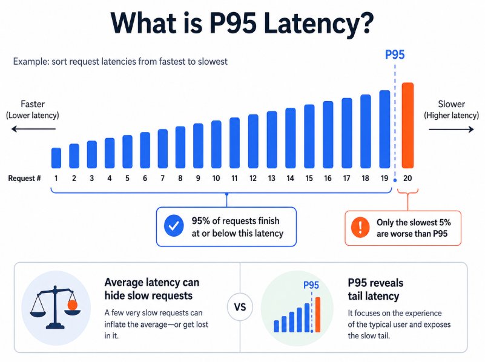

P95 is important because production users often feel the tail, not the mean. A system can have acceptable average latency while still producing slow responses under contention, long prompts, or queueing spikes.

## Metric Timeline Summary

```text
Request starts
     |
     |<----------- TTFT ----------->|
     |                              |
     v                              v
Prompt received                First token
                                   |
                                   |<-- TPOT -->|<-- TPOT -->|<-- TPOT -->|
                                   v            v            v
                                token 2      token 3      token 4
                                                                |
                                                                v
                                                          Final response

|<-------------------- End-to-end latency -------------------->|
```

## Prefill

Prefill processes the full input prompt and builds the initial KV cache before generating the first token.

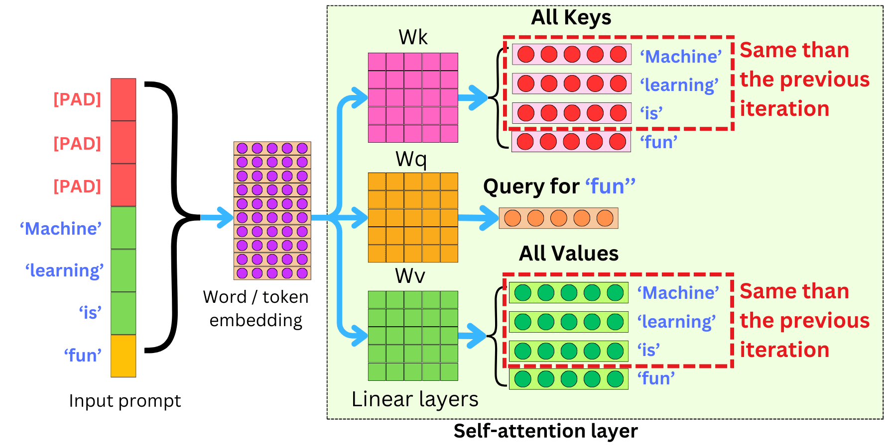

For prompt tokens:

```text
x1, x2, x3, ..., xN
```

prefill performs:

- Full prompt processing.
- Q/K/V computation for the prompt.
- Initial KV-cache construction.
- First-token generation.

TTFT mainly reflects the cost of prefill and system responsiveness. Longer prompt length means more prefill computation, larger attention cost, and higher TTFT.

Example:

| Prompt length | Prefill work |
|---:|---:|
| 32 tokens | Prefill processes 32 tokens |
| 1024 tokens | Prefill processes 1024 tokens |

Prefill bottlenecks include:

- Compute.
- Large attention computation.
- Matrix multiplication.
- Activation memory.
- Prefill batch size.

## Decode

Decode starts after the first token and KV cache exist. Each step reads cached K/V values, processes the previous generated token, appends new K/V, and emits the next token.

```text
First token y1 + KV cache
-> decode step 1: input y1, read cached K/V, generate y2, append new K/V
-> decode step 2: generate y3
-> decode step 3: generate y4
```

TPOT mainly reflects the sustained generation speed of this decode stage.

## KV Cache Interpretation

The benchmark enables:

```text
use_cache=True
```

When generating token `t`, the model does not need to recompute the K/V projections for all previous tokens. Instead, it:

```text
computes Q, K, V for the new token
appends the new K/V to the cache
uses the new Q to attend over historical K/V
reads historical V to produce the output
```

KV cache saves repeated K/V projection work for historical tokens. However, it does not make decode independent of context length. Each decode step still attends over a growing cache:

```text
context length increases
        ↓
KV-cache memory increases
        ↓
each decode step reads more K/V
        ↓
TPOT may gradually increase
```

## Prefill vs. Decode

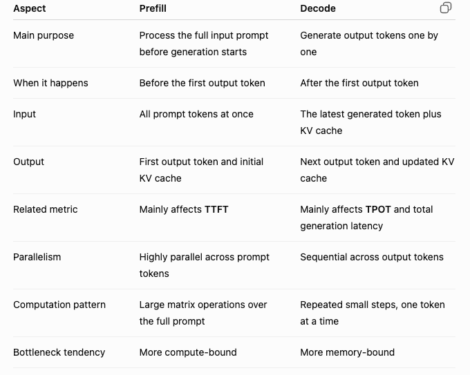

| Aspect | Prefill | Decode |
|---|---|---|
| Main purpose | Process the full input prompt before generation starts | Generate output tokens one by one |
| When it happens | Before the first output token | After the first output token |
| Input | All prompt tokens at once | Latest generated token plus KV cache |
| Output | First output token and initial KV cache | Next output token and updated KV cache |
| Related metric | Mainly affects TTFT | Mainly affects TPOT and total generation latency |
| Parallelism | Highly parallel across prompt tokens | Sequential across output tokens |
| Computation pattern | Large matrix operations over the full prompt | Repeated small steps, one token at a time |
| Bottleneck tendency | More compute-bound | More memory-bound |

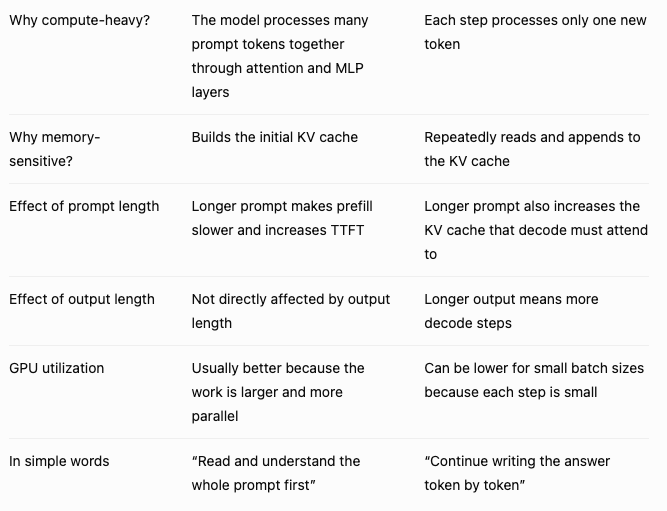

## Concurrency

Concurrency means multiple tasks are in progress at the same time. Parallelism means multiple tasks are physically executed at the exact same time.

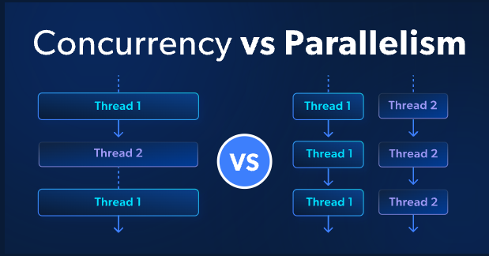

Concurrency affects serving in several ways:

| Serving stage | Concurrency effect | Metric impact |
|---|---|---|
| Prefill queueing | Request arrives, waits in queue, then prefill starts | Increases TTFT |
| Prefill contention | Multiple requests may need prefill at the same time | Raises compute contention and first-token delay |
| Batching delay | The scheduler may wait briefly to collect more requests | Can increase TTFT but improve throughput |
| Decode batching | Concurrent decode requests can be batched | Can improve GPU utilization and token throughput |

This creates a latency-throughput trade-off. More concurrency can improve utilization, but it can also increase queueing delay and tail latency.

## Benchmark Repository Results

The full benchmark repository includes three notebooks and saved result artifacts:

- [1.minimal_benchmark copy.ipynb](https://github.com/licheng2018/serving-benchmark/blob/main/1.minimal_benchmark%20copy.ipynb)
- [2_sweep_benchmark.ipynb](https://github.com/licheng2018/serving-benchmark/blob/main/2_sweep_benchmark.ipynb)
- [3_concurrency_benchmark.ipynb](https://github.com/licheng2018/serving-benchmark/blob/main/3_concurrency_benchmark.ipynb)
- [prompt_sweep_summary.json](../assets/projects/llm-serving/repo-prompt-sweep-summary.json)
- [output_sweep_summary.json](../assets/projects/llm-serving/repo-output-sweep-summary.json)
- [concurrency_sweep_summary.json](../assets/projects/llm-serving/repo-concurrency-sweep-summary.json)

The repo contains four result plots: TTFT vs. prompt length, TPOT vs. output length, throughput vs. concurrency, and average latency vs. concurrency. These result images are included here so the project page reflects the actual benchmark outputs rather than only the slide-level explanation.

### TTFT vs. Prompt Length

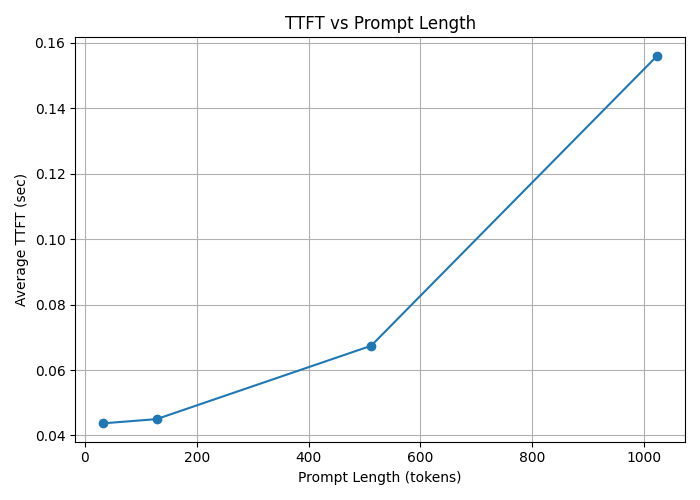

Prompt sweep setting: fixed output length of 64 generated tokens.

| Prompt length (tokens) | Average TTFT (sec) | Average total latency (sec) | Observation |
|---:|---:|---:|---|
| 32 | 0.0437 | 2.6492 | Short prompt, low prefill cost |
| 128 | 0.0450 | 2.3884 | Similar TTFT to 32 tokens |
| 512 | 0.0674 | 2.6174 | Clear prefill-cost growth |
| 1024 | 0.1561 | 2.6707 | Largest TTFT due to full-prompt attention/KV-cache construction |

### TPOT vs. Output Length

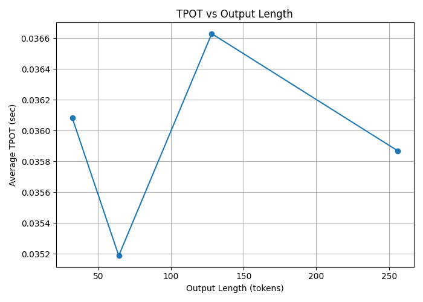

Output sweep setting: fixed prompt length of 128 input tokens.

| Output length (tokens) | Average TPOT (sec/token) | Average total latency (sec) | Observation |
|---:|---:|---:|---|
| 32 | 0.0361 | 1.1586 | Short decode, lowest total latency |
| 64 | 0.0352 | 2.2537 | TPOT remains stable |
| 128 | 0.0366 | 4.6908 | Total latency grows with generated tokens |
| 256 | 0.0359 | 9.1844 | Longest decode, total latency scales nearly linearly |

The TPOT curve is much flatter than TTFT. This supports the expected separation between prefill and decode: prompt length strongly affects prefill/TTFT, while output length mostly extends total latency by repeating decode steps.

### Throughput vs. Concurrency

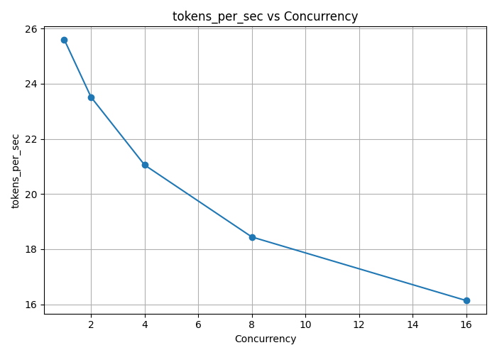

Concurrency sweep setting: 20 total requests, 128 input tokens per request, 64 generated tokens per request.

| Concurrency | Requests/sec | Tokens/sec | Wall time (sec) | Observation |
|---:|---:|---:|---:|---|
| 1 | 0.4000 | 25.60 | 49.999 | Best throughput in this run |
| 2 | 0.3674 | 23.51 | 54.436 | Throughput begins to drop |
| 4 | 0.3289 | 21.05 | 60.803 | More contention, lower token throughput |
| 8 | 0.2882 | 18.44 | 69.400 | Higher concurrency reduces completed requests/sec |
| 16 | 0.2522 | 16.14 | 79.316 | Worst throughput and longest wall time |

### Latency vs. Concurrency

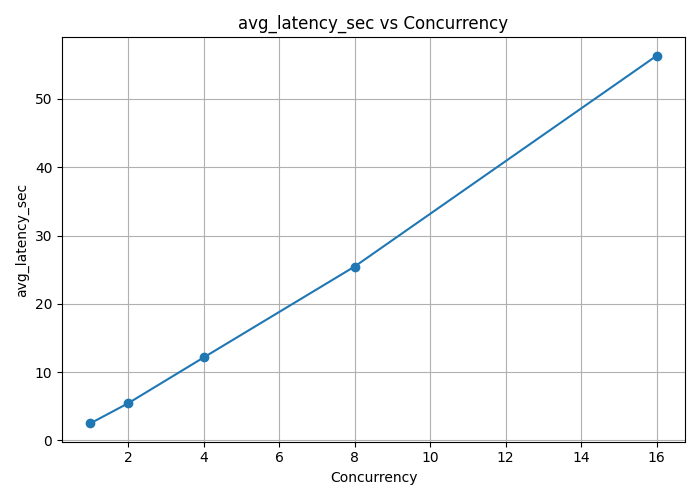

| Concurrency | Average latency (sec) | P95 latency (sec) | Observation |
|---:|---:|---:|---|
| 1 | 2.499 | 2.920 | Low queueing/contention baseline |
| 2 | 5.437 | 6.794 | Latency roughly doubles |
| 4 | 12.140 | 14.708 | Tail latency grows sharply |
| 8 | 25.457 | 29.433 | Requests spend much longer under contention |
| 16 | 56.324 | 67.718 | Severe latency degradation |

The concurrency sweep is the most important result from the repo. In this benchmark, increasing concurrency did not improve throughput; it reduced requests/sec and tokens/sec while sharply increasing average and P95 latency. This indicates that the tested serving setup was already resource-constrained, so more simultaneous requests mainly added contention and queueing rather than useful parallelism.

## Benchmark Limitations and Scope

This benchmark should be described precisely as a Hugging Face FP16 baseline, not as a production serving engine.

| Limitation | Meaning |
|---|---|
| Not a continuous-batching engine | The code uses `transformers.model.generate()` rather than vLLM, TensorRT-LLM, TGI, or SGLang. |
| No PagedAttention or paged KV cache | KV cache is enabled, but the benchmark does not implement production-style KV block management. |
| No request preemption or iteration-level scheduler | Independent requests are not dynamically merged into an optimized decode batch. |
| Approximate model-side TTFT | The code measures a first-token timing path, but not full client-observed streaming TTFT with network, serialization, and serving scheduler delay. |
| FP16 baseline only | The current repo does not contain completed AWQ, GPTQ, INT8, or FP8 comparison results. |
| Small model | Qwen2.5-0.5B fits easily on T4, so Python overhead and scheduling overhead may be more visible than they would be for larger 7B/13B models. |

The most important interpretation is that concurrency is not the same as batching.

```text
batch size:
    multiple inputs explicitly combined in one model forward

concurrency:
    multiple independent requests exist at the same time
```

Concurrency becomes useful for throughput only when a serving engine converts independent requests into efficient GPU batches through scheduling. In this benchmark, multiple concurrent requests mostly compete for the same Hugging Face `generate()` path and single T4 GPU. That can introduce Python thread contention, CUDA work serialization, independent KV caches, extra kernel launches, stream/context contention, and small unbatched GEMMs.

This is why the concurrency results show:

```text
concurrency increases
        ↓
average latency and P95 latency increase sharply
        ↓
requests/sec and tokens/sec decrease
```

That result is still valuable: it demonstrates why production LLM serving needs explicit batching, admission control, and scheduler design instead of simply allowing more simultaneous requests.

## Main Takeaways

- TTFT is the best metric for first-response responsiveness.
- TPOT is the best metric for sustained token streaming speed.
- End-to-end latency combines prefill and decode costs.
- P95 latency is necessary for understanding tail behavior under contention.
- Prefill is usually compute-heavy because it processes the full prompt.
- Decode is often memory-bound because each step repeatedly reads and updates the KV cache.
- Concurrency can improve throughput through batching, but it can also increase queueing delay and tail latency.
- In this repo's concurrency experiment, higher concurrency reduced throughput and sharply increased both average latency and P95 latency.
- The current implementation is an FP16 Hugging Face baseline, not a full continuous-batching serving engine.
- Concurrency and batch size are different; concurrency only becomes efficient batching when a scheduler explicitly combines requests.

## Skills Demonstrated

- LLM serving metric design.
- Latency and throughput benchmarking.
- Prefill/decode bottleneck analysis.
- Queueing and concurrency reasoning.
- GPU inference performance analysis.
- Clear visualization of serving-system behavior.

## Experiment Result Analysis

The benchmark results match the expected behavior of autoregressive LLM serving. TTFT grows strongly with prompt length because prefill must process the entire prompt and construct the initial KV cache before the first token can be produced. The 1024-token prompt shows the largest TTFT, which reflects the cost of full-sequence attention and initial cache construction.

TPOT is comparatively stable across output lengths because each decode step performs a similar unit of work: read the current KV cache, process the latest generated token, sample the next token, and append new cache entries. Output length still increases total latency, but it does so by repeating decode steps rather than by making each individual step dramatically more expensive.

Concurrency adds another layer. In theory, more concurrent requests can create batching opportunities and improve GPU utilization, especially during decode. In this benchmark, however, higher concurrency reduced throughput from 0.4000 requests/sec at concurrency 1 to 0.2522 requests/sec at concurrency 16, while P95 latency increased from 2.92 sec to 67.72 sec. That pattern suggests the serving setup was dominated by contention, queueing, and resource saturation rather than by beneficial batching.

This concurrency result is useful because it shows why serving systems need explicit admission control and concurrency limits. More in-flight requests are not automatically better. Once the GPU or scheduler is saturated, additional concurrency can lower throughput and dramatically worsen tail latency.

The result also highlights the gap between independent concurrent `generate()` calls and production serving engines. A production engine with continuous batching may trade higher per-request latency for higher aggregate throughput. This baseline did not show that trade-off; it showed contention without batching benefit. That makes the result useful as a baseline and as motivation for future comparisons against vLLM, TensorRT-LLM, TGI, or SGLang.

Overall, the benchmark separates three different questions that are often mixed together: how fast the first token appears, how fast later tokens stream, and how much work the system can sustain under concurrent load. That separation makes it easier to diagnose whether an inference bottleneck is dominated by prefill compute, decode memory bandwidth, queueing, batching policy, or tail-latency behavior.

[Back to Home](../index.md)
