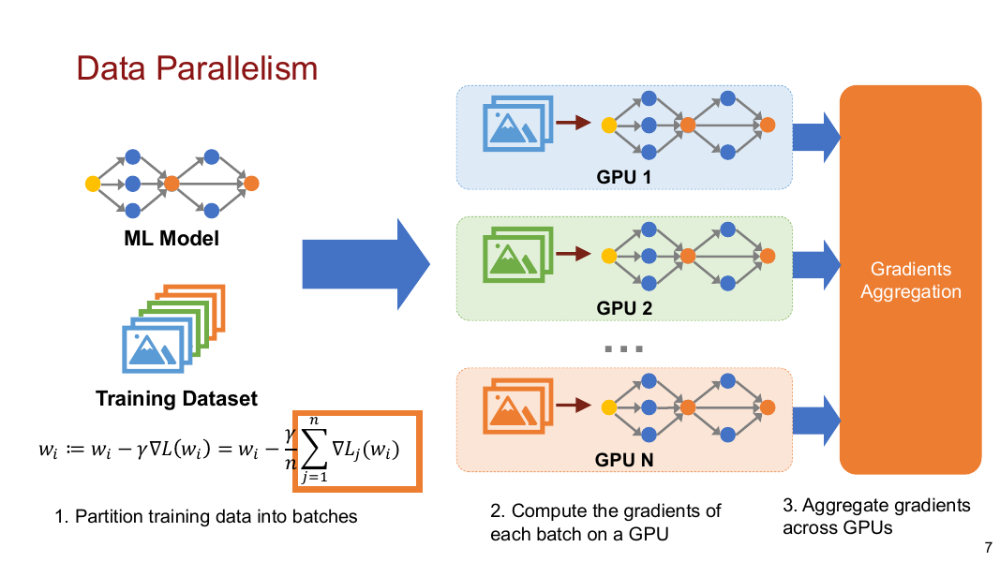
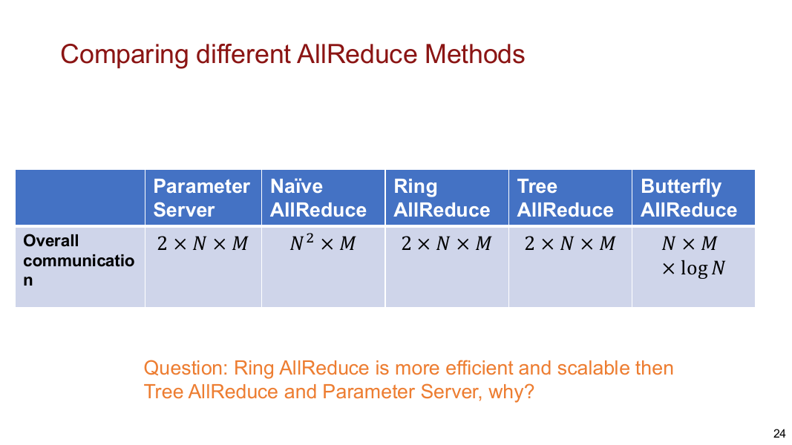
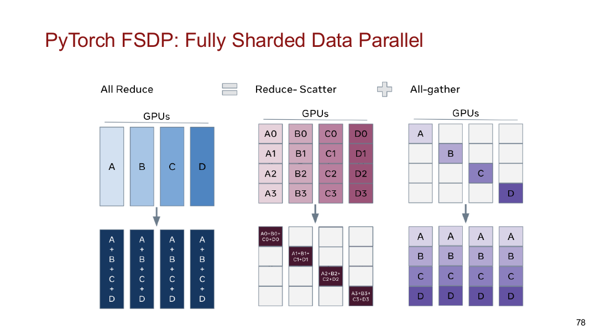
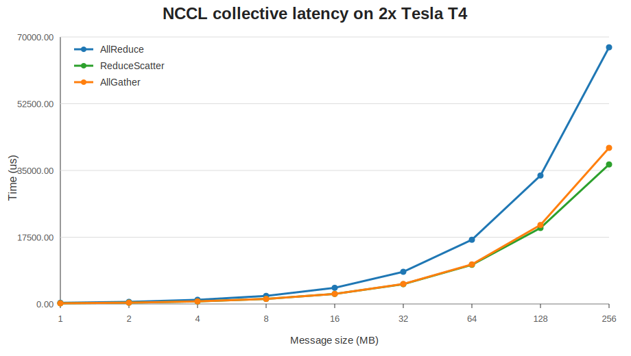
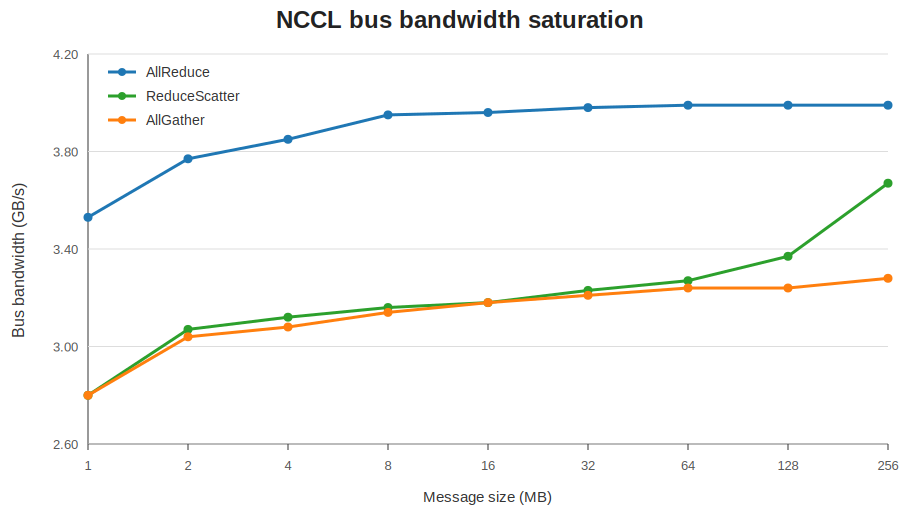
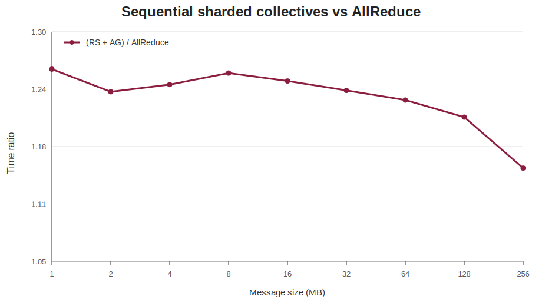
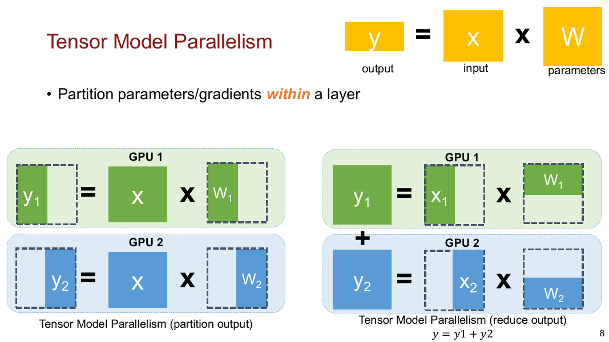
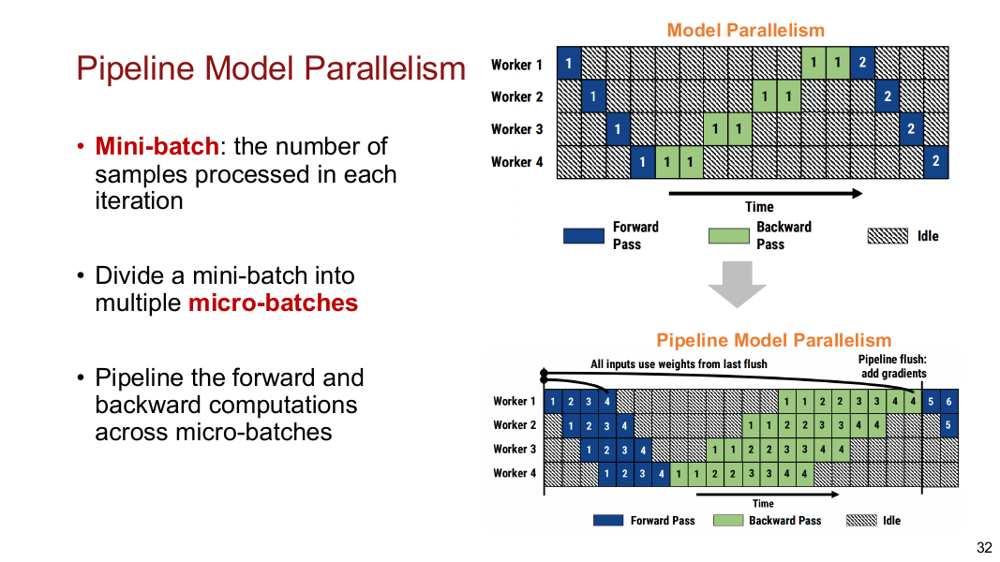
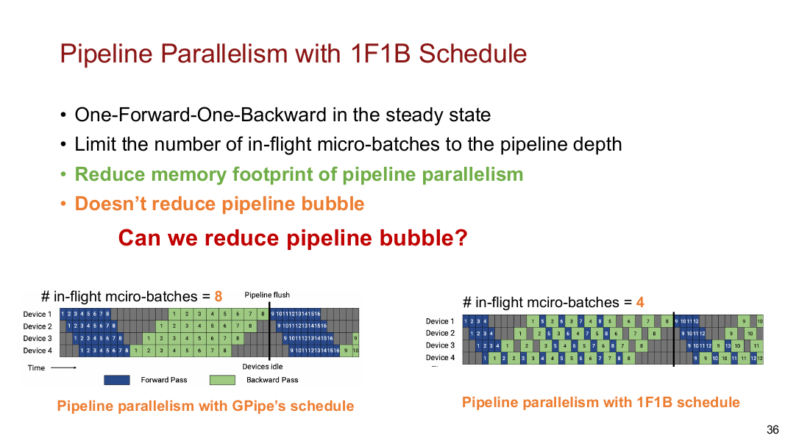

# NCCL Parallelism and Communication Benchmarking

Built a hands-on distributed systems benchmarking project to study how NCCL collectives, data parallelism, tensor parallelism, and pipeline parallelism shape the communication cost of large-model training.

- Source code: [github](https://github.com/licheng2018/NCCL)

## Project Scope

- Benchmarked NCCL `AllReduce`, `ReduceScatter`, and `AllGather` on a 2-GPU Tesla T4 setup using `nccl-tests`.
- Measured latency and bus bandwidth across message sizes from bytes-scale transfers to hundreds of MB.
- Compared full-gradient synchronization with sharded communication patterns used by ZeRO/FSDP-style training.
- Implemented toy tensor-parallel and pipeline-parallel training examples to connect collective primitives with model-parallel execution.
- Analyzed when communication is latency-bound, when it becomes bandwidth-bound, and when sharded collectives are useful despite extra orchestration overhead.

## Repository Structure

| Notebook | Main purpose | Key output |
|---|---|---|
| `nccl-experiments.ipynb` | Run NCCL `all_reduce_perf` across message sizes | AllReduce latency/bandwidth curve and saturation behavior |
| `reducescatter-allgather.ipynb` | Compare `AllReduce`, `ReduceScatter`, and `AllGather` | Collective-level latency, bandwidth, and RS+AG vs AllReduce ratio |
| `tensor-parallel-megatron.ipynb` | Build a Megatron-style toy tensor-parallel MLP block | Correctness check against a reference dense block |
| `pipeline-parallel.ipynb` | Build a two-stage pipeline-parallel toy training loop | No-microbatch vs microbatch scheduling behavior |

## Parallelism Background

Data parallel training replicates the model across GPUs, partitions mini-batches, computes local gradients, and then synchronizes gradients across devices. This makes the collective communication pattern a core part of training performance.

The project uses NCCL collectives to compare communication schemes that appear in distributed training systems:

| Collective | Input on each GPU | Output on each GPU | Training intuition |
|---|---|---|---|
| `AllReduce` | Full tensor | Full reduced tensor | DDP-style full gradient synchronization |
| `ReduceScatter` | Full tensor | One reduced shard | FSDP/ZeRO-style sharded gradient aggregation |
| `AllGather` | One shard | Reconstructed full tensor | FSDP/ZeRO-style temporary parameter reconstruction |

## NCCL Benchmark Setup

| Item | Configuration |
|---|---|
| GPU setup | 2 x Tesla T4 |
| NCCL test version | `nccl-tests` 2.18.2 |
| Main benchmark | `all_reduce_perf`, `reduce_scatter_perf`, `all_gather_perf` |
| Data type / op | `float`, `sum` |
| Message range | 8 B to 512 MB for AllReduce scan; 1 MB to 256 MB for collective comparison |
| Reported metrics | Latency in microseconds, algorithm bandwidth, bus bandwidth, correctness errors |

## AllReduce Scaling Result

The AllReduce scan shows a clear transition from latency-bound execution at small message sizes to bandwidth-bound execution at large message sizes.

| Message size | Time | Bus bandwidth | Observation |
|---:|---:|---:|---|
| 8 B | 14.46 us | 0.00 GB/s | Launch and synchronization overhead dominate |
| 1 KB | 14.34 us | 0.07 GB/s | Still latency-bound |
| 64 KB | 44.73 us | 1.47 GB/s | Bandwidth begins to matter |
| 1 MB | 293.66 us | 3.57 GB/s | Collective approaches high utilization |
| 8 MB | 2,111.71 us | 3.97 GB/s | Near saturation |
| 32 MB | 8,377.52 us | 4.01 GB/s | Bandwidth-bound region |
| 128 MB | 33,408.50 us | 4.02 GB/s | Sustained bandwidth |
| 512 MB | 133,221.00 us | 4.03 GB/s | Saturated around 4 GB/s bus bandwidth |

## Collective Comparison

The second experiment compares AllReduce with its sharded building blocks. On two GPUs, `ReduceScatter` and `AllGather` each move less data than a full AllReduce and therefore have lower individual latency, but composing them sequentially adds extra overhead.

| Size | AllGather time | ReduceScatter time | AllReduce time | AllGather bus BW | ReduceScatter bus BW | AllReduce bus BW |
|---:|---:|---:|---:|---:|---:|---:|
| 1 MB | 186.94 us | 187.11 us | 297.03 us | 2.80 GB/s | 2.80 GB/s | 3.53 GB/s |
| 2 MB | 345.46 us | 341.86 us | 556.66 us | 3.04 GB/s | 3.07 GB/s | 3.77 GB/s |
| 4 MB | 680.58 us | 671.56 us | 1,088.25 us | 3.08 GB/s | 3.12 GB/s | 3.85 GB/s |
| 8 MB | 1,334.26 us | 1,328.48 us | 2,121.56 us | 3.14 GB/s | 3.16 GB/s | 3.95 GB/s |
| 16 MB | 2,634.97 us | 2,639.63 us | 4,231.72 us | 3.18 GB/s | 3.18 GB/s | 3.96 GB/s |
| 32 MB | 5,232.37 us | 5,191.20 us | 8,432.17 us | 3.21 GB/s | 3.23 GB/s | 3.98 GB/s |
| 64 MB | 10,369.70 us | 10,269.40 us | 16,839.90 us | 3.24 GB/s | 3.27 GB/s | 3.99 GB/s |
| 128 MB | 20,714.80 us | 19,925.50 us | 33,668.50 us | 3.24 GB/s | 3.37 GB/s | 3.99 GB/s |
| 256 MB | 40,918.20 us | 36,571.90 us | 67,290.60 us | 3.28 GB/s | 3.67 GB/s | 3.99 GB/s |

## ReduceScatter + AllGather vs AllReduce

Mathematically, an AllReduce can be expressed as `ReduceScatter + AllGather`. The experiment validates this decomposition but also shows that directly composing the two primitives is slower than a fused NCCL AllReduce on this 2-GPU setup.

| Size | `(ReduceScatter + AllGather) / AllReduce` | Interpretation |
|---:|---:|---|
| 1 MB | 1.26x | Sequential sharded collectives are 26% slower than fused AllReduce |
| 2 MB | 1.23x | Extra launch/synchronization cost is still visible |
| 4 MB | 1.24x | Similar overhead region |
| 8 MB | 1.26x | Sharded composition remains slower |
| 16 MB | 1.25x | Bandwidth is higher, but two collectives still cost more |
| 32 MB | 1.24x | Gap narrows slowly |
| 64 MB | 1.23x | Larger messages amortize some overhead |
| 128 MB | 1.21x | Sharded composition becomes closer |
| 256 MB | 1.15x | Large messages reduce the relative penalty |

This result is useful because it separates two questions: `AllReduce` is the right fused primitive for replicated gradient synchronization, while `ReduceScatter` and `AllGather` are useful in sharded training because they avoid keeping full optimizer states, gradients, or parameters resident on every GPU.

## Tensor Parallel Experiment

The tensor-parallel notebook builds a small Megatron-style MLP block and compares it with an equivalent dense reference implementation.

| Component | Parallelization strategy | Communication behavior |
|---|---|---|
| LayerNorm | Replicated/local | No collective needed |
| MLP `fc1` | Column parallel | Splits output features across GPUs |
| GELU | Local | Runs independently on each shard |
| MLP `fc2` | Row parallel | Requires output aggregation |
| Residual add | Local after aggregation | Uses the reconstructed output |

| Check | Result |
|---|---:|
| World size | 2 |
| Input shape | `(8, 16)` |
| Output shape | `(8, 16)` |
| Max error vs dense reference | `0.00000012` |
| Mean error vs dense reference | `0.00000000` |

The correctness result shows that the toy tensor-parallel decomposition reproduces the dense block while making the communication site explicit: the row-parallel output needs a reduction across ranks.

## Pipeline Parallel Experiment

The pipeline-parallel notebook splits a toy model into two stages and compares ordinary stage execution with microbatch-based pipelining.

| Mode | Observed step time | Notes |
|---|---:|---|
| No microbatch, first step | 0.3275 s | Includes setup/warmup overhead |
| No microbatch, later step | 0.0030 s | Simple two-stage execution after warmup |
| 4 microbatches, first step | 0.0740 s | Pipeline schedule starts to overlap stage work |
| 4 microbatches, steady state | 0.0070-0.0071 s | More scheduling overhead than no-microbatch toy case, but exposes pipeline behavior |

The small toy model is too tiny to show a throughput win from pipelining, but it makes the scheduling tradeoff visible. Microbatching reduces idle time in realistic multi-stage models, while 1F1B limits the number of in-flight microbatches and reduces pipeline memory pressure.

## Result Analysis

The experiments show three main communication regimes. First, small collectives are latency-bound: bytes-scale AllReduce calls spend most of their time in launch, synchronization, and protocol overhead. Second, large collectives are bandwidth-bound: AllReduce reaches roughly 4 GB/s bus bandwidth on the 2 x T4 environment and stays flat from tens of MB through 512 MB. Third, sharded collectives change the memory and ownership model rather than simply replacing AllReduce as a faster primitive.

`ReduceScatter` and `AllGather` are each cheaper than a full AllReduce because each primitive only produces a shard or reconstructs from shards. However, running them sequentially to emulate AllReduce is 1.15x-1.26x slower in this setup because two collectives introduce extra launch and synchronization overhead. In FSDP/ZeRO, the benefit comes from using these collectives at the right points in the training step so that parameters, gradients, and optimizer states can stay sharded instead of fully replicated.

The tensor-parallel and pipeline-parallel notebooks connect these low-level collectives to model execution. Tensor parallelism inserts reductions at layer boundaries, while pipeline parallelism trades larger scheduling complexity for the ability to partition a model across stages. Together, the project builds a practical mental model for choosing between replicated data parallel training, sharded data parallel training, tensor parallelism, and pipeline parallelism.

[Back to Home](../index.md)
