# NCCL Parallelism and Communication Benchmarking

Built a hands-on distributed systems benchmarking project to study how NCCL collectives, data parallelism, tensor parallelism, and pipeline parallelism shape the communication cost of large-model training.

- Source code: [github](https://github.com/licheng2018/NCCL)

## Contents

| Area | Jump to sections |
|---|---|
| Overview | [Project Scope](#project-scope) · [Project Positioning](#project-positioning) · [Repository Structure](#repository-structure) · [Learning Path](#learning-path) |
| NCCL Collectives | [Parallelism Background](#parallelism-background) · [AllReduce Semantics](#allreduce-semantics) · [AllReduce Algorithm Visual Walkthrough](#allreduce-algorithm-visual-walkthrough) · [NCCL Benchmark Setup](#nccl-benchmark-setup) · [Message Size and Communication Regimes](#message-size-and-communication-regimes) · [Algorithm Bandwidth and Bus Bandwidth](#algorithm-bandwidth-and-bus-bandwidth) |
| Results | [AllReduce Scaling Result](#allreduce-scaling-result) · [Collective Comparison](#collective-comparison) · [ReduceScatter + AllGather vs AllReduce](#reducescatter-allgather-vs-allreduce) |
| Model Parallelism | [Connection to DDP, FSDP, and ZeRO](#connection-to-ddp-fsdp-and-zero) · [Tensor Parallel Experiment](#tensor-parallel-experiment) · [Pipeline Parallel Experiment](#pipeline-parallel-experiment) · [Combining DP, TP, PP, and FSDP](#combining-dp-tp-pp-and-fsdp) |
| Review | [Main Conclusions](#main-conclusions) · [Result Analysis](#result-analysis) |

## Project Scope

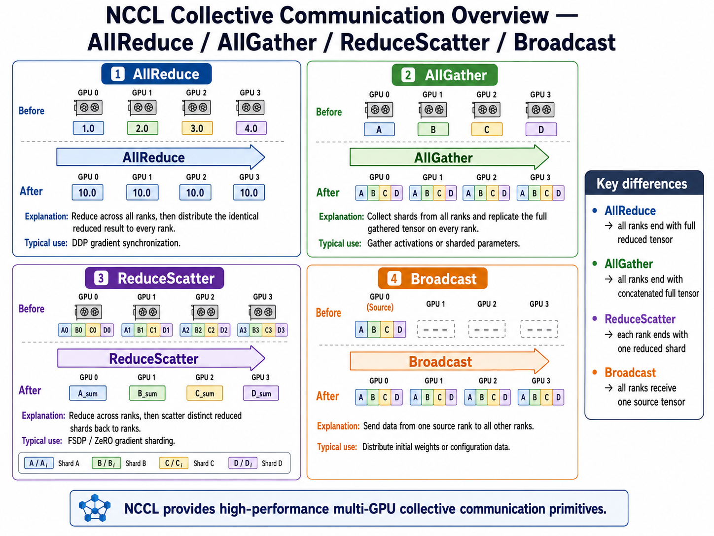

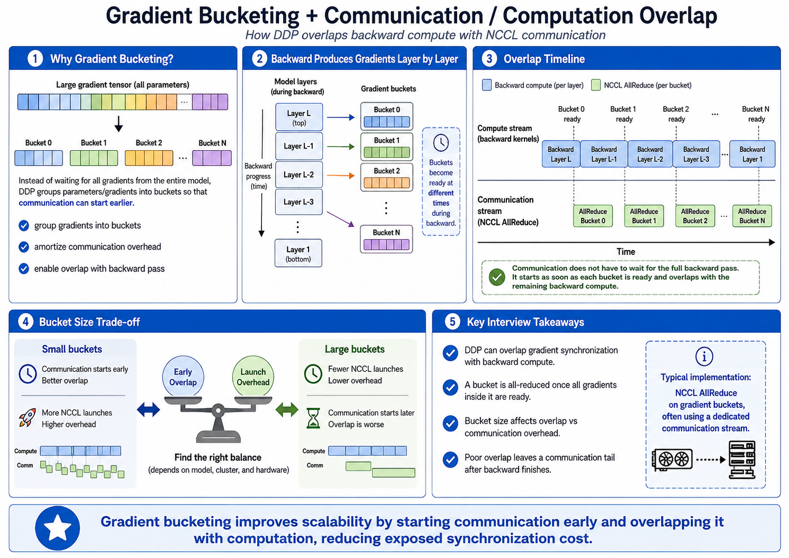

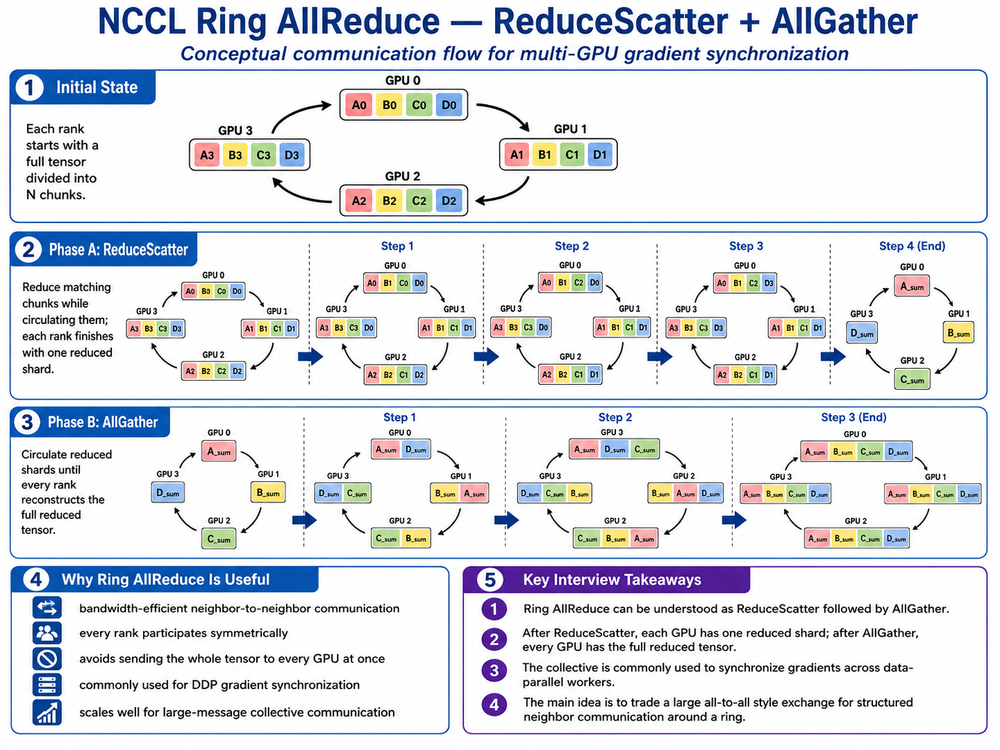

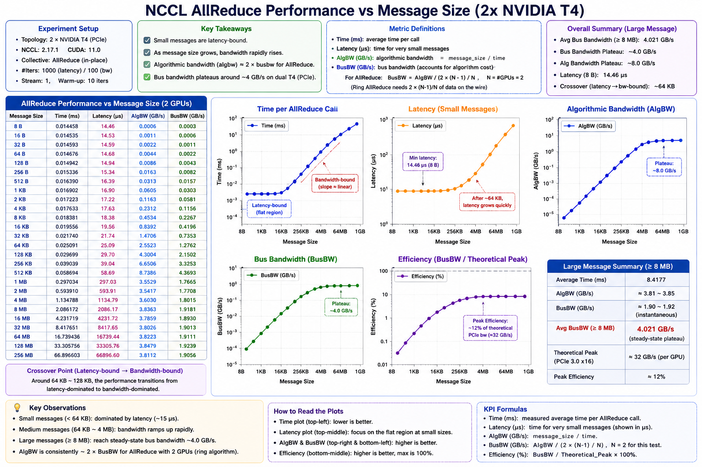

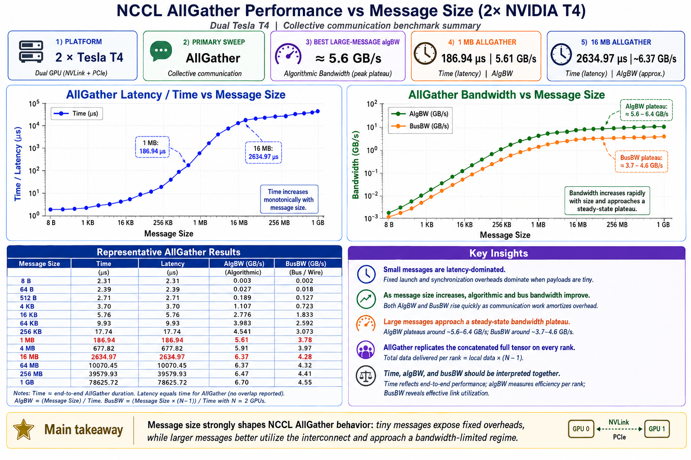

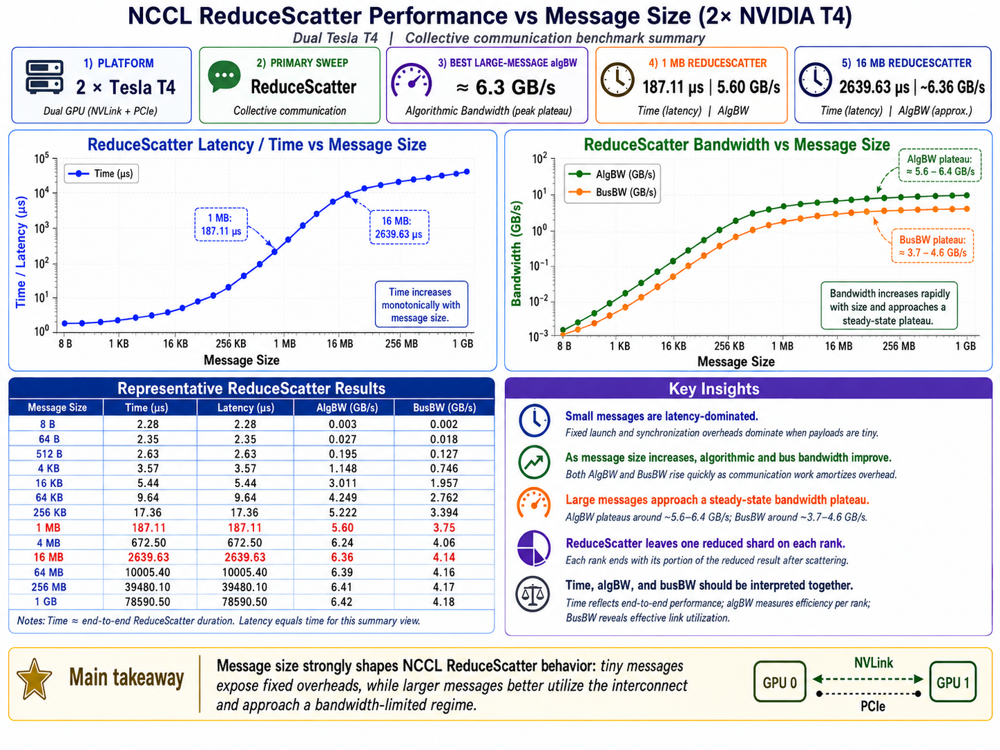

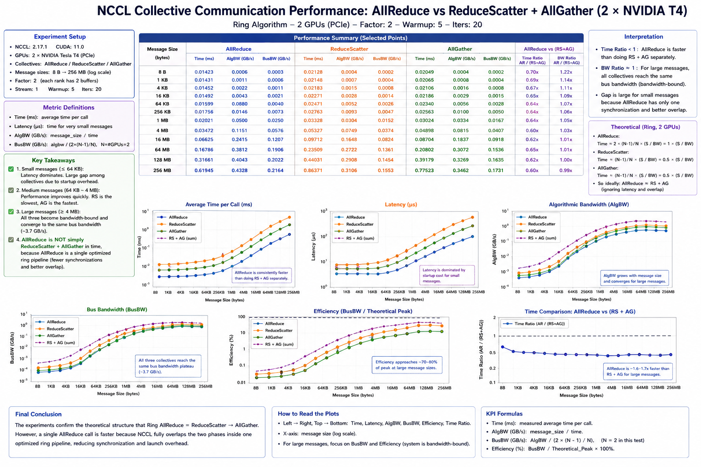

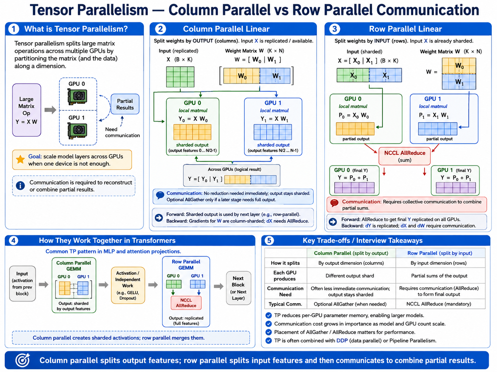

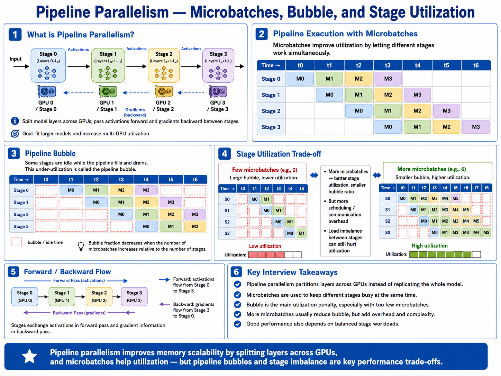

- Benchmarked NCCL `AllReduce`, `ReduceScatter`, and `AllGather` on a 2-GPU Tesla T4 setup using `nccl-tests`.
- Measured latency and bus bandwidth across message sizes from bytes-scale transfers to hundreds of MB.
- Compared full-gradient synchronization with sharded communication patterns used by ZeRO/FSDP-style training.
- Implemented toy tensor-parallel and pipeline-parallel training examples to connect collective primitives with model-parallel execution.
- Analyzed when communication is latency-bound, when it becomes bandwidth-bound, and when sharded collectives are useful despite extra orchestration overhead.

## Project Positioning

This repository is more than a simple NCCL bandwidth test. It is a multi-GPU communication and model-parallel learning project built on a `2 x Tesla T4` environment. The goal is to connect low-level collective behavior with the distributed training strategies used in larger systems.

The project answers four related questions:

| Question | Experiment |
|---|---|
| How does collective performance change with message size? | `all_reduce_perf` scans from tiny messages to hundreds of MB. |
| How do `AllReduce`, `ReduceScatter`, and `AllGather` differ? | Collective comparison notebook benchmarks all three primitives. |
| How does tensor parallelism use collectives inside a layer? | Megatron-style toy MLP with column-parallel and row-parallel linear layers. |
| How does pipeline parallelism move work across stages? | Two-stage toy model with no-microbatch and microbatch execution. |

This project also forms a lower-level companion to the GPT training project:

```text
gpt_training
├── DDP
├── FSDP
├── gradient accumulation
└── end-to-end training performance

NCCL
├── AllReduce
├── ReduceScatter
├── AllGather
├── tensor parallel communication
└── pipeline activation movement
```

## Repository Structure

| Notebook | Main purpose | Key output |
|---|---|---|
| `nccl-experiments.ipynb` | Run NCCL `all_reduce_perf` across message sizes | AllReduce latency/bandwidth curve and saturation behavior |
| `reducescatter-allgather.ipynb` | Compare `AllReduce`, `ReduceScatter`, and `AllGather` | Collective-level latency, bandwidth, and RS+AG vs AllReduce ratio |
| `tensor-parallel-megatron.ipynb` | Build a Megatron-style toy tensor-parallel MLP block | Correctness check against a reference dense block |
| `pipeline-parallel.ipynb` | Build a two-stage pipeline-parallel toy training loop | No-microbatch vs microbatch scheduling behavior |

## Learning Path

The four notebooks form a progression from raw communication measurements to model-parallel execution:

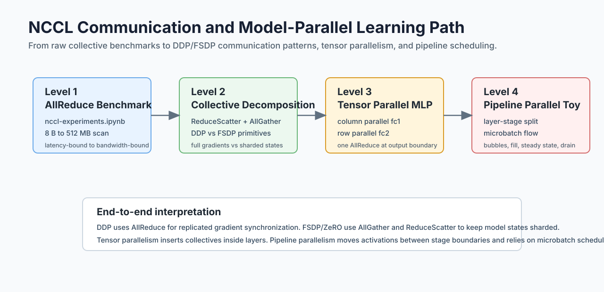

| Level | What is learned | Why it matters |
|---|---|---|
| 1. Communication performance | Latency-bound vs bandwidth-bound collective behavior. | Explains why many tiny collectives are inefficient. |
| 2. Collective primitives | `AllReduce`, `ReduceScatter`, and `AllGather`. | Connects DDP gradient sync with FSDP/ZeRO sharding. |
| 3. Tensor parallelism | Column-parallel and row-parallel layers. | Shows where collectives appear inside Transformer layers. |
| 4. Pipeline parallelism | Layer-stage split and microbatch scheduling. | Shows how pipeline bubbles arise and why microbatches matter. |

## Parallelism Background

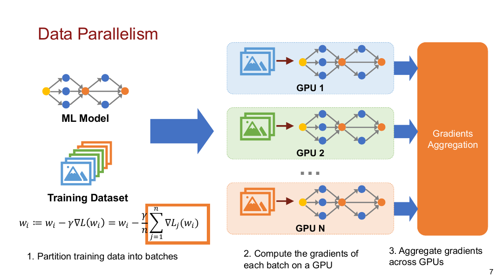

Data parallel training replicates the model across GPUs, partitions mini-batches, computes local gradients, and then synchronizes gradients across devices. This makes the collective communication pattern a core part of training performance.

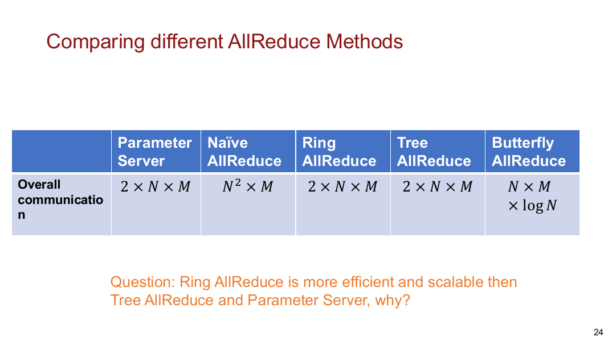

The project uses NCCL collectives to compare communication schemes that appear in distributed training systems:

| Collective | Input on each GPU | Output on each GPU | Training intuition |
|---|---|---|---|
| `AllReduce` | Full tensor | Full reduced tensor | DDP-style full gradient synchronization |
| `ReduceScatter` | Full tensor | One reduced shard | FSDP/ZeRO-style sharded gradient aggregation |
| `AllGather` | One shard | Reconstructed full tensor | FSDP/ZeRO-style temporary parameter reconstruction |

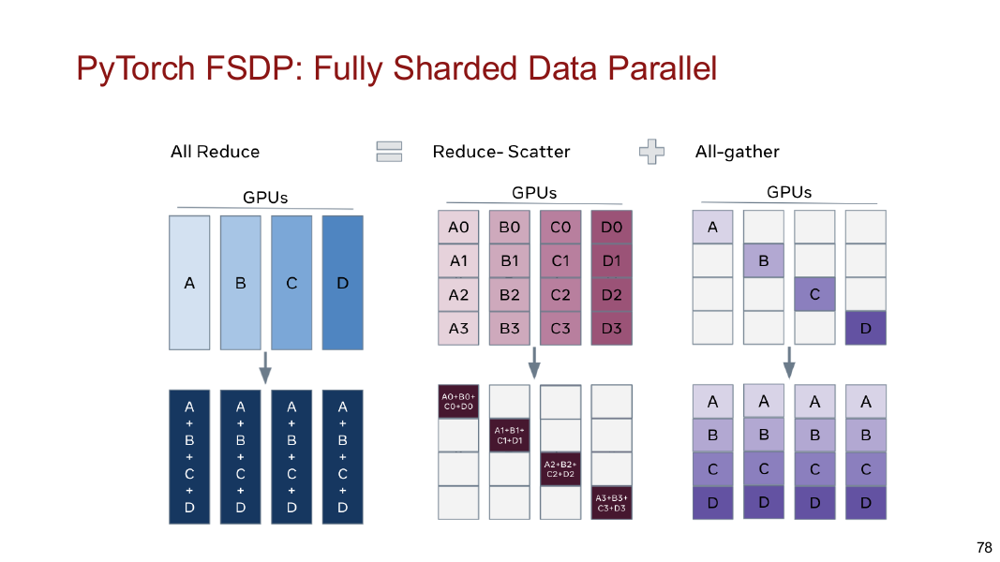

## AllReduce Semantics

`AllReduce` combines values across all ranks and returns the reduced result to every rank.

For example, with two GPUs:

```text
GPU 0: [1, 2, 3, 4]
GPU 1: [10, 20, 30, 40]
```

After:

```text
dist.all_reduce(tensor, op=SUM)
```

both GPUs hold:

```text
GPU 0: [11, 22, 33, 44]
GPU 1: [11, 22, 33, 44]
```

Logically, this contains two actions:

```text
Reduce:    combine data across GPUs
Broadcast: make the result available on every GPU
```

In DDP, this corresponds to gradient synchronization:

```text
GPU 0 calculates local gradients
GPU 1 calculates local gradients
            ↓
        AllReduce
            ↓
both GPUs obtain synchronized gradients
```

This is why the NCCL project directly supports the distributed-training project: DDP's high-level gradient sync is implemented using collective communication.

## AllReduce Algorithm Visual Walkthrough

The slide deck explains why different AllReduce algorithms have different latency and bandwidth behavior. These diagrams are useful for interpreting the NCCL measurements: the same mathematical collective can be implemented with different communication schedules.

### Naive AllReduce

Naive AllReduce sends local gradients from each worker to all other workers. If there are `N` workers and each model has `M` parameters, the communication can grow poorly because every worker communicates full parameter-size data with many peers.

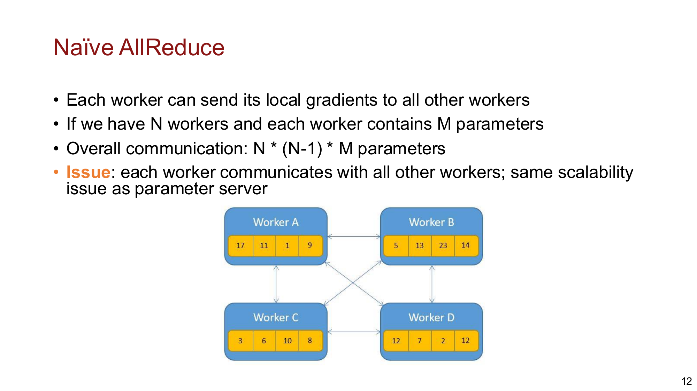

The main issue is scalability. It is conceptually simple, but the traffic pattern becomes expensive as the number of workers increases.

### Ring AllReduce

Ring AllReduce arranges workers in a ring and divides the parameter vector into `N` slices. It has two phases:

```text
1. Aggregation / reduce-scatter-style phase
2. Broadcast / all-gather-style phase
```

In the aggregation phase, each worker sends one slice to the next worker in the ring and receives one slice from the previous worker. After repeating this process, each worker owns one fully aggregated slice.

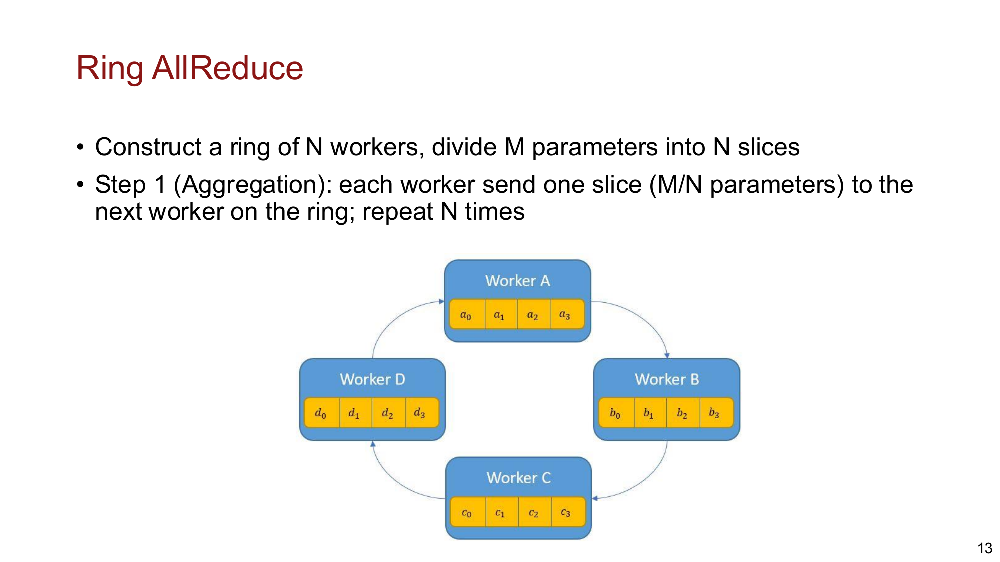

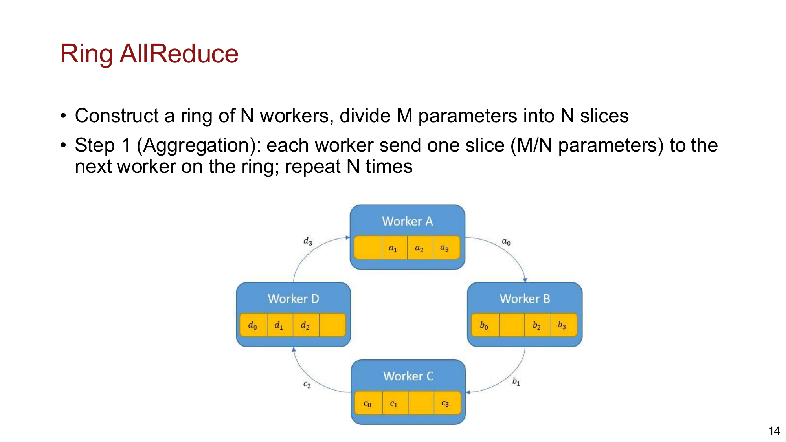


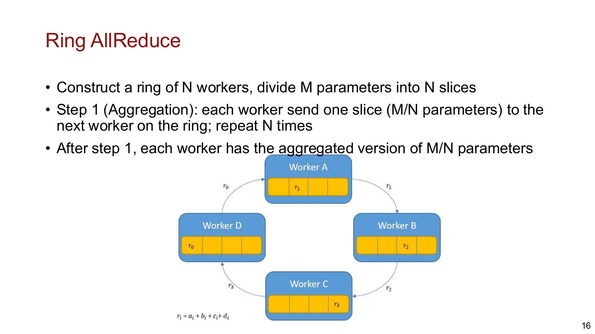

In the broadcast phase, the aggregated slices circulate so every worker reconstructs the full reduced tensor.


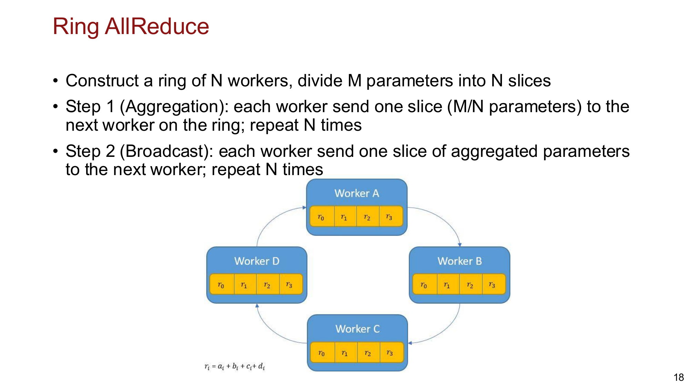

The slide summary states the overall communication as:

```text
Aggregation: N * M parameters
Broadcast:   N * M parameters
Total:       2 * N * M parameters
```

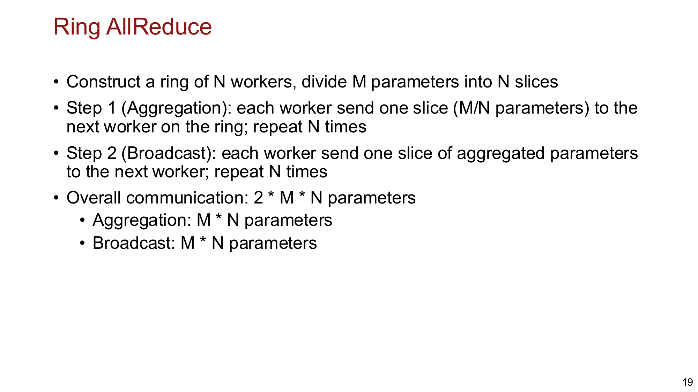

This is why ring algorithms are strong for large messages: they are bandwidth-efficient and use a regular communication pattern, though they require multiple phases around the ring.

### Tree AllReduce

Tree AllReduce organizes workers into a tree. The aggregation phase sends data upward to parent nodes, and the broadcast phase sends the reduced result back downward to children.

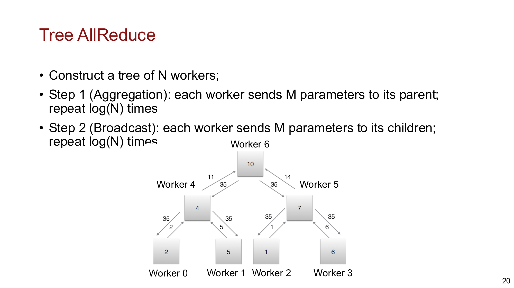

The total communication volume is summarized as:

```text
Aggregation: N * M parameters
Broadcast:   N * M parameters
Total:       2 * N * M parameters
```

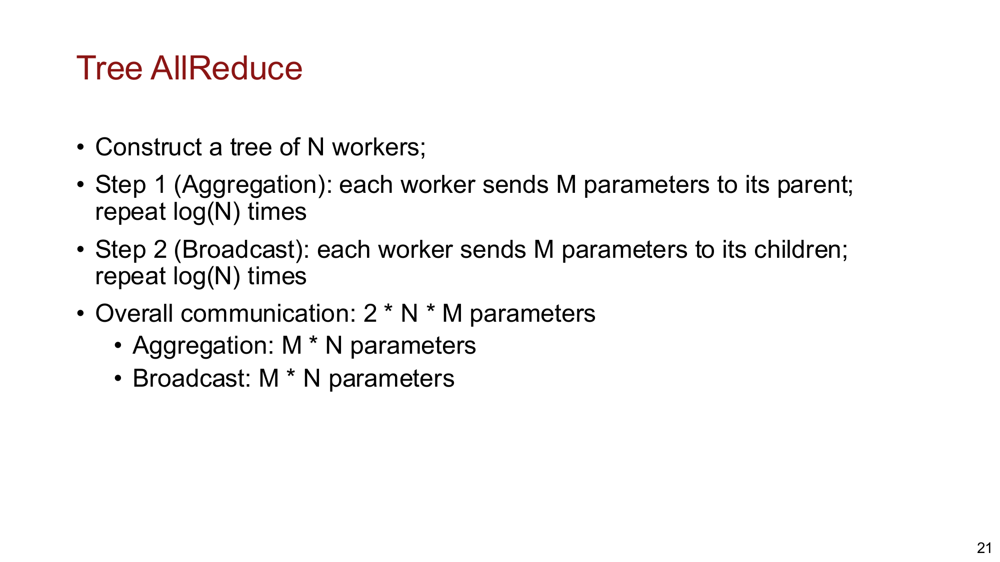

Tree methods can reduce the number of startup phases compared with ring-style communication, which can be attractive for smaller messages or specific network topologies.

### Butterfly AllReduce

Butterfly communication repeatedly pairs workers so each step exchanges and aggregates partial results with a different partner. After `log(N)` rounds, all workers can obtain the full reduction.

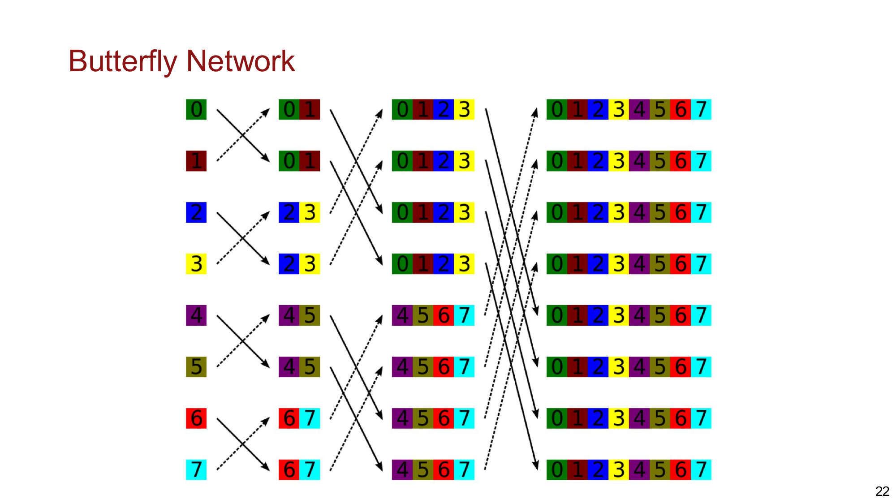

The slide summary emphasizes:

```text
repeat log(N) times:
    each worker sends parameters to its butterfly target
    each worker aggregates gradients locally

overall communication: N * M * log(N) parameters
```

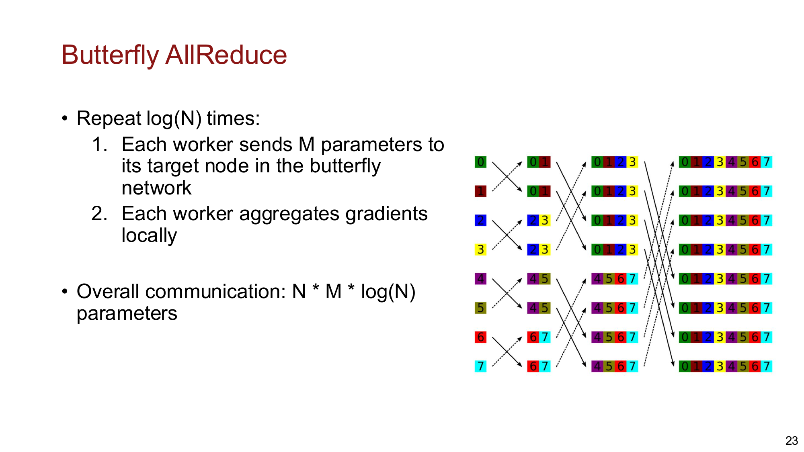

The takeaway is that AllReduce performance depends on both message size and algorithmic schedule. Ring is often bandwidth-efficient for large payloads, while tree or butterfly-style approaches can have different latency and phase trade-offs.

## NCCL Benchmark Setup

| Item | Configuration |
|---|---|
| GPU setup | 2 x Tesla T4, 15 GB each |
| Runtime environment | Kaggle GPU runtime |
| PyTorch / CUDA | PyTorch 2.10, CUDA 12.8 |
| NCCL test version | `nccl-tests` 2.18.2 |
| Main benchmark | `all_reduce_perf`, `reduce_scatter_perf`, `all_gather_perf` |
| Data type / op | `float`, `sum` |
| Message range | 8 B to 512 MB for AllReduce scan; 1 MB to 256 MB for collective comparison |
| Reported metrics | Latency in microseconds, algorithm bandwidth, bus bandwidth, correctness errors |

The first notebook verifies the two T4 GPUs using `nvidia-smi` and PyTorch, clones and compiles NVIDIA's official `nccl-tests`, then runs the main executable:

```text
all_reduce_perf
```

The core command is equivalent to:

```text
./all_reduce_perf \
    -b 8 \
    -e 256M \
    -f 2 \
    -g 2
```

Parameter meaning:

| Flag | Meaning |
|---|---|
| `-b 8` | Minimum message size is 8 bytes. |
| `-e 256M` | Maximum message size is 256 MB. |
| `-f 2` | Message size doubles each step. |
| `-g 2` | Use two GPUs. |

The goal is not to obtain a single bandwidth number. The goal is to observe how communication behavior changes as message size grows.

## Message Size and Communication Regimes

Communication time can be approximated as:

```text
T_communication ~= alpha + N / B
```

where:

| Symbol | Meaning |
|---|---|
| `alpha` | Fixed latency and launch/protocol overhead. |
| `N` | Message size. |
| `B` | Effective communication bandwidth. |

For small messages:

```text
N / B << alpha
```

The fixed cost dominates. NCCL launch overhead, CUDA kernel launch, synchronization, protocol setup, and software-stack overhead are paid even if the payload is only a few bytes. This is why 8-byte to KB-scale messages can take tens of microseconds while reporting nearly zero effective bandwidth.

For large messages:

```text
N / B >> alpha
```

The fixed overhead is amortized and communication becomes limited by PCIe bandwidth, peer-to-peer path, memory copy bandwidth, NCCL protocol choice, and topology.

The notebook separates the scan into three ranges:

| Scan | Range | Factor | Purpose |
|---|---|---:|---|
| Full scan | 8 B to 256 MB | 2.0 | Shows the whole transition from latency-bound to bandwidth-bound. |
| Mid-size scan | 1 KB to 16 MB | 1.5 | Zooms into the transition region where bandwidth rises quickly. |
| Large-message scan | 8 MB to 512 MB | 2.0 | Confirms the saturated bandwidth plateau. |

The logs are parsed into Pandas DataFrames containing message size, time, algorithm bandwidth, bus bandwidth, and correctness status.

## Algorithm Bandwidth and Bus Bandwidth

`nccl-tests` reports both `algbw` and `busbw`.

Algorithm bandwidth describes the logical collective throughput from the application perspective:

```text
algbw ~= logical data size / operation time
```

Bus bandwidth applies collective-specific correction factors to estimate effective utilization of the underlying interconnect.

For Ring AllReduce with `P` GPUs, the common bus-bandwidth correction is:

```text
busbw = algbw * P / [2 * (P - 1)]
```

For `P = 2`:

```text
P / [2 * (P - 1)] = 2 / [2 * 1] = 1
```

So in this 2-GPU AllReduce experiment:

```text
algbw ~= busbw
```

For `ReduceScatter` and `AllGather`, `algbw` and `busbw` differ more visibly because the logical output size and physical communication volume are defined differently. When comparing different collective types, `busbw` is usually the safer metric for interconnect utilization.

## AllReduce Scaling Result

The AllReduce scan shows a clear transition from latency-bound execution at small message sizes to bandwidth-bound execution at large message sizes.

| Message size | Time | Bus bandwidth | Observation |
|---:|---:|---:|---|
| 8 B | 14.46 us | 0.00 GB/s | Launch and synchronization overhead dominate |
| 1 KB | 14.34 us | 0.07 GB/s | Still latency-bound |
| 64 KB | 44.73 us | 1.47 GB/s | Bandwidth begins to matter |
| 1 MB | 293.66 us | 3.57 GB/s | Collective approaches high utilization |
| 8 MB | 2,111.71 us | 3.97 GB/s | Near saturation |
| 32 MB | 8,377.52 us | 4.01 GB/s | Bandwidth-bound region |
| 128 MB | 33,408.50 us | 4.02 GB/s | Sustained bandwidth |
| 512 MB | 133,221.00 us | 4.03 GB/s | Saturated around 4 GB/s bus bandwidth |

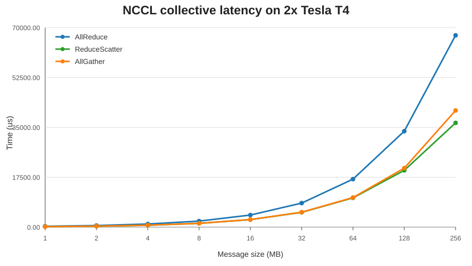

## Collective Comparison

The second experiment compares AllReduce with its sharded building blocks. On two GPUs, `ReduceScatter` and `AllGather` each move less data than a full AllReduce and therefore have lower individual latency, but composing them sequentially adds extra overhead.

The notebook runs three NCCL benchmarks:

```text
all_reduce_perf
reduce_scatter_perf
all_gather_perf
```

Configuration:

| Item | Setting |
|---|---|
| Message range | 8 bytes to 256 MB |
| GPUs | 2 |
| Warmup iterations | 5 |
| Measured iterations | 20 |

This experiment is the part most directly connected to FSDP and ZeRO because sharded training uses `ReduceScatter` and `AllGather` separately instead of always exposing full `AllReduce`.

### ReduceScatter Semantics

Assume each GPU starts with a full vector:

```text
GPU 0: [1, 2, 3, 4]
GPU 1: [10, 20, 30, 40]
```

First, the values are reduced:

```text
[1, 2, 3, 4] + [10, 20, 30, 40]
= [11, 22, 33, 44]
```

Then the reduced result is scattered:

```text
GPU 0 receives: [11, 22]
GPU 1 receives: [33, 44]
```

So `ReduceScatter` leaves each GPU with only one shard of the reduced result. This is the communication pattern behind gradient sharding:

```text
each GPU calculates gradients
        ↓
ReduceScatter
        ↓
each GPU retains only its gradient shard
```

### AllGather Semantics

Assume each GPU starts with one shard:

```text
GPU 0: [11, 22]
GPU 1: [33, 44]
```

After `AllGather`:

```text
GPU 0: [11, 22, 33, 44]
GPU 1: [11, 22, 33, 44]
```

Each GPU contributes its shard, all GPUs exchange shards, and every GPU reconstructs the complete tensor.

In FSDP forward, this corresponds to:

```text
parameter shards
      ↓
AllGather
      ↓
temporary full parameters
      ↓
layer computation
```

### AllReduce as ReduceScatter + AllGather

Logically:

```text
AllReduce = ReduceScatter + AllGather
```

Step 1:

```text
ReduceScatter:
different GPUs reduce data
each GPU retains one reduced shard
```

Step 2:

```text
AllGather:
all GPUs exchange reduced shards
each GPU reconstructs the full reduced tensor
```

The distinction is not just mathematical; it changes ownership. DDP usually needs the full synchronized gradient on every GPU, so `AllReduce` is the natural primitive. FSDP/ZeRO can keep gradients, parameters, and optimizer states sharded, so `ReduceScatter` and `AllGather` appear at different points in the training step.

| Size | AllGather time | ReduceScatter time | AllReduce time | AllGather bus BW | ReduceScatter bus BW | AllReduce bus BW |
|---:|---:|---:|---:|---:|---:|---:|
| 1 MB | 186.94 us | 187.11 us | 297.03 us | 2.80 GB/s | 2.80 GB/s | 3.53 GB/s |
| 2 MB | 345.46 us | 341.86 us | 556.66 us | 3.04 GB/s | 3.07 GB/s | 3.77 GB/s |
| 4 MB | 680.58 us | 671.56 us | 1,088.25 us | 3.08 GB/s | 3.12 GB/s | 3.85 GB/s |
| 8 MB | 1,334.26 us | 1,328.48 us | 2,121.56 us | 3.14 GB/s | 3.16 GB/s | 3.95 GB/s |
| 16 MB | 2,634.97 us | 2,639.63 us | 4,231.72 us | 3.18 GB/s | 3.18 GB/s | 3.96 GB/s |
| 32 MB | 5,232.37 us | 5,191.20 us | 8,432.17 us | 3.21 GB/s | 3.23 GB/s | 3.98 GB/s |
| 64 MB | 10,369.70 us | 10,269.40 us | 16,839.90 us | 3.24 GB/s | 3.27 GB/s | 3.99 GB/s |
| 128 MB | 20,714.80 us | 19,925.50 us | 33,668.50 us | 3.24 GB/s | 3.37 GB/s | 3.99 GB/s |
| 256 MB | 40,918.20 us | 36,571.90 us | 67,290.60 us | 3.28 GB/s | 3.67 GB/s | 3.99 GB/s |

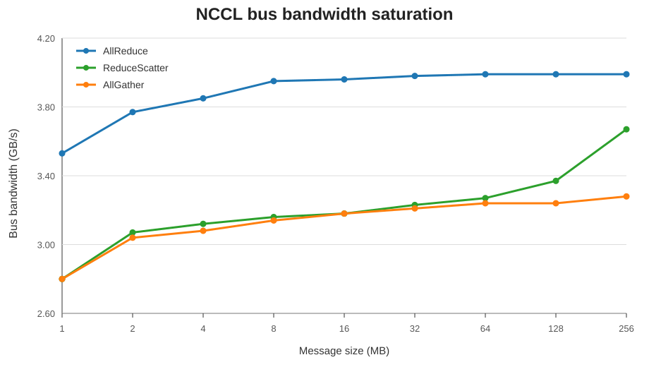

For large `ReduceScatter` messages, the experiment reports roughly:

| Message | Time | Algorithm bandwidth | Bus bandwidth | Correctness |
|---:|---:|---:|---:|---|
| 128 MB | about 20 ms | about 6.5 GB/s | about 3.2-3.4 GB/s | `#wrong = 0`, out-of-bounds OK |
| 256 MB | about 37-41 ms | about 6.6-7.3 GB/s | about 3.3-3.7 GB/s | `#wrong = 0`, out-of-bounds OK |

The higher `algbw` does not mean the physical link suddenly became faster than the AllReduce link. It reflects how the benchmark defines logical size for a collective whose output is sharded. For cross-collective comparison, `busbw` is the more meaningful interconnect-oriented number.

## ReduceScatter + AllGather vs AllReduce

Mathematically, an AllReduce can be expressed as `ReduceScatter + AllGather`. The experiment validates this decomposition but also shows that directly composing the two primitives is slower than a fused NCCL AllReduce on this 2-GPU setup.

| Size | `(ReduceScatter + AllGather) / AllReduce` | Interpretation |
|---:|---:|---|
| 1 MB | 1.26x | Sequential sharded collectives are 26% slower than fused AllReduce |
| 2 MB | 1.23x | Extra launch/synchronization cost is still visible |
| 4 MB | 1.24x | Similar overhead region |
| 8 MB | 1.26x | Sharded composition remains slower |
| 16 MB | 1.25x | Bandwidth is higher, but two collectives still cost more |
| 32 MB | 1.24x | Gap narrows slowly |
| 64 MB | 1.23x | Larger messages amortize some overhead |
| 128 MB | 1.21x | Sharded composition becomes closer |
| 256 MB | 1.15x | Large messages reduce the relative penalty |

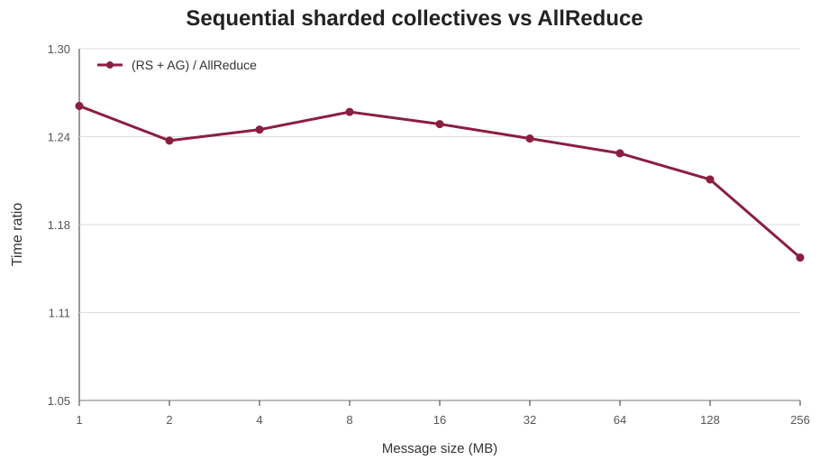

This result is useful because it separates two questions: `AllReduce` is the right fused primitive for replicated gradient synchronization, while `ReduceScatter` and `AllGather` are useful in sharded training because they avoid keeping full optimizer states, gradients, or parameters resident on every GPU.

## Connection to DDP, FSDP, and ZeRO

The collective experiments make the DDP/FSDP distinction concrete.

DDP stores complete model state on every GPU:

```text
GPU 0:
full parameters
full gradients
full optimizer states

GPU 1:
full parameters
full gradients
full optimizer states
```

During backward:

```text
gradient bucket
    ↓
AllReduce
    ↓
full synchronized gradient on every GPU
```

FSDP shards model state:

```text
GPU 0:
parameter shard 0
gradient shard 0
optimizer shard 0

GPU 1:
parameter shard 1
gradient shard 1
optimizer shard 1
```

During computation:

```text
before layer computation:
    AllGather parameter shards

after backward:
    ReduceScatter gradients
```

So the NCCL project explains the communication layer underneath the distributed-training project:

| High-level training method | Main collective pattern |
|---|---|
| DDP | Gradient `AllReduce`. |
| FSDP / ZeRO-3 forward | Parameter `AllGather`. |
| FSDP / ZeRO-3 backward | Gradient `ReduceScatter`. |
| Tensor parallel row-parallel layer | Output `AllReduce` or equivalent reduction. |
| Pipeline parallelism | Point-to-point activation and gradient transfers between stages. |

## Tensor Parallel Experiment

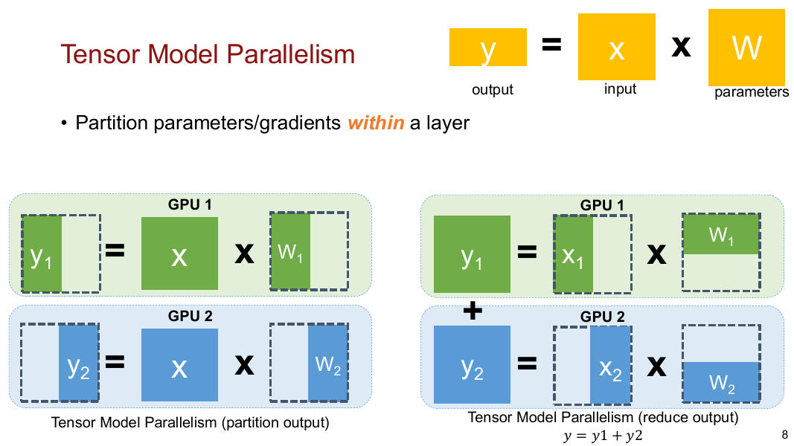

The tensor-parallel notebook is not just a benchmark. It implements a small Megatron-style tensor-parallel Transformer MLP block and compares it with an equivalent dense reference implementation.

The block structure is:

```text
LayerNorm
    ↓
Column Parallel Linear
    ↓
GELU
    ↓
Row Parallel Linear
    ↓
Residual Add
```

| Component | Parallelization strategy | Communication behavior |
|---|---|---|
| LayerNorm | Replicated/local | No collective needed |
| MLP `fc1` | Column parallel | Splits output features across GPUs |
| GELU | Local | Runs independently on each shard |
| MLP `fc2` | Row parallel | Requires output aggregation |
| Residual add | Local after aggregation | Uses the reconstructed output |

### Column Parallel Linear

A normal linear layer is:

```text
Y = X W
```

For an MLP expansion such as:

```text
W in R^{H x 4H}
```

column parallelism splits the output feature dimension:

```text
W = [W_0, W_1]
```

Each GPU computes:

```text
GPU 0: Y_0 = X W_0
GPU 1: Y_1 = X W_1
```

Each rank receives a shard of the output features. If the next operator can consume sharded activations, the code does not need to immediately `AllGather`. In the notebook, `ToyColumnParallelLinear` does:

```python
y_local = x @ self.weight
```

and only gathers when `gather_output=True`.

In the notation from the review notes:

```text
W = [W_1, W_2, ..., W_p]
Y_i = X W_i
```

The output feature dimension is partitioned. This reduces per-rank parameter memory and per-rank FLOPs for that layer, but it produces sharded output activations.

### Row Parallel Linear

The second linear layer splits the input feature dimension:

```text
W = [W_0
     W_1]
```

The input is already sharded:

```text
GPU 0 has X_0
GPU 1 has X_1
```

Each GPU computes a partial output:

```text
GPU 0: Y_0 = X_0 W_0
GPU 1: Y_1 = X_1 W_1
```

The complete output is:

```text
Y = Y_0 + Y_1
```

so the row-parallel layer needs:

```text
dist.all_reduce(y_partial, SUM)
```

In review-note notation:

```text
W = [W_1
     ...
     W_p]

Y = sum_i X_i W_i
```

The input feature dimension is partitioned. Each rank produces a partial output, and a reduction combines those partial outputs. Depending on the next operator, this reduction can be implemented with `AllReduce` or a sharded variant such as `ReduceScatter`.

### Why Column Then Row

The reason Megatron-style MLP uses column parallelism for the first projection and row parallelism for the second projection is communication placement.

After the column-parallel first layer:

```text
GPU 0: first half of intermediate features
GPU 1: second half of intermediate features
```

`GELU` is elementwise, so it runs locally on each shard:

```text
GELU requires no communication
```

The row-parallel second layer can directly consume the sharded intermediate features and only requires one reduction at the output boundary. This avoids a full `AllGather` between the two MLP linear layers.

| Check | Result |
|---|---:|
| World size | 2 |
| Input shape | `(8, 16)` |
| Output shape | `(8, 16)` |
| Max error vs dense reference | `0.00000012` |
| Mean error vs dense reference | `0.00000000` |

The notebook constructs both:

```text
ReferenceBlock
TensorParallelBlock
```

It slices the reference weights by rank, loads those slices into the tensor-parallel block, then compares output tensors. The small numerical error shows that the tensor-parallel decomposition reproduces the dense block while making the communication site explicit: the row-parallel output needs a reduction across ranks.

The central lesson is that tensor parallelism is not simply "split every tensor." The key is choosing compatible partition directions so adjacent operations can stay local and communication happens only where mathematically necessary.

### Megatron-Style Transformer TP

The review notes generalize the toy MLP pattern to Transformer blocks:

| Transformer component | Common TP mapping | Communication intuition |
|---|---|---|
| QKV projection | Column parallel | Each rank owns a shard of output features or heads. |
| Attention heads / intermediate activations | Local on shards when partitioning is compatible | Avoids gathering the full intermediate after every projection. |
| Attention output projection | Row parallel | Partial outputs must be reduced. |
| MLP gate/up projection | Column parallel | Expands hidden dimension into local shards. |
| Elementwise activation | Local | GELU/SwiGLU-style work does not need communication. |
| MLP down projection | Row parallel | Partial outputs are reduced back to the model hidden dimension. |

This is the Megatron-style idea:

```text
column-parallel projection
        ↓
local nonlinear or attention work
        ↓
row-parallel projection
        ↓
selected reduction boundary
```

Compatible partitions avoid full intermediate gathers after every linear layer. That is why the tensor-parallel experiment is useful even though it is small: it shows where communication is mathematically required and where it can be avoided.

There are also important limits:

- Attention heads must divide cleanly across tensor-parallel ranks.
- GQA/MQA can complicate KV-head placement when the number of KV heads is smaller than the tensor-parallel degree.
- Replicating KV heads may avoid cross-rank attention communication, but increases memory.
- Sequence parallelism can shard otherwise replicated sequence-dimension activations, but adds collectives around normalization and related operations.
- As tensor-parallel degree grows, local GEMMs shrink while collective frequency remains. TP works best inside a high-bandwidth domain with enough matrix work per rank.

## Pipeline Parallel Experiment

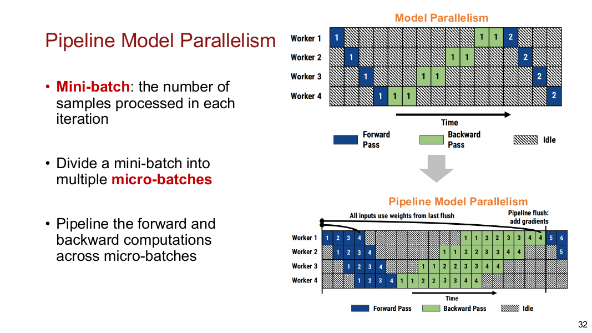

The pipeline-parallel notebook splits a toy model into two stages and compares ordinary stage execution with microbatch-based pipelining.

Pipeline parallelism differs from tensor parallelism:

```text
Tensor Parallel:
split one layer or tensor across GPUs

Pipeline Parallel:
place different layers on different GPUs
```

The toy model is split as:

```text
GPU 0: Stage 0
Linear -> ReLU -> Linear -> ReLU

GPU 1: Stage 1
Linear -> ReLU -> Linear
```

### No-Microbatch Baseline

The full-batch execution order is:

```text
GPU 0 Stage 0 forward
        ↓
transfer activation GPU 0 -> GPU 1
        ↓
GPU 1 Stage 1 forward
        ↓
loss
        ↓
backward
        ↓
optimizer update
```

This creates large bubbles:

```text
Stage 0 works -> Stage 1 idle
Stage 1 works -> Stage 0 mostly idle
```

Simply placing layers on different GPUs does not automatically improve throughput.

### Microbatch Version

The notebook also runs a microbatch version:

```text
batch size = 32
num microbatches = 4
microbatch size = 8
```

Each microbatch flows through the stages and contributes gradients:

```text
zero_grad()
MB0 backward
MB1 backward
MB2 backward
MB3 backward
optimizer.step()
```

The microbatch loss is divided by the number of microbatches:

```text
loss_mb = criterion(...) / num_microbatches
```

so the accumulated gradient keeps approximately the same scale as the full-batch average gradient.

In this notebook, microbatching has two meanings:

| Role | Meaning |
|---|---|
| Gradient accumulation | Several backward passes occur before one optimizer step. |
| Pipeline scheduling unit | Smaller pieces of work can move through different stages. |

Important limitation: this is an educational microbatch version, not a fully optimized GPipe or 1F1B scheduler. The code still largely executes one microbatch through the stages before moving to the next one, so it should not be claimed as full pipeline overlap.

An optimized pipeline would overlap stages like:

```text
Time 1:
Stage 0 -> MB0

Time 2:
Stage 0 -> MB1
Stage 1 -> MB0

Time 3:
Stage 0 -> MB2
Stage 1 -> MB1
```

This fill, steady-state, and drain schedule is what reduces pipeline bubbles in realistic multi-stage training.

### Bubble Fraction and Pipeline Schedules

For `p` pipeline stages and `m` microbatches, a simple fill/drain bubble fraction is approximately:

```text
bubble ~= (p - 1) / (m + p - 1)
```

Another common large-`m` approximation is:

```text
bubble ~= (p - 1) / m
```

The exact denominator depends on the schedule definition, so it should be stated when reporting pipeline efficiency. The qualitative trend is stable: more microbatches reduce bubbles, but they also increase scheduling overhead and can make local GEMMs too small.

The review notes distinguish common schedules:

| Schedule | How it works | Strength | Limitation |
|---|---|---|---|
| GPipe | Run all microbatch forwards, then all backwards. | Simple and easy to reason about. | Can retain many outstanding activations; often needs checkpointing. |
| 1F1B | Warm up, then alternate one forward and one backward microbatch in steady state, then cool down. | Starts backward earlier and limits in-flight activations closer to pipeline depth. | Does not remove bubbles or stage imbalance. |
| Interleaved 1F1B | Assigns multiple virtual chunks per rank. | Can reduce bubble fraction further. | More scheduling and communication complexity. |

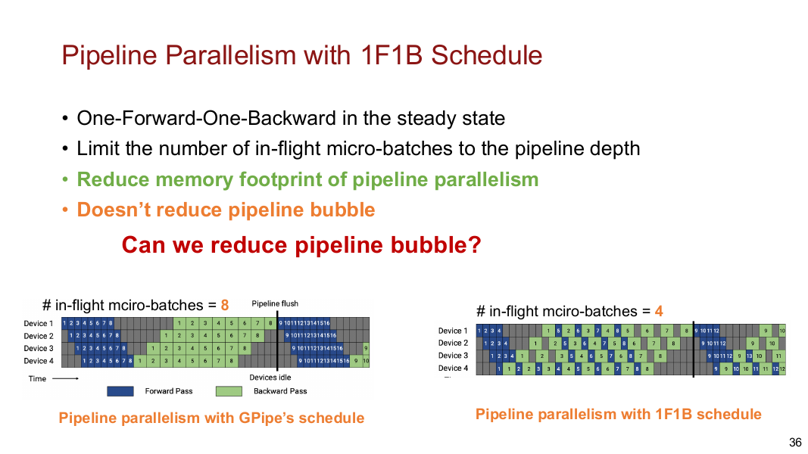

The slowest stage limits throughput. Unequal layer cost, inter-stage communication, sequence-length variation, and MoE routing can create imbalance. Pipeline degree, microbatch count, stage placement, activation memory, and inter-stage bandwidth must be tuned together.

| Mode | Observed step time | Notes |
|---|---:|---|
| No microbatch, first step | 0.3275 s | Includes setup/warmup overhead |
| No microbatch, later step | 0.0030 s | Simple two-stage execution after warmup |
| 4 microbatches, first step | 0.0740 s | Pipeline schedule starts to overlap stage work |
| 4 microbatches, steady state | 0.0070-0.0071 s | More scheduling overhead than no-microbatch toy case, but exposes pipeline behavior |

The small toy model is too tiny to show a throughput win from pipelining, but it makes the scheduling tradeoff visible. Microbatching reduces idle time in realistic multi-stage models, while 1F1B limits the number of in-flight microbatches and reduces pipeline memory pressure.

## Combining DP, TP, PP, and FSDP

The review notes summarize three-dimensional parallelism as:

```text
N_GPU = N_DP * N_TP * N_PP
```

Every rank can belong to:

```text
a DP group
a TP group
a pipeline stage
```

The roles are different:

| Axis | Partitioned object | Main communication | Main objective |
|---|---|---|---|
| DP | Samples | Gradient reduction | Data throughput. |
| TP | Tensors within a layer | `AllReduce`, `ReduceScatter`, `AllGather` | Layer capacity and compute sharing. |
| PP | Consecutive layers | Point-to-point activations and gradients | Model depth capacity. |
| FSDP | Data-parallel model states | Parameter gather, gradient scatter | Remove DP state redundancy. |

For example, with 64 GPUs:

```text
N_TP = 4
N_PP = 4
N_DP = 4

N_GPU = 4 * 4 * 4 = 64
```

This means:

```text
4 GPUs cooperate within each layer through tensor parallelism.
4 pipeline stages cover the model depth.
4 data-parallel replicas process different data.
```

TP is usually kept inside the fastest interconnect domain because it communicates inside layers. PP spans groups of layers. The remaining capacity is often used for DP. FSDP can be used along the data-parallel axis to reduce replicated model-state memory.

A practical global-batch formula may look like:

```text
B_global = N_DP * B_micro * m * K_outer
```

where `m` is the number of pipeline microbatches and `K_outer` is an outer accumulation count. The warning from the notes is important: pipeline microbatches often already implement accumulation, so `m` must not be multiplied twice if the framework's configured accumulation count already includes it. The safest definition is always:

```text
number of samples or tokens that contribute to one optimizer update
```

This is why the NCCL project matters for large-model systems: each parallelism axis maps to different collective or point-to-point communication. Choosing DP, TP, PP, FSDP, or a combination is really choosing where memory is saved, where compute is split, and where communication appears on the critical path.

## Main Conclusions

The four experiments form a complete path from raw communication to model parallelism.

| Level | Experiment | Main conclusion |
|---|---|---|
| Communication performance | AllReduce sweep | Small messages are latency-bound; large messages become bandwidth-bound and saturate around 4 GB/s on the 2 x T4 setup. |
| Collective primitives | AllReduce vs ReduceScatter/AllGather | `AllReduce` is natural for DDP; `ReduceScatter` and `AllGather` are useful for sharded training state. |
| Tensor parallelism | Megatron-style MLP | Correct partition directions avoid unnecessary intermediate gathers and require one output reduction. |
| Pipeline parallelism | Two-stage toy model | Layer placement alone does not guarantee speedup; microbatch scheduling is needed to reduce bubbles. |

Conclusion 1: small messages are latency-limited.

```text
small message -> low bandwidth -> nearly fixed communication time
```

This explains why too-small gradient buckets, too-frequent synchronization, and missing `no_sync()` during gradient accumulation can hurt training performance.

Conclusion 2: large messages become bandwidth-limited.

```text
larger message -> higher effective bandwidth -> plateau
```

In the 2 x Tesla T4 setup, the AllReduce bus bandwidth reaches roughly `4 GB/s` for large messages. Larger gradient buckets can better utilize bandwidth, but may also start later and reduce overlap with backward computation.

Conclusion 3: DDP and FSDP use different collective patterns.

```text
DDP:
gradient AllReduce

FSDP / ZeRO:
parameter AllGather
gradient ReduceScatter
```

FSDP lowers memory residency but adds more communication phases and more complex timing.

Conclusion 4: tensor parallelism is about communication placement.

The useful design is:

```text
fc1 column parallel
GELU local
fc2 row parallel
one AllReduce at the end
```

This is more efficient than gathering after every layer because adjacent operations use compatible sharding.

Conclusion 5: pipeline parallelism is about scheduling.

Simply splitting layers across GPUs creates bubbles. Efficient pipeline parallelism needs microbatch scheduling with fill, steady state, and drain phases so that multiple stages work at the same time.

## Result Analysis

The experiments show three main communication regimes. First, small collectives are latency-bound: bytes-scale AllReduce calls spend most of their time in launch, synchronization, and protocol overhead. Second, large collectives are bandwidth-bound: AllReduce reaches roughly 4 GB/s bus bandwidth on the 2 x T4 environment and stays flat from tens of MB through 512 MB. Third, sharded collectives change the memory and ownership model rather than simply replacing AllReduce as a faster primitive.

`ReduceScatter` and `AllGather` are each cheaper than a full AllReduce because each primitive only produces a shard or reconstructs from shards. However, running them sequentially to emulate AllReduce is 1.15x-1.26x slower in this setup because two collectives introduce extra launch and synchronization overhead. In FSDP/ZeRO, the benefit comes from using these collectives at the right points in the training step so that parameters, gradients, and optimizer states can stay sharded instead of fully replicated.

The tensor-parallel and pipeline-parallel notebooks connect these low-level collectives to model execution. Tensor parallelism inserts reductions at layer boundaries, while pipeline parallelism trades larger scheduling complexity for the ability to partition a model across stages. Together, the project builds a practical mental model for choosing between replicated data parallel training, sharded data parallel training, tensor parallelism, and pipeline parallelism.

The most important interview framing is:

```text
NCCL collectives are not just benchmark numbers.
They define the cost model behind DDP, FSDP, tensor parallelism, and pipeline parallelism.
```

When a training system is slow, the right diagnosis depends on where communication appears:

| Symptom | Likely communication issue |
|---|---|
| Many tiny collective calls | Latency and launch overhead dominate. |
| Large gradients but poor overlap | Buckets may be too large or ready too late. |
| FSDP slower than DDP | Extra AllGather/ReduceScatter overhead is not offset by useful larger workload shape. |
| Tensor parallel slowdown | Local GEMMs may be too small, or collectives appear too frequently. |
| Pipeline stages idle | Microbatch schedule has large bubbles or insufficient overlap. |

[Back to Home](../index.md)
