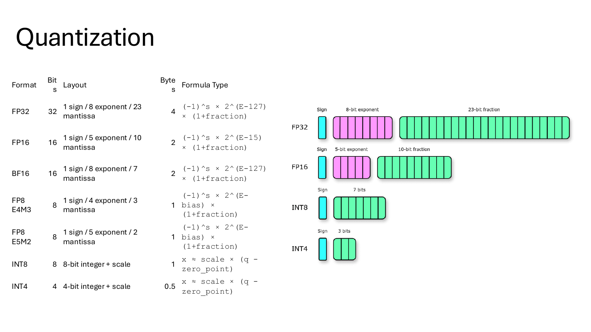
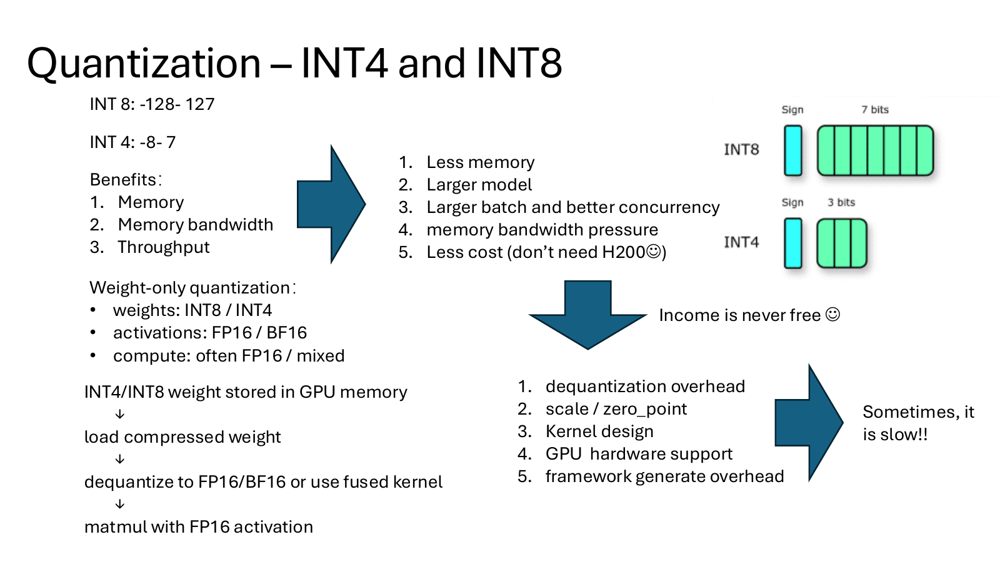
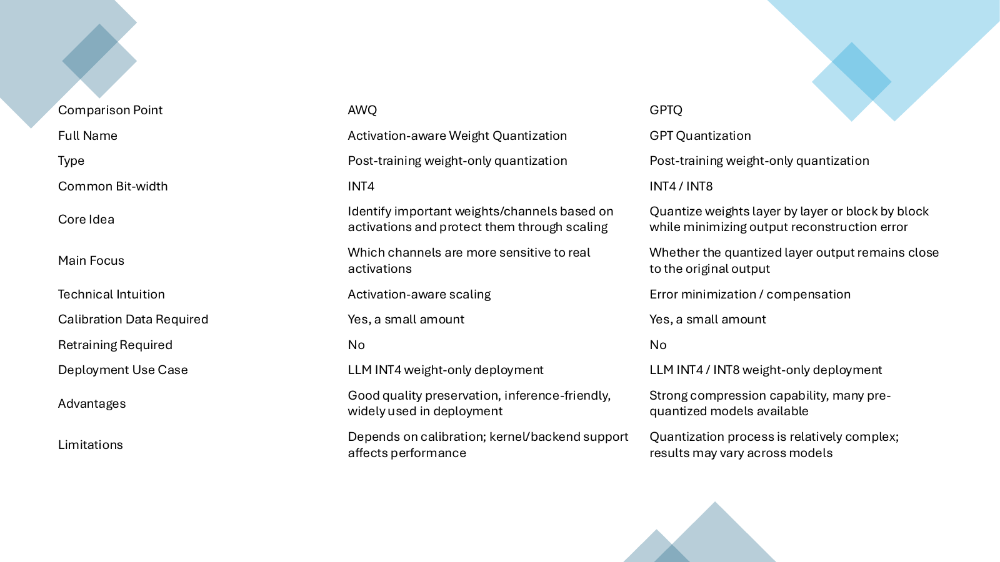
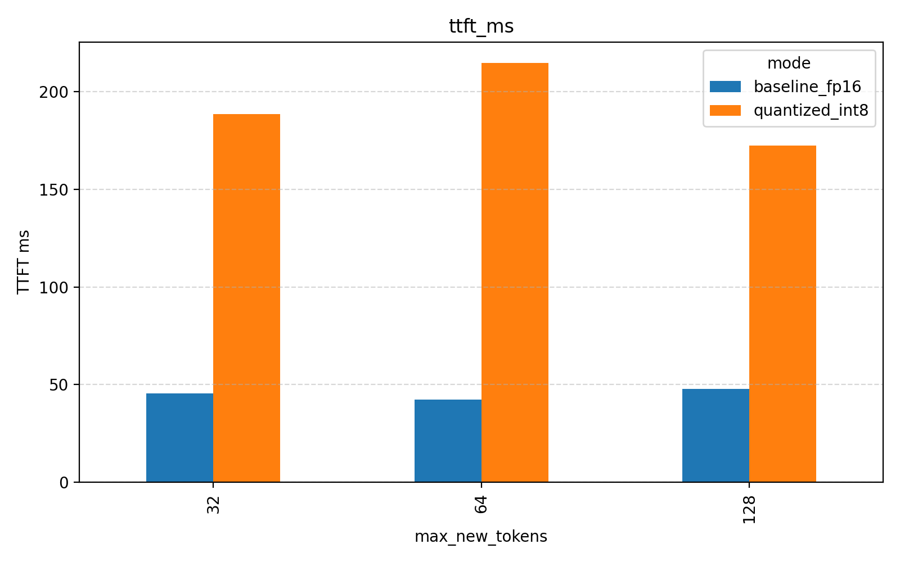
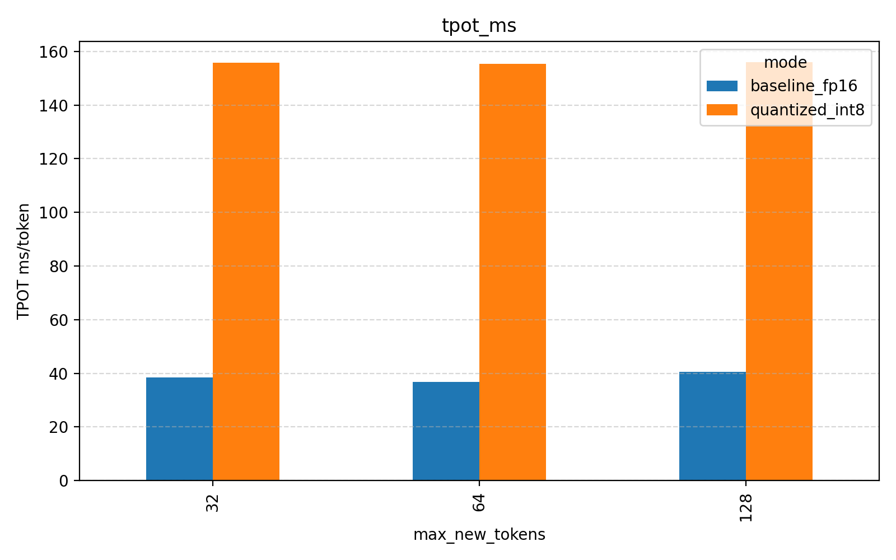
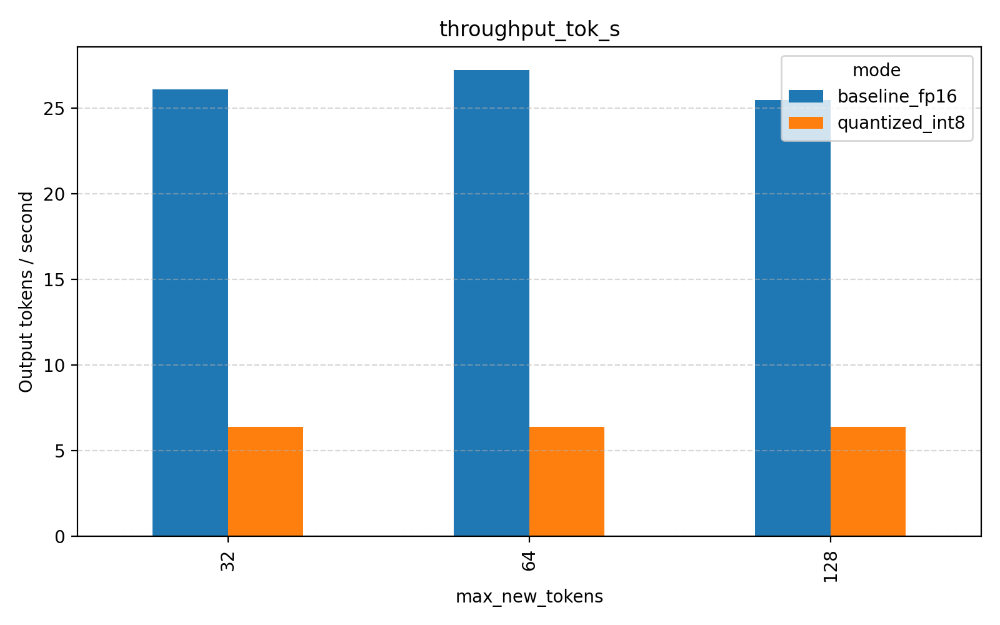
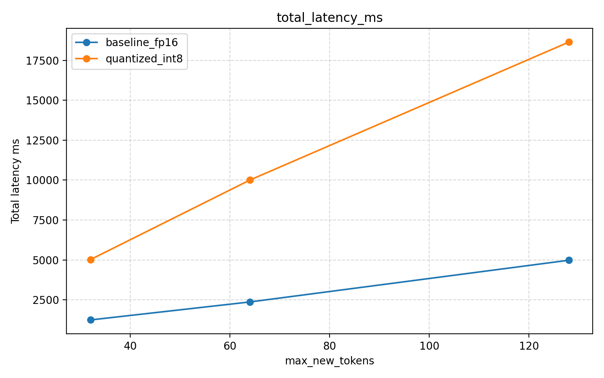
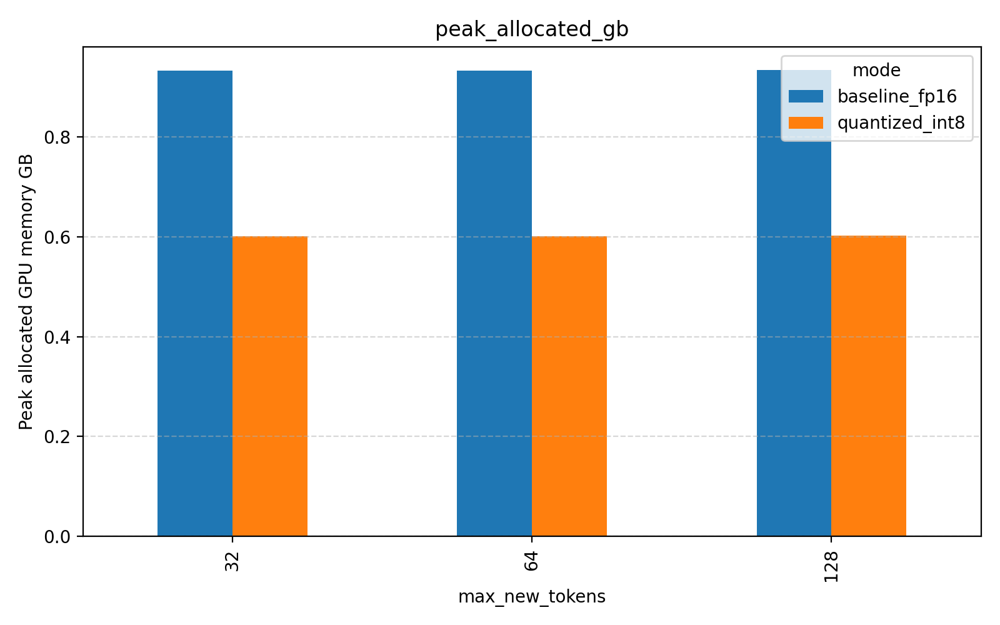
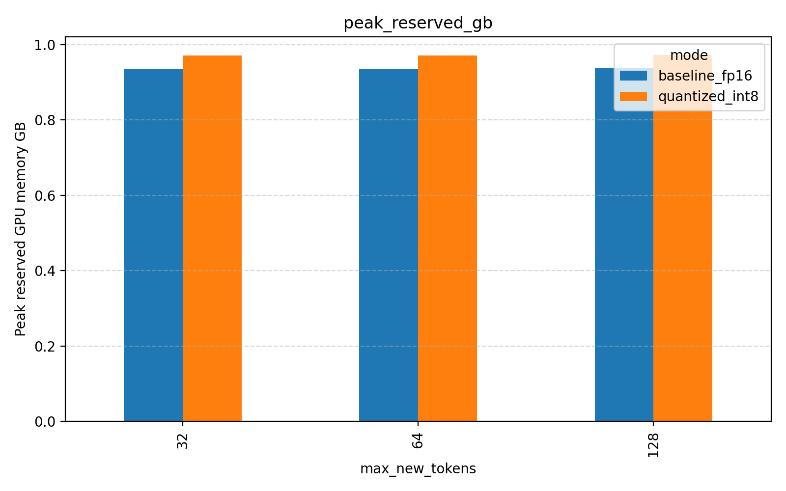

# LLM Quantization Benchmark and Inference Optimization

Built an LLM quantization benchmark pipeline to compare FP16 inference with INT8 weight quantization under consistent prompt, output-length, runtime, and GPU settings, then analyzed when quantization helps deployment and when it slows inference down.

- Project page: [LLM Quantization Benchmark and Inference Optimization](https://licheng2018.github.io/projects/quantization.html)
- Source code: [licheng2018/Quantization-Deployment-Basics](https://github.com/licheng2018/Quantization-Deployment-Basics)
- Result data: [benchmark-results.csv](../assets/projects/quantization/benchmark-results.csv)

## Project Scope

- Implemented a Hugging Face / Transformers benchmark for FP16 baseline inference and `bitsandbytes` INT8 quantized inference.
- Measured time-to-first-token, total latency, time-per-output-token, throughput, peak allocated GPU memory, and peak reserved GPU memory.
- Swept output lengths across 32, 64, and 128 `max_new_tokens` with multiple prompts.
- Logged generated text for manual output-quality review instead of treating latency alone as the deployment objective.
- Connected benchmark results with quantization concepts from FP32, FP16, BF16, FP8, INT8, INT4, AWQ, and GPTQ.

## Quantization Background

Quantization reduces the precision used to store model values. Lower precision can reduce memory footprint and memory bandwidth pressure, but inference speed depends on kernel support, dequantization cost, hardware support, and whether the workload is memory-bound or compute/overhead-bound.

| Format | Storage intuition | Typical LLM use | Main tradeoff |
|---|---|---|---|
| FP32 | 4 bytes/value | Reference precision, training/debugging | Highest memory cost |
| FP16 / BF16 | 2 bytes/value | Common inference/training precision | Good GPU support, lower memory than FP32 |
| FP8 | 1 byte/value | Newer low-precision training/inference paths | Requires strong hardware/kernel support |
| INT8 | 1 byte/value plus scales | Weight-only or mixed inference quantization | Can reduce model memory, but may add dequantization overhead |
| INT4 | 0.5 byte/value plus scales | Aggressive LLM compression | Strong memory savings, higher quality/kernel sensitivity |

## AWQ vs GPTQ

| Method | Full name | Core idea | Calibration | Deployment intuition |
|---|---|---|---|---|
| AWQ | Activation-aware Weight Quantization | Protect important weights/channels based on activation sensitivity | Yes, small calibration set | Inference-friendly INT4 weight-only deployment with good quality preservation |
| GPTQ | GPT Quantization | Quantize weights layer by layer while minimizing output reconstruction error | Yes, small calibration set | Strong compression, many pre-quantized model variants, but quantization process is more complex |

## Benchmark Setup

| Item | Configuration |
|---|---|
| GPU | Tesla T4, 15 GB |
| CUDA / driver context | CUDA 12.8 compiler, NVIDIA driver reporting CUDA 13.0 runtime capability |
| Model | `Qwen/Qwen2.5-0.5B-Instruct` |
| Baseline | FP16 inference |
| Quantized mode | INT8 via `bitsandbytes` / Transformers |
| Output sweep | 32, 64, 128 `max_new_tokens` |
| Prompt set | 4 short prompts, 24 total result rows across modes and lengths |
| Metrics | TTFT, total latency, TPOT, throughput, peak allocated memory, peak reserved memory, output text |

## Overall Result

The INT8 configuration reduced peak allocated GPU memory, but it was slower in this experiment. This is an important deployment result: quantization is not automatically a latency optimization unless the backend has efficient fused kernels and the workload benefits from reduced memory traffic.

| Mode | TTFT | Total latency | TPOT | Throughput | Peak allocated memory | Peak reserved memory |
|---|---:|---:|---:|---:|---:|---:|
| FP16 baseline | 45.23 ms | 2,860.48 ms | 38.64 ms/token | 26.28 tok/s | 0.933 GB | 0.936 GB |
| INT8 quantized | 192.01 ms | 11,220.72 ms | 155.70 ms/token | 6.40 tok/s | 0.601 GB | 0.971 GB |
| INT8 / FP16 ratio | 4.25x | 3.92x | 4.03x | 0.24x | 0.64x | 1.04x |

## Output-Length Sweep

| `max_new_tokens` | Mode | TTFT | Total latency | TPOT | Throughput | Peak allocated memory |
|---:|---|---:|---:|---:|---:|---:|
| 32 | FP16 | 45.62 ms | 1,238.32 ms | 38.47 ms/token | 26.11 tok/s | 0.932 GB |
| 32 | INT8 | 188.73 ms | 5,019.39 ms | 155.83 ms/token | 6.39 tok/s | 0.601 GB |
| 64 | FP16 | 42.23 ms | 2,365.46 ms | 36.88 ms/token | 27.24 tok/s | 0.932 GB |
| 64 | INT8 | 214.80 ms | 10,002.26 ms | 155.36 ms/token | 6.40 tok/s | 0.601 GB |
| 128 | FP16 | 47.83 ms | 4,977.65 ms | 40.57 ms/token | 25.50 tok/s | 0.934 GB |
| 128 | INT8 | 172.50 ms | 18,640.51 ms | 155.92 ms/token | 6.41 tok/s | 0.602 GB |

The FP16 baseline sustained roughly 25-27 tokens/s across the sweep. The INT8 configuration stayed around 6.4 tokens/s, which indicates that the quantized path was dominated by overhead or slower kernels rather than by raw memory movement savings.

## Latency And Memory Figures

Peak allocated memory dropped from about 0.933 GB to 0.601 GB, a 35.5% reduction. Peak reserved memory did not drop because PyTorch/CUDA memory reservation reflects allocator behavior, fragmentation, and cached blocks, not only live tensor allocation.

## What The Benchmark Shows

| Finding | Evidence | Deployment implication |
|---|---|---|
| INT8 saves live GPU allocation | Peak allocated memory ratio is 0.64x vs FP16 | Useful when fitting a model into limited memory or increasing room for KV cache/batch size |
| INT8 is slower in this setup | TPOT is 155.70 ms/token vs 38.64 ms/token | Quantized inference needs efficient kernels; otherwise dequantization and framework overhead dominate |
| Longer outputs expose decode cost | INT8 TPOT is roughly flat around 155 ms/token across output lengths | Decode-phase per-token overhead matters more as generation length grows |
| Reserved memory can hide savings | Reserved memory is slightly higher for INT8 | Use allocated memory plus allocator-aware profiling, not reserved memory alone |
| Quality still needs review | Outputs are logged with `quality_note = manual review needed` | Quantization evaluation should include correctness/quality checks, not only speed |

## Result Analysis

This project demonstrates the core quantization tradeoff in a concrete serving-style benchmark. INT8 reduced live model memory, which is the expected benefit of lower-precision storage. However, the INT8 path was about 4x slower in TTFT and TPOT than FP16 on this T4 experiment. The likely reason is that the tested stack paid extra cost for dequantization, scale handling, and non-ideal kernel dispatch, while the FP16 path used better-supported GPU execution.

The result does not mean quantization is ineffective. It means quantization has to be matched with the right model size, batch/concurrency regime, kernel backend, and hardware. For larger models or memory-constrained deployments, the memory reduction can enable workloads that FP16 cannot fit, or allow larger KV cache and higher concurrency. For small models on hardware with strong FP16 support, weight-only INT8 can be slower if the runtime cannot exploit the compressed representation efficiently.

The practical takeaway is to evaluate quantization with both system metrics and output quality: memory footprint, TTFT, TPOT, throughput, p95 latency, reserved vs allocated memory, and qualitative answer consistency all matter before choosing FP16, INT8, AWQ, GPTQ, or more aggressive INT4 deployment.

[Back to Home](../index.md)
