# LLM Quantization Benchmark and Inference Optimization

Built an LLM quantization benchmark pipeline to compare FP16 inference with INT8 weight quantization under consistent prompt, output-length, runtime, and GPU settings, then analyzed when quantization helps deployment and when it slows inference down.

- Source code: [github](https://github.com/licheng2018/Quantization-Deployment-Basics)
- Result data: [benchmark-results.csv](../assets/projects/quantization/benchmark-results.csv)

## Contents

| Area | Jump to sections |
|---|---|
| Overview | [Project Scope](#project-scope) · [Project Positioning](#project-positioning) · [Benchmark Design](#benchmark-design) |
| Quantization Fundamentals | [Decode Bottleneck Motivation](#decode-bottleneck-motivation) · [Quantization Background](#quantization-background) · [Numeric Formats From The Slides](#numeric-formats-from-the-slides) · [Weight-Only INT4/INT8 Quantization](#weight-only-int4int8-quantization) · [Mixed Precision and Salient Weights](#mixed-precision-and-salient-weights) · [AWQ vs GPTQ](#awq-vs-gptq) |
| Results | [Benchmark Setup](#benchmark-setup) · [Overall Result](#overall-result) · [Output-Length Sweep](#output-length-sweep) · [Latency And Memory Figures](#latency-and-memory-figures) |
| Review | [Why INT8 Was Slower In This Benchmark](#why-int8-was-slower-in-this-benchmark) · [What The Benchmark Shows](#what-the-benchmark-shows) · [Connection To Serving Benchmark](#connection-to-serving-benchmark) · [Result Analysis](#result-analysis) · [Interview Summary](#interview-summary) |

## Project Scope

- Implemented a Hugging Face / Transformers benchmark for FP16 baseline inference and `bitsandbytes` INT8 quantized inference.
- Measured time-to-first-token, total latency, time-per-output-token, throughput, peak allocated GPU memory, and peak reserved GPU memory.
- Swept output lengths across 32, 64, and 128 `max_new_tokens` with multiple prompts.
- Logged generated text for manual output-quality review instead of treating latency alone as the deployment objective.
- Connected benchmark results with quantization concepts from FP32, FP16, BF16, FP8, INT8, INT4, AWQ, and GPTQ.

## Project Positioning

The core of this project is a controlled inference comparison:

```text
same LLM
same GPU
same prompts
same output lengths
same benchmark loop
        ↓
FP16 baseline vs INT8 quantized inference
```

The main question is:

```text
Does quantization automatically make inference faster?
```

The experiment is intentionally designed to avoid unfair comparisons such as testing FP16 with one prompt length and INT8 with another. The FP16 model is the reference baseline, and every INT8 measurement is compared against the same workload.

The project measures deployment behavior, not only model compression:

| Dimension | Why it matters |
|---|---|
| TTFT | Whether quantization affects first-token responsiveness. |
| TPOT | Whether decode-stage generation becomes faster or slower. |
| Total latency | Whether the full response improves. |
| Throughput | Whether output-token rate improves. |
| Peak GPU memory | Whether quantization reduces live GPU allocation. |
| Generated text | Whether output quality needs manual review. |

## Benchmark Design

The most complete experiment is implemented in `quant_benchmark_skeleton.ipynb`.

| Component | Setting |
|---|---|
| Model | `Qwen/Qwen2.5-0.5B-Instruct` |
| GPU | Tesla T4 |
| Baseline | FP16 |
| Quantized mode | INT8 with `bitsandbytes` |
| Output lengths | 32, 64, 128 `max_new_tokens` |
| Warmup | 1 run |
| Measured runs | 3 runs per configuration |
| Prompt set | 4 prompts |

The FP16 baseline is loaded with:

```python
AutoModelForCausalLM.from_pretrained(
    model_name,
    torch_dtype=torch.float16,
    device_map="auto"
)
```

The INT8 model is loaded through `bitsandbytes`:

```python
bnb_config = BitsAndBytesConfig(
    load_in_8bit=True
)

model = AutoModelForCausalLM.from_pretrained(
    model_name,
    quantization_config=bnb_config,
    device_map="auto"
)
```

The benchmark uses fixed prompts, including prompts such as:

```text
Explain what quantization means for LLM inference in simple terms.
Why can quantization reduce GPU memory usage?
```

For each precision mode:

```text
4 prompts
× 3 output lengths
× 3 measured runs
```

The repeated runs are averaged for the summary tables.

The benchmark records:

| Metric | Definition |
|---|---|
| TTFT | `first_token_time - start_time` |
| Total latency | Time from request start to completed generation. |
| TPOT | `(total_latency_sec - ttft_sec) / (generated_tokens - 1)` |
| Throughput | Generated tokens per second. |
| Peak allocated memory | `torch.cuda.max_memory_allocated()` after resetting peak stats. |
| Output quality note | Generated text is saved for manual qualitative review. |

The quality evaluation is intentionally conservative. The current project saves generated text with a note such as `manual review needed`; it does not claim a full perplexity, MMLU, or task-accuracy evaluation.

## Decode Bottleneck Motivation

The quantization slides start from the decode problem: inference is not only a question of storing model weights. Decode repeatedly executes small steps, reads cached state, launches kernels, and streams one token at a time.

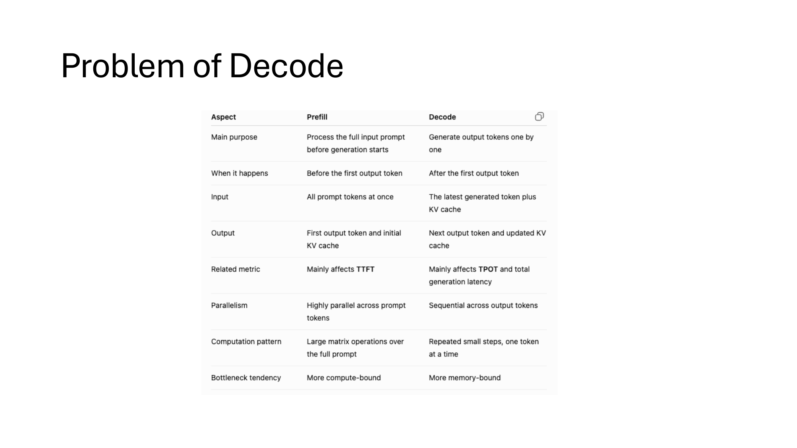

Quantization can reduce model weight memory and memory bandwidth pressure, but decode latency also depends on kernel dispatch, dequantization, KV-cache reads, batch/concurrency, and framework overhead.

## Quantization Background


Quantization reduces the precision used to store model values. Lower precision can reduce memory footprint and memory bandwidth pressure, but inference speed depends on kernel support, dequantization cost, hardware support, and whether the workload is memory-bound or compute/overhead-bound.

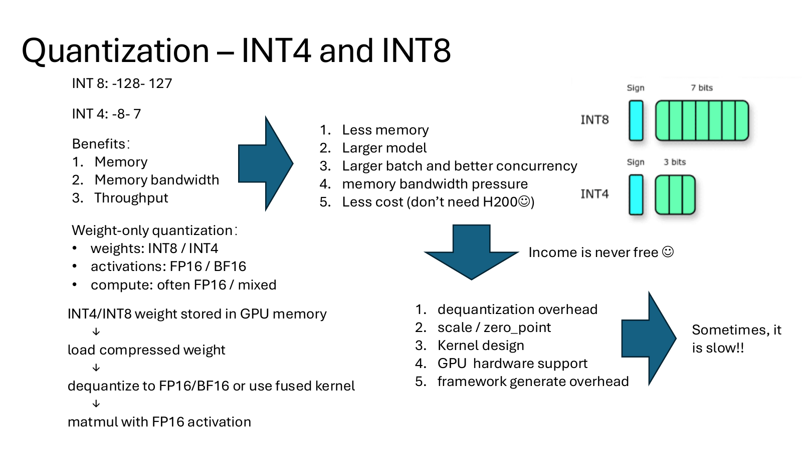

| Format | Storage intuition | Typical LLM use | Main tradeoff |
|---|---|---|---|
| FP32 | 4 bytes/value | Reference precision, training/debugging | Highest memory cost |
| FP16 / BF16 | 2 bytes/value | Common inference/training precision | Good GPU support, lower memory than FP32 |
| FP8 | 1 byte/value | Newer low-precision training/inference paths | Requires strong hardware/kernel support |
| INT8 | 1 byte/value plus scales | Weight-only or mixed inference quantization | Can reduce model memory, but may add dequantization overhead |
| INT4 | 0.5 byte/value plus scales | Aggressive LLM compression | Strong memory savings, higher quality/kernel sensitivity |

## Numeric Formats From The Slides

The PDF summarizes the numerical formats used in LLM deployment:

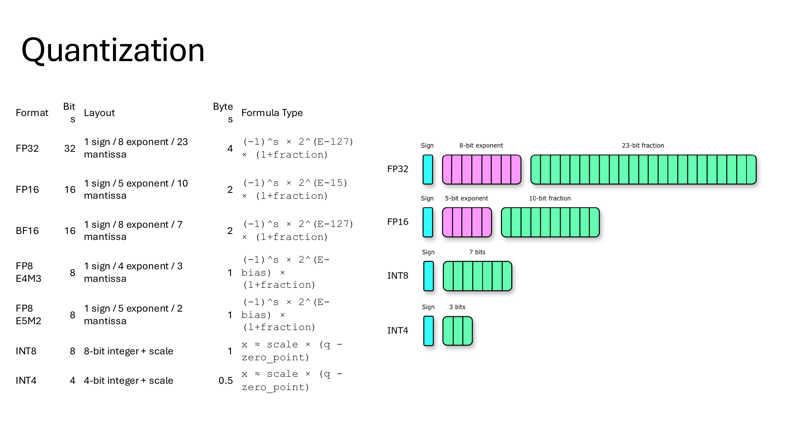

FP32 uses 4 bytes per value and provides high precision and range. FP16 uses 2 bytes and is widely supported on GPUs, but its smaller exponent range can cause overflow or underflow. BF16 also uses 2 bytes but keeps an FP32-like exponent range, making it more robust for training and some inference paths.

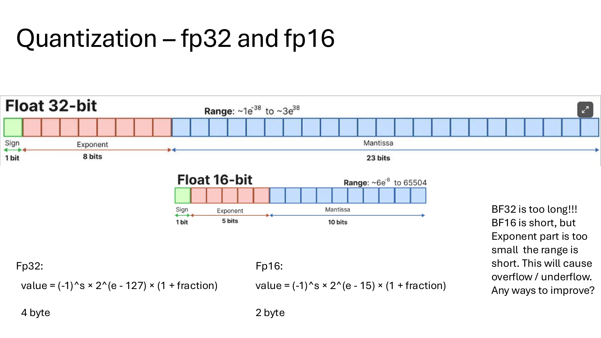

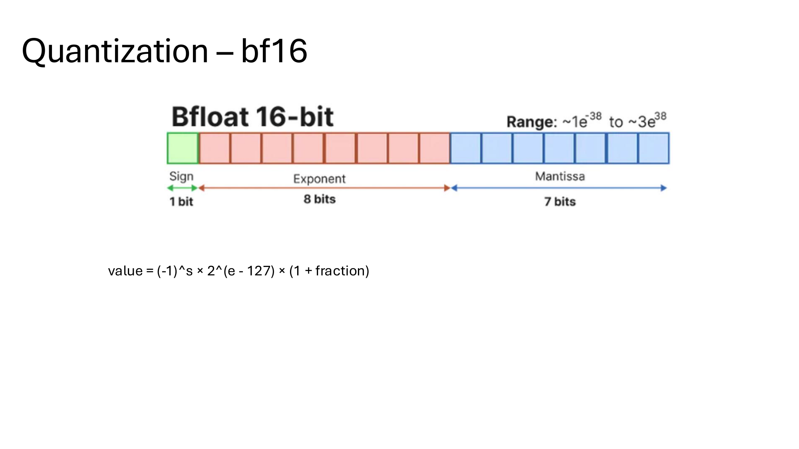

The important deployment distinction is:

```text
storage dtype
compute dtype
accumulation dtype
output dtype
```

These may differ. A model can store weights in INT8 or INT4 while using FP16/BF16 activations and higher-precision accumulation.

## Weight-Only INT4/INT8 Quantization

The slides emphasize weight-only quantization:

```text
weights:      INT8 / INT4
activations:  FP16 / BF16
compute:      often FP16 / mixed precision
```

The runtime path is:

```text
INT4/INT8 weights stored in GPU memory
        ↓
load compressed weights
        ↓
load scale / zero-point metadata
        ↓
dequantize to FP16/BF16 or use fused kernel
        ↓
matmul with FP16/BF16 activations
```

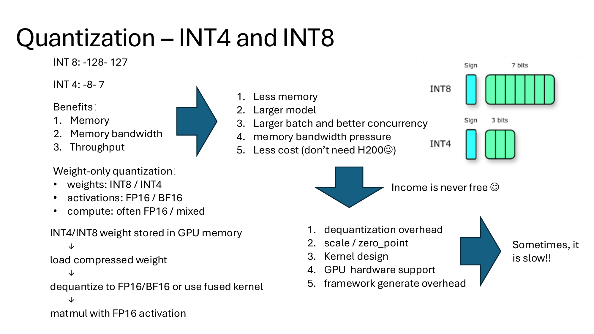

The expected benefits are:

- Lower weight memory footprint.
- Lower memory bandwidth pressure for weight reads.
- Ability to fit larger models.
- More room for KV cache, larger batch, or higher concurrency.
- Lower hardware cost if a smaller GPU can serve the model.

The costs are:

- Dequantization overhead.
- Scale and zero-point metadata.
- Kernel complexity.
- Dependence on GPU hardware support.
- Framework overhead in `generate()` and model dispatch.

This is why lower precision is not automatically faster.

## Mixed Precision and Salient Weights

The slides also introduce the idea that not all weights are equally important. Keeping a small fraction of salient weights or channels in higher precision can preserve quality better than quantizing everything uniformly.

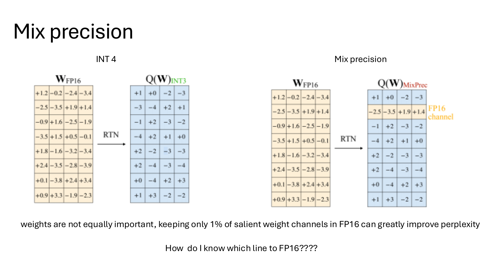

This is the motivation behind activation-aware or error-aware quantization methods: protect numerically sensitive parts of the model while compressing the rest.

## AWQ vs GPTQ


| Method | Full name | Core idea | Calibration | Deployment intuition |
|---|---|---|---|---|
| AWQ | Activation-aware Weight Quantization | Protect important weights/channels based on activation sensitivity | Yes, small calibration set | Inference-friendly INT4 weight-only deployment with good quality preservation |
| GPTQ | GPT Quantization | Quantize weights layer by layer while minimizing output reconstruction error | Yes, small calibration set | Strong compression, many pre-quantized model variants, but quantization process is more complex |

AWQ uses real activation statistics to identify important weights or channels and protect them through scaling. Its intuition is that a small number of salient channels can strongly affect output quality.

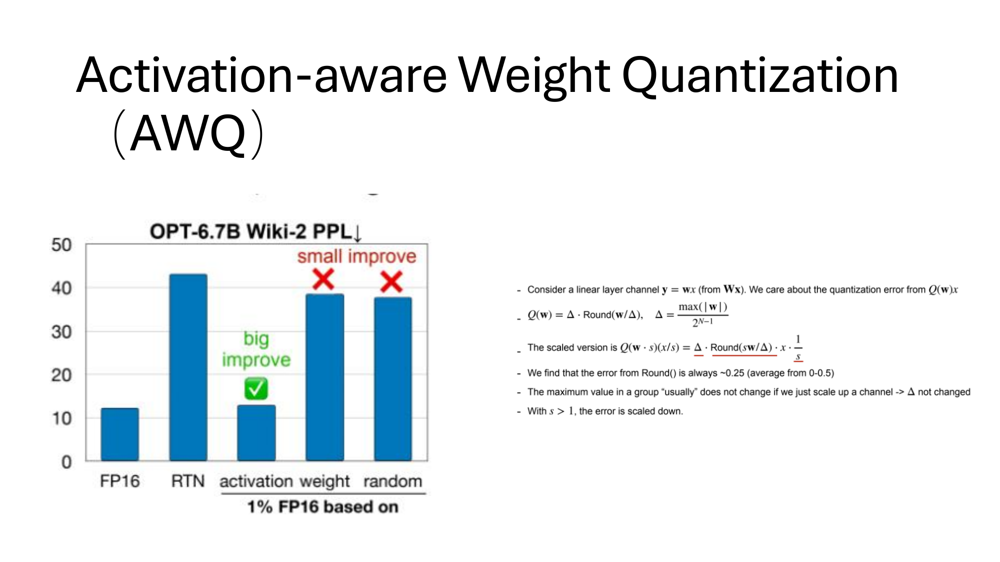

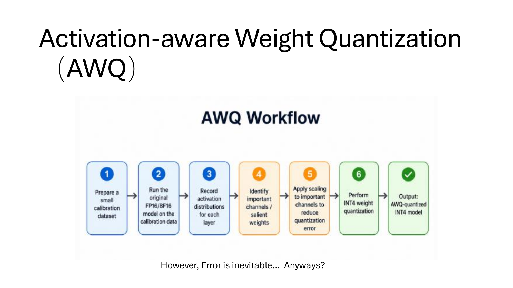

GPTQ quantizes weights layer by layer or block by block while minimizing reconstruction error. The intuition is that small weight-level errors may be acceptable if the layer's output remains close enough to the original output.

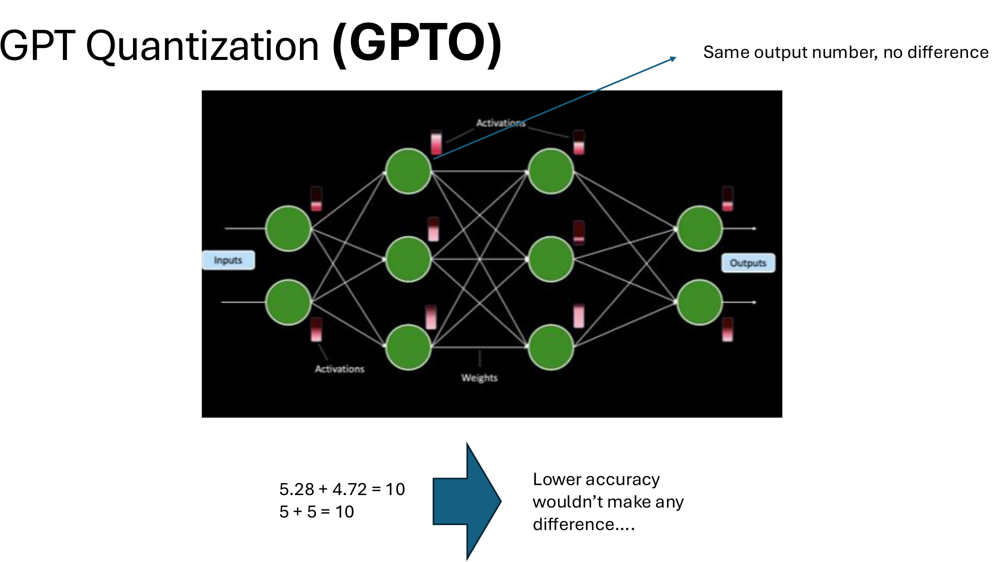

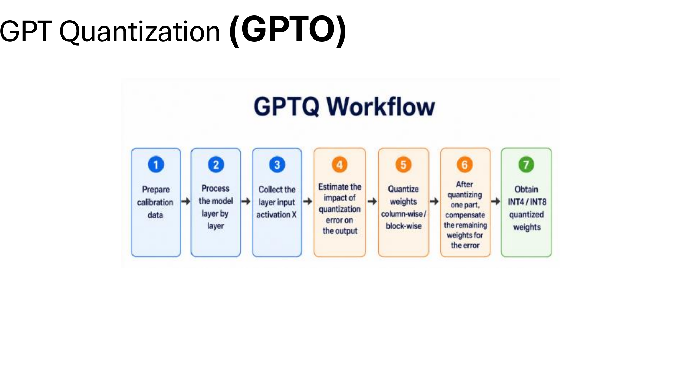

The PDF comparison table is included below:

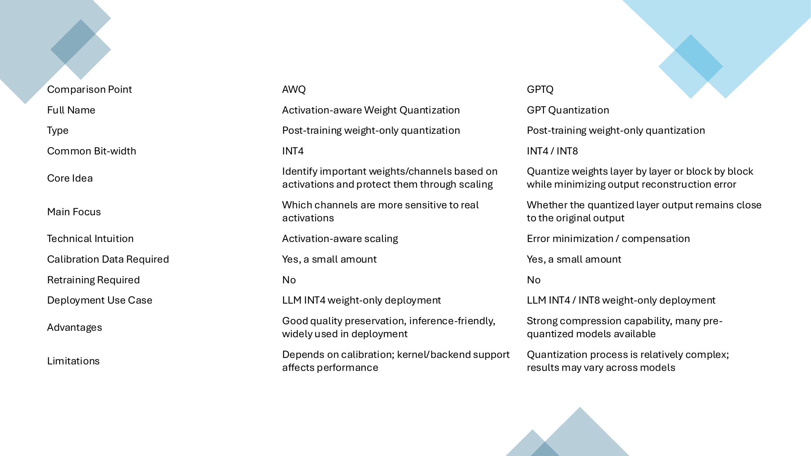

## Benchmark Setup

| Item | Configuration |
|---|---|
| GPU | Tesla T4, 15 GB |
| CUDA / driver context | CUDA 12.8 compiler, NVIDIA driver reporting CUDA 13.0 runtime capability |
| Model | `Qwen/Qwen2.5-0.5B-Instruct` |
| Baseline | FP16 inference |
| Quantized mode | INT8 via `bitsandbytes` / Transformers |
| Output sweep | 32, 64, 128 `max_new_tokens` |
| Prompt set | 4 short prompts, 24 total result rows across modes and lengths |
| Metrics | TTFT, total latency, TPOT, throughput, peak allocated memory, peak reserved memory, output text |

## Overall Result

The INT8 configuration reduced peak allocated GPU memory, but it was slower in this experiment. This is an important deployment result: quantization is not automatically a latency optimization unless the backend has efficient fused kernels and the workload benefits from reduced memory traffic.

| Mode | TTFT | Total latency | TPOT | Throughput | Peak allocated memory | Peak reserved memory |
|---|---:|---:|---:|---:|---:|---:|
| FP16 baseline | 45.23 ms | 2,860.48 ms | 38.64 ms/token | 26.28 tok/s | 0.933 GB | 0.936 GB |
| INT8 quantized | 192.01 ms | 11,220.72 ms | 155.70 ms/token | 6.40 tok/s | 0.601 GB | 0.971 GB |
| INT8 / FP16 ratio | 4.25x | 3.92x | 4.03x | 0.24x | 0.64x | 1.04x |

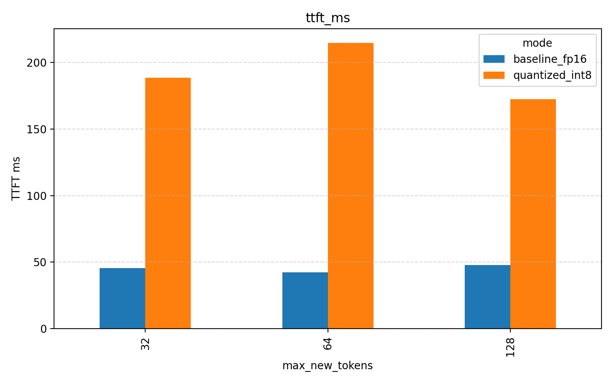

## Output-Length Sweep

| `max_new_tokens` | Mode | TTFT | Total latency | TPOT | Throughput | Peak allocated memory |
|---:|---|---:|---:|---:|---:|---:|
| 32 | FP16 | 45.62 ms | 1,238.32 ms | 38.47 ms/token | 26.11 tok/s | 0.932 GB |
| 32 | INT8 | 188.73 ms | 5,019.39 ms | 155.83 ms/token | 6.39 tok/s | 0.601 GB |
| 64 | FP16 | 42.23 ms | 2,365.46 ms | 36.88 ms/token | 27.24 tok/s | 0.932 GB |
| 64 | INT8 | 214.80 ms | 10,002.26 ms | 155.36 ms/token | 6.40 tok/s | 0.601 GB |
| 128 | FP16 | 47.83 ms | 4,977.65 ms | 40.57 ms/token | 25.50 tok/s | 0.934 GB |
| 128 | INT8 | 172.50 ms | 18,640.51 ms | 155.92 ms/token | 6.41 tok/s | 0.602 GB |

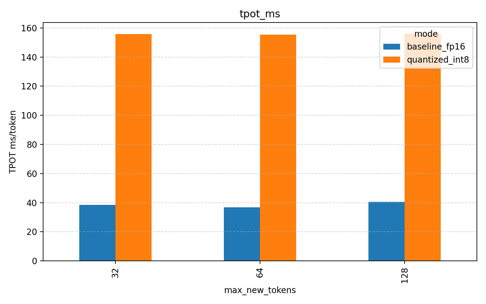

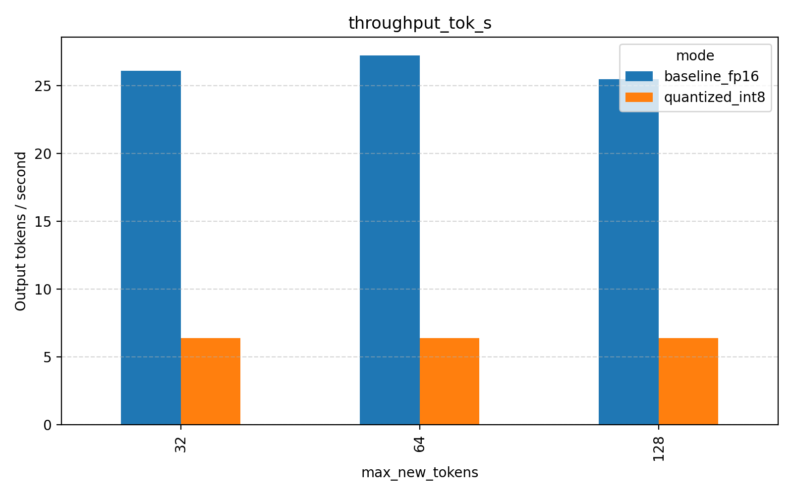

The FP16 baseline sustained roughly 25-27 tokens/s across the sweep. The INT8 configuration stayed around 6.4 tokens/s, which indicates that the quantized path was dominated by overhead or slower kernels rather than by raw memory movement savings.

## Latency And Memory Figures

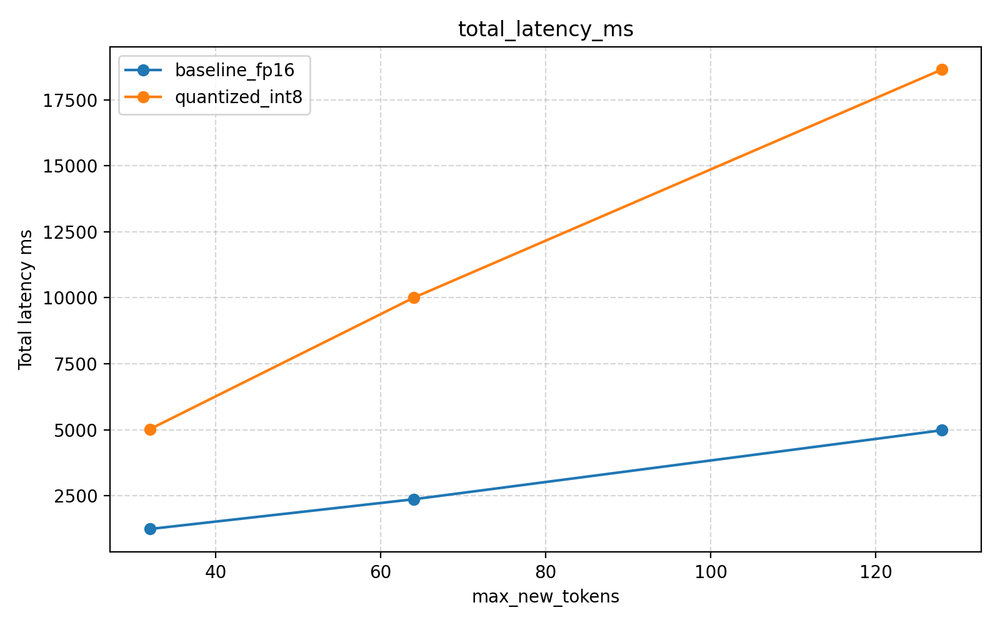

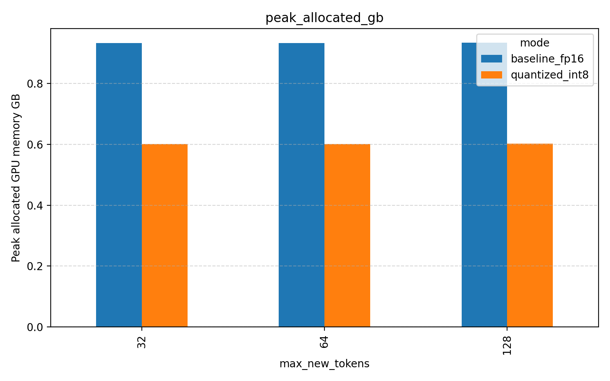

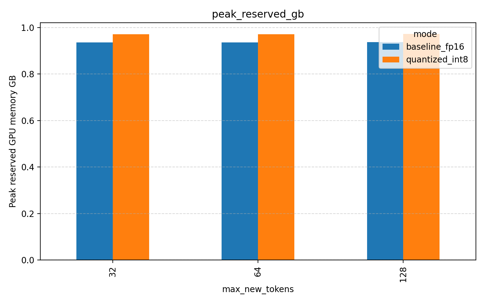

The PDF also includes a summary plot slide for the measured benchmark:

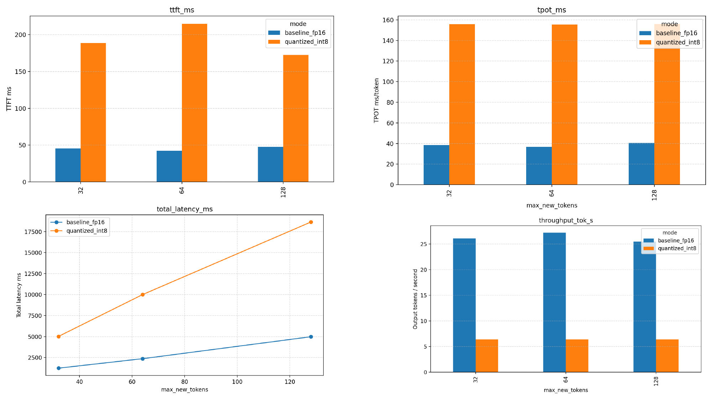

Peak allocated memory dropped from about 0.933 GB to 0.601 GB, a 35.5% reduction. Peak reserved memory did not drop because PyTorch/CUDA memory reservation reflects allocator behavior, fragmentation, and cached blocks, not only live tensor allocation.

The memory result should be interpreted carefully. `torch.cuda.max_memory_allocated()` measures PyTorch-tracked tensor allocation. It may not fully capture all non-standard allocator, library, or `bitsandbytes` memory. A safer interpretation is:

```text
INT8 reduced the model-weight footprint as expected,
but overall GPU memory did not drop by a theoretical 2x
because inference memory also includes KV cache, activations,
temporary buffers, scales, metadata, CUDA context, and runtime allocations.
```

## Why INT8 Was Slower In This Benchmark

The most important result is that INT8 was not faster.

| Comparison | Result |
|---|---|
| INT8 TTFT | About `4.2x` slower than FP16. |
| INT8 TPOT | About `4x` slower than FP16. |
| INT8 throughput | About `1/4` of FP16 throughput. |
| INT8 allocated memory | Lower than FP16. |

This does not mean quantization is ineffective. It means quantization only becomes a speedup when the compressed representation is matched with efficient hardware and kernel support.

Likely reasons:

| Reason | Explanation |
|---|---|
| Dequantization overhead | INT8 weights may need scale/metadata loads and conversion before matmul. If this cost exceeds memory savings, latency increases. |
| Suboptimal kernel path | T4 supports INT8 Tensor Core operations in principle, but Hugging Face + `bitsandbytes` + this model may not dispatch the best fused INT8 kernels. |
| Small model size | Qwen2.5-0.5B already fits easily in FP16 on a 15 GB T4, so weight memory pressure was not the main bottleneck. |
| Low batch/concurrency | Single-request, low-batch inference exposes launch/conversion overhead and may not fully utilize low-precision matrix hardware. |
| Framework overhead | `generate()` orchestration, module dispatch, and unfused operations can dominate small-model inference. |

The important engineering lesson is:

```text
lower precision != automatically lower latency
```

Actual performance depends on:

```text
hardware support
optimized kernels
dequantization overhead
model size
batch / concurrency
memory bandwidth pressure
serving runtime
```

## What The Benchmark Shows

| Finding | Evidence | Deployment implication |
|---|---|---|
| INT8 saves live GPU allocation | Peak allocated memory ratio is 0.64x vs FP16 | Useful when fitting a model into limited memory or increasing room for KV cache/batch size |
| INT8 is slower in this setup | TPOT is 155.70 ms/token vs 38.64 ms/token | Quantized inference needs efficient kernels; otherwise dequantization and framework overhead dominate |
| Longer outputs expose decode cost | INT8 TPOT is roughly flat around 155 ms/token across output lengths | Decode-phase per-token overhead matters more as generation length grows |
| Reserved memory can hide savings | Reserved memory is slightly higher for INT8 | Use allocated memory plus allocator-aware profiling, not reserved memory alone |
| Quality still needs review | Outputs are logged with `quality_note = manual review needed` | Quantization evaluation should include correctness/quality checks, not only speed |

## Connection To Serving Benchmark

This project connects naturally to the LLM serving benchmark.

| Project | What changes | What is measured |
|---|---|---|
| Serving benchmark | Prompt length, output length, concurrency | TTFT, TPOT, latency, throughput |
| Quantization benchmark | Precision/runtime path: FP16 vs INT8 | TTFT, TPOT, latency, throughput, memory, output quality |

Together, they tell a fuller inference story:

```text
Serving benchmark:
What workload factors affect inference?

Quantization benchmark:
What precision/runtime choices affect inference?
```

The correct deployment question is not:

```text
How much faster is INT8 than FP16?
```

It is:

```text
For this model, hardware, kernel implementation, workload, and serving engine,
does INT8 improve the deployment objective?
```

## Result Analysis

This project demonstrates the core quantization tradeoff in a concrete serving-style benchmark. INT8 reduced live model memory, which is the expected benefit of lower-precision storage. However, the INT8 path was about 4x slower in TTFT and TPOT than FP16 on this T4 experiment. The likely reason is that the tested stack paid extra cost for dequantization, scale handling, and non-ideal kernel dispatch, while the FP16 path used better-supported GPU execution.

The result does not mean quantization is ineffective. It means quantization has to be matched with the right model size, batch/concurrency regime, kernel backend, and hardware. For larger models or memory-constrained deployments, the memory reduction can enable workloads that FP16 cannot fit, or allow larger KV cache and higher concurrency. For small models on hardware with strong FP16 support, weight-only INT8 can be slower if the runtime cannot exploit the compressed representation efficiently.

The practical takeaway is to evaluate quantization with both system metrics and output quality: memory footprint, TTFT, TPOT, throughput, p95 latency, reserved vs allocated memory, and qualitative answer consistency all matter before choosing FP16, INT8, AWQ, GPTQ, or more aggressive INT4 deployment.

## Interview Summary

```text
I built a controlled quantization benchmark using Qwen2.5-0.5B-Instruct on a Tesla T4.
I compared an FP16 baseline against a bitsandbytes INT8 model under the same prompts
and output lengths. I swept output lengths of 32, 64, and 128 tokens, used one warmup
run followed by three measured runs, and recorded TTFT, TPOT, end-to-end latency,
output-token throughput, peak GPU memory, and generated text for qualitative review.

The interesting result was that INT8 was not faster. FP16 achieved about 26 tokens/s
with roughly 39 ms TPOT, while INT8 achieved about 6.4 tokens/s with roughly 156 ms
TPOT. TTFT increased from about 45 ms to 192 ms.

My conclusion was that quantization does not automatically imply inference acceleration.
Although INT8 reduces weight footprint in principle, the practical benefit depends on
hardware-native precision support, optimized kernels, dequantization overhead, model size,
batch/concurrency, and the serving runtime. In this small-model, low-batch T4 setup,
INT8 reduced storage pressure but significantly hurt latency and throughput.
```

For an accelerator or systems interview, the useful point is not pretending that INT8 was faster. The useful point is being able to explain why it was slower and connect that result to kernel support, memory-bound vs compute-bound execution, dequantization overhead, and deployment-specific trade-offs.

[Back to Home](../index.md)
