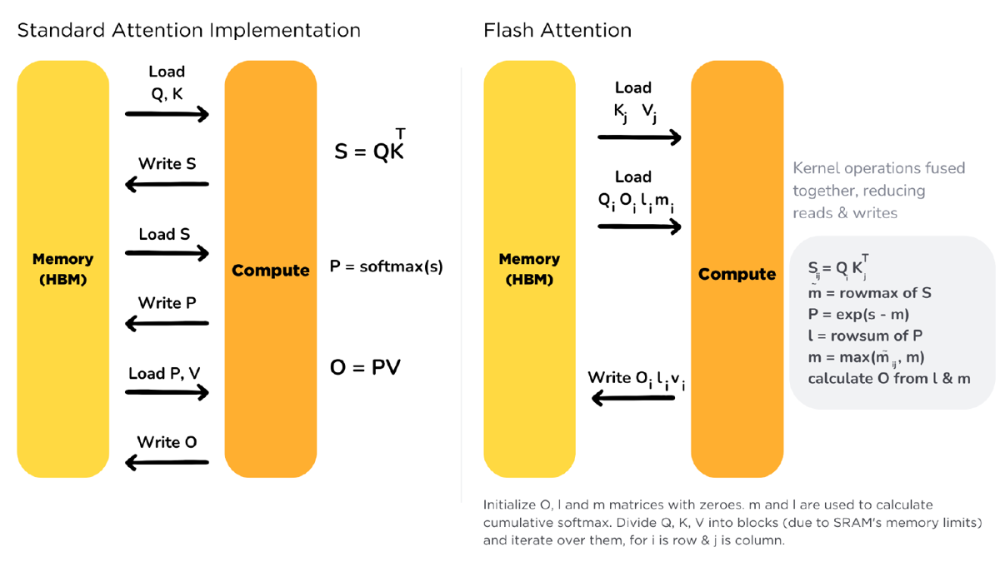
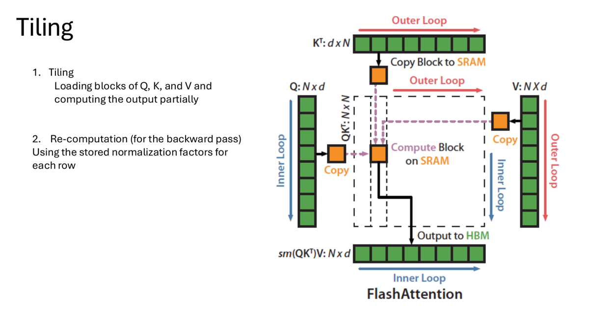
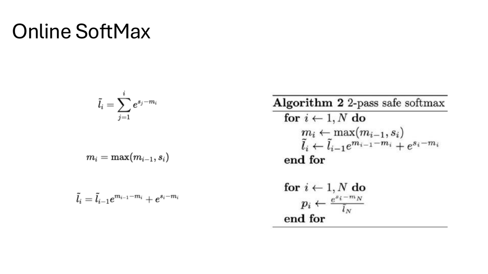
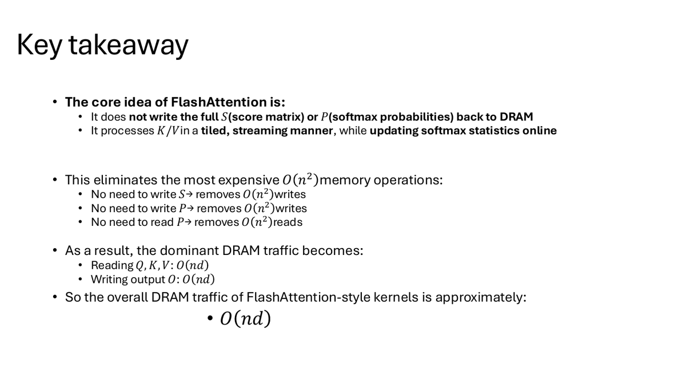
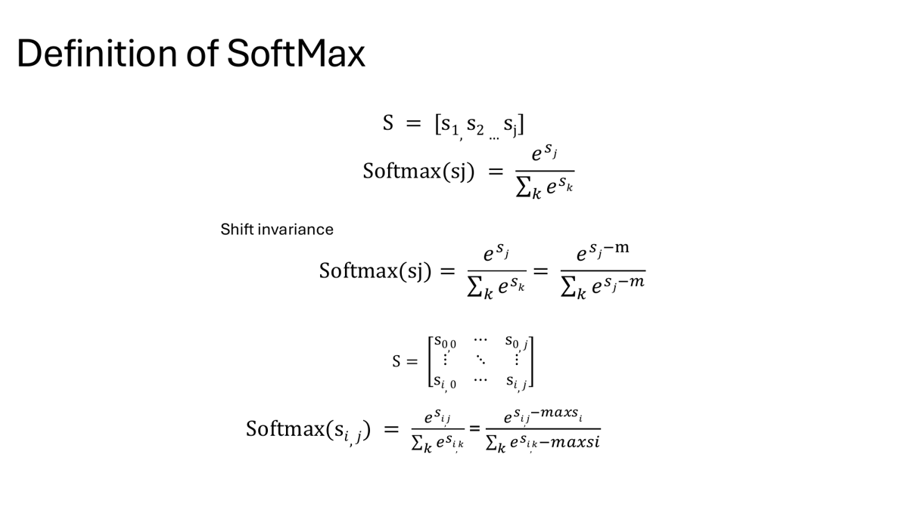
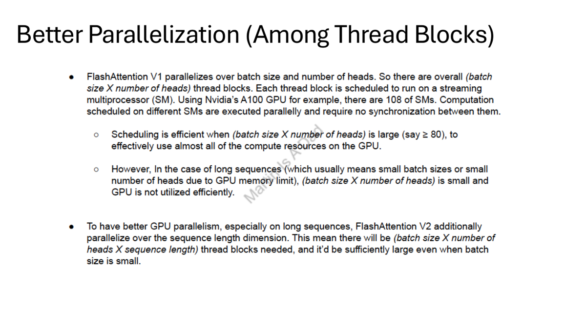

# IO-Aware Attention System with Triton and FlashAttention-style Optimization

This project implements and analyzes Triton kernels for vector operations, row-wise ML kernels, naive attention, paged KV-cache attention, and a mini FlashAttention-style kernel. The main goal is to understand why naive attention is memory-heavy and how online softmax plus tiled Q/K/V loading reduces DRAM traffic.

Source repo: [github](https://github.com/licheng2018/triton)

## Project Goal

The project studies attention performance from the perspective of IO-aware GPU programming:

- Start from simple Triton kernels to understand program/block mapping.
- Implement row-wise kernels such as softmax and LayerNorm.
- Build a naive attention baseline in Triton.
- Compare naive Triton attention with PyTorch attention kernels.
- Implement a paged-KV toy attention path.
- Implement a mini FlashAttention-style kernel with online softmax.
- Evaluate a FlashAttention v1-style kernel and an experimental v2/split-k variant.

## Repository Structure

| Notebook | Role |
|---|---|
| `1. triton_vector_add.ipynb` | Triton vector add baseline and bandwidth benchmark. |
| `2. triton_matmul_softmax_layernorm.ipynb` | Triton matmul, softmax, LayerNorm, tuning of `num_warps` and `num_stages`. |
| `3. attention.ipynb` | Naive Triton attention, paged KV-cache toy example, mini FlashAttention kernel, v1 vs. v2/split-k experiment. |

## Why FlashAttention

Standard attention materializes intermediate matrices:

```text
S = Q K^T
P = softmax(S)
O = P V
```

The score matrix `S` and probability matrix `P` are `N x N`. Writing and reading those full matrices creates expensive `O(N^2)` DRAM traffic.

FlashAttention-style kernels avoid writing the full `S` or `P` matrices to DRAM. Instead, they stream blocks of `K` and `V`, keep partial statistics in SRAM/registers, and update softmax normalization online.



## Tiling Strategy

The core implementation idea is tiling:

- Load a block of `Q`.
- Stream blocks of `K` and `V`.
- Compute partial `QK^T` scores.
- Update row-wise softmax statistics online.
- Accumulate the partial output.
- Write only the final output block to HBM.



## Online Softmax

A normal softmax needs the row maximum and row sum:

```text
softmax(x_j) = exp(x_j - m) / sum_k exp(x_k - m)
```

FlashAttention cannot materialize the full score row before softmax. It therefore maintains online statistics while processing blocks:

- Running maximum `m_i`.
- Running denominator / normalization factor `l_i`.
- Running weighted output accumulator.



This is the key to computing exact attention without writing the full attention matrix to global memory.



## Softmax and Warp-Level Background

The project also includes softmax background material. Row-wise softmax requires reduction operations, so warp-level primitives such as `__shfl_down_sync` and `__shfl_sync` are useful for reducing and broadcasting values inside a warp.




## Triton Warm-Up: Vector Add

The first notebook validates a simple Triton vector add kernel against PyTorch and measures memory bandwidth on Tesla T4.

| N | PyTorch time (ms) | PyTorch GB/s | Triton block | Triton time (ms) | Triton GB/s | Speedup | Max error |
|---:|---:|---:|---:|---:|---:|---:|---:|
| 1,000,000 | 0.0526 | 228.34 | 512 | 0.0521 | 230.14 | 1.01x | 0.00e+00 |
| 10,000,000 | 0.4915 | 244.15 | 256 | 0.4672 | 256.87 | 1.05x | 0.00e+00 |
| 50,000,000 | 2.4857 | 241.38 | 256 | 2.3667 | 253.51 | 1.05x | 0.00e+00 |

This warm-up shows that the Triton kernel reaches similar memory bandwidth to PyTorch for a simple memory-bound operation.

## Triton Row-Wise Kernel Tuning

The second notebook tests Triton row-wise kernels on Tesla T4, including the effect of `num_warps` and `num_stages`.

For shape `B=4096, D=2048`, `float32`, the benchmark reported:

| Kernel | Best config | Time (ms) | Approx. GB/s | Max error | Notes |
|---|---|---:|---:|---:|---|
| Kernel A | `warps=8, stages=1` | 0.2825 | 237.58 | 5.588e-09 | 1 read + 1 write per element |
| Kernel B | `warps=8, stages=3` | 0.2861 | 469.17 | 4.602e-02 | 3 reads + 1 write per element |

The notebook also checks matmul and LayerNorm correctness:

| Kernel | Result |
|---|---|
| Triton matmul skeleton | max absolute error `6.250e-02` vs torch FP16 |
| Triton LayerNorm skeleton | max absolute error `1.907e-06`, mean absolute error `1.651e-08` |

## Naive Triton Attention Baseline

The attention notebook first implements a naive attention baseline in Triton. Correctness is checked against PyTorch:

| Case | N | D | dtype | Mask | Max abs error | Mean abs error | RMSE |
|---|---:|---:|---|---|---:|---:|---:|
| Naive Triton attention | 128 | 64 | FP16 | True | 1.192e-06 | 6.596e-08 | 1.133e-07 |
| Alternate naive version | 128 | 64 | FP16 | True | 7.546e-04 | 1.006e-04 | 1.451e-04 |

The quick benchmark showed that naive Triton attention was much slower than PyTorch's optimized attention path:

| N | D | Triton naive (ms) | PyTorch (ms) | Speedup (PyTorch/Triton) |
|---:|---:|---:|---:|---:|
| 1024 | 64 | 4.712 | 0.145 | 0.03x |
| 1024 | 64 | 4.049 | 0.144 | 0.04x |

This is expected: naive attention materializes and processes large intermediate score/probability matrices, while optimized library paths use more specialized kernels.

## Naive Attention Profiling Sweep

The repo includes a Day 3 benchmark comparing PyTorch and naive Triton attention across sequence lengths and block configurations.

| N | Best naive Triton config | PyTorch time (ms) | Naive Triton time (ms) | Naive Triton GFLOP/s | Speedup vs PyTorch |
|---:|---|---:|---:|---:|---:|
| 256 | `BM=64, BN=64, BK=32, SB=256, warps=4` | 0.0944 | 1.0278 | 16.32 | 0.09x |
| 512 | `BM=64, BN=128, BK=32, SB=512, warps=8` | 0.1036 | 1.5887 | 42.24 | 0.07x |
| 1024 | `BM=64, BN=128, BK=32, SB=512, warps=8` | 0.1335 | 3.5751 | 75.08 | 0.04x |

The naive Triton version scales in absolute throughput as `N` grows, but it remains far behind PyTorch's optimized kernel.

## Paged KV-Cache Toy Attention

The notebook also includes a toy paged-KV attention example.

| Setting | Value |
|---|---:|
| Contiguous KV allocated | 0.262 MB |
| Contiguous KV used | 0.262 MB |
| Paged KV allocated | 0.524 MB |
| Paged KV used | 0.262 MB |
| Fragmentation | 50.00% |

Correctness check:

| T | D | Block T | Page block | Mask | Max abs error | Mean abs error |
|---:|---:|---:|---:|---|---:|---:|
| 1024 | 64 | 16 | 128 | False | 0.0 | 0.0 |

This experiment illustrates the memory-management side of serving attention: paged layouts can represent KV cache blocks flexibly, but they can also introduce fragmentation depending on allocation granularity.

## Mini FlashAttention-style Kernel

The mini FlashAttention-style kernel uses tiled Q/K/V loading and online softmax. Correctness for the causal FP16 case:

| N | D | dtype | causal | Max abs error | Mean abs error |
|---:|---:|---|---|---:|---:|
| 256 | 64 | FP16 | True | 2.441e-04 | 4.479e-08 |

Benchmark:

| N | Naive Triton (ms) | Flash-style Triton (ms) | Speedup vs naive |
|---:|---:|---:|---:|
| 256 | 1.0282 | 0.2426 | 4.24x |
| 512 | 1.7125 | 0.4714 | 3.63x |
| 1024 | 3.7537 | 0.5541 | 6.77x |
| 1024 | 3.5619 | 0.4618 | 7.71x |

The speedup comes from avoiding full materialization of the attention score/probability matrices and reusing data inside SRAM/register-level state.

## FlashAttention v2 / Split-K Experiment

The PDF also discusses FlashAttention v2 ideas: better parallelization across thread blocks and more work partitioning across sequence dimensions.




The repo includes an experimental v1 vs. v2/split-k comparison. In this implementation, v2 produced `nan` correctness values and was slower than v1:

| N | v1 time (ms) | v2 time (ms) | v2/v1 speedup |
|---:|---:|---:|---:|
| 256 | 0.2352 | 0.3407 | 0.69x |
| 512 | 0.4575 | 0.9071 | 0.50x |
| 1024 | 0.8932 | 3.6534 | 0.24x |
| 2048 | 2.3417 | 12.0738 | 0.19x |

This is a useful negative result: v2-style parallelization is not automatically faster. Correct split-k reduction, synchronization, and numerical handling are essential.

## Main Takeaways

- Naive Triton attention is correct but much slower than PyTorch's optimized attention path.
- Materializing full `S = QK^T` and `P = softmax(S)` creates expensive `O(N^2)` memory traffic.
- Online softmax enables exact attention while streaming K/V blocks.
- The mini FlashAttention-style kernel gives 3.63x to 7.71x speedup over the naive Triton baseline.
- Paged KV-cache layouts are useful for serving-style memory management but introduce fragmentation trade-offs.
- FlashAttention v2/split-k requires careful implementation; the experimental version here was slower and numerically unstable.

## Experiment Result Analysis

The results show the difference between implementing attention directly and implementing it in an IO-aware way. The naive Triton kernel is useful as a baseline because it exposes the cost of materializing and processing full score/probability matrices. Even though it is correct, it is far slower than PyTorch's optimized attention path, especially at `N=1024`.

The mini FlashAttention-style kernel demonstrates the key systems idea: performance improves when the kernel changes the memory behavior, not merely when it rewrites the same algorithm in Triton. By streaming K/V blocks and updating online softmax statistics, the Flash-style kernel avoids writing the full `S` and `P` matrices to DRAM. That is why it reaches up to 7.71x speedup over the naive Triton baseline.

The v2/split-k experiment is also important. It shows that more parallelism can hurt if the reduction and numerical handling are not implemented carefully. In this repo, the v2 variant produced `nan` correctness values and slowed down as `N` increased. That makes the result useful for debugging: the next optimization step should focus on stable split-k accumulation, correct rescaling of online softmax statistics across partitions, and reducing inter-block merge overhead.

Overall, this project shows why attention optimization is mainly an IO problem. The best kernel is not just the one with more parallel blocks; it is the one that minimizes global memory traffic while preserving numerically stable softmax semantics.

[Back to Home](../index.md)
