# IO-Aware Attention System with Triton and FlashAttention-style Optimization

This project implements and analyzes Triton kernels for vector operations, row-wise ML kernels, naive attention, paged KV-cache attention, and a mini FlashAttention-style kernel. The main goal is to understand why naive attention is memory-heavy and how online softmax plus tiled Q/K/V loading reduces DRAM traffic.

Source repo: [github](https://github.com/licheng2018/triton)

## Contents

| Area | Jump to sections |
|---|---|
| Overview | [Project Goal](#project-goal) · [Repository Structure](#repository-structure) · [Chapter 1 Integration Scope](#chapter-1-integration-scope) |
| Attention Theory | [Naive Attention and IO Cost](#naive-attention-and-io-cost) · [Arithmetic Intensity and T4 Roofline Example](#arithmetic-intensity-and-t4-roofline-example) · [Diagnosing Memory-Bound Behavior](#diagnosing-memory-bound-behavior) |
| FlashAttention | [FlashAttention IO-Aware Design](#flashattention-io-aware-design) · [Triton Program Ownership and Tile Loop](#triton-program-ownership-and-tile-loop) · [Online Softmax](#online-softmax) · [Why Backward Recomputation Is Necessary](#why-backward-recomputation-is-necessary) · [FlashAttention-2 Design Ideas](#flashattention-2-design-ideas) · [Visual Explanations](#visual-explanations) |
| Implementation Results | [Triton Warm-Up: Vector Add](#triton-warm-up-vector-add) · [Triton Row-Wise Kernel Tuning](#triton-row-wise-kernel-tuning) · [Naive Triton Attention Baseline](#naive-triton-attention-baseline) · [Naive Attention Profiling Sweep](#naive-attention-profiling-sweep) · [Paged KV-Cache Toy Attention](#paged-kv-cache-toy-attention) · [Mini FlashAttention-style Kernel](#mini-flashattention-style-kernel) · [FlashAttention v2 / Split-K Experiment](#flashattention-v2-split-k-experiment) |
| Review | [Benchmark Methodology and Caveats](#benchmark-methodology-and-caveats) · [Interview Review Summary](#interview-review-summary) · [Main Takeaways](#main-takeaways) · [Experiment Result Analysis](#experiment-result-analysis) |

## Project Goal

The project studies attention optimization as an IO-aware GPU programming problem. It starts from simple Triton kernels, builds a correctness-first naive attention baseline, then implements a mini FlashAttention-style forward kernel that fuses score computation, scaling, masking, online softmax, and multiplication by `V` without materializing the full attention score or probability matrices.

The main lesson from the PDF review is:

```text
FlashAttention does not change the leading O(N^2 D) attention arithmetic.
It changes where data lives and how often it crosses the global-memory boundary.
```

The work therefore focuses on:

- Understanding why naive attention is IO-heavy.
- Building a controlled Triton baseline.
- Reducing global-memory traffic through tiling and fusion.
- Maintaining exact numerically stable attention through online softmax.
- Auditing benchmark methodology, correctness parity, and profiler interpretation.

## Repository Structure

| Notebook | Role |
|---|---|
| `1. triton_vector_add.ipynb` | Triton vector add baseline and bandwidth benchmark. |
| `2. triton_matmul_softmax_layernorm.ipynb` | Triton matmul, softmax, LayerNorm, tuning of `num_warps` and `num_stages`. |
| `3. attention.ipynb` | Naive Triton attention, paged KV-cache toy example, mini FlashAttention kernel, v1 vs. v2/split-k experiment. |

## Chapter 1 Integration Scope

The first chapter of the interview review PDF covers the full FlashAttention story:

| PDF section | What is integrated here |
|---|---|
| `1.1 Naive Attention` | Standard attention pipeline, compute/memory complexity, arithmetic intensity, and T4 roofline example. |
| `1.2 Flash Attention Improvements` | Memory hierarchy, tiling, program ownership, online softmax, and backward recomputation. |
| `1.3 FlashAttention-2` | Scheduling improvements, fewer non-matmul FLOPs, sequence parallelism, and better warp partitioning. |
| `1.4 My Implementation` | Naive Triton baseline, KPI definitions, Day 3 results, mini FlashAttention correctness and speedup. |
| `1.5 Common Interview Questions` | Benchmark caveats, memory-bound diagnosis, tuning trade-offs, and communication-ready project summaries. |
| `1.6 Visual Explanations` | Naive attention dataflow, Flash fused flow, and online softmax update timeline. |

## Naive Attention and IO Cost

Naive scaled dot-product attention is computed in three stages:

```text
S = Q K^T
P = softmax(S)
O = P V
```

For one head:

```text
Q, K, V, O in R^{N x D}
S, P in R^{N x N}
```

The main arithmetic work is the two GEMM-like stages:

```text
QK^T: about 2 N^2 D FLOPs
PV:   about 2 N^2 D FLOPs
Total leading work: about 4 N^2 D FLOPs
```

This FLOP count excludes softmax comparisons, subtraction, exponentials, reductions, divisions, masking, dtype conversions, and indexing. Those non-GEMM operations matter for runtime, especially because softmax does not map to Tensor Cores like GEMM.

The IO problem is that naive attention materializes the quadratic intermediates `S` and `P` in off-chip global memory. A typical unfused pipeline performs these global-memory round trips:

| Stage | Global-memory behavior |
|---|---|
| Score GEMM | Reads `Q`, `K`; writes `S`. |
| Row-wise softmax | Reads `S`; writes `P`. |
| Output GEMM | Reads `P`, `V`; writes `O`. |

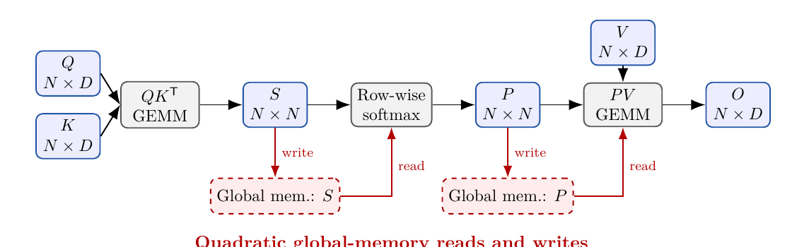

This is why the baseline is slow: the matrix multiplications do useful arithmetic, but the pipeline also writes and rereads two `N x N` intermediates and pays multiple kernel-launch boundaries.

A minimal logical byte model for the quadratic intermediates includes at least:

```text
write S + read S + write P + read P = O(N^2) global-memory traffic
```

Real traffic can be higher because of cache behavior, dtype choices, repeated reads, transaction granularity, and local-memory spills.

## Arithmetic Intensity and T4 Roofline Example

Arithmetic intensity answers a simple question:

```text
AI = FLOPs / global-memory bytes
```

It measures how much useful arithmetic is extracted from every byte that crosses the off-chip global-memory boundary. A higher value means the kernel can potentially keep the compute units busier; a lower value means the kernel spends more of its time waiting for data movement.

A kernel is memory-bound in the Roofline model when:

```text
AI < AI_ridge = peak_compute / peak_memory_bandwidth
```

For naive attention, we can estimate the arithmetic intensity from the forward-pass work and the minimum logical global-memory traffic.

For one head:

```text
Q, K in R^{N x d}
V, O in R^{N x d_v}
S, P in R^{N x N}
```

The leading FLOP count is:

```text
QK^T: about 2 N^2 d FLOPs
PV:   about 2 N^2 d_v FLOPs

Total leading compute: 2 N^2 d + 2 N^2 d_v
```

The minimal logical global-memory traffic of the unfused pipeline includes:

| Tensor traffic | Elements moved | Why it appears |
|---|---:|---|
| Read `Q`, `K` | `2Nd` | Score GEMM input. |
| Write `S` | `N^2` | Materialized attention scores. |
| Read `S` | `N^2` | Softmax input. |
| Write `P` | `N^2` | Materialized attention probabilities. |
| Read `P` | `N^2` | Output GEMM input. |
| Read `V` | `Nd_v` | Value matrix input. |
| Write `O` | `Nd_v` | Final output. |

So the idealized traffic is:

```text
4 N^2 + 2 N d + 2 N d_v elements
```

If each element uses `b` bytes, the byte traffic is:

```text
b * (4 N^2 + 2 N d + 2 N d_v)
```

Therefore the modeled arithmetic intensity of the complete naive forward pipeline is:

```text
AI_naive ~= (2 N^2 d + 2 N^2 d_v)
            / [b * (4 N^2 + 2 N d + 2 N d_v)]
```

In the common self-attention case where `d_v = d`, this simplifies to:

```text
AI_naive ~= 4 N^2 d / [b * (4 N^2 + 4 N d)]
         ~= N d / [b * (N + d)]
```

For long sequences where `N >> d`:

```text
AI_naive ~= d / b
```

This is the key intuition from the PDF: increasing sequence length does not make naive attention arbitrarily compute-dense. Its dominant compute grows as `N^2`, but its dominant global-memory traffic also grows as `N^2` because the full score matrix `S` and probability matrix `P` are written to and reread from global memory.

The PDF then uses this concrete example:

```text
N = 1024
d = d_v = 64
b = 2 bytes per element, FP16/BF16 model
```

The leading attention work is:

```text
4 * N^2 * d
= 4 * 1024^2 * 64
= 268,435,456 FLOPs
~= 0.268 GFLOPs
```

The idealized off-chip global-memory traffic is:

```text
Bytes ~= b * (4 N^2 + 4 N d)
      = 2 * (4 * 1024^2 + 4 * 1024 * 64)
      = 8,912,896 bytes
      ~= 8.91 MB
```

So the modeled arithmetic intensity is:

```text
AI_naive ~= 268,435,456 / 8,912,896
         ~= 30.1 FLOP/byte
```

For an NVIDIA T4, using the PDF's idealized reference numbers:

```text
mixed-precision Tensor Core peak ~= 65 TFLOP/s
memory bandwidth ~= 320 GB/s
AI_ridge ~= 65,000 / 320 ~= 203 FLOP/byte
```

Since:

```text
AI_naive ~= 30.1 FLOP/byte < AI_ridge,T4 ~= 203 FLOP/byte
```

the modeled end-to-end naive attention pipeline falls on the memory-bound side of the idealized T4 Roofline.

Another way to read the same result is to compare two ideal lower bounds:

```text
t_compute = FLOPs / peak_compute
t_memory  = bytes / peak_memory_bandwidth
```

For the T4 example:

```text
t_compute ~= 0.268 GFLOPs / 65 TFLOP/s
          ~= 4.13 us

t_memory  ~= 8.91 MB / 320 GB/s
          ~= 27.9 us
```

Even on an idealized machine, moving the data takes about:

```text
27.9 / 4.13 ~= 6.8x
```

longer than the leading arithmetic. The bandwidth-limited throughput ceiling is also much lower than the nominal compute peak:

```text
30.1 FLOP/byte * 320 GB/s ~= 9.63 TFLOP/s
```

This is far below the T4's idealized `65 TFLOP/s` mixed-precision peak. That gap explains why FlashAttention can speed up attention without changing the leading `O(N^2 d)` math: it mainly removes the global-memory round trips for the quadratic intermediates `S` and `P`.

This estimate should be interpreted carefully. It is a Roofline model, not an exact latency prediction. Real performance is lower because kernels do not sustain peak bandwidth or peak Tensor Core throughput, and because scaling, masking, softmax exponentials, launch overhead, tiling overhead, and non-ideal cache reuse add extra work and traffic. Also, the two GEMMs inside naive attention may individually be compute-efficient; the full pipeline can still be memory-bound once materialization of `S` and `P` plus softmax traffic are included.

## Diagnosing Memory-Bound Behavior

The PDF emphasizes that memory-bound diagnosis should combine evidence rather than rely on one number.

| Evidence type | What to check |
|---|---|
| Model evidence | Arithmetic intensity below the machine ridge point. |
| Counter evidence | Roofline point near a memory ceiling, high DRAM/L2/L1 traffic, low compute utilization, relevant warp stalls. |
| Experimental evidence | Reducing transferred bytes reduces runtime by a meaningful amount. |

Useful checks include:

- Profile the complete attention pipeline and each stage separately.
- Inspect achieved DRAM/L2/L1 throughput and SM/Tensor Core throughput.
- Look at warp-stall reasons such as long scoreboard, memory dependency, barrier, and math-pipe throttle.
- Compare against a controlled optimization that reduces bytes without substantially changing FLOPs.
- Sweep sequence length `N` while keeping `D` fixed.

Important caveat:

```text
Low achieved bandwidth does not prove memory is irrelevant.
```

A kernel can be memory-latency-bound, under-occupied, uncoalesced, dependent on cache misses, or limited by too few active programs without saturating DRAM bandwidth.

## FlashAttention IO-Aware Design

FlashAttention computes exact scaled dot-product attention, but reorganizes execution to reduce data movement. Its key idea is to keep small tiles and row-wise running state on chip instead of materializing full `S` and `P` matrices in global memory.

GPU memory is hierarchical: on-chip SRAM/shared-memory/cache capacity is small, but bandwidth is much higher and access is closer to compute. Off-chip GPU memory has much larger capacity but is expensive to move through repeatedly.

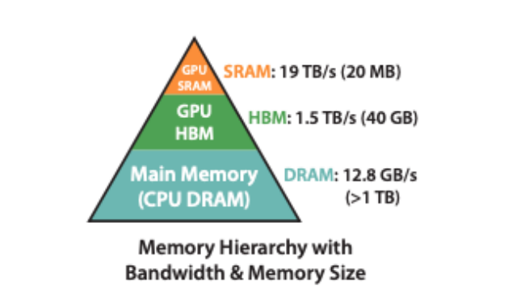

The central engineering trade-off is capacity. On-chip state cannot hold the full `N x N` attention matrix for realistic sequence lengths, so FlashAttention tiles the computation and reuses local storage block by block.

The IO-aware design does four things:

- **Avoid quadratic intermediates in global memory:** local score/probability tiles are produced and consumed on chip.
- **Increase data reuse:** loaded `Q`, `K`, and `V` tiles participate in many multiply-accumulate operations before local state is recycled.
- **Fuse operations:** score computation, scaling, masking, softmax, and multiplication by `V` happen inside one tiled kernel.
- **Keep attention exact:** online softmax combines independently processed tiles using running maxima and normalization sums.

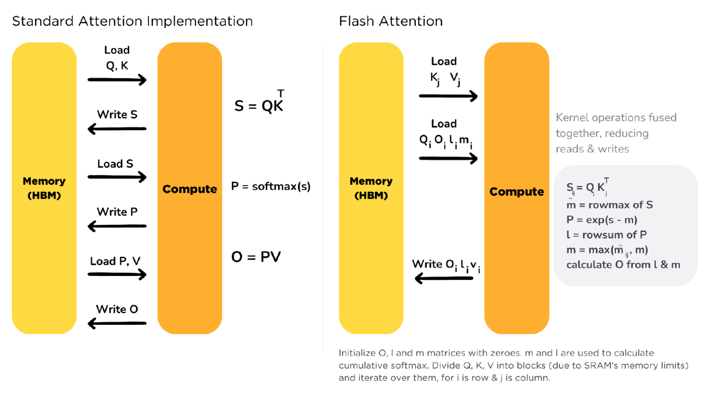

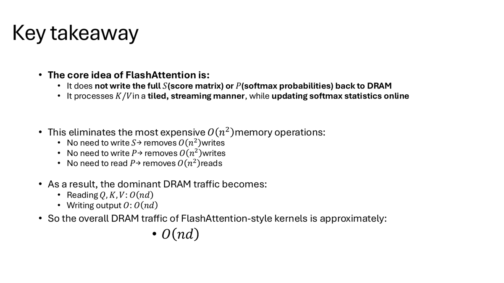

## Triton Program Ownership and Tile Loop

The matrices are partitioned along the sequence dimension:

```text
Q = [Q1, Q2, ..., Q_Tr]
K = [K1, K2, ..., K_Tc]
V = [V1, V2, ..., V_Tc]
```

with tile shapes:

```text
Qi in R^{Br x D}
Kj in R^{Bc x D}
Vj in R^{Bc x Dv}
```

where `Br` and `Bc` are chosen so the active tiles and temporary state fit within program-local/on-chip resource budgets.

The PDF notes an important distinction:

```text
Some paper diagrams use a column-major schedule: load one K/V tile and visit
multiple Q tiles. The Triton implementation here instead launches over query
blocks: each program owns one Qi tile and streams over K/V tiles.
```

In this implementation, each Triton program:

1. Owns a query block `Qi`.
2. Keeps `Qi` and row-wise state `(m_i, l_i, A_i)` program-local.
3. Loops over `Kj, Vj` tiles.
4. Computes a local score tile:

```text
S_ij = Qi Kj^T / sqrt(D)
```

5. Applies boundary, additive, and causal masks.
6. Updates online softmax state.
7. Accumulates the partial output.
8. Writes only the final output tile.

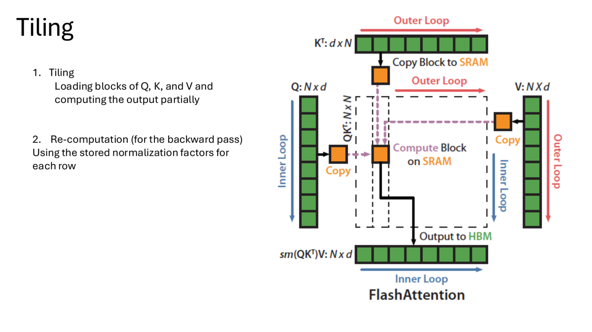

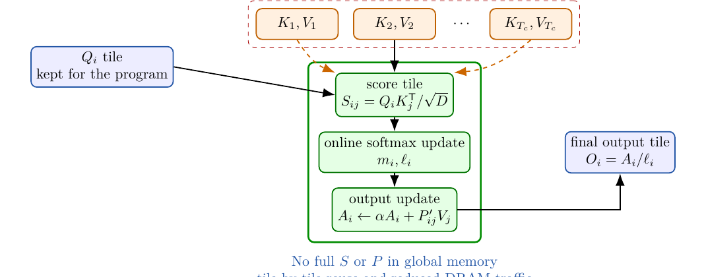

Only required input blocks and the final output cross the global-memory boundary; temporary score and probability tiles are consumed on chip.

## Online Softmax

A normal stable softmax needs the row maximum and row sum:

```text
softmax(x_j) = exp(x_j - m) / sum_k exp(x_k - m)
```

FlashAttention cannot materialize the full score row before softmax. It therefore keeps online state for each query row:

```text
m_i: running maximum
l_i: running denominator / normalization factor
A_i: running unnormalized weighted output accumulator
```

For a new score block with block maximum `m_tilde` and block denominator `l_tilde`, the state is updated by moving old and new terms to a shared numerical reference:

```text
m_new = max(m_old, m_tilde)
alpha = exp(m_old - m_new)
beta  = exp(m_tilde - m_new)
l_new = alpha * l_old + beta * l_tilde
A_new = alpha * A_old + beta * A_tilde
```

The final output is:

```text
O_i = A_i / l_i
```

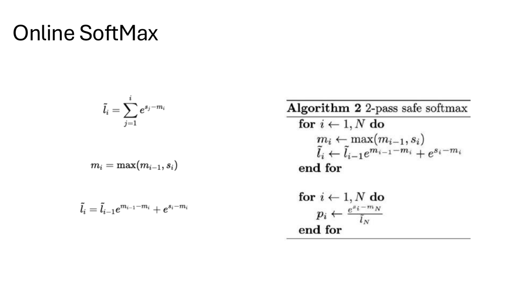

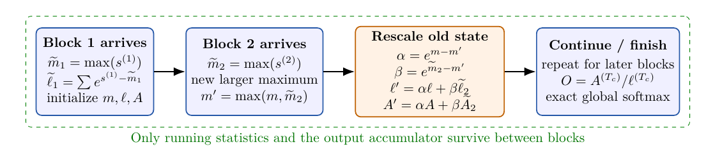

The rescaling is necessary because exponentials accumulated from earlier blocks were normalized relative to the old maximum. If a later tile contains a larger maximum, earlier denominator and output-numerator terms must be rescaled before adding the new tile. Without this correction, different tiles would be normalized under incompatible exponential scales.

## Why Backward Recomputation Is Necessary

FlashAttention deliberately avoids materializing the probability matrix `P` in HBM. Saving it for backward would reintroduce the same quadratic activation memory and IO cost that the forward pass removed.

Instead, FlashAttention stores compact per-row statistics and recomputes score/probability tiles during backward.

The backward idea is:

1. Reload `Q_i`, `K_j`, `V_j`, and saved row statistics.
2. Recompute the local score tile.
3. Reconstruct local probabilities using the saved normalization state.
4. Compute local gradient contributions.
5. Accumulate gradients without saving full `P`.

This is a deliberate compute-memory trade-off:

```text
Repeat some QK^T and exp work
        vs
avoid storing and rereading O(N^2) probability matrices
```

On modern GPUs, data movement is often more expensive than recomputing local arithmetic, so recomputation preserves the forward-pass IO and memory benefits.

## FlashAttention-2 Design Ideas

FlashAttention-2 keeps the same exact-attention mathematics and the same IO-aware principle, but improves scheduling and GPU utilization.

FlashAttention-1 already avoids materializing the full attention matrix, but it can still leave performance on the table because:

- Some work is non-matmul scalar work such as rescaling, masking, and normalization.
- Parallelism can be limited when a single block owns too much row work.
- Shared-memory communication and warp partitioning can be inefficient.

FlashAttention-2 improves three areas:

| Improvement | Explanation |
|---|---|
| Fewer non-matmul FLOPs | Reduces unnecessary normalization/rescaling work and restructures bounds/masking logic. |
| More sequence-dimension parallelism | Parallelizes work across sequence tiles, especially important in backward and long-sequence cases. |
| Better warp partitioning | Splits work so warps own query slices and reduce communication/synchronization overhead. |

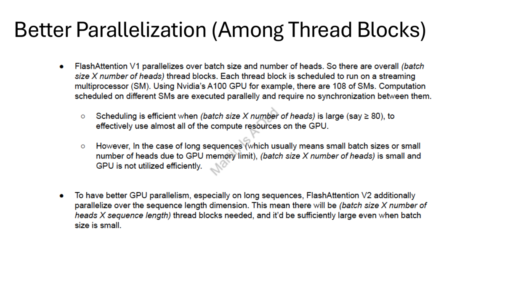

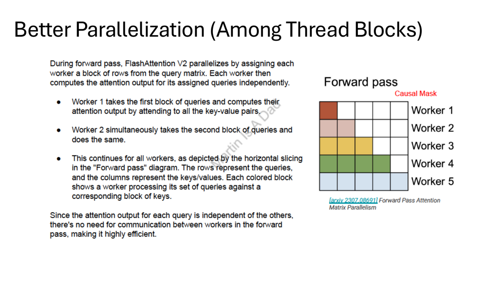

The interview-safe summary is:

```text
FlashAttention established IO-aware exact attention. FlashAttention-2 keeps the
algorithmic foundation but improves GPU utilization through better scheduling,
less non-matmul overhead, more sequence parallelism, and better warp work
partitioning.
```

## Softmax and Warp-Level Background

The project also includes softmax background material. Row-wise softmax requires reductions, so warp-level primitives such as `__shfl_down_sync` and `__shfl_sync` are useful for reducing and broadcasting values inside a warp.


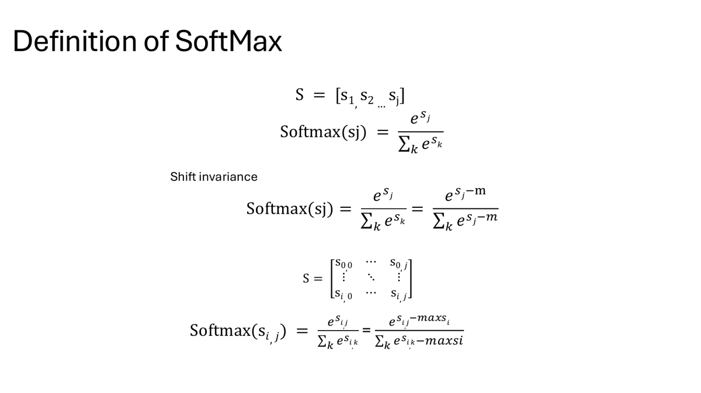

## Visual Explanations

These PDF diagrams are the most useful interview visuals:

| Visual | What it explains |
|---|---|
| Naive attention dataflow | Separate `QK^T`, softmax, and `PV` stages materialize full `S` and `P` in global memory. |
| Flash fused flow | One query tile streams over key/value tiles and consumes temporary score/probability tiles on chip. |
| Online softmax timeline | When a later block increases the running maximum, old denominator and output accumulator state are rescaled. |


## Triton Warm-Up: Vector Add

The first notebook validates a simple Triton vector add kernel against PyTorch and measures memory bandwidth on Tesla T4.

| N | PyTorch time (ms) | PyTorch GB/s | Triton block | Triton time (ms) | Triton GB/s | Speedup | Max error |
|---:|---:|---:|---:|---:|---:|---:|---:|
| 1,000,000 | 0.0526 | 228.34 | 512 | 0.0521 | 230.14 | 1.01x | 0.00e+00 |
| 10,000,000 | 0.4915 | 244.15 | 256 | 0.4672 | 256.87 | 1.05x | 0.00e+00 |
| 50,000,000 | 2.4857 | 241.38 | 256 | 2.3667 | 253.51 | 1.05x | 0.00e+00 |

This warm-up shows that the Triton kernel reaches similar memory bandwidth to PyTorch for a simple memory-bound operation.

## Triton Row-Wise Kernel Tuning

The second notebook tests Triton row-wise kernels on Tesla T4, including the effect of `num_warps` and `num_stages`.

For shape `B=4096, D=2048`, `float32`, the benchmark reported:

| Kernel | Best config | Time (ms) | Approx. GB/s | Max error | Notes |
|---|---|---:|---:|---:|---|
| Kernel A | `warps=8, stages=1` | 0.2825 | 237.58 | 5.588e-09 | 1 read + 1 write per element |
| Kernel B | `warps=8, stages=3` | 0.2861 | 469.17 | 4.602e-02 | 3 reads + 1 write per element |

The notebook also checks matmul and LayerNorm correctness:

| Kernel | Result |
|---|---|
| Triton matmul skeleton | max absolute error `6.250e-02` vs torch FP16 |
| Triton LayerNorm skeleton | max absolute error `1.907e-06`, mean absolute error `1.651e-08` |

## Naive Triton Attention Baseline

The attention notebook first implements a naive attention baseline in Triton. Correctness is checked against PyTorch:

| Case | N | D | dtype | Mask | Max abs error | Mean abs error | RMSE |
|---|---:|---:|---|---|---:|---:|---:|
| Naive Triton attention | 128 | 64 | FP16 | True | 1.192e-06 | 6.596e-08 | 1.133e-07 |
| Alternate naive version | 128 | 64 | FP16 | True | 7.546e-04 | 1.006e-04 | 1.451e-04 |

The quick benchmark showed that naive Triton attention was much slower than PyTorch's optimized attention path:

| N | D | Triton naive (ms) | PyTorch (ms) | Speedup (PyTorch/Triton) |
|---:|---:|---:|---:|---:|
| 1024 | 64 | 4.712 | 0.145 | 0.03x |
| 1024 | 64 | 4.049 | 0.144 | 0.04x |

This is expected: naive attention materializes and processes large intermediate score/probability matrices, while optimized library paths use more specialized kernels.

## Naive Attention Profiling Sweep

The repo includes a Day 3 benchmark comparing PyTorch and naive Triton attention across sequence lengths and block configurations.

| N | Best naive Triton config | PyTorch time (ms) | Naive Triton time (ms) | Naive Triton GFLOP/s | Speedup vs PyTorch |
|---:|---|---:|---:|---:|---:|
| 256 | `BM=64, BN=64, BK=32, SB=256, warps=4` | 0.0944 | 1.0278 | 16.32 | 0.09x |
| 512 | `BM=64, BN=128, BK=32, SB=512, warps=8` | 0.1036 | 1.5887 | 42.24 | 0.07x |
| 1024 | `BM=64, BN=128, BK=32, SB=512, warps=8` | 0.1335 | 3.5751 | 75.08 | 0.04x |

The naive Triton version scales in absolute throughput as `N` grows, but it remains far behind PyTorch's optimized kernel.

## Paged KV-Cache Toy Attention

The notebook also includes a toy paged-KV attention example.

| Setting | Value |
|---|---:|
| Contiguous KV allocated | 0.262 MB |
| Contiguous KV used | 0.262 MB |
| Paged KV allocated | 0.524 MB |
| Paged KV used | 0.262 MB |
| Fragmentation | 50.00% |

Correctness check:

| T | D | Block T | Page block | Mask | Max abs error | Mean abs error |
|---:|---:|---:|---:|---|---:|---:|
| 1024 | 64 | 16 | 128 | False | 0.0 | 0.0 |

This experiment illustrates the memory-management side of serving attention: paged layouts can represent KV cache blocks flexibly, but they can also introduce fragmentation depending on allocation granularity.

## Mini FlashAttention-style Kernel

The mini FlashAttention-style kernel uses tiled Q/K/V loading and online softmax. Correctness for the causal FP16 case:

| N | D | dtype | causal | Max abs error | Mean abs error |
|---:|---:|---|---|---:|---:|
| 256 | 64 | FP16 | True | 2.441e-04 | 4.479e-08 |

Benchmark:

| N | Naive Triton (ms) | Flash-style Triton (ms) | Speedup vs naive |
|---:|---:|---:|---:|
| 256 | 1.0282 | 0.2426 | 4.24x |
| 512 | 1.7125 | 0.4714 | 3.63x |
| 1024 | 3.7537 | 0.5541 | 6.77x |
| 1024 | 3.5619 | 0.4618 | 7.71x |

The speedup comes from avoiding full materialization of the attention score/probability matrices and reusing data inside SRAM/register-level state.

## FlashAttention v2 / Split-K Experiment

The PDF also discusses FlashAttention v2 ideas: better parallelization across thread blocks and more work partitioning across sequence dimensions.


The repo includes an experimental v1 vs. v2/split-k comparison. In this implementation, v2 produced `nan` correctness values and was slower than v1:

| N | v1 time (ms) | v2 time (ms) | v2/v1 speedup |
|---:|---:|---:|---:|
| 256 | 0.2352 | 0.3407 | 0.69x |
| 512 | 0.4575 | 0.9071 | 0.50x |
| 1024 | 0.8932 | 3.6534 | 0.24x |
| 2048 | 2.3417 | 12.0738 | 0.19x |

This is a useful negative result: v2-style parallelization is not automatically faster. Correct split-k reduction, synchronization, and numerical handling are essential.

## Benchmark Methodology and Caveats

The PDF review is careful about which claims are final and which are preliminary. The main benchmark caveats are:

| Issue | Why it matters | Fix |
|---|---|---|
| PyTorch baseline parity | The PyTorch path may include FP16-to-FP32 conversion inside the timed function, while Triton consumes FP16 inputs and accumulates internally. | Pre-convert outside timing or match dtype/accumulation semantics exactly. |
| Flash vs naive parity | The Flash path uses causal masking and scaling; the naive benchmark path must use the same semantics for a strict comparison. | Validate both against the same reference immediately before benchmarking. |
| Configuration sweep bug | The top-level function accepts `cfg`, but the launchers may not forward all config fields to the Triton kernels, so displayed configs can label identical generated kernels. | Forward `BLOCK_M`, `BLOCK_N`, `BLOCK_K`, `SOFTMAX_BLOCK`, and `num_warps` into the launches. |
| Repeated Torch timing | Torch may be benchmarked repeatedly for every Triton configuration and then overwritten in formatting. | Benchmark Torch once per `(N, D)` shape and report it separately. |
| Estimated GB/s | The current GB/s value is an algorithmic estimate, not hardware DRAM bandwidth. | Use Nsight Compute counters for DRAM/L2/L1 bytes, transactions, cache hit rates, and spills. |
| Timing variance | Duplicate `N=1024` runs show noticeable variance. | Report medians, variance, warmups, synchronization, and fixed seeds. |

The defensible claim is:

```text
The fused FlashAttention-style kernel substantially improves this controlled
naive Triton baseline by avoiding quadratic intermediate traffic.
```

The not-yet-final claim would be:

```text
This implementation is production-grade or universally faster than PyTorch SDPA.
```

That stronger claim would require stricter parity, broader shapes, multiple dtypes, non-multiple dimensions, non-causal mode, masks, robust statistics, and hardware-counter profiling.

## Interview Review Summary

The PDF's interview section can be distilled into a practical explanation flow:

| Question | Interview-ready answer |
|---|---|
| What problem does the project solve? | It studies why standard attention becomes inefficient as sequence length grows and uses fusion plus tiled reuse to reduce global-memory traffic. |
| What exactly is fused? | Score computation, scaling, causal/boundary masking, online softmax, and multiplication by `V` are fused in one Triton kernel. |
| Why does one program own a `Q` block? | Each query row depends on all key/value tiles, and the same program must maintain the row's running max, denominator, and output accumulator. |
| Why is online-softmax rescaling needed? | Later tiles may increase the running max, so old denominator/output terms must be rescaled to the new exponential reference. |
| Why not compute softmax first and only fuse `PV`? | That would still require materializing or rereading the full score/probability matrix, preserving the dominant quadratic HBM traffic. |
| How is causal masking handled? | Invalid `j > i` score positions are set to `-inf`, so their exponentials contribute zero. Boundary lanes are also masked. |
| Why compare to naive Triton? | It isolates the effect of fusion and IO-aware tiling in the same programming stack. PyTorch SDPA is still important as a production baseline. |
| What remains untested? | Non-causal mode, additive masks, non-multiple sequence lengths, more head dimensions, more dtypes, large/small score ranges, and degenerate rows. |
| What would be optimized next? | Fix benchmark parity, autotune tiles/warps/stages, reduce accumulator footprint, skip fully masked causal tiles, profile spills, and add backward/dropout/layout support. |

The 30-second version is:

```text
I implemented a naive attention baseline and a FlashAttention-style fused
Triton kernel. The naive version materializes full N x N score and probability
matrices. The fused version tiles Q/K/V, uses online softmax, applies causal
masking in-kernel, and accumulates the output without storing those quadratic
intermediates. The goal is to reduce global-memory traffic, not the leading
O(N^2 D) arithmetic. On the recorded T4 runs, the fused kernel is 3.63x to
7.71x faster than my naive Triton baseline, with benchmark-parity caveats.
```

## Main Takeaways

- Naive Triton attention is correct but much slower than PyTorch's optimized attention path.
- Materializing full `S = QK^T` and `P = softmax(S)` creates expensive `O(N^2)` memory traffic.
- Online softmax enables exact attention while streaming K/V blocks.
- The mini FlashAttention-style kernel gives 3.63x to 7.71x speedup over the naive Triton baseline.
- Paged KV-cache layouts are useful for serving-style memory management but introduce fragmentation trade-offs.
- FlashAttention v2/split-k requires careful implementation; the experimental version here was slower and numerically unstable.

## Experiment Result Analysis

The results show the difference between implementing attention directly and implementing it in an IO-aware way. The naive Triton kernel is useful as a baseline because it exposes the cost of materializing and processing full score/probability matrices. Even though it is correct, it is far slower than PyTorch's optimized attention path, especially at `N=1024`.

The mini FlashAttention-style kernel demonstrates the key systems idea: performance improves when the kernel changes the memory behavior, not merely when it rewrites the same algorithm in Triton. By streaming K/V blocks and updating online softmax statistics, the Flash-style kernel avoids writing the full `S` and `P` matrices to DRAM. That is why it reaches up to 7.71x speedup over the naive Triton baseline.

The v2/split-k experiment is also important. It shows that more parallelism can hurt if the reduction and numerical handling are not implemented carefully. In this repo, the v2 variant produced `nan` correctness values and slowed down as `N` increased. That makes the result useful for debugging: the next optimization step should focus on stable split-k accumulation, correct rescaling of online softmax statistics across partitions, and reducing inter-block merge overhead.

Overall, this project shows why attention optimization is mainly an IO problem. The best kernel is not just the one with more parallel blocks; it is the one that minimizes global memory traffic while preserving numerically stable softmax semantics.

[Back to Home](../index.md)
