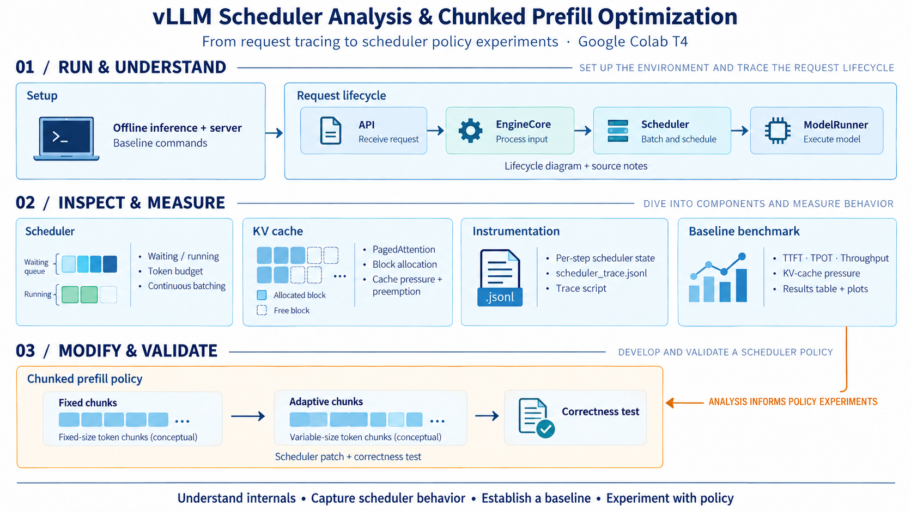
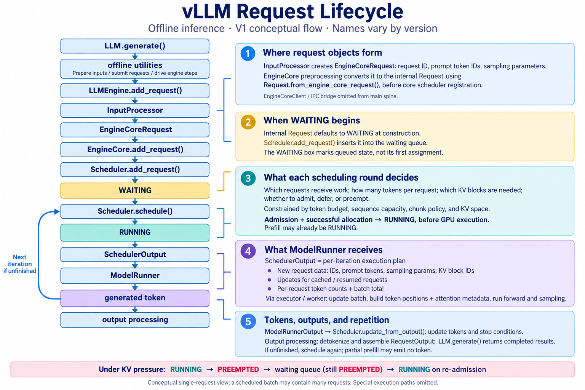
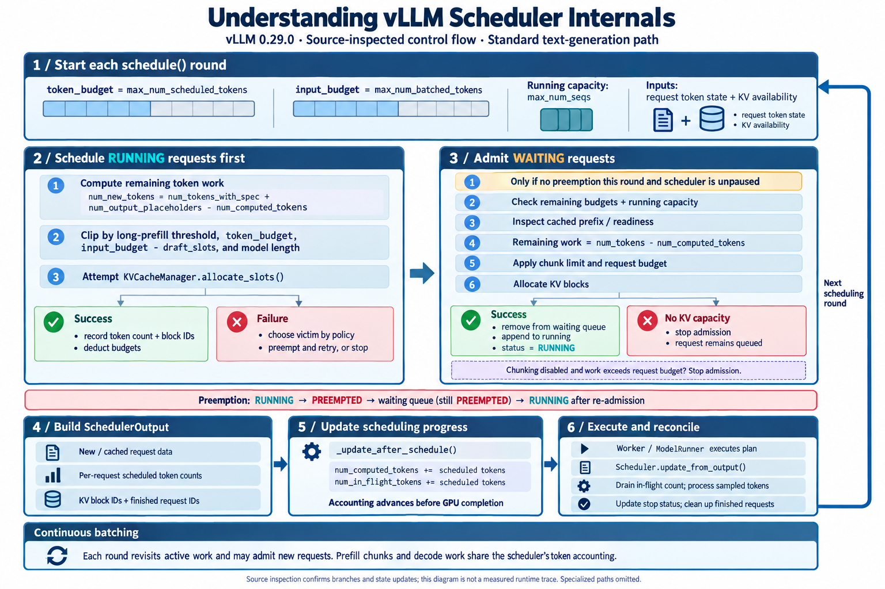
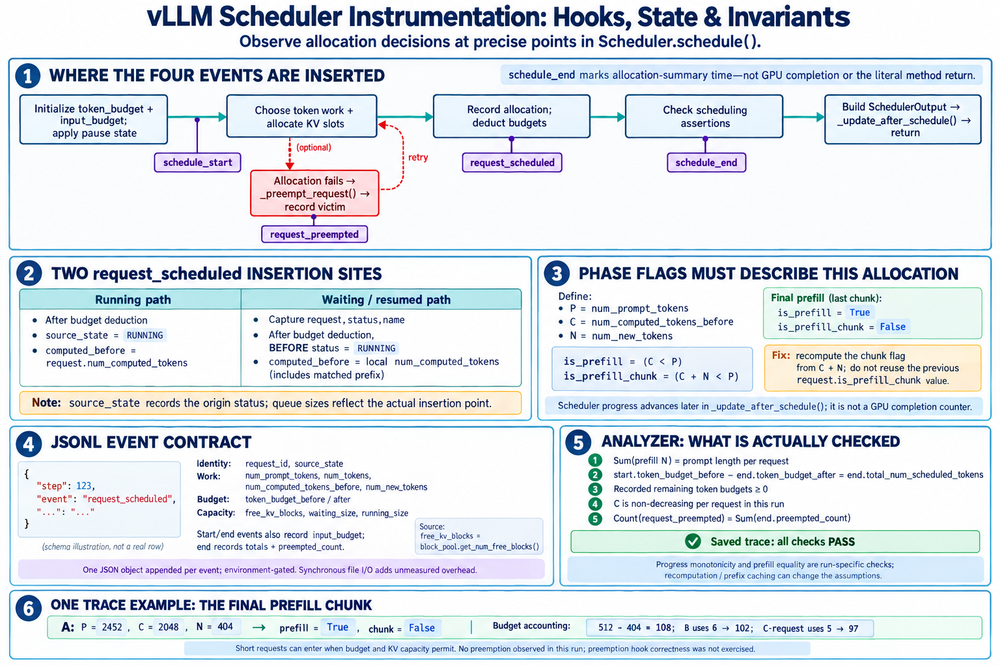
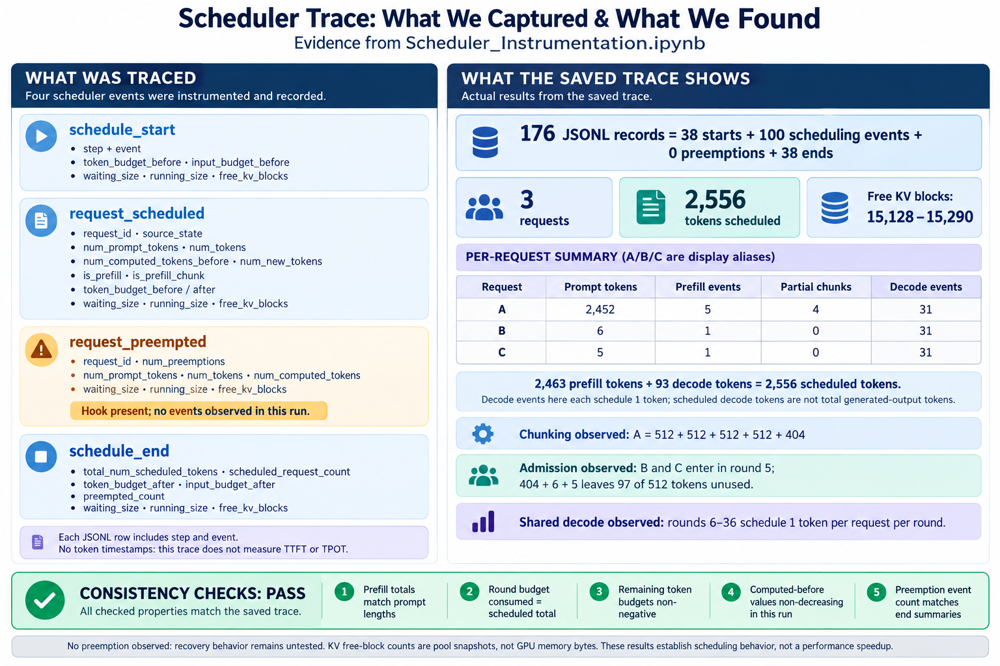
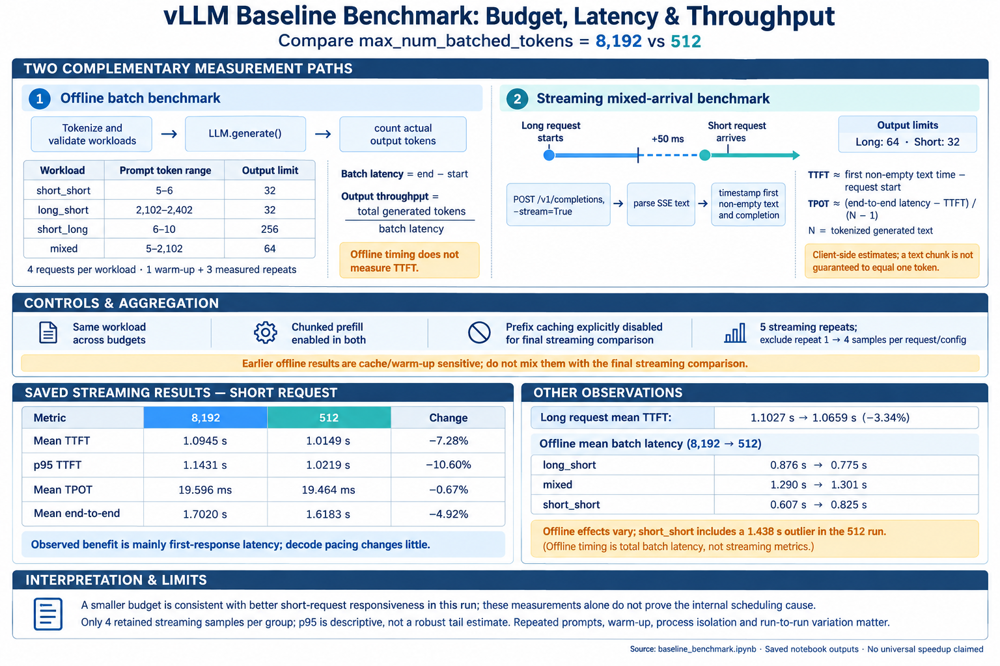
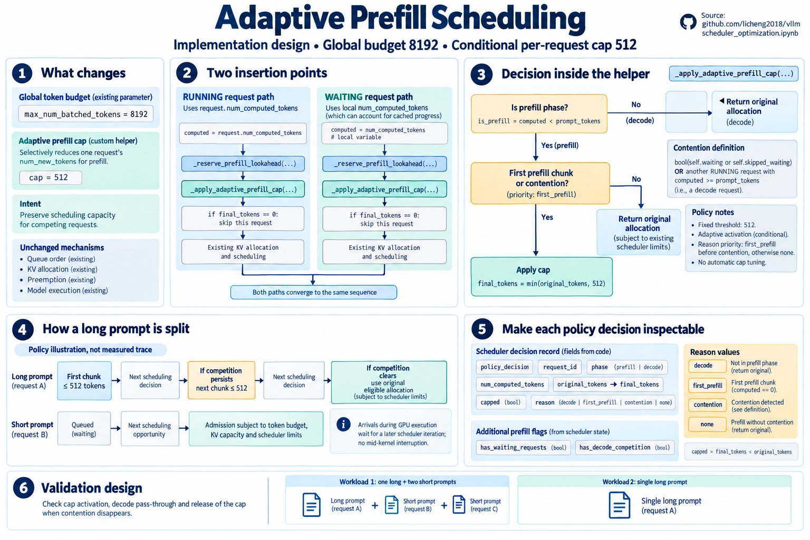
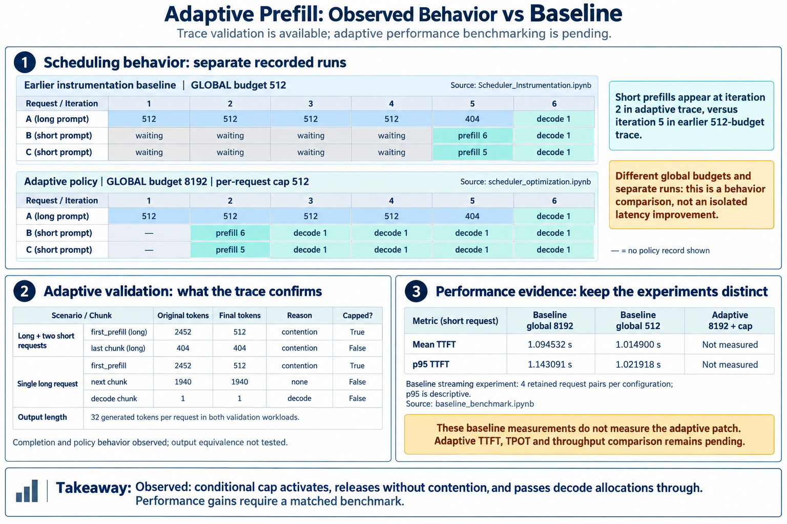

# vLLM Scheduler Analysis and Chunked Prefill Optimization

## Contents

- [Project Goal](#section-project-goal)
- [Experimental Setup](#section-experimental-setup)
- [Implementation Milestones](#section-implementation-milestones)
- [Request Lifecycle and Scheduler Analysis](#section-request-lifecycle-and-scheduler-analysis)
- [Understanding vLLM Scheduler Internals](#section-understanding-vllm-scheduler-internals)
- [KV Cache, PagedAttention, and Block Allocation](#section-kv-cache-pagedattention-and-block-allocation)
- [Scheduler_Instrumentation](#section-scheduler-instrumentation)
- [Baseline Benchmark](#section-baseline-benchmark)
- [scheduler_optimization](#section-scheduler-optimization)
- [Skills Demonstrated](#section-skills-demonstrated)

This project explores vLLM inference internals through source-code analysis, scheduler instrumentation, baseline benchmarking, and chunked prefill policy experiments. The work was carried out on a Google Colab T4, starting with small-model offline inference and server execution and progressing to scheduler modifications and correctness testing.

Source repo: [github](https://github.com/licheng2018/vllm)

<a id="section-project-goal"></a>

## Project Goal

Connect serving performance with the internal decisions behind request scheduling and KV-cache management. The project focuses on tracing request execution, observing scheduler state at each step, and experimenting with fixed and adaptive chunked prefill policies.


















**Figure correction:** In panel 2, the first-prefill row for each workload should show `reason = first_prefill`, not `contention`. The final 404-token chunk correctly shows `reason = contention`. The trace comparison uses separate runs with different global token budgets; adaptive TTFT, TPOT, and throughput have not yet been measured.

<a id="section-experimental-setup"></a>

## Experimental Setup

| Component | Setting |
|---|---|
| Environment | Google Colab |
| GPU | NVIDIA T4 |
| Inference framework | vLLM |
| Execution modes | Small-model offline inference and inference server |
| Performance measurements | TTFT, TPOT, throughput, and KV-cache pressure |
| Policy experiments | Fixed and adaptive chunked prefill |

<a id="section-implementation-milestones"></a>

## Implementation Milestones

| Stage | Work | Outputs |
|---|---|---|
| Environment and baseline | Set up vLLM and run small-model offline inference and server execution. | Runnable environment and baseline commands. |
| Request lifecycle | Trace the request path through API, EngineCore, Scheduler, and ModelRunner. | Request lifecycle diagram and source-code notes. |
| Scheduler analysis | Study waiting/running states, token budgets, and continuous batching. | Scheduler flow diagram and key-function explanations. |
| KV cache and PagedAttention | Analyze block allocation, cache pressure, and preemption. | KV-cache flow diagram and key-function explanations. |
| Instrumentation | Add scheduler instrumentation to record state at each scheduling step. | `scheduler_trace.jsonl` and a trace script. |
| Baseline benchmarking | Measure TTFT, TPOT, throughput, and KV-cache pressure. | Baseline results table and two to three plots. |
| Policy modification | Modify chunked prefill policy, starting with fixed chunks and extending to adaptive chunks. | Scheduler patch and correctness test. |

<a id="section-request-lifecycle-and-scheduler-analysis"></a>

## Request Lifecycle and Scheduler Analysis

This walkthrough follows the code and saved outputs in [vLLM_Foundation.ipynb](https://github.com/licheng2018/vllm/blob/main/vLLM%20Setup%2C%20Request%20Inspection%2C%20and%20Baseline%20Benchmarking/vLLM_Foundation.ipynb). The recorded environment is **vLLM 0.29.0**, PyTorch **2.13.0+cu130**, Python **3.13.15**, and a **Tesla T4 with 14.56 GiB VRAM**. The offline example uses **Qwen/Qwen2.5-1.5B-Instruct**, FP16, `max_model_len=4096`, and `gpu_memory_utilization=0.70`.

The investigation combines an actual inference run with inspection of the installed Python source. **Source verified** below means that the notebook printed the relevant implementation. **Runtime observed** means that a saved execution output shows the behavior. These are different levels of evidence: printing a branch establishes what the code does when reached, but does not establish that a particular request took that branch.

Notebook cell references below use **one-based physical cell positions**, counting both Markdown and code cells, rather than execution counts. Code snippets are shortened inspection commands or selected implementation excerpts; omitted branches are not intended as a replacement implementation.

### Step 1 — Establish a working request before tracing internals

**What I wanted to see.** Can a small model accept prompts and return outputs on the T4, using the same public API that the source investigation will follow?

**How the code does it.** Notebook cells 14–15 write and execute a separate Python script:

```python
from vllm import LLM, SamplingParams

llm = LLM(
    model="Qwen/Qwen2.5-1.5B-Instruct",
    dtype="float16",
    max_model_len=4096,
    gpu_memory_utilization=0.70,
)
sampling_params = SamplingParams(temperature=0.0, max_tokens=64)
outputs = llm.generate(prompts, sampling_params)
```

**What the saved output establishes.** Runtime observed: engine initialization identifies V1 and v0.29.0, and the initial batch reaches `Processed prompts: 100% 2/2`. Initialization also reports chunked prefill with `max_num_batched_tokens=8192`. A Triton JIT warning appears during inference, so the first run includes compilation activity. These logs establish that inference runs; they do not expose individual WAITING/RUNNING transitions or prove a continuous-batching speedup.

### Step 2 — Locate the public entry point: LLM.generate()

**What I wanted to see.** Where is the public API implemented, and does it execute the model itself or delegate to another layer?

**How I inspected it.** Notebook cells 40–41:

```python
import inspect
from vllm import LLM

print(inspect.getfile(LLM.generate))
print(inspect.getsource(LLM.generate))
```

**What I found.** Source verified: the installed method lives in `vllm/entrypoints/llm.py`. It checks the model's runner type, supplies default sampling parameters if needed, and calls `self._run_completion(...)`. The forwarded arguments include prompts, sampling parameters, `RequestOutput` as the output type, progress-display settings, LoRA, priority, and preprocessing options. This identifies the public wrapper and its next call; there is no model forward pass in the printed method.

### Step 3 — Open the offline utilities layer

**What I wanted to see.** What happens between the public API and per-request engine submission?

**How I inspected it.** Notebook cells 42–43:

```python
print(inspect.getfile(LLM._run_completion))
print(inspect.getsource(LLM._run_completion))
print(inspect.getsource(LLM._add_completion_requests))
```

**What I found.** Source verified: these helpers live in `vllm/entrypoints/offline_utils.py`. `_run_completion()` first calls `_add_completion_requests()` and then `_run_engine()`. Submission and engine driving are separate operations. `_add_completion_requests()` normalizes prompts, parameters, LoRA requests, and priorities into matching sequences, then supplies `_preprocess_cmpl_one(...)` results to `_render_and_add_requests()`.

The saved source therefore expands “offline utilities” into concrete functions. It shows the preprocessing call site, but does not separately print the implementation of `_preprocess_cmpl_one()` or `_run_engine()`; their full internals are not demonstrated by these cells.

### Step 4 — Submit each prompt and create its initial request ID

**What I wanted to see.** Where does a batch become individual requests, and where is the first request ID assigned?

**How I inspected it.** Notebook cells 44–45 print `LLM._render_and_add_requests` and `LLM._add_request`. Selected lines from the latter are:

```python
params.output_kind = RequestOutputKind.FINAL_ONLY
request_id = str(next(self.request_counter))
return self.llm_engine.add_request(
    request_id, prompt, params,
    lora_request=lora_request, priority=priority,
)
```

**What I found.** Source verified: `_render_and_add_requests()` loops over prompts, pairs each with its parameters, and collects the returned IDs. If submission fails after some requests were added, it aborts those already submitted. `_add_request()` creates a counter-based string ID and forwards one request to `LLMEngine.add_request()`.

`FINAL_ONLY` explains why this offline call collects completed results rather than exposing an HTTP token stream. This is the **initial** ID: the next layer also calls `assign_request_id()`, whose implementation was not inspected here, so the counter string should not be assumed to remain unchanged throughout the system.

### Step 5 — Inspect LLMEngine.add_request() and output registration

**What I wanted to see.** What does the engine do before handing a request to EngineCore, and how will returned tokens be associated with the caller?

**How I inspected it.** Notebook cells 46 and 48 print `LLMEngine.add_request()`. The import through `vllm.engine.llm_engine` resolves to an implementation in `vllm/v1/engine/llm_engine.py`. For the ordinary single-output path, the printed sequence is:

```python
request = self.input_processor.process_inputs(...)
self.input_processor.assign_request_id(request)
# For n == 1:
self.output_processor.add_request(request, prompt_text, None, 0)
self.engine_core.add_request(request)
```

**What I found.** Source verified: input processing happens before core submission, and output-side request state is registered before the request is forwarded. The method also contains a separate parent/child fan-out path for `n > 1`. This makes the output processor part of request setup, not merely a formatter invoked at the very end.

### Step 6 — Find the EngineCoreRequest construction site

**What I wanted to see.** At what exact point does processed input become a structured engine request, and what information travels with it?

**How I inspected it.** Notebook cell 47:

```python
from vllm.v1.engine.input_processor import InputProcessor

print(inspect.getfile(InputProcessor.process_inputs))
print(inspect.getsource(InputProcessor.process_inputs))
```

**What I found.** Source verified: `vllm/v1/engine/input_processor.py` explicitly returns an `EngineCoreRequest(...)`. Before that, it validates parameters and model inputs, accepts an already rendered `EngineInput` or renders a raw prompt, extracts token IDs or embeddings, and clones and updates generation parameters.

| Request information | Why it is needed downstream |
|---|---|
| `request_id` | Identify the request across engine components. |
| `prompt_token_ids`, optional embeddings | Represent model input after preprocessing. |
| `sampling_params` or `pooling_params` | Define the requested generation or pooling behavior. |
| `arrival_time`, `priority` | Preserve timing and scheduling metadata. |
| LoRA, multimodal, routing, and tracing fields | Carry optional execution context. |

The object construction site and field assignments are visible in the saved source. The notebook does not print a live `EngineCoreRequest` instance with all these fields populated for a specific prompt.

### Step 7 — Distinguish EngineCoreRequest from the internal Request

**What I wanted to see.** Does the scheduler receive the same object constructed by the input processor?

**How I inspected it.** Notebook cell 49 prints `EngineCore.add_request()`, and cell 56 prints the complete `Request` class:

```python
from vllm.v1.engine.core import EngineCore
from vllm.v1.request import Request

print(inspect.getsource(EngineCore.add_request))
print(inspect.getsource(Request))
```

**What I found.** Source verified: `EngineCore.add_request(self, request: Request, ...)` accepts the internal `Request` type and calls `self.scheduler.add_request(request)`. The printed `Request.from_engine_core_request()` factory constructs that internal object from an `EngineCoreRequest`.

**What remains only partially traced.** The notebook's “core client” inspection reprints `LLMEngine.add_request()`; it does not print the concrete client transport or the EngineCore preprocessing call site that invokes this factory. The conversion factory and both sides of the handoff are visible, but the complete client/IPC bridge is not established by these cells. The lifecycle diagram compresses that bridge.

### Step 8 — Separate WAITING initialization from waiting-queue insertion

**What I wanted to see.** When does a request become WAITING, and when does the scheduler actually store it?

**How the inspected code implements it.** Notebook cells 50, 55, and 56 expose three distinct pieces:

```python
# Request.__init__:
self.status = RequestStatus.WAITING

# Scheduler.add_request, new-request branch:
self._enqueue_waiting_request(request)
self.requests[request.request_id] = request

# Scheduler.__init__:
self.waiting = create_request_queue(self.policy)
self.skipped_waiting = create_request_queue(self.policy)
self.running: list[Request] = []
```

**What I found.** Source verified: the default status is assigned during object construction, before scheduler registration. Registration then enqueues the request and indexes it by ID; it does not launch a GPU kernel. The waiting queues are created using the configured scheduling policy. Requests with structured-output requirements can receive a specialized waiting status, so plain WAITING describes the ordinary path rather than every possible request.

The notebook shows the state assignment and enqueue call, but contains no timestamped observation of a particular request entering the queue.

### Step 9 — Understand the token state that drives scheduling

**What I wanted to see.** What does “remaining work” mean to the scheduler, and why can the same mechanism cover both prefill and decode?

**How I inspected it.** Notebook cell 56 prints `Request`, including its fields and properties.

| Field or property | Meaning in the inspected implementation |
|---|---|
| `num_prompt_tokens` | Length of the prompt input. |
| `num_tokens` | Length of the accumulated non-speculative token sequence. |
| `num_tokens_with_spec` | Accumulated tokens plus speculative candidate tokens. |
| `output_token_ids` | Read-only view of generated output token IDs. |
| `num_computed_tokens` | Progress accounted for by the scheduler, including optimistically scheduled work. |
| `num_in_flight_tokens` | Scheduled tokens whose execution output has not yet been processed. |

**What I found.** Source verified: token counts are not interchangeable. In particular, the `Request` source explicitly describes in-flight work as being included optimistically in `num_computed_tokens`. Prefill and decode can be understood through the gap between available tokens and accounted-for progress, rather than by treating every scheduling step as exactly one generated token.

### Step 10 — Read the decisions made by Scheduler.schedule()

**What I wanted to see.** Which requests get work in this round, how much work do they receive, and what limits that decision?

**How I inspected it.** Notebook cell 51 prints the complete method; cells 57 and 64 filter its token-budget and chunk-policy logic. The running-request calculation includes:

```python
token_budget = self.max_num_scheduled_tokens
input_budget = self.scheduler_config.max_num_batched_tokens

num_new_tokens = (
    request.num_tokens_with_spec
    + request.num_output_placeholders
    - request.num_computed_tokens
)
# After applying the long-prefill threshold:
num_new_tokens = min(
    num_new_tokens, token_budget, input_budget - draft_slots
)
```

**What I found.** Source verified: this version distinguishes a scheduling-token budget from the input-batch budget. `max_num_running_reqs` is set from `max_num_seqs`; `max_num_scheduled_tokens` uses its explicit configuration value or falls back to `max_num_batched_tokens`. The ordinary scheduling flow considers running requests before admitting waiting requests, while accounting for additional pause, dependency, and execution constraints.

The scheduler determines request selection, per-request token counts, and KV allocation. It records allocations in `num_scheduled_tokens[request_id]` and reduces the remaining budgets. The source explains how batching can change between iterations; the notebook does not measure a live mixed-request batch composition in these inspection cells.

### Step 11 — Identify the exact WAITING → RUNNING transition

**What I wanted to see.** What must succeed before a queued request becomes RUNNING, and does that happen before or after model execution?

**How I inspected it.** Notebook cell 58 filters waiting admission, allocation, and status changes from `Scheduler.schedule()`; cell 65 prints the chunked-prefill admission condition. For a waiting request, the method computes remaining work using `request.num_tokens - num_computed_tokens`, applies the request budget and chunk limits, and attempts `kv_cache_manager.allocate_slots(...)`.

Selected lines from the successful admission path are:

```python
self.running.append(request)
num_scheduled_tokens[request_id] = num_new_tokens
token_budget -= num_new_tokens
input_budget -= num_new_tokens + draft_slots
request.status = RequestStatus.RUNNING
request.num_computed_tokens = num_computed_tokens
```

**What I found.** Source verified: RUNNING is assigned inside scheduling, after successful admission and allocation, before the returned plan is executed. It does not mean prefill has finished, the first output token exists, or the GPU has completed this round. The source also shows that disabling chunked prefill can prevent admission when the required work exceeds the available request budget.

The assignment site is confirmed. A per-request WAITING duration or actual transition timestamp is not present in the saved inspection output.

### Step 12 — Check the KV-allocation failure and preemption path

**What I wanted to see.** What happens when token budget exists but KV-cache capacity prevents execution?

**How I inspected it.** Notebook cell 59 searches `Scheduler.schedule()` for `allocate_slots`, `new_blocks`, and preemption-related lines. Cell 68 prints `KVCacheManager.allocate_slots()`, and cell 63 includes the tail of the scheduler's preemption handling.

**What I found.** Source verified: allocation can return `None`. In the running-request flow, the scheduler can select a victim, call `_preempt_request(...)`, and retry allocation; waiting admission also has an allocation-failure path. The inspected preemption tail puts a request back with `self.waiting.prepend_request(request)` and records its ID for worker notification.

This establishes the control path connecting memory availability to scheduling. It does **not** establish that the notebook's baseline run triggered preemption, how often it occurred, or how much latency it caused. Those claims require runtime traces or counters. Waiting-queue membership should also be distinguished from the request's status enum: a resumed preempted request is not simply a newly arrived WAITING request.

### Step 13 — Inspect the SchedulerOutput handed toward execution

**What I wanted to see.** Does the worker receive the original prompt request again, or a plan describing only this iteration?

**How I inspected it.** Notebook cells 83–84 follow block IDs into the output and print the data classes:

```python
import vllm.v1.core.sched.output as sched_output_module

for cls in (
    sched_output_module.NewRequestData,
    sched_output_module.CachedRequestData,
    sched_output_module.SchedulerOutput,
):
    print(inspect.getsource(cls))
```

**What I found.** Source verified: `SchedulerOutput` is a per-iteration execution plan with distinct representations for newly scheduled requests and requests already known to the worker.

| Payload | What the printed data classes contain |
|---|---|
| `scheduled_new_reqs` | `NewRequestData`: request ID, prompt tokens/embeddings, sampling or pooling parameters, block IDs, and computed-token count, with optional context. |
| `scheduled_cached_reqs` | `CachedRequestData`: IDs, resumed-request IDs, token updates, block updates, and progress information for previously scheduled requests. |
| `num_scheduled_tokens` | Mapping from each request ID to its scheduled token count. |
| `total_num_scheduled_tokens` | Total token work assigned in this round. |
| `finished_req_ids` | IDs whose worker-side cached state can be removed. |
| Additional metadata | Optional speculative, encoder, connector, block-zeroing, and block-copy information. |

The class definitions and construction site are visible. No concrete runtime `SchedulerOutput` instance is printed, so this is a verified schema and producer path, not an observed batch example.

### Step 14 — Locate the progress update before GPU completion

**What I wanted to see.** Exactly where does `num_computed_tokens` increase, and what would that counter mean in a trace?

**How I inspected it.** Notebook cells 62–63 search the scheduler class and print the relevant context:

```python
# Scheduler._update_after_schedule:
for req_id, num_scheduled_token in scheduler_output.num_scheduled_tokens.items():
    request = self.requests[req_id]
    request.num_computed_tokens += num_scheduled_token
    request.num_in_flight_tokens += num_scheduled_token
```

**What I found.** Source verified: `schedule()` constructs its output, calls `_update_after_schedule(scheduler_output)`, and then returns it. The original progress values must first be captured for input preparation; the scheduler then advances its own accounting so future work can be scheduled. Later output handling can correct that accounting, including speculative-token rejection.

This changes how instrumentation should be interpreted: a counter sampled after `schedule()` can already include work that has not completed on the GPU. A meaningful trace must record both the observation point and in-flight work.

### Step 15 — Follow request data into ModelRunner and KV addressing

**What I wanted to see.** How does the ModelRunner consume the scheduler's request and block data, and how do logical token positions connect to physical KV storage?

**How I inspected it.** Notebook cells 85–86 search and print `GPUModelRunner` source around `scheduled_new_reqs`, `scheduled_cached_reqs`, `block_ids`, and `block_table`. Cells 87–91 follow `compute_slot_mapping()` into its implementation.

```python
import vllm.v1.worker.gpu_model_runner as runner_module
import vllm.v1.worker.block_table as block_table_module

print(inspect.getsource(runner_module.GPUModelRunner))
KernelClass = type(block_table_module._COMPUTE_SLOT_MAPPING_KERNEL)
print(inspect.getsource(KernelClass))
```

**What I found.** Source verified: new request data is used to build `CachedRequestState`. For known requests, the runner updates token/progress state and extends block IDs; resumed requests can replace their block mapping. The printed code also updates the input batch's block table, commits it, and computes slot mappings.

The investigation initially found only the `MultiGroupBlockTable` wrapper. Following its module located the concrete `BlockTable`, whose `compute_slot_mapping()` invokes `_COMPUTE_SLOT_MAPPING_KERNEL` with token positions, request offsets, GPU block-table data, and block-size parameters. Directly calling `inspect.getsource()` on the kernel object failed; inspecting `type(kernel)` successfully exposed `ComputeSlotMappingKernel` and its Triton implementation.

This is a concrete source-level connection from scheduler-selected KV block IDs to worker-side memory addressing. The notebook does not dump actual GPU slot mappings or profile a forward pass here, and inspecting this runner class alone does not establish which optional runner implementation every experiment used.

### Step 16 — Follow generated tokens back to request state and caller output

**What I wanted to see.** How are model results reconciled with scheduled work, and how does the caller receive a finished result?

**How I inspected it.** Notebook cells 60–61 locate and print `Scheduler.update_from_output()`. The printed implementation reads `model_runner_output.sampled_token_ids`, reconciles in-flight counts, calls `_update_request_with_output(...)` when token IDs are available, handles stopped requests, and constructs `EngineCoreOutput` objects carrying new tokens and finish information.

The original inference script in notebook cell 14 also accesses the public result fields:

```python
for output in outputs:
    candidate = output.outputs[0]
    # Written to the script's inspection file:
    output.request_id
    output.prompt_token_ids
    output.finished
    candidate.text
    candidate.token_ids
    candidate.finish_reason
```

**What I found.** Source verified: output handling updates the request lifecycle and emits core results, with a finished-request path that invokes resource cleanup. The earlier `FINAL_ONLY` setting explains the offline caller's completed-result contract. Runtime progress confirms that the initial batch completed.

**What is not shown.** The script writes detailed `RequestOutput` fields and timing results to `/content/request_output_inspection.txt`, but that file's contents are not displayed in this notebook's saved outputs. The output processor's full detokenization implementation and `_run_engine()` loop are also not printed. Therefore, the notebook demonstrates successful generation and several output-handling boundaries, but not a complete token-by-token execution trace or the exact returned text and finish reasons in the inspection file.

### What this investigation establishes

| Question | Evidence-based conclusion |
|---|---|
| Where does the engine request form? | `InputProcessor.process_inputs()` explicitly constructs `EngineCoreRequest`. |
| Where does the scheduler's internal object form? | The `Request.from_engine_core_request()` factory is printed; its core-client/preprocessing call site is not traced in these cells. |
| When does WAITING begin? | Default status initialization occurs in `Request.__init__`; scheduler insertion is a separate operation. |
| When does RUNNING begin? | The successful admission path sets it inside `Scheduler.schedule()`, before execution. |
| What does a round decide? | Request selection, token counts, admission/defer/preemption decisions, and KV allocation under capacity constraints. |
| What does ModelRunner consume? | Per-iteration `SchedulerOutput` data used to update cached request state, the batch, and KV block mappings. |
| Was every transition observed live? | No. Most evidence is saved source inspection; per-request event timing and actual scheduled-batch payloads remain for instrumentation. |


<a id="section-understanding-vllm-scheduler-internals"></a>

## Understanding vLLM Scheduler Internals

This section follows the scheduler-internals chapter of [vLLM_Foundation.ipynb](https://github.com/licheng2018/vllm/blob/main/vLLM%20Setup%2C%20Request%20Inspection%2C%20and%20Baseline%20Benchmarking/vLLM_Foundation.ipynb), in its original investigation order. The lifecycle walkthrough above follows a request across components; here the focus is how **one scheduling round distributes limited token and KV-cache resources across requests**.

The evidence comes from saved inspection outputs for **vLLM 0.29.0**, primarily notebook cells **55–65**. Cell numbers count all physical notebook cells from one. The snippets below reproduce the inspection approach or selected source excerpts. They are not standalone scheduler implementations. These cells inspect source rather than record live request-state transitions.

### 1. Inspect scheduler initialization: queues, policy, and capacity

**Question.** Where are requests stored, and which configuration values constrain an iteration?

**What I did.** The chapter starts by locating and printing `Scheduler.__init__()` in notebook cell 55:

```python
import inspect
from vllm.v1.core.sched.scheduler import Scheduler

print(inspect.getfile(Scheduler.__init__))
print(inspect.getsource(Scheduler.__init__))
```

**Implementation found.** The scheduler maintains an ID-to-request dictionary, policy-aware waiting queues, and a running list:

```python
self.requests: dict[str, Request] = {}
self.waiting = create_request_queue(self.policy)
self.skipped_waiting = create_request_queue(self.policy)
self.running: list[Request] = []
self.max_num_running_reqs = self.scheduler_config.max_num_seqs
```

`self.policy` comes from `SchedulingPolicy(self.scheduler_config.policy)`. `max_num_scheduled_tokens` uses its explicitly configured value when present, otherwise falling back to `max_num_batched_tokens`. These values become two distinct budgets inside `schedule()`:

| Constraint | What it limits |
|---|---|
| `max_num_running_reqs` | Concurrent running-request capacity. Specialized streaming sessions also affect the admission count. |
| `token_budget` | Remaining scheduled-token work in this iteration. |
| `input_budget` | Remaining input-batch capacity, including reserved draft slots when applicable. |
| KV-cache availability | Whether the selected work can obtain the required memory blocks. |

**Did the inspection answer the question?** Yes, at source level. It located the containers and configuration bindings. It did not print a live scheduler's queue lengths or all resolved configuration values. The initialization log elsewhere in the notebook reports `max_num_batched_tokens=8192`; that is a configured limit, not evidence that every round schedules 8,192 tokens.

### 2. Inspect Request token state: distinguish input, output, and progress

**Question.** How does the scheduler calculate work remaining for a request?

**What I did.** Notebook cell 56 prints the `Request` class:

```python
from vllm.v1.request import Request

print(inspect.getfile(Request))
print(inspect.getsource(Request))
```

**Implementation found.** Some values are stored, while others are derived from token lists:

```python
@property
def num_tokens(self) -> int:
    return len(self._all_token_ids)

@property
def num_tokens_with_spec(self) -> int:
    return len(self._all_token_ids) + len(self.spec_token_ids)
```

`num_prompt_tokens` describes the prompt length; `output_token_ids` exposes generated tokens; `spec_token_ids` holds speculative candidates. `num_computed_tokens` starts at zero, but its later value includes optimistically scheduled work. `num_in_flight_tokens` separately tracks scheduled work whose output has not yet been processed.

**Did the inspection answer the question?** Yes. The scheduler can express both a long prefill and a decode step as token work that has not yet been accounted for. The source also corrects an oversimplification in the chapter's introductory notes: `num_computed_tokens` is not always the number of tokens already completed on the GPU. That distinction becomes explicit in step 6 below.

### 3. Inspect RUNNING-request token-budget clipping

**Question.** How many tokens does an existing running request receive, and which limits can reduce that allocation?

**What I did.** Notebook cell 57 retrieves `Scheduler.schedule()` and filters for token-count and budget expressions:

```python
schedule_source = inspect.getsource(Scheduler.schedule)
keywords = [
    "num_new_tokens", "token_budget", "input_budget",
    "long_prefill_token_threshold", "max_model_len",
]
for line in schedule_source.splitlines():
    if any(keyword in line for keyword in keywords):
        print(line)
```

**Implementation found.** The full method, printed earlier in the notebook, provides the surrounding control flow. For running requests, the initial calculation is:

```python
num_new_tokens = (
    request.num_tokens_with_spec
    + request.num_output_placeholders
    - request.num_computed_tokens
)
if 0 < self.scheduler_config.long_prefill_token_threshold < num_new_tokens:
    num_new_tokens = self.scheduler_config.long_prefill_token_threshold
num_new_tokens = min(
    num_new_tokens, token_budget, input_budget - draft_slots
)
```

The method also caps work by the remaining model-length allowance and applies specialized alignment, encoder, and lookahead constraints. Once a request receives an allocation, its token count is saved and the budgets are deducted:

```python
num_scheduled_tokens[request_id] = num_new_tokens
token_budget -= num_new_tokens
input_budget -= num_new_tokens + draft_slots
```

If an individual running request has zero schedulable tokens, the inspected branch advances to another request with `continue`; it does not necessarily terminate the whole round. Exhausting the shared token budget, however, ends the running-request loop.

**Did the inspection answer the question?** Yes: allocation is the remaining token demand clipped by several constraints, not a fixed number of tokens per running request. The keyword output alone omits some branch context, so it must be read alongside the complete method. No actual per-request allocations were measured in this cell.

### 4. Inspect WAITING → RUNNING admission

**Question.** When can a queued request join the active set, and where exactly does its status change?

**What I did.** Notebook cell 58 searches the same method for waiting queues, request budgets, KV allocation, `self.running.append`, and `RequestStatus.RUNNING`.

**Implementation found.** The ordinary waiting flow is entered only when there were no preemptions in the round and the scheduler is unpaused. It checks the remaining budgets and running capacity, selects a waiting queue, and examines request readiness and cached-prefix progress. For an eligible request:

```python
request_token_budget = min(token_budget, input_budget - draft_slots)
num_new_tokens = request.num_tokens - num_computed_tokens
```

Using `num_tokens` rather than only `num_prompt_tokens` also accounts for resumed requests with existing output tokens. After chunk and budget constraints, the scheduler attempts `allocate_slots(...)`. In the successful ordinary admission branch, the request is removed from its waiting queue, appended to `self.running`, and recorded in the iteration's plan before:

```python
request.status = RequestStatus.RUNNING
request.num_computed_tokens = num_computed_tokens
```

**Did the inspection answer the question?** Yes. RUNNING is set during scheduling, before model execution. A request can therefore be RUNNING while still processing prefill chunks. Allocation failure in this waiting branch stops admission; the request is not promoted simply because token budget remains. The notebook identifies these conditions in source but does not measure waiting time or capture a real transition event.

### 5. Inspect KV allocation failure, victim selection, and budget rollback

**Question.** What happens if an already running request cannot obtain KV slots, and why does the code sometimes add tokens back to the budget?

**What I did.** Notebook cell 59 filters allocation and preemption logic, including `new_blocks`, `_preempt_request`, `restored`, and budget increments.

**Implementation found.** `new_blocks is None` indicates that the allocation attempt did not succeed. In the running flow, the scheduler can remove a victim and invoke `_preempt_request(...)`. Under priority scheduling, the full printed method selects a victim using the largest `(priority, arrival_time)` key. In the alternative branch, it removes the last entry from `self.running`.

The priority branch may choose a request that was already included in this round's tentative plan. That allocation must be undone:

```python
scheduled_running_reqs.remove(preempted_req)
restored = num_scheduled_tokens.pop(preempted_req_id)
token_budget += restored
input_budget += restored + draft_slots
req_to_new_blocks.pop(preempted_req_id)
```

The code also removes associated speculative or encoder planning entries where applicable. Restoring the budgets prevents canceled work from continuing to consume this iteration's capacity. The scheduler retries allocation where possible; if the current request itself is preempted or allocation remains impossible, it stops that scheduling path.

**Did the inspection answer the question?** Yes for the failure branch and its accounting. The chapter's later context dump also shows the preempted request being prepended to the waiting queue. However, these outputs do not demonstrate an actual preemption during the baseline run, nor do they establish a measured preemption cost. Queue membership and enum state must remain distinct: a preempted request can be in the waiting queue while still marked PREEMPTED.

### 6. Locate progress updates and reconcile model output

**Question.** Are computed-token counts advanced after scheduling or after execution? Where do generated tokens enter the lifecycle?

**What I did.** This step spans notebook cells 60–63. First, I searched method names containing `update_from`; the saved output identified `update_from_output` and `_update_from_kv_xfer_finished`. I then printed `Scheduler.update_from_output()`. Finally, I searched the entire scheduler class for `num_computed_tokens` and printed the surrounding lines where it increases.

```python
for name in dir(Scheduler):
    if "update_from" in name:
        print(name)

print(inspect.getsource(Scheduler.update_from_output))

scheduler_source = inspect.getsource(Scheduler)
for i, line in enumerate(scheduler_source.splitlines()):
    if "num_computed_tokens" in line:
        print(f"{i:4d}: {line}")
```

**Implementation found.** The exact context revealed `_update_after_schedule()`:

```python
for req_id, num_scheduled_token in scheduler_output.num_scheduled_tokens.items():
    request = self.requests[req_id]
    request.num_computed_tokens += num_scheduled_token
    request.num_in_flight_tokens += num_scheduled_token
```

The accompanying source comments explain the order: first capture the original request progress in `SchedulerOutput` so the worker can determine input IDs, then advance scheduler accounting so later rounds can be planned. `schedule()` calls this update before returning its plan.

When model output is processed, `update_from_output()` reduces in-flight counts, reads sampled token IDs, calls `_update_request_with_output(...)`, handles stopping, and builds core outputs. It also contains correction logic for rejected speculative tokens and stale or failed work.

**Did the inspection answer the question?** Yes, and it changed the initial mental model. The increment was not located solely in post-execution processing: scheduled progress and execution reconciliation are separate operations. The notebook prints the helper call that processes generated tokens, but this chapter does not independently inspect every statement inside `_update_request_with_output()`. The printed search indices are relative to the inspected class text, not stable repository line numbers.

### 7. Inspect chunked-prefill policy and its admission gate

**Question.** What allows a long prompt to be spread across rounds, and what happens if chunking is disabled?

**What I did.** Notebook cell 64 filters the schedule method for prefill and token-budget controls. Cell 65 then prints the exact context around the waiting-request admission condition, rather than relying on keyword matches alone.

**Implementation found.** The saved source uses the configuration name `enable_chunked_prefill`; an earlier search keyword in the notebook, `chunked_prefill_enabled`, is not the exact spelling in this branch. The relevant excerpt is:

```python
threshold = self.scheduler_config.long_prefill_token_threshold
if 0 < threshold < num_new_tokens:
    num_new_tokens = threshold

if (
    not self.scheduler_config.enable_chunked_prefill
    and num_new_tokens > request_token_budget
):
    break

num_new_tokens = min(num_new_tokens, request_token_budget)
assert num_new_tokens > 0
```

The long-prefill threshold limits a candidate chunk; the available request budget can reduce it further. Disabling chunked prefill causes this admission branch to stop when its candidate work exceeds the request budget. Running requests are revisited in later rounds, allowing a partially processed prompt to continue.

**Did the inspection answer the question?** Yes: it found the threshold, the actual configuration flag, and the admission condition. It did not implement a new adaptive policy or compare chunk sizes experimentally in this chapter. Smaller chunks creating room for other requests is a scheduling mechanism; an improvement in TTFT, TPOT, or throughput would require measurements.

### Worked scheduling round: make the ordering assumption explicit

The chapter proposes a long-prefill request A with 3,000 tokens remaining, a decode request B needing one token, a waiting request C, and a 2,048-token budget. The suggested allocation of A = 2,047 and B = 1 is possible, but is not guaranteed by those quantities alone.

For this **illustrative example, not a recorded trace**, assume B is visited before A in the running list, both budgets start at 2,048, speculative draft slots are zero, KV allocations succeed, and no additional cap reduces A's chunk:

| Decision | Scheduled work | Remaining token/input budgets |
|---|---:|---:|
| Visit running decode request B | 1 token | 2,047 / 2,047 |
| Visit running prefill request A | 2,047 tokens | 0 / 0 |
| Consider waiting request C | Not admitted in this round | 0 / 0 |

If A is visited first with no smaller chunk cap, it may consume the entire 2,048-token budget and B may receive no work that round. **“RUNNING requests first” does not mean “decode requests always first.”** Running requests can include incomplete prefills. Ordering, thresholds, capacity, and allocation outcomes determine the final plan.

After the round is scheduled, progress accounting advances; execution and output reconciliation follow. Subsequent rounds revisit unfinished requests and can admit new ones when conditions allow. That changing membership is the mechanism behind continuous batching, rather than a requirement to wait for a fixed batch to finish.

### Findings and remaining runtime evidence

| Established by this chapter | Not established by its saved inspection outputs |
|---|---|
| Queue structures and configuration bindings. | Live queue sizes and per-request waiting durations. |
| Token-demand calculation and budget clipping. | Actual token allocation for every baseline iteration. |
| Successful admission and allocation-failure branches. | Whether the baseline caused preemption, and its frequency. |
| Scheduling-time progress updates and output reconciliation. | A timestamped sequence matching scheduling decisions to GPU completion. |
| Chunk threshold and chunked-prefill admission control. | Performance gains from fixed or adaptive chunk-policy changes. |


<a id="section-kv-cache-pagedattention-and-block-allocation"></a>

## KV Cache, PagedAttention, and Block Allocation

This section follows the corresponding chapter of [vLLM_Foundation.ipynb](https://github.com/licheng2018/vllm/blob/main/vLLM%20Setup%2C%20Request%20Inspection%2C%20and%20Baseline%20Benchmarking/vLLM_Foundation.ipynb). After understanding how the scheduler chooses token work, the next question is **how that work obtains KV storage and how the worker locates it**.

The investigation uses the saved **vLLM 0.29.0** source-inspection outputs in notebook cells **68–91**, counting all physical cells from one. Each step below preserves the notebook's progression, including searches that initially reached a wrapper or abstract method. Code excerpts are shortened for readability. The evidence establishes implementation paths; these cells do not measure live block allocation, cache-hit rates, fragmentation, or GPU memory traffic.

### 1. Inspect KVCacheManager.allocate_slots(): connect token work to capacity

**Question.** When the scheduler requests storage for N more tokens, what information does the KV manager consider, and how does it report failure?

**What I did.** Notebook cell 68 locates and prints the allocation entry point:

```python
import inspect
from vllm.v1.core.kv_cache_manager import KVCacheManager

print(inspect.getfile(KVCacheManager))
print(inspect.getsource(KVCacheManager.allocate_slots))
```

**Implementation found.** The method receives the request and `num_new_tokens`, plus optional information about newly matched prefix blocks, externally computed tokens, speculative lookahead, encoder tokens, reservations, and admission constraints. It returns `KVCacheBlocks | None`.

The calculation distinguishes already accounted-for tokens, new cache hits, and positions requiring storage. Selected expressions are:

```python
num_local_computed_tokens = (
    request.num_computed_tokens + num_new_computed_tokens
)
total_computed_tokens = min(
    num_local_computed_tokens + num_external_computed_tokens,
    self.max_model_len,
)
num_tokens_main_model = total_computed_tokens + num_new_tokens
num_tokens_need_slot = min(
    num_tokens_main_model + num_lookahead_tokens, self.max_model_len
)
```

The manager asks its coordinator how many blocks are required. Capacity is checked after accounting for reservations and admission headroom:

```python
available_blocks = self.block_pool.get_num_free_blocks() - reserved_blocks
required_blocks = num_blocks_to_allocate + watermark_blocks
if required_blocks > available_blocks:
    return None
```

An optional `full_sequence_must_fit` gate performs an earlier capacity check. The printed method also removes blocks no longer needed by an attention window, using a boundary that subtracts in-flight tokens so it does not rely solely on optimistic scheduling progress. After successful checks, it attaches newly computed blocks as needed and delegates new allocation to the coordinator.

**Did the inspection answer the question?** Yes. Token budget alone is insufficient: an allocation can fail because the required blocks exceed available capacity after reservations. The source also shows that an allocation attempt may perform window-related cleanup before returning `None`, so failure should not be interpreted as a guarantee that no bookkeeping changed. The notebook does not print the actual required/free-block counts for a live request.

### 2. Follow block-demand calculation through the coordinator

**Question.** Which component converts token positions into block requirements, and why is there more than one coordinator?

**What I did.** Notebook cells 69–72 search `KVCacheManager` for coordinator calls, inspect `get_kv_cache_coordinator()`, and examine `get_num_blocks_to_allocate()` on the available coordinator classes.

```python
from vllm.v1.core.kv_cache_manager import get_kv_cache_coordinator
import vllm.v1.core.kv_cache_coordinator as kv_coord

print(inspect.getsource(get_kv_cache_coordinator))
for cls in (
    kv_coord.KVCacheCoordinatorNoPrefixCache,
    kv_coord.UnitaryKVCacheCoordinator,
    kv_coord.HybridKVCacheCoordinator,
):
    print(inspect.getsource(cls.get_num_blocks_to_allocate))
```

**Implementation found.** The factory selects a coordinator according to caching configuration and the number of KV-cache groups:

| Factory condition | Selected class |
|---|---|
| Prefix caching disabled | `KVCacheCoordinatorNoPrefixCache` |
| Caching enabled and one KV-cache group | `UnitaryKVCacheCoordinator` |
| Caching enabled and multiple groups | `HybridKVCacheCoordinator` |

The coordinator's counting method iterates over its single-type managers and combines their requirements. Its inputs include the target token capacity, existing prefix-hit blocks, local/external progress, and encoder requirements. Cross-attention and other attention types can require different accounting.

**Did the inspection answer the question?** It established the delegation structure and factory conditions. A method printed through a subclass can be inherited; seeing the same implementation under several class names does not imply three separate algorithms. The notebook's next search, despite being titled “single-type KV cache managers,” still exposes coordinator-level counting in this module. The concrete allocation step below provides the clearer token-to-block calculation. These inspections do not instantiate the factory to report which coordinator the baseline actually selected.

### 3. Trace physical block allocation and request growth

**Question.** Where are new blocks obtained, how are they associated with a request, and does every token require a new block?

**What I did.** Notebook cell 73 finds `allocate_new_blocks()` implementations. Cells 74–75 inspect `BlockPool.get_new_blocks()`, `KVCacheBlock`, and pool initialization.

```python
print(inspect.getsource(kv_coord.SingleTypeKVCacheManager.allocate_new_blocks))

from vllm.v1.core.block_pool import BlockPool
print(inspect.getsource(BlockPool.get_new_blocks))
print(inspect.getsource(BlockPool.__init__))
```

**Implementation found: request capacity.** The coordinator delegates to per-type managers. In the printed single-type allocation method, the ordinary growth calculation is:

```python
req_blocks = self.req_to_blocks[request_id]
num_required_blocks = cdiv(num_tokens, self.block_size)
num_new_blocks = num_required_blocks - len(req_blocks)
```

When additional capacity is needed, the method obtains blocks from the pool and extends `req_blocks`. A separate partial-prefix-hit branch can allocate a private copy-on-write block before this calculation, so “no length growth” does not universally mean “no new allocation.”

For a **simplified example** with a 16-token block size, no cache sharing, and no speculative reservations:

| Token positions requiring storage | Required blocks | Growth from two existing blocks |
|---|---:|---:|
| 0–29: 30 positions | `ceil(30 / 16) = 2` | None |
| 0–31: 32 positions | `ceil(32 / 16) = 2` | None |
| 0–32: 33 positions | `ceil(33 / 16) = 3` | One block |

This describes capacity for processed positions, not the exact instant a generated token is appended. The example block size is illustrative, not a measured configuration value from these cells.

**Implementation found: the pool.** `BlockPool.get_new_blocks()` removes entries with `free_block_queue.popleft_n(num_blocks)`. Returned blocks must have `ref_cnt == 0`, and allocation increments their reference count. When caching is enabled, a reused free block may have its previous cached mapping evicted first. An oversized direct pool request raises `ValueError`, unlike the higher-level `allocate_slots()` capacity-failure return of `None`.

`KVCacheBlock` contains a physical block ID, reference count, cache-hash metadata, and links used by the free queue. Pool initialization creates block metadata and a `FreeKVCacheBlockQueue`, and reserves a special null block that must not be freed like a normal block.

**Did the inspection answer the question?** Yes: it traces request growth to pool allocation and reference bookkeeping. These Python block objects identify slots in the KV pool; allocating one does not mean a fresh CUDA allocation is issued for each token. The chapter does not inspect initial GPU KV-tensor allocation or capture actual block IDs assigned during inference.

### 4. Inspect freeing: release references and preserve reuse opportunities

**Question.** When a request releases its blocks, when do those blocks become available, and are cached contents immediately discarded?

**What I did.** Notebook cells 76–77 print the per-type free method, discover free-related pool methods, and inspect `BlockPool.free_blocks()`.

```python
print(inspect.getsource(kv_coord.SingleTypeKVCacheManager.free))
print(inspect.getsource(BlockPool.free_blocks))
```

**Implementation found.** The single-type manager passes blocks in reverse order, releasing the tail first:

```python
self.block_pool.free_blocks(reversed(self.pop_blocks_for_free(request_id)))
```

The pool decrements references and only queues ordinary blocks whose count reaches zero:

```python
block.ref_cnt -= 1
if block.ref_cnt == 0 and not block.is_null:
    # Classify for early or late reuse based on cache metadata.
    ...
```

The saved implementation separates blocks without cached hashes from cached blocks. Non-cached blocks are prepended for earlier reuse; cached blocks are appended for later reuse, supporting the pool's stated locality and cache-eviction behavior.

**Did the inspection answer the question?** Yes. A request releasing a reference does not necessarily make a shared block free, and a reusable cached block can retain useful cache metadata until reuse/eviction. Returning a block to this pool is also different from returning GPU memory to the CUDA allocator. The notebook does not log reference counts before and after a real completion or demonstrate how long a released prefix remains reusable.

### 5. Follow prefix-cache lookup to the concrete hash lookup

**Question.** How does vLLM discover reusable prefix KV blocks, and where is the actual cache lookup performed?

**What I did.** Notebook cells 78–82 progressively inspect coordinator lookup, search for concrete method definitions, enumerate subclasses, and finally inspect `FullAttentionManager.find_longest_cache_hit()` and `BlockPool.get_cached_block()`.

```python
from vllm.v1.core.single_type_kv_cache_manager import FullAttentionManager

print(inspect.getsource(FullAttentionManager.find_longest_cache_hit))
print(inspect.getsource(BlockPool.get_cached_block))
```

The intermediate subclass traversal matters: the first search encounters abstract `find_longest_cache_hit()` methods and wrappers. Enumerating `SingleTypeKVCacheManager.__subclasses__()` and following each class's `__module__` locates concrete implementations in `vllm.v1.core.single_type_kv_cache_manager`.

**Implementation found: coordinator behavior.** With prefix caching disabled, lookup returns empty hit lists and zero hit lengths. The unitary coordinator delegates to its single manager. The hybrid implementation reconciles candidate hit lengths across attention groups, reducing the candidate until their constraints agree.

**Implementation found: full-attention lookup.** After resolving hash granularity and block sizing, the full-attention implementation scans cached full blocks from the beginning:

```python
for block_hash in itertools.islice(full_block_hashes, max_length // block_size):
    cached_block = block_pool.get_cached_block(block_hash, kv_cache_group_ids)
    if not cached_block:
        break
    for computed, cached in zip(computed_blocks, cached_block):
        computed.append(cached)
hit_length = len(computed_blocks[0]) * block_size
```

The inspected version also supports a fine-grained lookup branch that probes boundaries inside the first non-full hit block. It then applies alignment and optional EAGLE-related adjustments. Consequently, a universal claim that all cache hits must end at a full physical block would be too strong for this source.

At pool level, lookup combines the block hash with each KV-cache group ID and queries `cached_block_hash_to_block`. If any required group misses, `get_cached_block()` returns `None`; otherwise it returns the matched block objects.

**Did the inspection answer the question?** Yes: it traces the path from the coordinator interface to a concrete cache map. It also shows why ordinary decode reuse and prefix caching should be distinguished: decode reuses a request's existing K/V, while prefix lookup can avoid recomputing a matching prefix. The chapter inspects lookup, but does not measure cache-hit rate, inspect the full hash-construction path, or run a repeated-prefix performance comparison.

### 6. Follow block IDs into ModelRunner and the slot-mapping kernel

**Question.** How does a scheduler-side allocation become a physical KV location that GPU work can use?

**What I did.** Notebook cells 83–91 follow this path in several stages:

| Notebook cells | Inspection | What the saved source reveals |
|---|---|---|
| 83–84 | Scheduler output construction and request-data classes | New requests carry `block_ids`; cached-request updates carry `new_block_ids` and resumed-request information. |
| 85–86 | `GPUModelRunner` keyword search and surrounding code | Build cached request state, extend mappings for growth, replace mappings on resume where needed, and update batch block tables. |
| 87–88 | `compute_slot_mapping()` in the input-batch module | Initially finds `MultiGroupBlockTable`, a wrapper delegating to per-group tables. |
| 89 | Follow the defining module | Finds `BlockTable.compute_slot_mapping()` in `vllm.v1.worker.block_table`. |
| 90–91 | Inspect the callable kernel object, then its class | Direct object inspection fails; class inspection exposes `ComputeSlotMappingKernel` and its Triton kernel. |

**Implementation found: worker state.** `NewRequestData.from_request(...)` combines request fields with block IDs. The runner uses these values to construct `CachedRequestState`. Existing requests can extend their per-group block lists; a preempted/resumed request can replace its mapping. The inspected runner also commits the block table and invokes slot mapping with request boundaries and token positions.

This is metadata propagation, not a transfer of all cached K/V values inside `SchedulerOutput`. The block table tells execution where the relevant storage resides.

**Implementation found: wrapper versus kernel.** The multi-group wrapper calls each table's `compute_slot_mapping()`. The per-group table then dispatches `_COMPUTE_SLOT_MAPPING_KERNEL` with `query_start_loc`, `positions`, the GPU block table, block sizes, output slot storage, and context-parallel configuration. It has a separate no-slot-mapping path for state-based groups such as Mamba/GDN.

The notebook's first attempt to inspect the callable fails because the object is a `ComputeSlotMappingKernel` instance. The successful follow-up is:

```python
import vllm.v1.worker.block_table as block_table_module

kernel = block_table_module._COMPUTE_SLOT_MAPPING_KERNEL
KernelClass = type(kernel)
print(inspect.getfile(KernelClass))
print(inspect.getsource(KernelClass))
```

The printed Triton implementation finds each request's token range, loads positions, resolves block-table entries, and writes slot IDs. The final address calculation includes:

```python
slot_offsets = local_block_offsets % block_size
slot_ids = block_numbers * block_size + slot_offsets
```

It also handles context-parallel locality and padding. In a **simplified single-rank example** with equal 16-token allocation and KV block sizes, the mapping can be expressed as:

```text
logical_block = token_position // 16
physical_block = request_block_table[logical_block]
slot = physical_block * 16 + token_position % 16
```

For a hypothetical table `[7, 21, 4]`, token position 32 maps to logical block 2, physical block 4, and slot 64. Physical adjacency between blocks 7, 21, and 4 is unnecessary. This is an illustrative calculation, not a slot value printed by the notebook.

**Did the inspection answer the question?** Yes for the route from allocation metadata to token-to-slot mapping. It does not inspect the full attention computation that reads those K/V values, dump real GPU mappings, or benchmark the attention kernel. The block table and mapping explain an essential part of paged KV management; the slot-mapping kernel itself is not the complete PagedAttention algorithm.

### What the allocation walkthrough establishes

The source-level chain is:

```text
Scheduler chooses token work
    → KVCacheManager checks demand and capacity
    → Coordinator delegates to per-type managers
    → BlockPool supplies reusable physical block IDs
    → SchedulerOutput carries request/block metadata
    → ModelRunner updates request state and block tables
    → Slot-mapping kernel resolves token positions to KV slots
```

Prefix-cache lookup can reuse existing computed blocks along this path. Completion or preemption can release references back to the pool, subject to sharing and execution-lifetime constraints. Neither operation requires a request's logical sequence to occupy one contiguous physical range.

| Established by saved source inspection | Still requires runtime evidence |
|---|---|
| Capacity checks, reservations, and the `None` failure path. | Actual required/free-block counts per scheduling round. |
| Block-growth arithmetic and reference-counted pool allocation. | Observed allocation sizes, fragmentation, and memory utilization. |
| Free-queue ordering and cache-aware block reuse. | Real reference-count transitions and cache eviction frequency. |
| Prefix lookup across hashes and KV-cache groups. | Cache-hit rates and saved prefill work for benchmark workloads. |
| Block-ID propagation and token-to-slot computation. | Concrete GPU slot mappings and attention memory-access measurements. |
| The scheduling link between KV capacity and admission/preemption. | Actual preemption frequency, recomputation cost, and latency impact. |


<a id="section-scheduler-instrumentation"></a>

## Scheduler_Instrumentation

The earlier chapters inspect how requests should move through the code. This experiment makes those decisions observable at runtime by adding event logging to the installed scheduler. The implementation and saved results are in [Scheduler_Instrumentation.ipynb](https://github.com/licheng2018/vllm/blob/main/Scheduler_Instrumentation.ipynb).

The walkthrough below follows the notebook's progression from locating insertion points to validating the final mixed-workload trace. Cell references use one-based physical positions, including Markdown cells. Snippets show the essential implementation rather than a complete portable patch. The recorded results belong to this experiment; they are not measurements of tracing overhead or scheduling-policy speedup.

### 1. Locate the scheduler decisions worth recording

**Question.** Where can logging capture the state before a round, individual allocations, preemption, and the final allocation summary?

**What I did.** Notebook cells 9–16 inspect `Scheduler.schedule()`, search for allocation and budget assignments, examine the surrounding request-scheduling branches, and locate the free-block API and constructor.

```python
import inspect
import vllm.v1.core.sched.scheduler as scheduler_module

Scheduler = scheduler_module.Scheduler
source = inspect.getsource(Scheduler.schedule)
keywords = [
    "token_budget", "num_new_tokens", "num_scheduled_tokens",
    "allocate_slots", "_preempt_request", "self.running.append",
    "request.status", "SchedulerOutput",
]
for i, line in enumerate(source.splitlines()):
    if any(keyword in line for keyword in keywords):
        print(f"{i:4d}: {line}")
```

**What I found.** The assignment `num_scheduled_tokens[request_id] = num_new_tokens` appears in both the running-request path and the waiting/resumed admission path. Both need instrumentation. KV capacity is available through `self.kv_cache_manager.block_pool.get_num_free_blocks()`. Constructor inspection exposes `current_step`, which can join events from the same round without introducing a separate counter.

**Was it verified?** Yes, by saved source excerpts. This identifies insertion points; it does not yet produce runtime scheduler events. The printed indices are offsets in inspected source strings, not stable repository line numbers.

### 2. Build and test an optional JSONL trace writer

**Question.** What is the smallest record format that supports per-round and per-request analysis?

**What I did.** Notebook cells 17–19 implement `_trace_event()` and test it with a dummy scheduler:

```python
def _trace_event(self, event: str, **fields) -> None:
    if not self._trace_enabled:
        return
    record = {"step": self.current_step, "event": event, **fields}
    with open(self._trace_path, "a") as f:
        f.write(json.dumps(record) + "\n")
```

**What I found.** The saved test file contains one JSON object with `step=1`, `event="test_event"`, a request ID, 128 new tokens, and a budget change from 2,048 to 1,920. This verifies serialization and append behavior using synthetic data; it is not an inference result.

Two environment variables control the actual scheduler patch: `VLLM_SCHEDULER_TRACE=1` enables logging, and `VLLM_SCHEDULER_TRACE_PATH` selects the destination. Disabled tracing returns immediately. Enabled tracing opens and appends to a file for each event, so its synchronous I/O cost must not be assumed negligible.

### 3. Integrate the helper into the installed scheduler

**Question.** How can the experiment modify the implementation while checking that the expected source structure is present?

**What I did.** Notebook cells 21–25 locate the installed `scheduler.py`, create a `.py.backup` if absent, insert imports and constructor configuration, and add the helper before `schedule()`.

```python
self._trace_enabled = (
    os.environ.get("VLLM_SCHEDULER_TRACE", "0") == "1"
)
self._trace_path = os.environ.get(
    "VLLM_SCHEDULER_TRACE_PATH", "/tmp/vllm_scheduler_trace.jsonl"
)
```

The patch checks for expected source anchors and existing trace markers before performing text replacement. After editing, it verifies that the imports, configuration fields, and helper exist, then runs:

```python
py_compile.compile(str(scheduler_path), doraise=True)
```

**Was it verified?** The saved output reports all five presence checks as true and `scheduler.py syntax OK`. This verifies patch presence and Python syntax, not semantic equivalence or compatibility with other vLLM releases. The anchor strings target the inspected installed version. Later runs launch a fresh Python process so that the edited module is loaded rather than relying on a previously imported notebook class.

### 4. Record schedule_start after budget initialization

**Question.** What resources and queue sizes are visible when a scheduling round begins?

**What I did.** Notebook cells 27–35 insert and test `schedule_start` after token/input budget initialization and the paused-scheduler adjustment.

```python
self._trace_event(
    "schedule_start",
    token_budget_before=token_budget,
    input_budget_before=input_budget,
    free_kv_blocks=self.kv_cache_manager.block_pool.get_num_free_blocks(),
    waiting_size=len(self.waiting),
    running_size=len(self.running),
)
```

**What I found.** The placement preserves the effective starting budget, including the possibility that a paused scheduler has reduced it to zero. The record captures pool capacity and the two named containers at that point. `waiting_size` counts `self.waiting`; it should not automatically be interpreted as every request in specialized waiting states or other queues.

**Was it verified?** The notebook clears the old trace, enables the environment variables, launches an inference script, and reads the resulting JSONL file. Unlike the dummy helper test, these events come from actual scheduler execution.

### 5. Record allocations in both request_scheduled paths

**Question.** Which request received work, how many tokens were assigned, and what state did it come from?

**What I did.** Notebook cells 36–48 add `request_scheduled` first to the running branch, then to waiting/preempted admission. Both events are emitted after the token and input budgets are deducted.

| Field | Meaning at the observation point |
|---|---|
| `request_id`, `source_state` | Request identity and the scheduling path's origin state. |
| `num_prompt_tokens`, `num_tokens` | Prompt length and current non-speculative token sequence length. |
| `num_computed_tokens_before` | Progress used for this allocation, before the later scheduling-progress update. |
| `num_new_tokens` | Token work assigned by this allocation. |
| `is_prefill`, `is_prefill_chunk` | Phase classification derived from prompt progress. |
| `token_budget_before`, `token_budget_after` | Remaining budget immediately around this allocation. |
| `free_kv_blocks`, `waiting_size`, `running_size` | Pool and queue snapshots at the insertion point. |

The running path records `source_state="RUNNING"` and uses `request.num_computed_tokens`. The admission path saves `request.status.name` before changing it and uses the local `num_computed_tokens`, which can incorporate matched-prefix progress.

```python
source_state = request.status.name
# Record allocation and deduct budgets, then emit the event.
self._trace_event(
    "request_scheduled",
    request_id=request_id,
    source_state=source_state,
    num_computed_tokens_before=num_computed_tokens,
    num_new_tokens=num_new_tokens,
    token_budget_before=token_budget + num_new_tokens,
    token_budget_after=token_budget,
    # Additional fields omitted here.
)
request.status = RequestStatus.RUNNING
request.num_computed_tokens = num_computed_tokens
```

**What I found.** Budget-before can be reconstructed by adding the assigned token count back to the already-decremented budget. For admission, the request has already been appended to the running list when this event is logged, but its enum has not yet been changed to RUNNING. Consequently, `source_state="WAITING"` and a running-list count that includes this request are compatible snapshots, not a contradiction.

**Was it verified?** Runtime outputs show events from both paths. The final trace contains admission events labeled WAITING and subsequent allocations labeled RUNNING. These fields describe scheduling decisions, not GPU completion or user-visible token delivery.

### 6. Record schedule_end and the optional preemption branch

**Question.** Can the analyzer reconcile the round's final allocation summary and count preemptions?

**What I did.** Notebook cells 49–60 add two further events. `schedule_end` is inserted after the scheduling assertions, while `request_preempted` is inserted after `_preempt_request(...)` and after appending the victim to `preempted_reqs`.

| Event | Recorded information | Timing meaning |
|---|---|---|
| `schedule_end` | Total scheduled tokens, scheduled-request count, remaining token/input budgets, free blocks, queue sizes, and `preempted_count`. | Allocation-summary point, before later output construction and progress accounting. |
| `request_preempted` | Victim ID, prompt/current/computed token counts, cumulative `num_preemptions`, free blocks, and queue sizes. | State after the preemption helper has executed. |

**What I found.** The preemption snapshot cannot be assumed to preserve the victim's pre-reset computed-token count because it is emitted after the helper. Similarly, despite its name, `schedule_end` is neither the literal end of the Python method nor a signal that GPU execution finished.

**Was it verified?** The patch passes syntax checks and later traces contain start/end pairs. The final experiment records **zero preemptions**. It therefore checks zero-count agreement but does not exercise the preemption event's runtime payload or validate recovery under memory pressure.

### 7. Use a mixed workload, then reduce the budget to expose chunking

**Question.** Does enabling chunked prefill make chunking visible for this particular input, and when do short requests enter?

**What I did.** Notebook cells 61–73 first run one long prompt and two short prompts with the default budget, inspect the resolved configuration, and then rerun with:

```python
max_num_batched_tokens=512,
enable_chunked_prefill=True,
```

The prompts are a repeated explanation request plus “What is a GPU warp?” and “What is KV cache?”. The run uses `temperature=0.0` and `max_tokens=32`. Traces are cleared between runs so the analyzer does not combine different executions.

**What I found.** The initial trace uses an 8,192-token budget. A 2,452-token prompt fits within that budget; enabling chunked prefill does not by itself force it to span multiple rounds. Reducing the budget to 512 makes partial prefill decisions visible. The final recorded prompt lengths are **2,452**, **6**, and **5** tokens.

**Was it verified?** Yes, the saved scheduling events show the smaller budget being consumed. This is an intervention to reveal scheduling behavior, not a controlled latency or throughput comparison. No performance improvement is established by the budget change.

### 8. Correct the meaning of is_prefill_chunk

**Question.** Does the event flag describe the allocation being recorded, or an earlier state of the request?

**What I did.** The initial running-path patch logs `request.is_prefill_chunk`. Notebook cells 74–78 replace it with a calculation from the current allocation, syntax-check the patch, clear the trace, and rerun.

```python
is_prefill = computed_before < prompt_tokens
is_prefill_chunk = computed_before + num_new_tokens < prompt_tokens
```

Here the names are shortened for explanation; the patch uses `request.num_computed_tokens`, `request.num_prompt_tokens`, and `num_new_tokens`. The waiting branch already computes its flag from local progress.

**What I found.** For the last prefill allocation of the long request, progress is 2,048 and the allocation is 404:

```text
is_prefill:        2048 < 2452          → True
is_prefill_chunk:  2048 + 404 < 2452    → False
```

This event is still prefill, but no prompt work remains after its allocation. Reusing the earlier stored flag can incorrectly mark the final chunk as partial because `_update_after_schedule()` updates request progress later.

**Was it verified?** Yes. The corrected saved trace marks the first four 512-token allocations as partial chunks and the final 404-token allocation as prefill with `chunk=False`. The analyzer then counts five prefill events but only four partial-chunk events for this request.

### 9. Analyze the final trace at request and round level

**Question.** What does the complete recorded execution show beyond individual printed rows?

**What I did.** Notebook cells 80–84 load JSONL records, split them by event type, aggregate by request, calculate round-level totals, and print a compact timeline.

```python
records = [json.loads(line) for line in trace_file.read_text().splitlines()]
scheduled_events = [r for r in records if r["event"] == "request_scheduled"]
```

**Observed event counts.** The final trace contains **176 records**: 38 `schedule_start`, 100 `request_scheduled`, zero `request_preempted`, and 38 `schedule_end` events. These are 38 scheduler rounds, not 38 generated tokens or 38 requests.

| Request alias | Prompt tokens | Prefill events | Partial chunks | Decode events | Decode tokens scheduled |
|---|---:|---:|---:|---:|---:|
| A | 2,452 | 5 | 4 | 31 | 31 |
| B | 6 | 1 | 0 | 31 | 31 |
| C | 5 | 1 | 0 | 31 | 31 |

A/B/C are display aliases for the saved request IDs. Summing the recorded work gives **2,463 prefill tokens + 93 decode tokens = 2,556 scheduled tokens**. Free KV-block snapshots range from **15,128 to 15,290**. These are block-pool counts, not byte measurements or a normalized memory-pressure percentage.

**Observed admission sequence.** In rounds 1–4, A receives 512 tokens per round, exhausting the budget. In round 5, A receives its remaining 404 tokens; B then receives 6 and C receives 5, leaving 97. Rounds 6–36 schedule one decode token per request per round. The trace demonstrates that the two short requests enter when capacity is available; it does not demonstrate automatic short-request priority.

The 31 decode scheduling events should not be equated with the total number of generated output tokens. The final prefill pass can produce the first output token, while later scheduled decode work produces subsequent tokens. Start/end events also count rounds without a `request_scheduled` entry, explaining why the total round count must be distinguished from the timeline of token-bearing allocations.

### 10. Validate the trace with consistency checks

**Question.** Are the logged totals internally consistent, and which properties were actually checked?

**What I did.** Notebook cell 85 groups events by request and indexes start/end records by step. It checks five properties:

| Check | Implemented comparison |
|---|---|
| Prefill coverage | Sum of prefill `num_new_tokens` equals that request's prompt length. |
| Round budget accounting | Start budget minus end budget equals `schedule_end.total_num_scheduled_tokens`; missing end events are flagged. |
| Budget bounds | Every recorded `token_budget_after` is non-negative. |
| Progress ordering | `num_computed_tokens_before` does not decrease across a request's events in this run. |
| Preemption agreement | Number of `request_preempted` events equals the sum of `schedule_end.preempted_count`. |

**Was it verified?** The saved output reports **PASS — all checks succeeded**. This validates the implemented checks against the final trace. It is not a general proof of scheduler correctness: prefix-cache hits can change prefill-work totals, and recomputation or speculative rollback can invalidate a blanket monotonic-progress assumption. The zero-preemption run does not test those cases.

### Experiment outcome and measurement limits

This experiment closes the gap between reading the scheduler source and observing real decisions. It produces a JSONL record of allocation origins, token work, phase classification, budgets, queue sizes, and KV capacity, and it demonstrates chunked prefill followed by short-request admission and shared decode.

| Supported by the saved run | Not measured or exercised |
|---|---|
| Four event types implemented; three types emitted in the final run. | Runtime preemption payloads and recovery behavior. |
| Long prompt split into `512 × 4 + 404`. | A latency or throughput benefit from changing the budget. |
| Short requests admitted in round 5. | General fairness or short-request priority guarantees. |
| Trace totals and five consistency checks pass. | Full numerical model correctness or every scheduler branch. |
| Free-block and queue snapshots at explicit insertion points. | GPU memory bytes, GPU completion timing, TTFT, or TPOT. |

The helper records no token-arrival timestamps, and synchronous trace-file writes introduce overhead that this notebook does not quantify. These records are an observability artifact for explaining scheduler behavior, not a replacement for a serving benchmark.


<a id="section-baseline-benchmark"></a>

## Baseline Benchmark

This experiment establishes a reference before changing scheduler policy. [baseline_benchmark.ipynb](https://github.com/licheng2018/vllm/blob/main/baseline_benchmark.ipynb) compares the default **8,192-token** batch budget with a **512-token** budget using two measurement paths: offline batch completion and streaming request latency.

The walkthrough follows the notebook's progression, including the addition of warm-up and the later decision to disable prefix caching. Cell references count all notebook cells from one. Tables report saved results, not a new rerun. Code excerpts are shortened to show the measurement logic. The model and hardware are the project's Qwen2.5-1.5B-Instruct FP16 / Colab T4 setup; the focus here is workload design, measurement, and interpretation.

### 1. Define workloads that stress different parts of inference

**Question.** How can a small baseline distinguish prefill-heavy, decode-heavy, and mixed work?

**What I did.** Notebook cells 12–18 define four workloads, each containing four prompts, and tokenize every prompt with the model tokenizer. Character lengths are printed first, then replaced with actual token counts for interpreting compute and KV demand.

```python
token_ids = tokenizer.encode(prompt, add_special_tokens=False)
prompt_tokens = len(token_ids)
```

**Observed workload sizes.**

| Workload | Prompt tokens per request | Maximum output tokens per request | Intended emphasis |
|---|---|---:|---|
| `short_short` | 6, 5, 6, 5 | 32 | Small requests and scheduling overhead. |
| `long_short` | 2,102, 2,102, 2,402, 2,402 | 32 | Prompt processing / prefill. |
| `short_long` | 8, 6, 7, 10 | 256 | Sustained decode. |
| `mixed` | 2,102, 6, 1,402, 5 | 64 | Interactions between different prompt lengths. |

**Was it verified?** Yes, the notebook saves token counts and a workload summary table. The output limits are caps, not guaranteed generated lengths; later throughput calculations use actual returned token IDs. These synthetic workloads probe specific behaviors rather than represent a production traffic distribution.

### 2. Measure offline batch latency and output-token throughput

**Question.** How long does a whole batch take, and how much generated output does it produce per second?

**What I did.** Notebook cells 20–24 build a helper around `LLM.generate()`, use greedy generation via `temperature=0.0`, and record three repeats per workload. The core measurement is:

```python
start_time = time.perf_counter()
outputs = llm.generate(prompts, sampling_params, use_tqdm=False)
latency = time.perf_counter() - start_time
output_tokens = sum(len(o.outputs[0].token_ids) for o in outputs)
output_tokens_per_s = output_tokens / latency
```

Each row also records the workload name, repeat number, request count, and total prompt-token count.

**What I found.** The smoke test completes four short requests with 128 output tokens. The timer covers the complete offline call, so its latency is batch completion time. Its output throughput includes time spent processing prompts as well as decoding; it is not a pure decode-kernel rate.

**Was it verified?** Yes, actual per-run rows are saved. This API returns completed results and does not expose first-token arrival, so it cannot directly measure TTFT or per-request streaming TPOT. A batch's latency must also not be presented as the average latency of its individual requests.

### 3. Inspect early-run variation and add warm-up

**Question.** Are initial measurements representative of repeated execution?

**What I did.** Notebook cells 26–29 inspect raw rows, revise the helper to perform one untimed warm-up per workload, and rerun three measured repeats.

```python
for _ in range(warmup_runs):
    llm.generate(prompts, sampling_params, use_tqdm=False)
# Timed repeats follow this loop.
```

**What I found.** Before this revision, `long_short` took **10.0789 s** in its first recorded repeat, followed by **0.7727 s** and **0.8130 s**. That difference motivated separating warm-up from measured runs. The output alone does not isolate which portion came from compilation, cache reuse, or other transient behavior.

**Was it verified?** The revised helper and its new results are saved. Warm-up improves the procedure, but it is not a complete control: repeated prompts can also reuse prefix KV when caching is enabled. The offline construction does not explicitly disable prefix caching, so these measurements must retain that limitation.

### 4. Compare the default and 512-token offline configurations

**Question.** Does reducing the batch token budget affect every workload in the same way?

**What I did.** Notebook cells 33–39 create the controlled engine with `max_num_batched_tokens=512` and `enable_chunked_prefill=True`, print its resolved settings, repeat the workloads, and aggregate latency and throughput. The printed controlled configuration has `max_num_scheduled_tokens=None`; the earlier default initialization log reports a batch budget of 8,192.

**Saved offline results.** Each configuration uses one warm-up and three measured repeats per workload.

| Workload | Mean batch latency: 8,192 → 512 | Latency change | Mean output tok/s: 8,192 → 512 |
|---|---|---:|---|
| `long_short` | 0.8760 → 0.7746 s | −11.57% | 147.34 → 165.25 |
| `mixed` | 1.2903 → 1.3011 s | +0.84% | 198.40 → 196.77 |
| `short_long` | 4.0087 → 3.9774 s | −0.78% | 229.78 → 230.31 |
| `short_short` | 0.6071 → 0.8248 s | +35.85% | 214.08 → 194.45 |

**What I found.** The effect varies by workload. The controlled `short_short` measurements include a **1.4376 s** run between approximately 0.5020 s and 0.5348 s, which strongly affects its mean. That is a reason to examine individual rows rather than conclude that the smaller budget always slows short requests.

**Was it verified?** These values are in the saved comparison tables. Throughput is the mean of per-run output-token rates, not necessarily total tokens divided by the sum of all run times. Small sample counts, repeated prompts, and runtime variation prevent treating the table as a universal performance ranking.

### 5. Add streaming measurements with explicit timing boundaries

**Question.** When does the client first receive generated text, and how fast does the remaining output arrive?

**What I did.** Notebook cells 41–55 introduce the OpenAI-compatible server and a streaming request helper. The later concurrent helper in cell 57 sends `stream=True` requests to `/v1/completions`, buffers incoming bytes, parses newline-delimited SSE events, and accumulates non-empty generated text.

```python
start_time = time.perf_counter()
# POST request; parse SSE events.
if text:
    if first_token_time is None:
        first_token_time = time.perf_counter()
    generated_text += text
# Record finish_time on [DONE], or when the response ends.
```

The helper retokenizes the completed generated text and computes:

```python
output_tokens = len(tokenizer.encode(generated_text, add_special_tokens=False))
ttft = first_token_time - start_time
latency = finish_time - start_time
tpot = (latency - ttft) / (output_tokens - 1)
```

The actual code guards the TPOT calculation for missing first text or fewer than two output tokens.

**What I found.** These are client-side estimates. TTFT measures first **non-empty text**, which may not coincide exactly with the model's first token. TPOT is an aggregate derived from elapsed time and retokenized output length, not an average of individually timestamped model-token gaps. A network chunk and an SSE text event are not guaranteed to represent one token.

**Was it verified?** The notebook saves text-stream timing results, including a single-request smoke measurement. Unlike offline timing, this method captures first-response behavior, but it includes HTTP, buffering, parsing, and completion overhead. It is not a direct GPU timing measurement.

### 6. Create a delayed short request behind a long request

**Question.** How responsive is serving when a short prompt arrives shortly after long-prompt processing begins?

**What I did.** Notebook cells 58–62 create an asynchronous two-request workload. The long prompt repeats “Explain GPU memory hierarchy in detail.” 300 times; the short prompt asks “What is a GPU warp?”. The long request allows 64 output tokens and the short one allows 32.

```python
long_task = asyncio.create_task(run_streaming_request_async(...))
await asyncio.sleep(0.05)
short_task = asyncio.create_task(run_streaming_request_async(...))
long_result, short_result = await asyncio.gather(long_task, short_task)
```

**What I found.** This creates a nominal **50 ms client-side arrival offset** and overlapping requests, rather than submitting one fixed offline batch. Each request's timer starts inside its own helper; the short request's latency does not include the deliberate delay before it was submitted.

**Was it verified?** Saved rows contain request-level TTFT, TPOT, total latency, output-token count, and non-empty stream-event count. The initial five repeated trials have substantially smaller TTFT than the first exploratory pair. That pattern raises a cache/warm-up concern; it does not by itself identify the underlying cause or prove a particular scheduling order.

### 7. Disable prefix caching for the final streaming comparison

**Question.** Can repeated-prefix reuse obscure the cost the scheduler-budget experiment is intended to expose?

**What I did.** Notebook cells 63–76 introduce an explicit cache control and launch server configurations for both budgets with:

```text
--max-num-batched-tokens 8192   # use 512 for the second configuration
--enable-chunked-prefill
--no-enable-prefix-caching
```

The notebook reruns the same mixed-arrival helper five times for each configuration. It then filters out repeat 1 before computing the final summaries:

```python
steady_df = results_df[results_df["repeat"] > 1].copy()
```

**What I found.** The retained groups each contain **four samples per request and budget**. With prefix caching explicitly disabled, the final results are a separate comparison from the earlier exploratory streaming and offline tables. For example, the default no-prefix-cache run records short-request TTFT of about 2.522 s in repeat 1, followed by values around 1.057–1.150 s in repeats 2–5.

**Was it verified?** Both server command definitions contain the intended flags, and the saved filtered summaries use repeats 2–5. The record is not a completely clean isolation audit: an intermediate GPU snapshot shows two residual EngineCore processes, and the 8,192-server startup-inspection cell saves no log text. Cleanup and a zero-process GPU snapshot appear before the later 512-server run. The tables therefore establish saved observations under the intended configurations, while a stronger causal comparison would also verify the active server, logs, and GPU process isolation for every run.

### 8. Aggregate mean and percentile metrics and compare results

**Question.** Which part of response latency changed most in the recorded streaming comparison?

**What I did.** Notebook cells 69 and 76–79 group retained rows by request, compute mean/p50/p95 values using NumPy percentiles, merge the summaries, and calculate relative change:

```python
change_pct = (metric_512 - metric_8192) / metric_8192 * 100
```

**Saved short-request results.** Negative changes indicate lower measured times.

| Metric | 8,192-token budget | 512-token budget | Change |
|---|---:|---:|---:|
| Mean TTFT | 1.094532 s | 1.014900 s | −7.28% |
| p95 TTFT | 1.143091 s | 1.021918 s | −10.60% |
| Mean TPOT | 19.596 ms | 19.464 ms | −0.67% |
| Mean end-to-end latency | 1.702005 s | 1.618280 s | −4.92% |

**Saved long-request results.**

| Metric | 8,192-token budget | 512-token budget | Change |
|---|---:|---:|---:|
| Mean TTFT | 1.102729 s | 1.065880 s | −3.34% |
| p95 TTFT | 1.144393 s | 1.073108 s | −6.23% |
| Mean TPOT | 22.723 ms | 22.345 ms | −1.67% |
| Mean end-to-end latency | 2.534309 s | 2.473601 s | −2.40% |

**What I found.** In these saved rows, the larger relative difference is in first-response latency, especially for the short request; average decode pacing changes much less. That is consistent with the motivation to study prefill and admission responsiveness, but timing alone does not prove which internal scheduler decisions caused the difference.

**Was it verified?** The merged tables reproduce these comparisons. With only four retained samples per group, p95 is an interpolated description of a very small sample, not a robust estimate of production tail latency. The notebook does not report confidence intervals or demonstrate statistical significance.

### 9. Define what this baseline can support next

**Question.** What should remain fixed when evaluating a later scheduling-policy patch?

**What the experiment provides.** It defines token-validated workload families, an offline measurement helper, an asynchronous streaming helper, an explicit delayed-arrival scenario, and saved reference results. Together these provide a repeatable starting procedure for comparing future changes.

| Supported by this notebook | Additional evidence needed for stronger conclusions |
|---|---|
| Offline batch latency and actual output-token throughput across four workloads. | More repetitions, controlled cache state, and verified process isolation. |
| Client-side first-text latency and estimated TPOT for overlapping requests. | Per-token timestamps or server-side metrics for more precise timing. |
| Lower saved short-request TTFT at the 512-token budget. | A controlled rerun to isolate scheduler-budget causality and quantify uncertainty. |
| Workload-dependent results and an identifiable offline outlier. | Broader concurrency, arrival-rate, and prompt-length sweeps. |
| A baseline for later policy experiments. | Matched runtime traces connecting budget decisions, KV allocation, and measured latency. |

This notebook does not provide a KV-pressure or preemption benchmark alongside the final timing tables. Those observations belong to separate instrumentation and stress tests. It also compares configuration values, not a newly implemented adaptive scheduler policy. Future comparisons should preserve the workload and timing definitions, verify cache and process state, and measure tracing overhead separately if instrumentation is enabled.


<a id="section-scheduler-optimization"></a>

## scheduler_optimization

This experiment moves from changing the global token budget to modifying the scheduler's per-request prefill allocation. The implementation and saved validation traces are in [scheduler_optimization.ipynb](https://github.com/licheng2018/vllm/blob/main/scheduler_optimization.ipynb). The recorded engine is vLLM 0.29.0. Cell references below count all notebook cells, including Markdown, starting at 1; code excerpts are shortened for readability.

The implemented policy keeps `max_num_batched_tokens=8192` and conditionally applies a 512-token prefill cap. The notebook demonstrates policy activation, release, and decode pass-through. It does not yet measure the adaptive patch's TTFT, TPOT, or throughput.

### 1. Turn the baseline observation into a specific scheduling hypothesis

**Question.** Can a long prefill be limited without reducing the entire scheduler's capacity to 512 tokens?

**What I did.** The policy-design section distinguishes a global budget from a per-request cap. A global budget limits the sum of work scheduled in an iteration. A per-request cap limits one request's contribution, potentially leaving capacity for other eligible requests.

```python
# Global scheduling capacity in the validation workloads
max_num_batched_tokens = 8192

# Additional limit applied conditionally by the custom helper
prefill_cap = 512
```

**What changed.** The notebook describes a fixed cap as the starting idea, but the inserted helper already uses conditional activation: cap the first prefill chunk, and cap subsequent chunks when the helper detects contention. The threshold stays fixed at 512; “adaptive” refers to whether the cap is active, not automatic tuning of its value.

**Was it verified?** The implementation and validation configurations show these two separate limits. The baseline motivated the policy; its timing improvements cannot be attributed to this new patch.

### 2. Locate and back up the installed scheduler before patching

**Question.** Which implementation will the experiment actually execute?

**What I did.** Cells 12–14 locate the installed `Scheduler` class, preserve a backup, and insert a helper immediately before `schedule()` using a source-text marker.

```python
from vllm.v1.core.sched.scheduler import Scheduler
scheduler_path = Path(inspect.getfile(Scheduler))
backup_path = scheduler_path.with_suffix(".py.adaptive_prefill_backup")
if not backup_path.exists():
    backup_path.write_text(scheduler_path.read_text())
```

**What I found.** The saved path is `/usr/local/lib/python3.13/dist-packages/vllm/v1/core/sched/scheduler.py`. This modifies the installed package used by the subsequent test processes. The backup is only written if it does not already exist.

**Was it verified?** The output confirms the path and backup creation. This is a version-specific source patch: it depends on matching the installed source text, rather than using a stable scheduler extension API.

### 3. Implement the prefill and contention decisions

**Question.** Exactly when should the helper reduce `num_new_tokens`?

**Implementation.** The helper receives the request, its effective computed-token count, and the scheduler's candidate allocation.

```python
is_prefill = num_computed_tokens < request.num_prompt_tokens
if not is_prefill:
    return num_new_tokens

is_first_prefill_chunk = num_computed_tokens == 0
has_waiting_requests = bool(self.waiting or self.skipped_waiting)
has_decode_competition = any(
    other is not request
    and other.num_computed_tokens >= other.num_prompt_tokens
    for other in self.running
)
has_contention = has_waiting_requests or has_decode_competition

if is_first_prefill_chunk or has_contention:
    num_new_tokens = min(num_new_tokens, 512)
return num_new_tokens
```

**What each condition means.** Decode allocations pass through unchanged. A request with zero computed tokens gets an initial cap even without detected competition. Later prefill chunks remain capped while a waiting queue is nonempty or another running request has reached its prompt boundary. Without either trigger, the helper returns the original candidate allocation, still subject to the scheduler's existing limits.

**Important implementation detail.** Contention is a snapshot of queue and request state at the helper call. The waiting check is simply queue nonemptiness; it does not explicitly exclude the current request. The running check excludes the current request and detects decode competition, not every possible form of resource contention. Also, “first chunk” means `num_computed_tokens == 0`; a request with cached progress need not satisfy it.

**Was it verified?** The saved traces exercise first-prefill capping, contention capping, no-contention release, and decode pass-through. They do not establish a general fairness guarantee or KV-pressure-aware adaptation.

### 4. Apply the same policy to RUNNING and WAITING paths

**Question.** How does the policy cover both admitted requests and requests being considered for admission?

**What I did.** Cells 16 and 18 insert the helper after `_reserve_prefill_lookahead(...)` and before the existing zero-token check in both paths.

```python
# RUNNING path
num_new_tokens = self._apply_adaptive_prefill_cap(
    request, request.num_computed_tokens, num_new_tokens
)

# WAITING path
num_new_tokens = self._apply_adaptive_prefill_cap(
    request, num_computed_tokens, num_new_tokens
)
```

**Why the arguments differ.** RUNNING uses the request's stored progress. WAITING uses the local effective progress calculated by that path, which can include cached progress. Both paths therefore evaluate the cap using the progress appropriate to their scheduling context.

**What remains downstream.** The patch reduces a candidate token count; it does not itself admit a request or guarantee execution. Existing zero-token checks, KV allocation, budget accounting, and scheduler constraints still apply. It does not intentionally change queue ordering, preemption policy, sampling, or model execution.

**Was it verified?** The source checks report one helper definition and two call sites. Runtime traces then show both initial prefill work and subsequent running-request work passing through the policy.

### 5. Check patch structure and Python syntax

**Question.** Was the helper inserted in both intended places without making the file invalid Python?

**What I did.** Cells 19–20 compile the modified file and count the helper and its calls. Cell 25 repeats syntax validation after adding tracing.

```python
py_compile.compile(str(scheduler_path), doraise=True)
source.count("def _apply_adaptive_prefill_cap")       # saved output: 1
source.count("self._apply_adaptive_prefill_cap(")    # saved output: 2
```

**Was it verified?** The saved outputs report `scheduler.py syntax OK`, one definition, and two calls. These checks validate syntax and insertion structure; they do not prove scheduling correctness, output equivalence, or performance.

### 6. Record the inputs, decision, and reason for every helper call

**Question.** How can the experiment distinguish a policy trigger from an allocation that was actually reduced?

**What I did.** Cells 22–24 add an environment-controlled JSONL tracer and replace the helper with an instrumented version. Each record contains `step=self.current_step`, `event="policy_decision"`, and the decision fields.

| Field | What it explains |
|---|---|
| `request_id`, `phase` | Which request was evaluated, and whether it was in prefill or decode. |
| `num_computed_tokens` | Progress used by this invocation of the helper. |
| `original_tokens`, `final_tokens` | Candidate allocation before and after the custom cap. |
| `capped` | Whether the helper actually reduced the candidate count. |
| `reason` | `decode`, `first_prefill`, `contention`, or `none`. |
| `has_waiting_requests`, `has_decode_competition` | The two contention signals, included for prefill records. |

```python
capped = num_new_tokens < original_num_new_tokens
# Prefill reason priority:
reason = "none"
if is_first_prefill_chunk:
    reason = "first_prefill"
elif has_contention:
    reason = "contention"
```

**What I found.** A trigger can be active without changing the count. For example, a 404-token remainder under contention remains 404, so `reason="contention"` and `capped=False` are consistent. Likewise, a short initial prompt can have `reason="first_prefill"` without being shortened.

**Was it verified?** The saved records contain these combinations. The tracer is enabled with `VLLM_ADAPTIVE_TRACE=1` and writes to `VLLM_ADAPTIVE_TRACE_PATH`. It opens and appends to the file synchronously for each event; tracing overhead is not measured. These records describe helper decisions before downstream scheduling completes, rather than GPU execution timestamps or final allocation-success events.

### 7. Validate a long request competing with two short requests

**Question.** Does the cap remain active while other requests need service, and do short prompts retain their full small allocations?

**What I did.** Cells 26–29 launch a fresh test process with chunked prefill enabled, an 8192-token global budget, and three prompts: a repeated long prompt, “What is a GPU warp?”, and “What is KV cache?”. Sampling uses temperature 0 and a maximum of 32 output tokens. The saved token counts are 2452, 6, and 5.

**Observed policy decisions.** The notebook prints the first 30 trace records, including the following prefill progression:

| Scheduler step | Long request: original → final | Reason / actually capped | Short-request decisions shown |
|---|---|---|---|
| 1 | 2452 → 512 | `first_prefill` / true | No short-request record shown. |
| 2 | 1940 → 512 | `contention` / true | Prefill 6 → 6 and 5 → 5. |
| 3 | 1428 → 512 | `contention` / true | Each decode allocation is 1 → 1. |
| 4 | 916 → 512 | `contention` / true | Each decode allocation is 1 → 1. |
| 5 | 404 → 404 | `contention` / false | Each decode allocation is 1 → 1. |
| 6 | 1 → 1 | `decode` / false | Each decode allocation is 1 → 1. |

**What I found.** The long prompt's prefill is split into `512 + 512 + 512 + 512 + 404`. Short prefills appear in step 2, and their decode decisions appear from step 3 while the long request is still processing its prompt. A nominally active cap does not reduce their 6- and 5-token allocations.

**Was it verified?** These values are present in the saved trace, and the output reports 32 generated tokens for each request. The displayed trace does not establish why the short requests have no step-1 record. It also does not measure their waiting time or prove that every arriving short request will enter in step 2.

### 8. Validate that the cap releases for a single long request

**Question.** Does the adaptive policy avoid forcing every long prompt into 512-token chunks when competition disappears?

**What I did.** Cells 30–33 run a separate process with the same long prompt alone, clear the trace file, and inspect the first 30 records.

| Scheduler step | Computed tokens before decision | Original → final | Reason |
|---|---:|---|---|
| 1 | 0 | 2452 → 512 | `first_prefill` |
| 2 | 512 | 1940 → 1940 | `none` |
| 3 | 2452 | 1 → 1 | `decode` |

**What I found.** The first chunk is capped, but the remaining 1940 prompt tokens pass through in the next decision. The observed prefill sequence is `512 + 1940`, followed by unchanged one-token decode allocations. This distinguishes conditional activation from an always-on per-request cap.

**Was it verified?** The saved trace shows the release and reports 32 output tokens. This demonstrates the intended branch behavior in this workload; it does not establish lower latency than the unmodified scheduler.

### 9. Compare the evidence with the earlier baseline

**Question.** What can the current results tell us about the benefit of the patch?

**Behavior comparison.** The earlier instrumentation run with a global budget of 512 admitted the short requests in round 5. In the adaptive run, with a global budget of 8192 and a conditional per-request cap, short-prefill decisions appear in step 2. These are separate runs with different global budgets and different trace insertion points. The contrast illustrates available scheduling capacity, but it does not isolate the patch's effect or translate iteration counts into elapsed-time gains.

**Performance comparison.** The baseline notebook measures the unmodified scheduler under global budgets of 8192 and 512. Its short-request mean TTFT values are 1.094532 s and 1.014900 s respectively. Neither is a measurement of this adaptive policy. The optimization notebook contains no matched adaptive TTFT, TPOT, throughput, or tail-latency benchmark.

**Was it verified?** The recorded evidence supports conditional capping, release without detected contention, small-prefill pass-through, decode pass-through, and completion of both test workloads. It does not support a numerical speedup claim. Generating 32 tokens also does not establish token-for-token equivalence with unmodified vLLM.

### 10. Define the remaining evaluation

**Question.** What would turn policy validation into a defensible optimization result?

**Next comparison.** Run the unmodified and patched schedulers with the same 8192-token global budget, model, prompts, arrival timing, cache settings, and output limits. Disable tracing for timing measurements or quantify its overhead separately. Reuse the baseline's offline and streaming measurement definitions, with enough repetitions to characterize variability.

The proposed cap sweep—no custom cap, 1024, 512, and 256—remains future evaluation in this notebook. Relevant outcomes include short- and long-request TTFT, TPOT, throughput, and scheduler overhead. Smaller chunks can create more scheduling opportunities but also require more iterations; the current validation does not determine the best trade-off.

**Current deliverables.** A backed-up installed-source patch, one shared helper called from both scheduling paths, syntax and insertion checks, policy-decision tracing, and saved mixed-request and single-request validation outputs.


<a id="section-skills-demonstrated"></a>

## Skills Demonstrated

- vLLM environment setup and offline/server inference execution.
- Source-code tracing across the request lifecycle.
- Scheduler analysis: waiting/running states, token budgets, and continuous batching.
- KV-cache management, PagedAttention, and preemption analysis.
- Scheduler instrumentation and structured trace collection.
- Inference benchmarking with TTFT, TPOT, throughput, and KV-cache pressure.
- Fixed and adaptive chunked prefill policy modification and correctness testing.

[Back to Home](../index.md)
